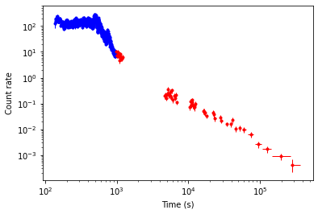

# The `swifttools.ukssdc.data.GRB` module

[Jupyter notebook version of this page](GRB.ipynb)

## Summary

This module provides direct access to the [GRB products created at the UKSSDC](https://www.swift.ac.uk/xrt_products), as well as the means to manipulate them (e.g. rebinning light curves). Being part of the [`swifttools.ukssdc.data` module](../data.md) it is designed for use where you already know which GRB(s) you want to get data for. If you don't know that, for example you want to select them based on their characteristics, you will need the [GRB query module](../query/GRB.md).

**Tip** You can read this page straight through, and you may want to, but there is a lot in it. So if you want a full overview, read through. If you want to know how to do do something specific, I'd advise you to read the introduction, and then use the [contents links](#page-contents) to jump straight to the section you are interested in.

You will notice that the functions in this module all begin with `get` (whereas the parent module used `download`). As you'll realise pretty quickly, this is because this module lets you do more than just download datafiles, you can instead pull the data into variables for example.

An important point to note is that this documentation is about the API, not the GRB products. So below we will talk about things like WT mode systematic errors, and unreliable light curve data, without any real explanation; you can read the documentation for the products if you don't understand.

OK, first let's import the module, using a short form to save our fingers:


```python
import swifttools.ukssdc.data.GRB as udg
```

After a short introduction, this page is split into sections according to the product type as below.

## Page contents

* [Introduction and common behaviour](#intro)
* [Light curves](#lightcurves)
  * [Rebinning](#rebin)
* [Spectra](#spectra)
  * [Time slicing](#slice)
* [Burst analyser](#ban)
* [Positions](#positions)
* [Obs data](#obs)

----

<a id='intro'></a>
## Introduction and common behaviour

Before we dive into things, let me introduce a couple of important concepts which are common to everything that follows.

Firstly, you specify which GRB(s) you are interested in either by their name, or their targetID. You do this (prepare for a shock) by supplying the `GRBName` or `targetID` argument to the relevant function: all functions in this module to get data take these arguments. You must supply one or the other though, if you suply a `GRBName` and `targetID` you will get an error. These arguments can be either a single value (e.g. `GRBName="GRB 060729"`) or a list/tuple (e.g. `targetID=[282445, 221755]`) if you want more than one GRB. Hold that thought for just a moment because we'll come back it to in a tick.

The second common concept is how the data you request are stored. This is controlled by two arguments, which again are common to all of the data-access functions in this module. These are:

* `returnData` - (default `False`), whether or not the function should return a `dict` containing the data.
* `saveData` - (default: `True`), whether or not the function should download the data files from the UKSSDC website and write them to disk.

You can set both to `True` to return and save. (You can also set both to `False` if you like wasting time, CPU and making TCP packets feel that they serve no real purpose in life, but why would you do that?)
If you are using `saveData=True` you may also need the `clobber` parameter. This specifies whether existing files should be overwritten, and is `False` by default.

You should still be holding onto a thought&hellip; the fact that you can supply either a single value or a list (or tuple) to identify the GRBs you want. What you do here affects how the data are stored as well.

If you gave a single value, then `saveData=True` will cause the data for your object to be downloaded to the specified directory. `returnData=True` will cause the function to return a `dict` containing your data.

If you supplied a list of objects then of course you're going to get multiple dataset. `saveData=True` will (by default) create a subdirectory per GRB to stick the data in. `returnData=True` will return a `dict` with an entry per GRB; that entry will the `dict` containing the data.

But, you may ask, what will the names of these subdirectories, or the keys of these `dict`s be? They will be whatever identifer you used to specify the GRBs you wanted. If you used the `GRBName` argument, the directories and `dict` keys will be the GRB names; if you used `targetID` then they will be, er, the target IDs.

That may not make so much sense in the abstract, but all will become clear as we see some demos. Oh, but just to further confuse you, please do note that a list (or tuple) with one entry is still a list (unless it's a tuple), and so the returned data will still have the subdirectories/extra `dict` that you get when you supply a list (or tuple) even though there is only one entry in this. Confused? Me too, but it will make sense when we start playing, so let's do so.

<a id='lightcurves'></a>
## Light curves

There are basically three ways we can play with light curve data, let's start with just downloading them straight from the UKSSDC website.

### Saving directly to disk

Our function for getting light curves is cunningly named `getLightCurves()`. As I'm sure you remember from above, it we want to save the data to disk, we supply `saveData=True` (this is the default but I think it's helpful to be explicit). Let's try that:


```python
udg.getLightCurves(GRBName="GRB 060729",
                   saveData=True,
                   destDir='/tmp/APIDemo_GRBLC1',
                   silent=False)
```

    Resolved `GRB 060729` as `221755`.
    Making directory /tmp/APIDemo_GRBLC1


    Downloading light curves:   0%|          | 0/5 [00:00<?, ?files/s]


In the above I turned `silent` off just to show you that something was happening; feel free to go and look at '/tmp/APIDemo_GRBLC1' to see what was downloaded.

`getLightCurves()` mainly just wraps the common `getLightCurve()` function, so see [its documentation](https://www.swift.ac.uk/API/ukssdc/commonFunc.md#getlightcurve) for a description of the various arguments, but there is one extra argument available to you to mention here: `subDirs`.

This variable, a boolean which defaults to `True`, only matters if you supplied a list/tuple of GRBs. If it is `True` then a subdirectory will be created for each GRB (as I mentioned [above](#intro). However, you can set this to `False`, if you want to put all the data in the same directory. In this case the GRB name or targetID (depending on which argument you called `getLightCurves()` with) will be prepended to the file names.

Let's demonstrate this with a couple of simple downloads:


```python
lcData = udg.getLightCurves(GRBName=("GRB 060729","GRB 080319B"),
                            destDir='/tmp/APIDemo_GRBLC2',
                            silent=False
                            )
```

    Resolved `GRB 060729` as `221755`.
    Resolved `GRB 080319B` as `306757`.
    Making directory /tmp/APIDemo_GRBLC2
    Making directory /tmp/APIDemo_GRBLC2/GRB 060729


    Downloading light curves:   0%|          | 0/5 [00:00<?, ?files/s]


    Making directory /tmp/APIDemo_GRBLC2/GRB 080319B


    Downloading light curves:   0%|          | 0/4 [00:00<?, ?files/s]


And as you can see, and hopefully expected, the GRBs were each saved into their own directory. Now let's do exactly the same thing, but disable the subdirs:


```python
lcData = udg.getLightCurves(GRBName=("GRB 060729","GRB 080319B"),
                            destDir='/tmp/APIDemo_GRBLC3',
                            subDirs=False,
                            silent=False,
                            verbose=True
                            )
```

    Uploading data to https://www.swift.ac.uk/API/main.php
    Returned keys: dict_keys(['OK', 'targetID', 'APIVersion'])
    Resolved `GRB 060729` as `221755`.
    Uploading data to https://www.swift.ac.uk/API/main.php
    Returned keys: dict_keys(['OK', 'targetID', 'APIVersion'])
    Resolved `GRB 080319B` as `306757`.
    Making directory /tmp/APIDemo_GRBLC3
    Getting GRB 060729
    Uploading data to https://www.swift.ac.uk/API/main.php
    Returned keys: dict_keys(['Datasets', 'WT_incbadData', 'WTHard_incbadData', 'WTSoft_incbadData', 'WTHR_incbadData', 'PC_incbadData', 'PCUL_incbadData', 'PCHard_incbadData', 'PCSoft_incbadData', 'PCHR_incbadData', 'OK', 'Binning', 'TimeFormat', 'T0', 'APIVersion'])
    Checking returned data for required content.


    Downloading light curves:   0%|          | 0/5 [00:00<?, ?files/s]


    Saving /tmp/APIDemo_GRBLC3/GRB 060729_WTCURVE.qdp
    Saving /tmp/APIDemo_GRBLC3/GRB 060729_WTHR.qdp
    Saving /tmp/APIDemo_GRBLC3/GRB 060729_PCCURVE_incbad.qdp
    Saving /tmp/APIDemo_GRBLC3/GRB 060729_PCUL_incbad.qdp
    Saving /tmp/APIDemo_GRBLC3/GRB 060729_PCHR_incbad.qdp
    Getting GRB 080319B
    Uploading data to https://www.swift.ac.uk/API/main.php
    Returned keys: dict_keys(['Datasets', 'WT_incbadData', 'WTHard_incbadData', 'WTSoft_incbadData', 'WTHR_incbadData', 'PC_incbadData', 'PCHard_incbadData', 'PCSoft_incbadData', 'PCHR_incbadData', 'OK', 'Binning', 'TimeFormat', 'T0', 'APIVersion'])
    Checking returned data for required content.


    Downloading light curves:   0%|          | 0/4 [00:00<?, ?files/s]


    Saving /tmp/APIDemo_GRBLC3/GRB 080319B_WTCURVE.qdp
    Saving /tmp/APIDemo_GRBLC3/GRB 080319B_WTHR.qdp
    Saving /tmp/APIDemo_GRBLC3/GRB 080319B_PCCURVE_incbad.qdp
    Saving /tmp/APIDemo_GRBLC3/GRB 080319B_PCHR_incbad.qdp


I turned `verbose` on as well so that you could see what was happening: the data all got saved into the same directory, with the GRB name prepended to the files.

In these examples I've given the GRB name, but the targetID was an option if you happen to know it:


```python
lcData = udg.getLightCurves(targetID=(221755, 306757),
                            destDir='/tmp/APIDemo_GRBLC4',
                            silent=False,
                            verbose=True
                            )
```

    Making directory /tmp/APIDemo_GRBLC4
    Getting 221755
    Making directory /tmp/APIDemo_GRBLC4/221755
    Uploading data to https://www.swift.ac.uk/API/main.php
    Returned keys: dict_keys(['Datasets', 'WT_incbadData', 'WTHard_incbadData', 'WTSoft_incbadData', 'WTHR_incbadData', 'PC_incbadData', 'PCUL_incbadData', 'PCHard_incbadData', 'PCSoft_incbadData', 'PCHR_incbadData', 'OK', 'Binning', 'TimeFormat', 'T0', 'APIVersion'])
    Checking returned data for required content.


    Downloading light curves:   0%|          | 0/5 [00:00<?, ?files/s]


    Saving /tmp/APIDemo_GRBLC4/221755/WTCURVE.qdp
    Saving /tmp/APIDemo_GRBLC4/221755/WTHR.qdp
    Saving /tmp/APIDemo_GRBLC4/221755/PCCURVE_incbad.qdp
    Saving /tmp/APIDemo_GRBLC4/221755/PCUL_incbad.qdp
    Saving /tmp/APIDemo_GRBLC4/221755/PCHR_incbad.qdp
    Getting 306757
    Making directory /tmp/APIDemo_GRBLC4/306757
    Uploading data to https://www.swift.ac.uk/API/main.php
    Returned keys: dict_keys(['Datasets', 'WT_incbadData', 'WTHard_incbadData', 'WTSoft_incbadData', 'WTHR_incbadData', 'PC_incbadData', 'PCHard_incbadData', 'PCSoft_incbadData', 'PCHR_incbadData', 'OK', 'Binning', 'TimeFormat', 'T0', 'APIVersion'])
    Checking returned data for required content.


    Downloading light curves:   0%|          | 0/4 [00:00<?, ?files/s]


    Saving /tmp/APIDemo_GRBLC4/306757/WTCURVE.qdp
    Saving /tmp/APIDemo_GRBLC4/306757/WTHR.qdp
    Saving /tmp/APIDemo_GRBLC4/306757/PCCURVE_incbad.qdp
    Saving /tmp/APIDemo_GRBLC4/306757/PCHR_incbad.qdp


I trust this hasn't surprised you.

As a final demonstration, let's illustrate the point that a tuple with one entry is still a tuple, and so the way the data are saved is set accordingly:


```python
lcData = udg.getLightCurves(GRBName=("GRB 060729",),
                            destDir='/tmp/APIDemo_GRBLC5',
                            silent=False,
                            verbose=True
                            )
```

    Uploading data to https://www.swift.ac.uk/API/main.php
    Returned keys: dict_keys(['OK', 'targetID', 'APIVersion'])
    Resolved `GRB 060729` as `221755`.
    Making directory /tmp/APIDemo_GRBLC5
    Getting GRB 060729
    Making directory /tmp/APIDemo_GRBLC5/GRB 060729
    Uploading data to https://www.swift.ac.uk/API/main.php
    Returned keys: dict_keys(['Datasets', 'WT_incbadData', 'WTHard_incbadData', 'WTSoft_incbadData', 'WTHR_incbadData', 'PC_incbadData', 'PCUL_incbadData', 'PCHard_incbadData', 'PCSoft_incbadData', 'PCHR_incbadData', 'OK', 'Binning', 'TimeFormat', 'T0', 'APIVersion'])
    Checking returned data for required content.


    Downloading light curves:   0%|          | 0/5 [00:00<?, ?files/s]


    Saving /tmp/APIDemo_GRBLC5/GRB 060729/WTCURVE.qdp
    Saving /tmp/APIDemo_GRBLC5/GRB 060729/WTHR.qdp
    Saving /tmp/APIDemo_GRBLC5/GRB 060729/PCCURVE_incbad.qdp
    Saving /tmp/APIDemo_GRBLC5/GRB 060729/PCUL_incbad.qdp
    Saving /tmp/APIDemo_GRBLC5/GRB 060729/PCHR_incbad.qdp


As you can see here, we only got a single GRB, but because we supplied its name as a tuple, not as a string, the data were saved into a subdirectory just as if we'd requested multiple GRBs.

### Storing the light curves in variables

Let's move on now to the `returnData=True` case. As I told you [earlier](#intro) this will return a `dict` containing the data. All light curves returned by anything in the `swifttools.ukssdc` module have a common structure which I call a "light curve `dict`", and you can [read about this here](https://www.swift.ac.uk/API/ukssdc/structures.md#the-light-curve-dict).

There are no special parameters related to returning data, so let's jump straight in with some demonstrations similar to those above.


```python
lcData = udg.getLightCurves(GRBName="GRB 220427A",
                            incbad="both",
                            nosys="both",
                            saveData=False,
                            returnData=True)
```

I don't recommend simply printing `lcData` straight, it's quite big. If you [read about the light curve `dict`](https://www.swift.ac.uk/API/ukssdc/structures.md#the-light-curve-dict) then you may have an idea what to expect, but it's helpful to explore it anyway, so let's do that.


```python
list(lcData.keys())
```


    ['WT',
     'WTHard',
     'WTSoft',
     'WTHR',
     'WT_incbad',
     'WTHard_incbad',
     'WTSoft_incbad',
     'WTHR_incbad',
     'WT_nosys',
     'WTHard_nosys',
     'WTSoft_nosys',
     'WTHR_nosys',
     'WT_nosys_incbad',
     'WTHard_nosys_incbad',
     'WTSoft_nosys_incbad',
     'WTHR_nosys_incbad',
     'PC',
     'PCHard',
     'PCSoft',
     'PCHR',
     'PC_incbad',
     'PCUL_incbad',
     'PCHard_incbad',
     'PCSoft_incbad',
     'PCHR_incbad',
     'PC_nosys',
     'PCHard_nosys',
     'PCSoft_nosys',
     'PCHR_nosys',
     'PC_nosys_incbad',
     'PCUL_nosys_incbad',
     'PCHard_nosys_incbad',
     'PCSoft_nosys_incbad',
     'PCHR_nosys_incbad',
     'Datasets',
     'Binning',
     'TimeFormat',
     'T0',
     'URLs']


(I used `list()` above because Jupyter renders it a bit more nicely than the `dict_keys` object). There is a lot to take in there, but most of those entries are just light curve data.

Let's first just check the keys that gave me some information about the light curve generically:


```python
print(f"Binning: {lcData['Binning']}")
print(f"TimeFormat: {lcData['TimeFormat']}")
print(f"T0: {lcData['T0']}")
```

    Binning: Counts
    TimeFormat: MET
    T0: 672786064


So we know that the light curves are binned by the number of counts per bin (no surprise, this is standard for GRBs), the timeformat is in Swift Mission Elapsed Time, and is in seconds since MET 672786064 (again, see the [light curve `dict` documentation](https://www.swift.ac.uk/API/ukssdc/structures.md#the-light-curve-dict) for more info).

The 'URLs' key lists the URL to the individual files in the light curve by dataset. I'm not going to print it here because it's long (and boring) but you can explore it if you want.

The 'Datasets' key is really the crucial one for exploring the data, it's essentially an index of all the datasets we obtained, in the form of a list. Let's take a look:


```python
lcData['Datasets']
```


    ['WT',
     'WTHard',
     'WTSoft',
     'WTHR',
     'WT_incbad',
     'WTHard_incbad',
     'WTSoft_incbad',
     'WTHR_incbad',
     'WT_nosys',
     'WTHard_nosys',
     'WTSoft_nosys',
     'WTHR_nosys',
     'WT_nosys_incbad',
     'WTHard_nosys_incbad',
     'WTSoft_nosys_incbad',
     'WTHR_nosys_incbad',
     'PC',
     'PCHard',
     'PCSoft',
     'PCHR',
     'PC_incbad',
     'PCUL_incbad',
     'PCHard_incbad',
     'PCSoft_incbad',
     'PCHR_incbad',
     'PC_nosys',
     'PCHard_nosys',
     'PCSoft_nosys',
     'PCHR_nosys',
     'PC_nosys_incbad',
     'PCUL_nosys_incbad',
     'PCHard_nosys_incbad',
     'PCSoft_nosys_incbad',
     'PCHR_nosys_incbad']


As a quick aside, you may wonder why we bother with this array, but we can't just step over the keys in `lcData` - 'Binning', for example, is not a light curve, and maybe in the future we'll want to add other things, so 'Datasets' is handy. 

There are a lot of datasets in this example, because we set both `incbad` and `nosys` to "both", so we got all data with/out missing centroids and with/out WT-mode systematics (if you don't know what I'm talking about, see the [the light curve documentation](https://www.swift.ac.uk/user_objects/lc_docs.php#systematics).


The contents of the datasets were discussed in [light curve `dict` documentation](https://www.swift.ac.uk/API/ukssdc/structures.md#the-light-curve-dict) (I'm sounding like a broken record, I know), so I'm not going to spend time on it here, except to show you one entry as an example:


```python
lcData['PC']
```


<div style='width: 95%; max-height: 200px; overflow: scroll;'><style scoped>    .dataframe tbody tr th:only-of-type {        vertical-align: middle;    }    .dataframe tbody tr th {        vertical-align: top;    }    .dataframe thead th {        text-align: right;    }</style><table border="1" class="dataframe">  <thead>    <tr style="text-align: right;">      <th></th>      <th>Time</th>      <th>TimePos</th>      <th>TimeNeg</th>      <th>Rate</th>      <th>RatePos</th>      <th>RateNeg</th>      <th>FracExp</th>      <th>BGrate</th>      <th>BGerr</th>      <th>CorrFact</th>      <th>CtsInSrc</th>      <th>BGInSrc</th>      <th>Exposure</th>      <th>Sigma</th>      <th>SNR</th>    </tr>  </thead>  <tbody>    <tr>      <th>0</th>      <td>231.329</td>      <td>9.456</td>      <td>-10.603</td>      <td>2.492634</td>      <td>0.547598</td>      <td>-0.547598</td>      <td>1.000000</td>      <td>0.006904</td>      <td>0.003088</td>      <td>2.396688</td>      <td>21.0</td>      <td>0.138491</td>      <td>20.058508</td>      <td>336.828549</td>      <td>4.551939</td>    </tr>    <tr>      <th>1</th>      <td>254.712</td>      <td>8.638</td>      <td>-13.928</td>      <td>2.458382</td>      <td>0.502403</td>      <td>-0.502403</td>      <td>1.000000</td>      <td>0.001227</td>      <td>0.001227</td>      <td>2.314148</td>      <td>24.0</td>      <td>0.027698</td>      <td>22.565840</td>      <td>865.481752</td>      <td>4.893247</td>    </tr>    <tr>      <th>2</th>      <td>272.685</td>      <td>10.724</td>      <td>-9.335</td>      <td>2.265870</td>      <td>0.510246</td>      <td>-0.510246</td>      <td>1.000000</td>      <td>0.006904</td>      <td>0.003088</td>      <td>2.288348</td>      <td>20.0</td>      <td>0.138491</td>      <td>20.058540</td>      <td>320.682615</td>      <td>4.440743</td>    </tr>    <tr>      <th>3</th>      <td>295.985</td>      <td>12.497</td>      <td>-12.577</td>      <td>1.890566</td>      <td>0.427545</td>      <td>-0.427545</td>      <td>1.000000</td>      <td>0.008838</td>      <td>0.003125</td>      <td>2.396673</td>      <td>20.0</td>      <td>0.221586</td>      <td>25.073120</td>      <td>252.461207</td>      <td>4.421909</td>    </tr>    <tr>      <th>4</th>      <td>318.394</td>      <td>10.146</td>      <td>-9.912</td>      <td>2.501020</td>      <td>0.546498</td>      <td>-0.546498</td>      <td>1.000000</td>      <td>0.001381</td>      <td>0.001381</td>      <td>2.392053</td>      <td>21.0</td>      <td>0.027698</td>      <td>20.058560</td>      <td>757.171533</td>      <td>4.576448</td>    </tr>    <tr>      <th>5</th>      <td>339.776</td>      <td>11.330</td>      <td>-11.236</td>      <td>2.218482</td>      <td>0.485411</td>      <td>-0.485411</td>      <td>1.000000</td>      <td>0.002455</td>      <td>0.001736</td>      <td>2.390206</td>      <td>21.0</td>      <td>0.055396</td>      <td>22.565840</td>      <td>534.694019</td>      <td>4.570320</td>    </tr>    <tr>      <th>6</th>      <td>358.720</td>      <td>9.937</td>      <td>-7.614</td>      <td>2.755213</td>      <td>0.617819</td>      <td>-0.617819</td>      <td>1.000000</td>      <td>0.003156</td>      <td>0.002232</td>      <td>2.424578</td>      <td>20.0</td>      <td>0.055396</td>      <td>17.551180</td>      <td>509.165055</td>      <td>4.459578</td>    </tr>    <tr>      <th>7</th>      <td>382.023</td>      <td>11.708</td>      <td>-13.365</td>      <td>2.049209</td>      <td>0.438572</td>      <td>-0.438572</td>      <td>1.000000</td>      <td>0.003314</td>      <td>0.001913</td>      <td>2.344316</td>      <td>22.0</td>      <td>0.083095</td>      <td>25.073160</td>      <td>456.842799</td>      <td>4.672456</td>    </tr>    <tr>      <th>8</th>      <td>414.364</td>      <td>14.469</td>      <td>-20.633</td>      <td>1.477339</td>      <td>0.316180</td>      <td>-0.316180</td>      <td>1.000000</td>      <td>0.002367</td>      <td>0.001367</td>      <td>2.366125</td>      <td>22.0</td>      <td>0.083095</td>      <td>35.102380</td>      <td>456.842799</td>      <td>4.672456</td>    </tr>    <tr>      <th>9</th>      <td>446.410</td>      <td>15.019</td>      <td>-17.577</td>      <td>1.561949</td>      <td>0.333009</td>      <td>-0.333009</td>      <td>1.000000</td>      <td>0.000000</td>      <td>0.000000</td>      <td>2.314176</td>      <td>22.0</td>      <td>0.000000</td>      <td>32.595080</td>      <td>1000.000000</td>      <td>4.690416</td>    </tr>    <tr>      <th>10</th>      <td>488.377</td>      <td>20.690</td>      <td>-26.949</td>      <td>1.088421</td>      <td>0.233243</td>      <td>-0.233243</td>      <td>1.000000</td>      <td>0.002326</td>      <td>0.001163</td>      <td>2.368805</td>      <td>22.0</td>      <td>0.110793</td>      <td>47.638980</td>      <td>395.137470</td>      <td>4.666469</td>    </tr>    <tr>      <th>11</th>      <td>542.713</td>      <td>21.515</td>      <td>-33.646</td>      <td>0.935390</td>      <td>0.201224</td>      <td>-0.201224</td>      <td>1.000000</td>      <td>0.003515</td>      <td>0.001329</td>      <td>2.366170</td>      <td>22.0</td>      <td>0.193888</td>      <td>55.160920</td>      <td>297.561957</td>      <td>4.648511</td>    </tr>    <tr>      <th>12</th>      <td>588.681</td>      <td>25.693</td>      <td>-24.453</td>      <td>0.972465</td>      <td>0.213350</td>      <td>-0.213350</td>      <td>1.000000</td>      <td>0.002209</td>      <td>0.001105</td>      <td>2.334482</td>      <td>21.0</td>      <td>0.110793</td>      <td>50.146260</td>      <td>377.085766</td>      <td>4.558066</td>    </tr>    <tr>      <th>13</th>      <td>641.368</td>      <td>25.660</td>      <td>-26.994</td>      <td>0.877843</td>      <td>0.198803</td>      <td>-0.198803</td>      <td>1.000000</td>      <td>0.004734</td>      <td>0.001578</td>      <td>2.340248</td>      <td>20.0</td>      <td>0.249284</td>      <td>52.653580</td>      <td>237.689376</td>      <td>4.415632</td>    </tr>    <tr>      <th>14</th>      <td>679.006</td>      <td>8.081</td>      <td>-11.978</td>      <td>2.458033</td>      <td>0.539997</td>      <td>-0.539997</td>      <td>1.000000</td>      <td>0.006904</td>      <td>0.003088</td>      <td>2.363423</td>      <td>21.0</td>      <td>0.138491</td>      <td>20.058540</td>      <td>336.828549</td>      <td>4.551939</td>    </tr>    <tr>      <th>15</th>      <td>720.041</td>      <td>22.207</td>      <td>-32.954</td>      <td>0.883485</td>      <td>0.193569</td>      <td>-0.193569</td>      <td>1.000000</td>      <td>0.001506</td>      <td>0.000870</td>      <td>2.329874</td>      <td>21.0</td>      <td>0.083095</td>      <td>55.160840</td>      <td>435.998488</td>      <td>4.564193</td>    </tr>    <tr>      <th>16</th>      <td>774.036</td>      <td>23.372</td>      <td>-31.789</td>      <td>0.824176</td>      <td>0.185594</td>      <td>-0.185594</td>      <td>1.000000</td>      <td>0.002511</td>      <td>0.001123</td>      <td>2.288964</td>      <td>20.0</td>      <td>0.138491</td>      <td>55.160900</td>      <td>320.682615</td>      <td>4.440743</td>    </tr>    <tr>      <th>17</th>      <td>821.775</td>      <td>18.257</td>      <td>-24.367</td>      <td>1.086019</td>      <td>0.244213</td>      <td>-0.244213</td>      <td>1.000000</td>      <td>0.002599</td>      <td>0.001300</td>      <td>2.327431</td>      <td>20.0</td>      <td>0.110793</td>      <td>42.624280</td>      <td>359.034063</td>      <td>4.447021</td>    </tr>    <tr>      <th>18</th>      <td>881.398</td>      <td>36.361</td>      <td>-41.366</td>      <td>0.596078</td>      <td>0.134801</td>      <td>-0.134801</td>      <td>1.000000</td>      <td>0.002851</td>      <td>0.001008</td>      <td>2.342510</td>      <td>20.0</td>      <td>0.221586</td>      <td>77.726680</td>      <td>252.461207</td>      <td>4.421909</td>    </tr>    <tr>      <th>19</th>      <td>960.261</td>      <td>40.240</td>      <td>-42.502</td>      <td>0.604748</td>      <td>0.133034</td>      <td>-0.133034</td>      <td>1.000000</td>      <td>0.002009</td>      <td>0.000820</td>      <td>2.401749</td>      <td>21.0</td>      <td>0.166189</td>      <td>82.741260</td>      <td>307.072742</td>      <td>4.545812</td>    </tr>    <tr>      <th>20</th>      <td>1038.422</td>      <td>44.819</td>      <td>-37.922</td>      <td>0.559252</td>      <td>0.126833</td>      <td>-0.126833</td>      <td>1.000000</td>      <td>0.003348</td>      <td>0.001059</td>      <td>2.346153</td>      <td>20.0</td>      <td>0.276982</td>      <td>82.741240</td>      <td>225.175713</td>      <td>4.409355</td>    </tr>    <tr>      <th>21</th>      <td>1130.873</td>      <td>32.603</td>      <td>-47.631</td>      <td>0.606471</td>      <td>0.133055</td>      <td>-0.133055</td>      <td>1.000000</td>      <td>0.001381</td>      <td>0.000690</td>      <td>2.329414</td>      <td>21.0</td>      <td>0.110793</td>      <td>80.233960</td>      <td>377.085766</td>      <td>4.558066</td>    </tr>    <tr>      <th>22</th>      <td>1195.819</td>      <td>22.817</td>      <td>-32.344</td>      <td>0.852082</td>      <td>0.192695</td>      <td>-0.192695</td>      <td>1.000000</td>      <td>0.004017</td>      <td>0.001420</td>      <td>2.376406</td>      <td>20.0</td>      <td>0.221586</td>      <td>55.160800</td>      <td>252.461207</td>      <td>4.421909</td>    </tr>    <tr>      <th>23</th>      <td>1252.063</td>      <td>34.271</td>      <td>-33.427</td>      <td>0.698409</td>      <td>0.156609</td>      <td>-0.156609</td>      <td>1.000000</td>      <td>0.000818</td>      <td>0.000579</td>      <td>2.370587</td>      <td>20.0</td>      <td>0.055396</td>      <td>67.697320</td>      <td>509.165055</td>      <td>4.459578</td>    </tr>    <tr>      <th>24</th>      <td>1332.788</td>      <td>33.780</td>      <td>-46.454</td>      <td>0.612633</td>      <td>0.134769</td>      <td>-0.134769</td>      <td>1.000000</td>      <td>0.002071</td>      <td>0.000846</td>      <td>2.359336</td>      <td>21.0</td>      <td>0.166189</td>      <td>80.233880</td>      <td>307.072742</td>      <td>4.545812</td>    </tr>    <tr>      <th>25</th>      <td>1417.909</td>      <td>38.922</td>      <td>-51.341</td>      <td>0.541106</td>      <td>0.119679</td>      <td>-0.119679</td>      <td>1.000000</td>      <td>0.003069</td>      <td>0.000970</td>      <td>2.356892</td>      <td>21.0</td>      <td>0.276982</td>      <td>90.263160</td>      <td>236.592612</td>      <td>4.521307</td>    </tr>    <tr>      <th>26</th>      <td>1501.599</td>      <td>45.495</td>      <td>-44.768</td>      <td>0.510294</td>      <td>0.115895</td>      <td>-0.115895</td>      <td>1.000000</td>      <td>0.003375</td>      <td>0.001018</td>      <td>2.338662</td>      <td>20.0</td>      <td>0.304680</td>      <td>90.263040</td>      <td>214.395107</td>      <td>4.403078</td>    </tr>    <tr>      <th>27</th>      <td>1628.792</td>      <td>58.711</td>      <td>-81.698</td>      <td>0.316147</td>      <td>0.072110</td>      <td>-0.072110</td>      <td>0.999953</td>      <td>0.002762</td>      <td>0.000738</td>      <td>2.263279</td>      <td>20.0</td>      <td>0.387775</td>      <td>140.402692</td>      <td>189.239167</td>      <td>4.384250</td>    </tr>    <tr>      <th>28</th>      <td>1734.370</td>      <td>38.382</td>      <td>-46.867</td>      <td>0.301100</td>      <td>0.068007</td>      <td>-0.068007</td>      <td>1.000000</td>      <td>0.002311</td>      <td>0.000874</td>      <td>1.296184</td>      <td>20.0</td>      <td>0.197032</td>      <td>85.248460</td>      <td>265.914145</td>      <td>4.427464</td>    </tr>    <tr>      <th>29</th>      <td>1825.855</td>      <td>84.798</td>      <td>-53.104</td>      <td>0.430621</td>      <td>0.095358</td>      <td>-0.095358</td>      <td>0.999997</td>      <td>0.002188</td>      <td>0.000660</td>      <td>2.868992</td>      <td>21.0</td>      <td>0.301715</td>      <td>137.901200</td>      <td>227.527350</td>      <td>4.515846</td>    </tr>    <tr>      <th>30</th>      <td>6244.828</td>      <td>121.386</td>      <td>-131.853</td>      <td>0.148955</td>      <td>0.033866</td>      <td>-0.033866</td>      <td>1.000000</td>      <td>0.001295</td>      <td>0.000254</td>      <td>1.917496</td>      <td>20.0</td>      <td>0.327916</td>      <td>253.238668</td>      <td>305.896115</td>      <td>4.398357</td>    </tr>    <tr>      <th>31</th>      <td>6479.412</td>      <td>112.460</td>      <td>-113.198</td>      <td>0.160183</td>      <td>0.036232</td>      <td>-0.036232</td>      <td>1.000000</td>      <td>0.001006</td>      <td>0.000237</td>      <td>1.828074</td>      <td>20.0</td>      <td>0.227019</td>      <td>225.658080</td>      <td>369.526994</td>      <td>4.421057</td>    </tr>    <tr>      <th>32</th>      <td>6732.499</td>      <td>152.728</td>      <td>-140.627</td>      <td>0.090189</td>      <td>0.023810</td>      <td>-0.023810</td>      <td>1.000000</td>      <td>0.001118</td>      <td>0.000219</td>      <td>1.803255</td>      <td>15.0</td>      <td>0.327916</td>      <td>293.355360</td>      <td>228.147331</td>      <td>3.787794</td>    </tr>    <tr>      <th>33</th>      <td>7026.168</td>      <td>164.951</td>      <td>-140.941</td>      <td>0.116608</td>      <td>0.026460</td>      <td>-0.026460</td>      <td>1.000000</td>      <td>0.000948</td>      <td>0.000198</td>      <td>1.809713</td>      <td>20.0</td>      <td>0.290080</td>      <td>305.891620</td>      <td>325.860125</td>      <td>4.406869</td>    </tr>    <tr>      <th>34</th>      <td>7308.908</td>      <td>137.957</td>      <td>-117.789</td>      <td>0.145418</td>      <td>0.032956</td>      <td>-0.032956</td>      <td>0.990174</td>      <td>0.001046</td>      <td>0.000228</td>      <td>1.865945</td>      <td>20.0</td>      <td>0.264856</td>      <td>253.232572</td>      <td>341.460864</td>      <td>4.412544</td>    </tr>    <tr>      <th>35</th>      <td>7607.183</td>      <td>195.718</td>      <td>-160.318</td>      <td>0.101916</td>      <td>0.023307</td>      <td>-0.023307</td>      <td>1.000000</td>      <td>0.001240</td>      <td>0.000210</td>      <td>1.855237</td>      <td>20.0</td>      <td>0.441426</td>      <td>356.036600</td>      <td>262.128016</td>      <td>4.372822</td>    </tr>    <tr>      <th>36</th>      <td>12416.800</td>      <td>356.855</td>      <td>-317.612</td>      <td>0.031317</td>      <td>0.008268</td>      <td>-0.008268</td>      <td>1.000000</td>      <td>0.000489</td>      <td>0.000071</td>      <td>1.439771</td>      <td>15.0</td>      <td>0.329649</td>      <td>674.466680</td>      <td>308.325562</td>      <td>3.787583</td>    </tr>    <tr>      <th>37</th>      <td>13083.407</td>      <td>449.956</td>      <td>-309.753</td>      <td>0.033220</td>      <td>0.008030</td>      <td>-0.008030</td>      <td>1.000000</td>      <td>0.000588</td>      <td>0.000073</td>      <td>1.437743</td>      <td>18.0</td>      <td>0.446400</td>      <td>759.708920</td>      <td>317.029134</td>      <td>4.137071</td>    </tr>    <tr>      <th>38</th>      <td>18498.142</td>      <td>396.336</td>      <td>-461.161</td>      <td>0.035760</td>      <td>0.008738</td>      <td>-0.008738</td>      <td>1.000000</td>      <td>0.000740</td>      <td>0.000076</td>      <td>1.765800</td>      <td>18.0</td>      <td>0.634600</td>      <td>857.496600</td>      <td>265.306944</td>      <td>4.092577</td>    </tr>  </tbody></table></div>


OK, so that's what `returnData=True` does. If we supply a list of GRBs then, as you should expect, we get a `dict` of light curves `dict`s; the top level is indexed either by GRB name, or targetID, depending on how you called the function, so:


```python
lcData = udg.getLightCurves(GRBName=("GRB 220427A","GRB 070616"),
                            saveData=False,
                            returnData=True)
```


```python
list(lcData.keys())
```


    ['GRB 220427A', 'GRB 070616']


I trust this doesn't come as a surprise! Nor should the fact that each of these in turn is a light curve `dict` similar to that above (although this time I left `nosys` and `incbad` to their defaults). I can prove this easily enough:


```python
list(lcData['GRB 070616'].keys())
```


    ['WT_incbad',
     'WTHard_incbad',
     'WTSoft_incbad',
     'WTHR_incbad',
     'PC_incbad',
     'PCHard_incbad',
     'PCSoft_incbad',
     'PCHR_incbad',
     'Datasets',
     'Binning',
     'TimeFormat',
     'T0',
     'URLs']


(I'll let you explore the other GRB yourself).

If we had supplied `targetID=(1104343, 282445)` you would have got the same data, but indexed by these targetIDs, not the name. You can test it out if you don't trust me, but frankly, I'm expecting most people know GRBs by their names not the Swift targetIDs!

#### Plotting light curves

If we've downloaded a light curve then we can make use of the [module-level `plotLightCurve()` function](https://www.swift.ac.uk/API/ukssdc/commonFunc.md#plotlightcurve) to give us a quick plot. I'm not going to repeat the `plotLightCurve()` documentation here, but I will note that its first argument is a single light curve `dict` so if, as in our case here, we downloaded multiple GRB light curves, we have to provide one of them to the function, like this:


```python
from swifttools.ukssdc import plotLightCurve
fig, ax = plotLightCurve(lcData['GRB 070616'],
                         whichCurves=('WT_incbad', 'PC_incbad'),
                         xlog=True,
                         ylog=True
                        )
```


    

    


You'll note I captured the return in variable names which will be familiar to users of `pyplot` and can be ignored by everyone else because you'll need to be familiar with `pyplot` to take advantage of the fact that `plotLightCurve` returnes them for you.

### The third way - save from a variable

We've covered two obvious ways of getting light curve data: downloading them straight to disk or to variables. But there is a third way (and it does not involve steep stairs or giant spiders): you pull the data into variables as above, and then save them to disk from there (OK, I guess maybe it's a two-and-a-halfth way, but that doesn't scan and can't be linked to Tolkien).

To do this we use the function `saveLightCurves()`, and the reason for providing this option as well as the `saveData=True` option above is that this gives you some more control over how the data are saved.

This function actually doesn't do very much itself, most of the work is done by another common function: [`saveLightCurveFromDict()`](https://www.swift.ac.uk/API/ukssdc/commonFunc.md#savelightcurvefromdict), and most of the arguments you may pass to `saveLightCurves()` are just keyword arguments that will get passed straight through, but there are a few things about `saveLightCurves()` to note here.

First, you may have spotted that the function name contains lightCurve**s** plural, whereas the common function is singular; that is because `saveLightCurves()` allows you to save more than one light curve in a single command - if you retrieved more than one of course! This means it has two extra parameters for use when you supplied a list or tuple to `getLightCurves()`. We will discuss those parameters in a moment.

The second thing is that it will override the default values for the `timeFormatInFname` and `binningInFname` arguments for `saveLightCurveFromDict()`, setting them both to ``False`` unless you explicitly specify them. This is because GRB light curves are always in MET and counts per bin.


So, the parameters for `saveLightCurves()` are:

* `lcData` - The light curves to save; basically whatever `getLightCurves(returnData=True)` returned.
* `whichGRBs` - An optional list of which GRBs' light curves to save. The entries in this list should be keys in `lcData`, or you'll get an error. If you want to save all the GRBs, you can set `whichGRBs='all'`, which is the default.
* `subDirs` - A `bool` indicating whether the light curves for each GRB should be saved into separate subdirectories (which will be named for the key the GRB is indexed under in `lcData`). If `False`, then the file names will have the GRB key prepended to their file name, because otherwise all of the files will have the same name, and I trust you can spot the problem with that (default: `True`).

One quick note, if `lcData` is just a light curve `dict`, e.g. you called `getLightCurves()` with a single GRB name or targetID, not a list/tuple, then `subDirs` is ignored.

Right: a little less talk, a little more action is called for now. I'm going to give a new `getLightCurves()` call first, so this example is standalone.


```python
lcData = udg.getLightCurves(GRBName=("GRB 220427A","GRB 070616", "GRB 080319B", "GRB 130925A"),
                            saveData=False,
                            returnData=True)
```

And now let's demonstrate saving things. I will only save two of these, and I'll also only save a couple of datasets. Oh and just to demonstrate that you can, I will set the column separator to some custom value.


```python
udg.saveLightCurves(lcData,
                    destDir='/tmp/APIDemo_GRBLC6',
                    whichGRBs=('GRB 070616', 'GRB 080319B'),
                    whichCurves=('WTHR_incbad', 'PCHR_incbad'),
                    sep=';',
                    verbose=True,
                   )
```

    Making directory /tmp/APIDemo_GRBLC6
    Making directory /tmp/APIDemo_GRBLC6/GRB 070616
    Writing file: `/tmp/APIDemo_GRBLC6/GRB 070616/WT_incbadNone`
    Writing file: `/tmp/APIDemo_GRBLC6/GRB 070616/WTHard_incbadNone`
    Writing file: `/tmp/APIDemo_GRBLC6/GRB 070616/WTSoft_incbadNone`
    Writing file: `/tmp/APIDemo_GRBLC6/GRB 070616/WTHR_incbadNone`
    Writing file: `/tmp/APIDemo_GRBLC6/GRB 070616/PC_incbadNone`
    Writing file: `/tmp/APIDemo_GRBLC6/GRB 070616/PCHard_incbadNone`
    Writing file: `/tmp/APIDemo_GRBLC6/GRB 070616/PCSoft_incbadNone`
    Writing file: `/tmp/APIDemo_GRBLC6/GRB 070616/PCHR_incbadNone`
    Making directory /tmp/APIDemo_GRBLC6/GRB 080319B
    Writing file: `/tmp/APIDemo_GRBLC6/GRB 080319B/WT_incbadNone`
    Writing file: `/tmp/APIDemo_GRBLC6/GRB 080319B/WTHard_incbadNone`
    Writing file: `/tmp/APIDemo_GRBLC6/GRB 080319B/WTSoft_incbadNone`
    Writing file: `/tmp/APIDemo_GRBLC6/GRB 080319B/WTHR_incbadNone`
    Writing file: `/tmp/APIDemo_GRBLC6/GRB 080319B/PC_incbadNone`
    Writing file: `/tmp/APIDemo_GRBLC6/GRB 080319B/PCHard_incbadNone`
    Writing file: `/tmp/APIDemo_GRBLC6/GRB 080319B/PCSoft_incbadNone`
    Writing file: `/tmp/APIDemo_GRBLC6/GRB 080319B/PCHR_incbadNone`


If you are looking at this and thinking, "Where did those arguments, `whichCurves`, `sep`, and `verbose` come from, the answer is of course that they are arguments taken by `saveLightCurveFromDict()`, as detailed in [that function's documentation](https://www.swift.ac.uk/API/ukssdc/commonFunc.md#savelightcurvefromdict).

---

<a id='rebin'></a>
## Rebinning light curves

Everything detailed above was about getting at the automated GRB light curves. But, if you are an afficionado of [our website](https://www.swift.ac.uk/xrt_curves) then you will know that from there you can do more than just get the automated results, you can rebin them too. Wouldn't it be nice if you could rebin them via the Python API? Luckily for you, I'm nice (sometimes).

Actually, rebinning appears in a few places so [it is one of the common functions](https://www.swift.ac.uk/API/ukssdc/commonFunc.md#rebinning-light-curves). This module (`swifttools.ukssdc.data.GRB`, in case you've forgotten) provides its own `rebinLightCurve()` function, which requires **either** the `GRBName` or `targetID` parameter (as everything in this module); all the other arguments are passed straight to [the common function](https://www.swift.ac.uk/API/ukssdc/commonFunc.md#rebinlightcurve).

One note before we give an example, for this function `GRBName` and `targetID` can ONLY be single values, not lists (or tuples); this is because the function sends a job request to our servers, and we don't want you accidentally overloading our servers with 300 jobs (we don't want you deliberately doing it either).

Right, let's plunge in with a demo, rebinning a GRB by one bin per observation, and asking for MJD on the time axis.


```python
JobID = udg.rebinLightCurve(GRBName="GRB 070616",
                            binMeth='obsid',
                            timeFormat='MJD')
```

That was easy enough. We'll unpack the arguments in a moment, but let's follow this example through to the end first. First, note that the function returned some identifier which we captured in the `JobID` variable. This really is critical because it's the only way that we can actually access our rebin request.

Data are not rebinned instantaneously, so we need to see how it's getting on. There are a couple of ways we can do this:


```python
udg.checkRebinStatus(JobID)
```


    {'statusCode': 3, 'statusText': 'Running'}


This function returns a `dict` telling you how things were going. On my computer it's telling me that the status 'running', but if you're running this notebook yourself, you may have a different status. Of course, you may not care about the status and just want to know if it's complete. You can do this either by knowing that the 'statusCode' will be 4 (and the text 'Complete'), or bypass that and call `rebinComplete()` which gives a simple `bool` (`True` meaning, "Yes, it's complete").


```python
udg.rebinComplete(JobID)
```


    True


If the above is not `True`, then give it 30 seconds and try again, rinse and repeat until it is `True`, because the next steps will fail if the job hasn't completed.

OK, complete now? Great!

To get the light curve we use the function `getRebinnedLightCurve()` function. This again asks the common `getLightCurve()` function to do all the work, so if you didn't do so earlier (or jave jumped straight to the rebin docs) you should read [its documentation](https://www.swift.ac.uk/API/ukssdc/commonFunc.md#getlightcurve). If you've worked through this notebook to this point, the only thing really to point out is that we don't specify which GRB to get, instead we tell it which rebin request we want the results of, by passing in the JobID. In this example, I will grab the data in a variable, rather than saving to disk (remember, you can do both, they're not mutually exclusive).


```python
lcData = udg.getRebinnedLightCurve(JobID,
                                   saveData=False,
                                   returnData=True)
list(lcData.keys())
```


    ['WT_incbad',
     'WTHard_incbad',
     'WTSoft_incbad',
     'WTHR_incbad',
     'PC_incbad',
     'PCUL_incbad',
     'PCHard_incbad',
     'PCSoft_incbad',
     'PCHR_incbad',
     'Datasets',
     'Binning',
     'TimeFormat',
     'T0',
     'URLs']


As you can see, this is a light curve `dict` just like earlier. I hope that doesn't surprise you. For the sake of sanity (or, as I write this, one last-minute test), let's confirm that the binning method and time format of this new light curve are what I asked for:


```python
print(f"Binning: {lcData['Binning']}")
print(f"TimeFormat: {lcData['TimeFormat']}")
```

    Binning: ObsID
    TimeFormat: MJD


OK phew!

The only other thing to introduce here is the fact that you can cancel a rebin job if you change your mind or submitted it accidentally:


```python
udg.cancelRebin(JobID)
```


    False


This returns a `bool` telling you whether the job was successfully cancelled or not. If it failed, as in this example, this is usually because the job had already completed, which we can check as above:


```python
udg.checkRebinStatus(JobID)
```


    {'statusCode': 4, 'statusText': 'Complete'}


And a last note: the functions `checkRebinStatus()`, `rebinComplete()`, `getRebinnedLightCurve()` and `cancelRebin()` are really common functions, and technically should have been documented with the common functions, but it really makes no sense to demonstrate rebinning here without these functions.

Right, that's it for light curves. Let's move on to spectra.

----

<a id='spectra'></a>
## Spectra

We get spectra with the `getSpectra()` function. This is actually **not** a common function, even though the name is reused in other places -- the specifics of the use and arguments in each place are so different the functions are not conflated. 

I'll follow the same pattern in this section as I did for light curves, but don't worry if you haven't read that section, this one is intended to be standalone.


### Saving directly to disk.

As already discussed in [the introduction](#intro) (which I *am* assuming you've read), if you want to get a product by downloading files straight to disk, you use the `saveData=True` argument, and while this is the default, I think it's much more helpful to be explicit.


```python
udg.getSpectra(GRBName="GRB 130925A",
               saveData=True,
               saveImages=True,
               destDir="/tmp/APIDemo_GRB_Spec1",
               extract=True,
               removeTar=True,
               silent=False,
               verbose=True
               )
```

    Uploading data to https://www.swift.ac.uk/API/main.php
    Returned keys: dict_keys(['OK', 'targetID', 'APIVersion'])
    Resolved `GRB 130925A` as `571830`.
    Making directory /tmp/APIDemo_GRB_Spec1
    Getting GRB 130925A
    Uploading data to https://www.swift.ac.uk/API/main.php
    Returned keys: dict_keys(['T0', 'DeltaFitStat', 'rnames', 'interval0', 'late_time', 'OK', 'APIVersion'])
    Saving `interval0` spectrum
    Downloading file `/tmp/APIDemo_GRB_Spec1/interval0.tar.gz`
    Saving file `/tmp/APIDemo_GRB_Spec1/interval0.tar.gz`
    Extracting `/tmp/APIDemo_GRB_Spec1/interval0.tar.gz`
    README.txt
    interval0wtsource.pi
    interval0wtback.pi
    interval0pcsource.pi
    interval0pcback.pi
    interval0wt.pi
    interval0wt.arf
    interval0wt.rmf
    interval0pc.pi
    interval0pc.arf
    interval0pc.rmf
    interval0.areas
    GRB_info.txt
    models/interval0wt.xcm
    models/interval0pc.xcm
    interval0wt_fit.fit
    interval0pc_fit.fit
    
    
    Removing file /tmp/APIDemo_GRB_Spec1/interval0.tar.gz
    Downloading file `/tmp/APIDemo_GRB_Spec1/interval0wt_plot.gif`
    Saving file `/tmp/APIDemo_GRB_Spec1/interval0wt_plot.gif`
    Downloading file `/tmp/APIDemo_GRB_Spec1/interval0pc_plot.gif`
    Saving file `/tmp/APIDemo_GRB_Spec1/interval0pc_plot.gif`
    Saving `late_time` spectrum
    Downloading file `/tmp/APIDemo_GRB_Spec1/late_time.tar.gz`
    Saving file `/tmp/APIDemo_GRB_Spec1/late_time.tar.gz`
    Extracting `/tmp/APIDemo_GRB_Spec1/late_time.tar.gz`
    README.txt
    late_timepcsource.pi
    late_timepcback.pi
    late_timepc.pi
    late_timepc.arf
    late_timepc.rmf
    late_time.areas
    GRB_info.txt
    models/late_timepc.xcm
    late_timepc_fit.fit
    
    
    Removing file /tmp/APIDemo_GRB_Spec1/late_time.tar.gz
    Downloading file `/tmp/APIDemo_GRB_Spec1/late_timepc_plot.gif`
    Saving file `/tmp/APIDemo_GRB_Spec1/late_timepc_plot.gif`


I turned on `verbose` mode to help you see what's going on here, but you may be wondering what all of those arguments were. `GRBName` and `saveData` were introduced in the, er, [introduction](#intro), and `silent` and `verbose` have been introduced [on the front page](https://www.swift.ac.uk/API/ukssdc/README.md). The other parameters all belong to the common, module-level function, `saveSpectrum()`, which is [documented here](https://www.swift.ac.uk/API/ukssdc/commonFunc.md#savespectrum). You can probably guess at what these did from the output above - the images of the spectra were downloaded, as the `tar` archives of the actual spectral data. The latter were also extracted, and then removed.

I will demonstrate here one argument of this common function: the ability to choose which spectra get saved to disk. You may have noticed - and if you're familiar with the XRT GRB spectra it won't surprise you - there were two spectra that were downloaded, called 'interval0' and 'late_time', and we saved both of them. The common `saveSpectrum()` function has a `spectra` argument (default: 'all') which determined which are saved. Since our `udg.getSpectra()` calls that common function behind the scenes, we can give it the `spectra` argument if we want, like this:


```python
udg.getSpectra(GRBName="GRB 130925A",
               saveData=True,
               saveImages=True,
               spectra=('late_time',),
               destDir="/tmp/APIDemo_GRB_Spec2",
               extract=True,
               removeTar=True,
               silent=False,
               verbose=True
               )
```

    Uploading data to https://www.swift.ac.uk/API/main.php
    Returned keys: dict_keys(['OK', 'targetID', 'APIVersion'])
    Resolved `GRB 130925A` as `571830`.
    Making directory /tmp/APIDemo_GRB_Spec2
    Getting GRB 130925A
    Uploading data to https://www.swift.ac.uk/API/main.php
    Returned keys: dict_keys(['T0', 'DeltaFitStat', 'rnames', 'interval0', 'late_time', 'OK', 'APIVersion'])
    Saving `late_time` spectrum
    Downloading file `/tmp/APIDemo_GRB_Spec2/late_time.tar.gz`
    Saving file `/tmp/APIDemo_GRB_Spec2/late_time.tar.gz`
    Extracting `/tmp/APIDemo_GRB_Spec2/late_time.tar.gz`
    README.txt
    late_timepcsource.pi
    late_timepcback.pi
    late_timepc.pi
    late_timepc.arf
    late_timepc.rmf
    late_time.areas
    GRB_info.txt
    models/late_timepc.xcm
    late_timepc_fit.fit
    
    
    Removing file /tmp/APIDemo_GRB_Spec2/late_time.tar.gz
    Downloading file `/tmp/APIDemo_GRB_Spec2/late_timepc_plot.gif`
    Saving file `/tmp/APIDemo_GRB_Spec2/late_timepc_plot.gif`


Don't forget (see the [introduction](#intro)), you can supply `targetID` instead of `GRBName` if you want, and this can be a list/tuple if you want to get multiple objects. If you do this then the `subDirs` argument of `getSpectra()` becomes important: if `True` (the default) then each GRB's data will be saved into a subdirectory which will be the GRB name or targetID (depending on which you called the function with). If it is `False` then the name/targetID will be prepended to the file names.

**Warning** there is one exception to the above: if you set `subDirs=False` and `extract=True` you will get an error. This is because the contents of the tar files are basically the same, so they have to be extracted into separate directories. Also, because of the way X-ray spectra work, various file names are embedded in other files, so we can't really rename them.

Let's do a quick demo of getting multiple spectra:


```python
udg.getSpectra(GRBName=("GRB 130925A", "GRB 071020"),
               saveData=True,
               saveImages=True,
               destDir="/tmp/APIDemo_GRB_Spec3",
               extract=True,
               removeTar=True,
               silent=False,
               verbose=True
               )
```

    Uploading data to https://www.swift.ac.uk/API/main.php
    Returned keys: dict_keys(['OK', 'targetID', 'APIVersion'])
    Resolved `GRB 130925A` as `571830`.
    Uploading data to https://www.swift.ac.uk/API/main.php
    Returned keys: dict_keys(['OK', 'targetID', 'APIVersion'])
    Resolved `GRB 071020` as `294835`.
    Making directory /tmp/APIDemo_GRB_Spec3
    Getting GRB 130925A
    Making directory /tmp/APIDemo_GRB_Spec3/GRB 130925A
    Uploading data to https://www.swift.ac.uk/API/main.php
    Returned keys: dict_keys(['T0', 'DeltaFitStat', 'rnames', 'interval0', 'late_time', 'OK', 'APIVersion'])
    Saving `interval0` spectrum
    Downloading file `/tmp/APIDemo_GRB_Spec3/GRB 130925A/interval0.tar.gz`
    Saving file `/tmp/APIDemo_GRB_Spec3/GRB 130925A/interval0.tar.gz`
    Extracting `/tmp/APIDemo_GRB_Spec3/GRB 130925A/interval0.tar.gz`
    README.txt
    interval0wtsource.pi
    interval0wtback.pi
    interval0pcsource.pi
    interval0pcback.pi
    interval0wt.pi
    interval0wt.arf
    interval0wt.rmf
    interval0pc.pi
    interval0pc.arf
    interval0pc.rmf
    interval0.areas
    GRB_info.txt
    models/interval0wt.xcm
    models/interval0pc.xcm
    interval0wt_fit.fit
    interval0pc_fit.fit
    
    
    Removing file /tmp/APIDemo_GRB_Spec3/GRB 130925A/interval0.tar.gz
    Downloading file `/tmp/APIDemo_GRB_Spec3/GRB 130925A/interval0wt_plot.gif`
    Saving file `/tmp/APIDemo_GRB_Spec3/GRB 130925A/interval0wt_plot.gif`
    Downloading file `/tmp/APIDemo_GRB_Spec3/GRB 130925A/interval0pc_plot.gif`
    Saving file `/tmp/APIDemo_GRB_Spec3/GRB 130925A/interval0pc_plot.gif`
    Saving `late_time` spectrum
    Downloading file `/tmp/APIDemo_GRB_Spec3/GRB 130925A/late_time.tar.gz`
    Saving file `/tmp/APIDemo_GRB_Spec3/GRB 130925A/late_time.tar.gz`
    Extracting `/tmp/APIDemo_GRB_Spec3/GRB 130925A/late_time.tar.gz`
    README.txt
    late_timepcsource.pi
    late_timepcback.pi
    late_timepc.pi
    late_timepc.arf
    late_timepc.rmf
    late_time.areas
    GRB_info.txt
    models/late_timepc.xcm
    late_timepc_fit.fit
    
    
    Removing file /tmp/APIDemo_GRB_Spec3/GRB 130925A/late_time.tar.gz
    Downloading file `/tmp/APIDemo_GRB_Spec3/GRB 130925A/late_timepc_plot.gif`
    Saving file `/tmp/APIDemo_GRB_Spec3/GRB 130925A/late_timepc_plot.gif`
    Getting GRB 071020
    Making directory /tmp/APIDemo_GRB_Spec3/GRB 071020
    Uploading data to https://www.swift.ac.uk/API/main.php
    Returned keys: dict_keys(['T0', 'DeltaFitStat', 'rnames', 'interval0', 'late_time', 'OK', 'APIVersion'])
    Saving `interval0` spectrum
    Downloading file `/tmp/APIDemo_GRB_Spec3/GRB 071020/interval0.tar.gz`
    Saving file `/tmp/APIDemo_GRB_Spec3/GRB 071020/interval0.tar.gz`
    Extracting `/tmp/APIDemo_GRB_Spec3/GRB 071020/interval0.tar.gz`
    README.txt
    interval0wtsource.pi
    interval0wtback.pi
    interval0pcsource.pi
    interval0pcback.pi
    interval0wt.pi
    interval0wt.arf
    interval0wt.rmf
    interval0pc.pi
    interval0pc.arf
    interval0pc.rmf
    interval0.areas
    GRB_info.txt
    models/interval0wt.xcm
    models/interval0pc.xcm
    interval0wt_fit.fit
    interval0pc_fit.fit
    
    
    Removing file /tmp/APIDemo_GRB_Spec3/GRB 071020/interval0.tar.gz
    Downloading file `/tmp/APIDemo_GRB_Spec3/GRB 071020/interval0wt_plot.gif`
    Saving file `/tmp/APIDemo_GRB_Spec3/GRB 071020/interval0wt_plot.gif`
    Downloading file `/tmp/APIDemo_GRB_Spec3/GRB 071020/interval0pc_plot.gif`
    Saving file `/tmp/APIDemo_GRB_Spec3/GRB 071020/interval0pc_plot.gif`
    Saving `late_time` spectrum


If you look through the output above, you will see that I was not lying: the two GRBs' data were saved in their own subdirectories.

<a id='specDict'></a>
### Storing the spectral data in variables

Let's move on now to the `returnData=True` case. As I told you [earlier](#intro) this will return a `dict` containing the data. All spectra returned by anything in the `swifttools.ukssdc` module have a common structure which I call a "spectrum `dict`", and you can [read about this here](https://www.swift.ac.uk/API/ukssdc/structures.md#the-spectrum-dict). A key thing to note about this structure is that, unlike the light curve `dict` it does not give you the actual spectral data in some Python data structure; instead it gives you the results of the automated spectral fits. The rationale here is that X-ray spectral data cannot simply be manipulated numerically, they need handling through tools such as `xspec`, so they don't really make sense as Python variables and are not likely to be useful to you. Spectral fit results, on the other hand, are very likely to be useful to you, and are just numbers.

So, let's go straight to a demo. First, let's get the data for GRB 130925A again, but this time as a variable only.


```python
specData = udg.getSpectra(GRBName="GRB 130925A",
                          saveData=False,
                          saveImages=False,
                          returnData=True
                          )
```

Our `specData` variable is now a spectrum `dict`. I'm not going to spend much time unpacking this because it's already [well documented](https://www.swift.ac.uk/API/ukssdc/structures.md#the-spectrum-dict), but let's give you a bit of help. Generally, I imagine that what you are going to want to access are the spectral fit parameters for a specific spectrum, and if you don't fancy ploughing through [the definition of this data structure](https://www.swift.ac.uk/API/ukssdc/structures.md#the-spectrum-dict) then I'll be nice and save you some effort. Let's see what happened for the late-time spectrum fit to PC data. I know that a power-law will have been fitted to it, because that's all that GRBs are fitted with, so I can go straight to the right part of my variable:


```python
specData['late_time']['PC']['PowerLaw']
```
    {'GalacticNH': 1.74728e+20,
     'NH': 3.15504e+22,
     'NHPos': 3.276992999999999e+21,
     'NHNeg': -3.0701709200000014e+21,
     'Redshift_abs': 0.347,
     'Gamma': 2.68868,
     'GammaPos': 0.14820270499999966,
     'GammaNeg': -0.13902135400000004,
     'ObsFlux': 6.826529950876817e-11,
     'ObsFluxPos': 3.594728145422862e-12,
     'ObsFluxNeg': -3.3616900080457612e-12,
     'UnabsFlux': 2.852200160603111e-10,
     'UnabsFluxPos': 6.096089137778289e-11,
     'UnabsFluxNeg': -4.542858750653171e-11,
     'Cstat': 450.7716251,
     'Dof': 470,
     'FitChi': 458.30322,
     'Image': 'https://www.swift.ac.uk/xrt_spectra/00571830/late_timepc_plot.gif'}


And you see that what we had was a `dict` with all the fit parameters. Obviously, I can actually get at specific values as well:


```python
specData['late_time']['PC']['PowerLaw']['Gamma']
```


    2.68868


I am not going to explore `specData` further here, because of the much-mentioned [dedicated documentation](https://www.swift.ac.uk/API/ukssdc/structures.md#the-spectrum-dict), but let's quickly explicitly see what happens if we ask for more than one spectrum:


```python
specData = udg.getSpectra(GRBName=["GRB 060729", "GRB 070616", "GRB 130925A"],
                            returnData=True,
                            saveData=False,
                            saveImages=False,
                           )
specData.keys()
```


    dict_keys(['GRB 060729', 'GRB 070616', 'GRB 130925A'])


As I trust you expected (if you read the [introduction](#intro)), we now have an extra layer tagged onto the front of our `dict`, and because I used the `GRBName` argument in my function call, the keys of this are the GRB names. How we go about accessing a specific spectral fit property should be obvious, but in case not:


```python
specData['GRB 130925A']['late_time']['PC']['PowerLaw']['Gamma']
```


    2.68868


The last thing to make explicit here is the point that the `getSpectra()` function doesn't count how many entries there are in the `GRBName` (or `targetID`) parameter, just whether it is a string/int, or a list/tuple. So if you supply a tuple (or list) with just one entry, you still get this extra layer in the `dict`, albeit only with one entry:


```python
specData = udg.getSpectra(GRBName=("GRB 060729",),
                            returnData=True,
                            saveData=False,
                            saveImages=False,
                           )
specData.keys()
```


    dict_keys(['GRB 060729'])


And if we'd done this with `saveData=True` then the data would have been saved in the "GRB 060729" subdirectory (or had "GRB 060729" prepended to the filename, if we said `subDirs=False`).

### The third way - save from a variable

As with the light curves, there is a third way&dagger; to use the data, you can pull the data into a variable, and then use that to request the files be saved to disk. This option is provided in case you want to filter your set of GRBs before saving (e.g. maybe you wanted to get a dozen spectra, identify those where the intrinsic NH was &lt;10<sup>21</sup> cm<sup>-2</sup>, and then save the spectral files for those).

We do this by calling `getSpectra(returnData=True)` to get the spectral fits, and then we use the `saveSpectra()` function to decide which to save. The arguments to this are essentially the same as when we called `getSpectra(saveData=True)`, indeed the back-end is the  module-level `saveSpectrum()` function, alluded to earlier and [documented here](https://www.swift.ac.uk/API/ukssdc/commonFunc.md#savespectrum). The one, very important, addition is the argument `whichGRBs`. This can either be 'all' (the default) or a list/tuple of which GRBs' spectra to save. The entries in this list/tuple should be valid keys in the `specData` variable we pass to the function. 

This is all a bit abstract, but it will all become clear (I hope) with the following example:

(&dagger; For Cirith Ungol-related humour, you *will* have to read the light curve section.)


```python
# Get the data for 3 GRBs in to the `specData` variable:

specData = udg.getSpectra(GRBName=["GRB 060729", "GRB 070616", "GRB 130925A"],
                            returnData=True,
                            saveData=False,
                            saveImages=False,
                           )

# In real code there would probably be some stuff here that leads us to deciding
# that we only want the interval0 spectra and only some of the above GRBs, but for this demo
# it's just hard coded.

udg.saveSpectra(specData,
                destDir='/tmp/APIDemo_GRBspec3',
                whichGRBs=('GRB 060729', 'GRB 130925A'),
                spectra=('interval0',),
                saveImages=True,
                verbose=True,
                clobber=True,
                extract=True,
                removeTar=True
               )
```

    Making directory /tmp/APIDemo_GRBspec3
    Making directory /tmp/APIDemo_GRBspec3/GRB 060729
    Saving `interval0` spectrum
    Downloading file `/tmp/APIDemo_GRBspec3/GRB 060729/interval0.tar.gz`
    Saving file `/tmp/APIDemo_GRBspec3/GRB 060729/interval0.tar.gz`
    Extracting `/tmp/APIDemo_GRBspec3/GRB 060729/interval0.tar.gz`
    README.txt
    interval0wtsource.pi
    interval0wtback.pi
    interval0pcsource.pi
    interval0pcback.pi
    interval0wt.pi
    interval0wt.arf
    interval0wt.rmf
    interval0pc.pi
    interval0pc.arf
    interval0pc.rmf
    interval0.areas
    GRB_info.txt
    models/interval0wt.xcm
    models/interval0pc.xcm
    interval0wt_fit.fit
    interval0pc_fit.fit
    
    
    Removing file /tmp/APIDemo_GRBspec3/GRB 060729/interval0.tar.gz
    Downloading file `/tmp/APIDemo_GRBspec3/GRB 060729/interval0wt_plot.gif`
    Saving file `/tmp/APIDemo_GRBspec3/GRB 060729/interval0wt_plot.gif`
    Downloading file `/tmp/APIDemo_GRBspec3/GRB 060729/interval0pc_plot.gif`
    Saving file `/tmp/APIDemo_GRBspec3/GRB 060729/interval0pc_plot.gif`
    Making directory /tmp/APIDemo_GRBspec3/GRB 130925A
    Saving `interval0` spectrum
    Downloading file `/tmp/APIDemo_GRBspec3/GRB 130925A/interval0.tar.gz`
    Saving file `/tmp/APIDemo_GRBspec3/GRB 130925A/interval0.tar.gz`
    Extracting `/tmp/APIDemo_GRBspec3/GRB 130925A/interval0.tar.gz`
    README.txt
    interval0wtsource.pi
    interval0wtback.pi
    interval0pcsource.pi
    interval0pcback.pi
    interval0wt.pi
    interval0wt.arf
    interval0wt.rmf
    interval0pc.pi
    interval0pc.arf
    interval0pc.rmf
    interval0.areas
    GRB_info.txt
    models/interval0wt.xcm
    models/interval0pc.xcm
    interval0wt_fit.fit
    interval0pc_fit.fit
    
    
    Removing file /tmp/APIDemo_GRBspec3/GRB 130925A/interval0.tar.gz
    Downloading file `/tmp/APIDemo_GRBspec3/GRB 130925A/interval0wt_plot.gif`
    Saving file `/tmp/APIDemo_GRBspec3/GRB 130925A/interval0wt_plot.gif`
    Downloading file `/tmp/APIDemo_GRBspec3/GRB 130925A/interval0pc_plot.gif`
    Saving file `/tmp/APIDemo_GRBspec3/GRB 130925A/interval0pc_plot.gif`


<a id='slice'></a>

## Time-slicing spectra

For GRBs you can request 'time-sliced' spectra, that is, spectra of the GRB created over a specific time interval, or set of intervals. This is essentially the same as [submitting an `XRTProductRequest`](https://www.swift.ac.uk/API/ukssdc/xrt_prods/RequestJob.md) with the GRB details and a set of time slices, except that you have no control over the model to be fitted; this is always the standard GRB model with Galactic absorption, intrinsic absorber (with redshift if available) and a power-law spectrum.

To request time-sliced spectra for a GRB we use the `timesliceSpectrum()` function. This requires the details of the timeslices and the GRB identifier, and then has various other arguments you can add, such as which grades to use and redshift information, if that which the system has for the GRB is not what you want.

The key parameter is `slices`, a `dict` defining the time slices. The keys of this `dict` are the names you want to give to your spectra, the values give the times, and can be in one of two formats:

1. A tuple comprising the time interval(s) and which mode(s) to extract data for.
1. A simple string giving the time interval(s) to extract data over (e.g. `100-400,500-700`).

As, for example:

```
slices = {
    'early': ['100-800', 'WT']
    'mixed': '100-300,500-1000',
}
```

I've deliberately shown both formats above (because you can mix and match). This would request a spectrum called 'early', which covers times 100-800 seconds since T0, and will only use WT-mode data. A second spectrum called 'mixed' will also be created, and that will be made of data collected between 100-300 seconds and 500-1000 seconds after T0.

You may have noticed that the second option, the string, doesn't give you the ability to request a specific mode (in fact, even using the first option the "mode" entry is optional); so what mode is used? The answer to that lies in the `mode` argument to `timesliceSpectrum()`; this can be 'PC', 'WT' or 'both' (default: 'both') and this is used when no mode is specified.

Let's do an actual demo to explore this properly. I think it reads a bit better if I define the `slices` variable outside the function call, so I will.


```python
slices = {
    'early': ['100-800', 'WT'],
    'mixed': '100-300,500-1000',
}

JobID = udg.timesliceSpectrum(targetID='00635887', slices=slices, verbose=True)
```

    Uploading data to https://www.swift.ac.uk/API/main.php
    Returned keys: dict_keys(['OK', 'JobID', 'APIVersion'])
    Checking returned data for required content.
    Success: JobID=1518


As with the light-curve rebinning, this returns the JobID which we need to retain if we are to do anything. One of the things we can do is to cancel the job, which I won't do here (you can if you want, just uncomment the command) but I'll show you how:


```python
#udg.cancelTimeslice(JobID)
```

And as for rebinning, this returns a `bool` telling whether it succeeded or not. We can also check the job status, which is a bit more useful:


```python
udg.checkTimesliceStatus(JobID)
```


    {'statusCode': 3, 'statusText': 'Running'}


Or just whether it is complete:


```python
udg.timesliceComplete(JobID)
```


    False


While the commands above - deliberately - look like those for rebinning light curves, time-slicing spectra takes a bit longer so you may need to go and make a drink, then come back and try the cell above again until it returns `True`.

Now that it is true, we can get at the data, and in this case we can actually use exactly the same function as above - `getSpectra()`, but instead of giving a `GRBName` or `targetID` we give a `JobID`. Beyond that, the function looks and behaves exactly as above - because it is the same function! I will call the function now and both return the data *and* save it to disk:


```python
specData = udg.getSpectra(JobID = JobID,
                          returnData=True,
                          saveData=True,
                          saveImages=True,
                          destDir="/tmp/APIDemo_slice_spec",
                          extract=True,
                          removeTar=True,
                          silent=False,
                          verbose=True,
                    )
```

    Making directory /tmp/APIDemo_slice_spec
    Getting 1518
    Uploading data to https://www.swift.ac.uk/API/main.php
    Returned keys: dict_keys(['T0', 'DeltaFitStat', 'rnames', 'early', 'mixed', 'OK', 'APIVersion'])
    Saving `early` spectrum
    Downloading file `/tmp/APIDemo_slice_spec/early.tar.gz`
    Saving file `/tmp/APIDemo_slice_spec/early.tar.gz`
    Extracting `/tmp/APIDemo_slice_spec/early.tar.gz`
    README.txt
    earlywtsource.pi
    earlywtback.pi
    earlywt.pi
    earlywt.arf
    earlywt.rmf
    early.areas
    GRB_info.txt
    models/earlywt.xcm
    earlywt_fit.fit
    
    
    Removing file /tmp/APIDemo_slice_spec/early.tar.gz
    Downloading file `/tmp/APIDemo_slice_spec/earlywt_plot.gif`
    Saving file `/tmp/APIDemo_slice_spec/earlywt_plot.gif`
    Saving `mixed` spectrum
    Downloading file `/tmp/APIDemo_slice_spec/mixed.tar.gz`
    Saving file `/tmp/APIDemo_slice_spec/mixed.tar.gz`
    Extracting `/tmp/APIDemo_slice_spec/mixed.tar.gz`
    README.txt
    mixedwtsource.pi
    mixedwtback.pi
    mixedpcsource.pi
    mixedpcback.pi
    mixedwt.pi
    mixedwt.arf
    mixedwt.rmf
    mixedpc.pi
    mixedpc.arf
    mixedpc.rmf
    mixed.areas
    GRB_info.txt
    models/mixedwt.xcm
    models/mixedpc.xcm
    mixedwt_fit.fit
    mixedpc_fit.fit
    
    
    Removing file /tmp/APIDemo_slice_spec/mixed.tar.gz
    Downloading file `/tmp/APIDemo_slice_spec/mixedwt_plot.gif`
    Saving file `/tmp/APIDemo_slice_spec/mixedwt_plot.gif`
    Downloading file `/tmp/APIDemo_slice_spec/mixedpc_plot.gif`
    Saving file `/tmp/APIDemo_slice_spec/mixedpc_plot.gif`


`specData` is a spectral `dict` as before, but let's have a quick look at our newly-made spectrum:


```python
specData['early']['WT']
```


    {'Models': ['PowerLaw'],
     'PowerLaw': {'GalacticNH': 3.04902e+20,
      'NH': 7.049640000000001e+21,
      'NHPos': 5.380738330000001e+20,
      'NHNeg': -5.0929806100000086e+20,
      'Redshift_abs': 0.593,
      'Gamma': 2.3113,
      'GammaPos': 0.056347732999999955,
      'GammaNeg': -0.05441983200000022,
      'ObsFlux': 2.0003684675208915e-09,
      'ObsFluxPos': 5.852778910380283e-11,
      'ObsFluxNeg': -5.6770129607812125e-11,
      'UnabsFlux': 3.4302833868315383e-09,
      'UnabsFluxPos': 1.2663680630597594e-10,
      'UnabsFluxNeg': -1.163813803282715e-10,
      'Cstat': 525.5201359,
      'Dof': 613,
      'FitChi': 531.5606583,
      'Image': 'https://www.swift.ac.uk/xrt_spectra/tprods/sliceSpec_1518/earlywt_plot.gif'},
     'Exposure': 169.57439661026,
     'MeanTime': 194.560444951057}


As you can see, the data were fitted here with an absorber at redshift 0.593; this is because that redshift has been recorded for the GRB in our (UKSSDC) GRB system. Maybe you think this is wrong, or want to fit without a redshifted absorber, you can do that by supplying the `redshift` parameter to `timesliceSpectrum()`.

By default this is `None` (i.e. the Python entity `None`) which means "Use whatever you have stored in the GRB system". You can supply either a redshift value to use, or the **string** 'NONE' which means "Do not use a redshift". i.e.


```python
# Uncomment the line you want to try:

#JobID = udg.timesliceSpectrum(targetID='00635887', slices=slices, redshift=2.3)
#JobID = udg.timesliceSpectrum(targetID='00635887', slices=slices, redshift='NONE')

```

You can then check the status and get the spectrum as above, and you will find that either no redshift was applied to the absorber, or a redshift of 2.3, depending which one you tried.

----


<a id='ban'></a>
## Burst analyser

This API gives access to all the data in the burst analyser, with some enhancements to which I will return in a moment. First, a reminder that this webpage is documenting the API, not the burst analyser, so if you don't understand some of what I'm discussing, I advise you to look at the [burst analyser paper](https://ui.adsabs.harvard.edu/abs/2010A%26A...519A.102E/abstract) and/or [online documentation](https://www.swift.ac.uk/burst_analyser/docs.php). Surprisingly enough, we get at burst analyser data with the function: `getBurstAnalyser()`. The burst analyser is built on top of light curves, and I will in places refer to things in the [light curve section](#light-curves) so it may be advisable to read that before this.

The burst analyser is a rather complex beast, because it has so many different datasets in it. We have 3 instruments, multiple energy bands, unabsorbed and observed fluxes, hardness ratios, inferred photon indices and energy conversion factors... oh yes, and a few different options for the BAT binning and multiple UVOT filters. All in all, it's complicated. On the website this is all managed through dividing the page into sections and giving various controls. For the API, it's handled by defining a data structure, the burst analyser `dict`, that contains everything, allowing you to explore it. This does mean that there are an awful lot of parameters available for us to consider when saving burst analyser data.

We will return to the burst analyser `dict`, and those parameters, in a minute, but first let's discuss the concept of saving data, because for the burst analyser this is a little more complicated than for the above products.

Conceptually, the situation is exactly the same as for light curves and spectra: you can either get the files from the website and save them straight to disk, or you can download them into a `dict` and, if you want to, write files to disk based on that. However, the way the files are organised for the website is optimised for online visualisation rather than access and manipulation, whereas the whole point of the API *is* access and manipulation. As a result, I decided to prioritise usefulness over uniformity, and give `getBurstAnalyser()` *three* options for what it does:

* `returnData` - (default `False`), whether or not the function should return the burst analyser `dict`.
* `saveData` - (default: `True`), whether the data in the burst analyser `dict` to be saved to disk.
* `downloadTar` - (default: `True`), whether the burst analyser tar file should be saved to disk.

Here `saveData` is effectively "the third way" defined for light curves and spectra, but automated: the data are downloaded into a burst analyser `dict` and then saved from that (that `dict` is, however, discarded unless `returnData=True`), but the files saved are, I think, much more helpful than those you would get just by grabbing the files from the website. `downloadTar` does let you pull the files straight from the web, and has accompanying boolean arguments `extract` and `removeTar` which lets you, er, extract the data from the `tar` file and then remove said file. I haven't included an explicit demonstration of `downloadTar=True` here because it should be obvious what I mean, it's easy for you to test, and it creates a *lot* of files; *and* because I personally advocate `saveData=True` instead. Oh, and as with the other products, these three parameters are not mutually exclusive, then can all be `True` (or `False` bur I still can't see why you would do that).

Before we plunge into some demos, though, I should elaborate briefly on the above: what are the 'enhancements' I referred to, and the difference between the files that you get with `downloadTar` and `saveData`? There are two parts to this.

First: most of the light curves in the burst analyser data actually consist of three time series: the flux (i.e. the light curve), the photon index and the energy conversion factor (ECF), and on the website (and in the downloable `tar` file) these are all in separate files, even though they share a common time axis. So if you want to do any manipulation, you have to read multiple files and then join them on said time axis. With `saveData=True`, this is done for you, so for each light curve you get **one** file that has columns for flux, photon index, ECF etc.

Second: The issue of error propagation for the burst analyser is complicated (do see [burst analyser paper](https://ui.adsabs.harvard.edu/abs/2010A%26A...519A.102E/abstract) and/or [online documentation](https://www.swift.ac.uk/burst_analyser/docs.php) if you want details). As the documentation explains, in the light curves online (and in the `tar` file), the errors on the flux values are derived solely from the error on the underlying count-rate light curves, the uncertainty in the spectral shape and hence flux conversion are **not** propagaged into those errors. The reasons for this are subtle (but important, and discussed in the documentation), and of course you can do this propagation yourself if you grab all the files. However, in the API, we do this for you! The downloaded data (which we will explore soon) contain two sets of errors &#8212; with and without propagation &#8212; and you can choose which to save to disk as we shall demonstrate in a second.

Right, that's enough talk, let's get to work.

<a id='ban_dict'></a>
### Getting the burst analyser data into a variable

I'm going to begin the burst analyser tutorial with the `returnData=True` case (unlike for the earlier products) because this introduces the data that we save to disk with `saveData=True`.

As with all previous products, this needs the `GRBName` or `targetID` arguments (see [the introduction](#intro)) which can be single values or lists/tuples, and it returns a `dict`. Unlike the light curve and spectral `dict`s, the burst analyser `dict` only appears for GRBs, and so while it is described in [the data structure documentation](https://www.swift.ac.uk/API/ukssdc/structures.md#the-burst-analyser-dict) it is only touched on lightly and I will give a full demonstration here.

The burst analyser `dict` is not too complicated, and in concept is intentionally reminscent of the way the spectral and light curve `dict`s were built. The burst analyser `dict` has (up to three) layers:

* Instruments
 * [BAT binning & HR Data]
   * Light curves & HR Data
   
For obvious reasons, the middle layer is only present for the BAT data, and the different instruments have slighly different contents as we'll see. 

You can see a detailed schematic in [the data structure documentation](https://www.swift.ac.uk/API/ukssdc/structures.md#the-burst-analyser-dict) but let's instead here explore interatively. First, let's get a single GRB:


```python
data = udg.getBurstAnalyser(GRBName="GRB 201013A",
                                returnData=True,
                                saveData=False)
```

Right, now we can explore `data`. The top level of this `dict` is all about the instruments:


```python
data.keys()
```


    dict_keys(['Instruments', 'BAT', 'BAT_NoEvolution', 'XRT', 'UVOT'])


If you've followed any of the other data structures you can probably guess what this means. The 'Instruments' entry is a list, telling us what intstruments' data we have; the other entries are all the `dict`s containing those data, obviously indexed by the instrument, so:


```python
data['Instruments']
```


    ['BAT', 'BAT_NoEvolution', 'XRT', 'UVOT']


should not be a surprise.

You will note that, as for the website, the BAT data, and the BAT data without spectral evolution are separate. I spent a while looking into putting them both inside the same entry and then decided it was much more sensible to keep them separate. We'll explore these data, one instrument at a time. The details of this `dict` differ slightly for each instrument so we'll go through them separately:

#### BAT data

As you can see from the description of the overall structure of the burst analyser `dict`, the BAT data should contain a level which divides the data according to how the BAT data were binned:


```python
list(data['BAT'].keys())
```


    ['HRData',
     'SNR4',
     'SNR4_sinceT0',
     'SNR5',
     'SNR5_sinceT0',
     'SNR6',
     'SNR6_sinceT0',
     'SNR7',
     'SNR7_sinceT0',
     'TimeBins_4ms',
     'TimeBins_64ms',
     'TimeBins_1s',
     'TimeBins_10s',
     'Binning']


It may not be immediately obvious with all the keys, but again this is the same design as the higher level and in other contexts: we have the key 'Binning', which is a list of the different binning methods available, which themselves exist as keys in this `dict`. There is also an entry `HRData` which we will start off with.

The burst analyser works by taking a hardness ratio time series and using it to infer the spectral properties and ECF at a given time. The hardness ratio is created with a fixed binning (and then we interpolate), which is why `HRData` appears at this level. It is simply a `DataFrame` like a light curve, and contains a lot of columns; the hardness ratio and then the various ECFs (to the different energy bands the burst analyser light curves are in) and the photon index. 

Let's look at it:


```python
data['BAT']['HRData']
```


<div style='width: 95%; max-height: 200px; overflow: scroll;'><style scoped>    .dataframe tbody tr th:only-of-type {        vertical-align: middle;    }    .dataframe tbody tr th {        vertical-align: top;    }    .dataframe thead th {        text-align: right;    }</style><table border="1" class="dataframe">  <thead>    <tr style="text-align: right;">      <th></th>      <th>Time</th>      <th>TimePos</th>      <th>TimeNeg</th>      <th>HR</th>      <th>HRPos</th>      <th>HRNeg</th>      <th>ECF_XRTBand</th>      <th>ECF_XRTBandPos</th>      <th>ECF_XRTBandNeg</th>      <th>ECF_BATBand</th>      <th>...</th>      <th>ECF_BATBandNeg</th>      <th>Gamma</th>      <th>GammaPos</th>      <th>GammaNeg</th>      <th>ECF_Density</th>      <th>ECF_DensityPos</th>      <th>ECF_DensityNeg</th>      <th>ECF_ObservedDensity</th>      <th>ECF_ObservedDensityPos</th>      <th>ECF_ObservedDensityNeg</th>    </tr>  </thead>  <tbody>    <tr>      <th>0</th>      <td>-215.568</td>      <td>23.88</td>      <td>-23.88</td>      <td>1.457744</td>      <td>5.746180</td>      <td>-5.746180</td>      <td>1.469556e-07</td>      <td>2.045085e+23</td>      <td>-1.468156e-07</td>      <td>2.586909e-07</td>      <td>...</td>      <td>-2.372653e-07</td>      <td>1.255057</td>      <td>18.231662</td>      <td>-2.905123</td>      <td>0.004733</td>      <td>7538.397454</td>      <td>-0.004712</td>      <td>0.002379</td>      <td>-0.002379</td>      <td>-0.001220</td>    </tr>    <tr>      <th>1</th>      <td>-24.488</td>      <td>23.92</td>      <td>-23.92</td>      <td>0.975023</td>      <td>1.761095</td>      <td>-1.761095</td>      <td>1.005992e-06</td>      <td>2.045085e+23</td>      <td>-9.954903e-07</td>      <td>3.118125e-07</td>      <td>...</td>      <td>-1.571576e-07</td>      <td>1.971329</td>      <td>17.515390</td>      <td>-1.833497</td>      <td>0.011933</td>      <td>7538.390254</td>      <td>-0.011138</td>      <td>0.001894</td>      <td>0.000521</td>      <td>-0.001894</td>    </tr>    <tr>      <th>2</th>      <td>-0.428</td>      <td>0.14</td>      <td>-0.14</td>      <td>1.766082</td>      <td>0.400998</td>      <td>-0.400998</td>      <td>6.445159e-08</td>      <td>1.324292e-07</td>      <td>-3.691165e-08</td>      <td>2.281995e-07</td>      <td>...</td>      <td>-3.436470e-08</td>      <td>0.915177</td>      <td>0.456382</td>      <td>-0.362488</td>      <td>0.002881</td>      <td>0.002681</td>      <td>-0.001258</td>      <td>0.002502</td>      <td>0.000024</td>      <td>-0.000185</td>    </tr>    <tr>      <th>3</th>      <td>-0.188</td>      <td>0.10</td>      <td>-0.10</td>      <td>2.190595</td>      <td>0.413010</td>      <td>-0.413010</td>      <td>2.634057e-08</td>      <td>3.636942e-08</td>      <td>-1.343418e-08</td>      <td>1.919938e-07</td>      <td>...</td>      <td>-2.914643e-08</td>      <td>0.533546</td>      <td>0.370137</td>      <td>-0.307107</td>      <td>0.001572</td>      <td>0.001259</td>      <td>-0.000641</td>      <td>0.002524</td>      <td>-0.000019</td>      <td>-0.000074</td>    </tr>    <tr>      <th>4</th>      <td>-0.048</td>      <td>0.04</td>      <td>-0.04</td>      <td>2.421296</td>      <td>0.552121</td>      <td>-0.552121</td>      <td>1.742665e-08</td>      <td>3.339662e-08</td>      <td>-1.000845e-08</td>      <td>1.750320e-07</td>      <td>...</td>      <td>-3.388627e-08</td>      <td>0.355699</td>      <td>0.459029</td>      <td>-0.366748</td>      <td>0.001165</td>      <td>0.001303</td>      <td>-0.000558</td>      <td>0.002491</td>      <td>0.000030</td>      <td>-0.000148</td>    </tr>    <tr>      <th>...</th>      <td>...</td>      <td>...</td>      <td>...</td>      <td>...</td>      <td>...</td>      <td>...</td>      <td>...</td>      <td>...</td>      <td>...</td>      <td>...</td>      <td>...</td>      <td>...</td>      <td>...</td>      <td>...</td>      <td>...</td>      <td>...</td>      <td>...</td>      <td>...</td>      <td>...</td>      <td>...</td>      <td>...</td>    </tr>    <tr>      <th>83</th>      <td>7.812</td>      <td>0.10</td>      <td>-0.10</td>      <td>1.215590</td>      <td>0.292271</td>      <td>-0.292271</td>      <td>3.360225e-07</td>      <td>1.007671e-06</td>      <td>-2.093564e-07</td>      <td>2.847554e-07</td>      <td>...</td>      <td>-3.126703e-08</td>      <td>1.577677</td>      <td>0.491350</td>      <td>-0.382546</td>      <td>0.007320</td>      <td>0.006061</td>      <td>-0.002970</td>      <td>0.002189</td>      <td>0.000219</td>      <td>-0.000374</td>    </tr>    <tr>      <th>84</th>      <td>8.592</td>      <td>0.68</td>      <td>-0.68</td>      <td>1.118462</td>      <td>0.256073</td>      <td>-0.256073</td>      <td>5.016495e-07</td>      <td>1.449489e-06</td>      <td>-3.107691e-07</td>      <td>2.955954e-07</td>      <td>...</td>      <td>-2.813149e-08</td>      <td>1.726027</td>      <td>0.465669</td>      <td>-0.366711</td>      <td>0.008848</td>      <td>0.006551</td>      <td>-0.003378</td>      <td>0.002084</td>      <td>0.000240</td>      <td>-0.000370</td>    </tr>    <tr>      <th>85</th>      <td>29.992</td>      <td>20.72</td>      <td>-20.72</td>      <td>1.621385</td>      <td>0.722003</td>      <td>-0.722003</td>      <td>9.261551e-08</td>      <td>1.456033e-06</td>      <td>-7.266977e-08</td>      <td>2.420956e-07</td>      <td>...</td>      <td>-6.157395e-08</td>      <td>1.066538</td>      <td>1.049646</td>      <td>-0.652690</td>      <td>0.003611</td>      <td>0.010519</td>      <td>-0.002324</td>      <td>0.002458</td>      <td>0.000047</td>      <td>-0.000682</td>    </tr>    <tr>      <th>86</th>      <td>112.872</td>      <td>20.72</td>      <td>-20.72</td>      <td>0.326495</td>      <td>1.041229</td>      <td>-1.041229</td>      <td>1.120180e-03</td>      <td>2.045085e+23</td>      <td>-1.119985e-03</td>      <td>3.814297e-07</td>      <td>...</td>      <td>-1.132404e-07</td>      <td>3.977098</td>      <td>15.509622</td>      <td>-2.608968</td>      <td>0.084318</td>      <td>7538.317869</td>      <td>-0.078782</td>      <td>0.000530</td>      <td>0.001789</td>      <td>-0.000530</td>    </tr>    <tr>      <th>87</th>      <td>858.792</td>      <td>20.72</td>      <td>-20.72</td>      <td>0.421534</td>      <td>0.765571</td>      <td>-0.765571</td>      <td>1.837580e-04</td>      <td>2.045085e+23</td>      <td>-1.833819e-04</td>      <td>3.717537e-07</td>      <td>...</td>      <td>-8.383805e-08</td>      <td>3.499771</td>      <td>15.986948</td>      <td>-1.879888</td>      <td>0.056260</td>      <td>7538.345928</td>      <td>-0.048528</td>      <td>0.000763</td>      <td>0.001397</td>      <td>-0.000763</td>    </tr>  </tbody></table><p>88 rows × 21 columns</p></div>


There's not much more to say really, so let's turn our attention to the 'Binning' list:


```python
data['BAT']['Binning']
```


    ['SNR4',
     'SNR4_sinceT0',
     'SNR5',
     'SNR5_sinceT0',
     'SNR6',
     'SNR6_sinceT0',
     'SNR7',
     'SNR7_sinceT0',
     'TimeBins_4ms',
     'TimeBins_64ms',
     'TimeBins_1s',
     'TimeBins_10s']


I trust the contents of this aren't a particular shock. One thing you may be wondering about is why, for the SNR (signal-to-noise ratio) binning there are two sets, some ending "\_sinceT0". This is just because you get somewhat different results with the SNR-binning approach if you consider only data taken at t>0 (necessary for plotting a logarithmic time axis) or all data, so these are available separately.

Each of these entries is itself a `dict`, taking us to the next level of the burst analyser `dict`, so let's pick one as an example:


```python
data['BAT']['SNR4'].keys()
```


    dict_keys(['ObservedFlux', 'Density', 'XRTBand', 'BATBand', 'Datasets'])


This is just a light curve `dict` ([documented here](https://www.swift.ac.uk/API/ukssdc/structures.md#the-light-curve-dict)); 'Datasets' will list the light curves present, and the other keys are those light curves.

There are no 'Binning' or 'TimeFormat' keys because for the burst analyser everything is in seconds since T0, and the binning was set by which `dict` we're in. Let's just check the contents:


```python
data['BAT']['SNR4']['Datasets']
```


    ['ObservedFlux', 'Density', 'XRTBand', 'BATBand']


```python
data['BAT']['SNR4']['Density']
```


<div style='width: 95%; max-height: 200px; overflow: scroll;'><style scoped>    .dataframe tbody tr th:only-of-type {        vertical-align: middle;    }    .dataframe tbody tr th {        vertical-align: top;    }    .dataframe thead th {        text-align: right;    }</style><table border="1" class="dataframe">  <thead>    <tr style="text-align: right;">      <th></th>      <th>Time</th>      <th>TimePos</th>      <th>TimeNeg</th>      <th>Flux</th>      <th>FluxPos</th>      <th>FluxNeg</th>      <th>FluxPosWithECFErr</th>      <th>FluxNegWithECFErr</th>      <th>Gamma</th>      <th>GammaPos</th>      <th>GammaNeg</th>      <th>ECF</th>      <th>ECFPos</th>      <th>ECFNeg</th>      <th>BadBin</th>    </tr>  </thead>  <tbody>    <tr>      <th>0</th>      <td>-215.568</td>      <td>23.88</td>      <td>-23.88</td>      <td>0.000012</td>      <td>0.000010</td>      <td>-0.000010</td>      <td>19.557086</td>      <td>-0.000016</td>      <td>1.255057</td>      <td>18.231662</td>      <td>-2.905123</td>      <td>0.004733</td>      <td>7538.397454</td>      <td>-0.004712</td>      <td>True</td>    </tr>    <tr>      <th>1</th>      <td>-167.808</td>      <td>23.88</td>      <td>-23.88</td>      <td>-0.000009</td>      <td>0.000013</td>      <td>-0.000013</td>      <td>-11.310830</td>      <td>0.000015</td>      <td>1.434087</td>      <td>14.358402</td>      <td>-2.226665</td>      <td>0.005964</td>      <td>7186.458888</td>      <td>-0.004665</td>      <td>True</td>    </tr>    <tr>      <th>2</th>      <td>-120.048</td>      <td>23.88</td>      <td>-23.88</td>      <td>0.000001</td>      <td>0.000016</td>      <td>-0.000016</td>      <td>1.204314</td>      <td>-0.000016</td>      <td>1.613118</td>      <td>12.641135</td>      <td>-1.717817</td>      <td>0.007515</td>      <td>6438.842527</td>      <td>-0.005127</td>      <td>True</td>    </tr>    <tr>      <th>3</th>      <td>-72.288</td>      <td>23.88</td>      <td>-23.88</td>      <td>-0.000002</td>      <td>0.000020</td>      <td>-0.000020</td>      <td>-1.529345</td>      <td>0.000021</td>      <td>1.792149</td>      <td>13.903136</td>      <td>-1.555094</td>      <td>0.009469</td>      <td>5860.853417</td>      <td>-0.007034</td>      <td>True</td>    </tr>    <tr>      <th>4</th>      <td>-24.528</td>      <td>23.88</td>      <td>-23.88</td>      <td>0.000016</td>      <td>0.000026</td>      <td>-0.000026</td>      <td>9.799804</td>      <td>-0.000030</td>      <td>1.971179</td>      <td>17.511724</td>      <td>-1.833113</td>      <td>0.011931</td>      <td>7535.354362</td>      <td>-0.011133</td>      <td>True</td>    </tr>    <tr>      <th>...</th>      <td>...</td>      <td>...</td>      <td>...</td>      <td>...</td>      <td>...</td>      <td>...</td>      <td>...</td>      <td>...</td>      <td>...</td>      <td>...</td>      <td>...</td>      <td>...</td>      <td>...</td>      <td>...</td>      <td>...</td>    </tr>    <tr>      <th>215</th>      <td>692.772</td>      <td>20.74</td>      <td>-20.74</td>      <td>0.000108</td>      <td>0.000112</td>      <td>-0.000112</td>      <td>11.503893</td>      <td>-0.000136</td>      <td>3.606010</td>      <td>12.899198</td>      <td>-1.572613</td>      <td>0.061561</td>      <td>6528.752230</td>      <td>-0.043222</td>      <td>True</td>    </tr>    <tr>      <th>216</th>      <td>734.252</td>      <td>20.74</td>      <td>-20.74</td>      <td>-0.000155</td>      <td>0.000110</td>      <td>-0.000110</td>      <td>-17.407297</td>      <td>0.000158</td>      <td>3.579466</td>      <td>13.567159</td>      <td>-1.625472</td>      <td>0.060191</td>      <td>6778.430813</td>      <td>-0.044259</td>      <td>True</td>    </tr>    <tr>      <th>217</th>      <td>775.732</td>      <td>20.74</td>      <td>-20.74</td>      <td>-0.000023</td>      <td>0.000107</td>      <td>-0.000107</td>      <td>-2.707486</td>      <td>0.000108</td>      <td>3.552922</td>      <td>14.311350</td>      <td>-1.695630</td>      <td>0.058852</td>      <td>7032.106861</td>      <td>-0.045526</td>      <td>True</td>    </tr>    <tr>      <th>218</th>      <td>817.212</td>      <td>20.74</td>      <td>-20.74</td>      <td>-0.000052</td>      <td>0.000105</td>      <td>-0.000105</td>      <td>-6.541562</td>      <td>0.000113</td>      <td>3.526379</td>      <td>15.120521</td>      <td>-1.781044</td>      <td>0.057543</td>      <td>7286.151456</td>      <td>-0.046964</td>      <td>True</td>    </tr>    <tr>      <th>219</th>      <td>858.692</td>      <td>20.74</td>      <td>-20.74</td>      <td>0.000171</td>      <td>0.000102</td>      <td>-0.000102</td>      <td>22.942664</td>      <td>-0.000180</td>      <td>3.499835</td>      <td>15.984805</td>      <td>-1.879636</td>      <td>0.056263</td>      <td>7537.744214</td>      <td>-0.048524</td>      <td>True</td>    </tr>  </tbody></table><p>220 rows × 15 columns</p></div>


You will note what I have said in the introduction above: the flux, photon index and ECF are all in this one table, and there are two sets of flux errors, with and without the ECF errors propagated. There is also a column, 'BadBin'. Some BAT data on the burst analyser are flagged as 'bad' ('unreliable' may be a better word, with hindsight) - you can read the burst analyser docs to find out why. On the website a checkbox lets you decide whether or not to plot these: in this API, you get all the bins, and the 'BadBin' `bool` column tells you which ones were marked as bad.

You may have noticed that the three different energy bands are in three different light curves. I could have combined these into one curve with lots of columns, but this way seems neater to me. If you really want to combine them yourself then `DataFrame.merge()` is your friend.

Having covered the BAT in detail, we can pass through the other instruments a bit more rapidly.

#### BAT_NoEvolution data

The BAT data without spectral evolution are a bit simpler because, well, they don't account for spectral evolution. So there is no hardness ratio, no photon index and ECF time series. Instead we have a single set of ECFs taken from a spectral fit to the data taken over T90. So, let's have a quick look:


```python
list(data['BAT_NoEvolution'].keys())
```


    ['ECFs',
     'SNR4',
     'SNR4_sinceT0',
     'SNR5',
     'SNR5_sinceT0',
     'SNR6',
     'SNR6_sinceT0',
     'SNR7',
     'SNR7_sinceT0',
     'TimeBins_4ms',
     'TimeBins_64ms',
     'TimeBins_1s',
     'TimeBins_10s',
     'Binning']


This looks rather like the BAT data, except that there is no 'HRData' entry, and there is an 'ECFs' one. The latter simply gives those ECFs from the T90 spectrum:


```python
data['BAT_NoEvolution']['ECFs']
```


    {'ObservedFlux': 0.00243424007095474,
     'Density': 0.00231776220799315,
     'XRTBand': 4.70354458026304e-08,
     'BATBand': 6.85253672780114e-07}


Beyond this, the BAT_NoEvolution data look just like the BAT data. i.e. if I pick a binning method, say SNR4 (again) and explore it:


```python
list(data['BAT_NoEvolution']['SNR4'].keys())
```


    ['ObservedFlux', 'Density', 'XRTBand', 'BATBand', 'Datasets']


```python
data['BAT_NoEvolution']['SNR4']['Datasets']
```


    ['ObservedFlux', 'Density', 'XRTBand', 'BATBand']


```python
data['BAT_NoEvolution']['SNR4']['Density']
```


<div style='width: 95%; max-height: 200px; overflow: scroll;'><style scoped>    .dataframe tbody tr th:only-of-type {        vertical-align: middle;    }    .dataframe tbody tr th {        vertical-align: top;    }    .dataframe thead th {        text-align: right;    }</style><table border="1" class="dataframe">  <thead>    <tr style="text-align: right;">      <th></th>      <th>Time</th>      <th>TimePos</th>      <th>TimeNeg</th>      <th>Flux</th>      <th>FluxPos</th>      <th>FluxNeg</th>      <th>BadBin</th>    </tr>  </thead>  <tbody>    <tr>      <th>0</th>      <td>-167.808</td>      <td>23.88</td>      <td>-23.88</td>      <td>-3.647946e-06</td>      <td>0.000005</td>      <td>-0.000005</td>      <td>True</td>    </tr>    <tr>      <th>1</th>      <td>-120.048</td>      <td>23.88</td>      <td>-23.88</td>      <td>4.335117e-07</td>      <td>0.000005</td>      <td>-0.000005</td>      <td>True</td>    </tr>    <tr>      <th>2</th>      <td>-72.288</td>      <td>23.88</td>      <td>-23.88</td>      <td>-6.048022e-07</td>      <td>0.000005</td>      <td>-0.000005</td>      <td>True</td>    </tr>    <tr>      <th>3</th>      <td>-24.528</td>      <td>23.88</td>      <td>-23.88</td>      <td>3.014273e-06</td>      <td>0.000005</td>      <td>-0.000005</td>      <td>True</td>    </tr>    <tr>      <th>4</th>      <td>-0.588</td>      <td>0.06</td>      <td>-0.06</td>      <td>5.243474e-04</td>      <td>0.000130</td>      <td>-0.000130</td>      <td>False</td>    </tr>    <tr>      <th>...</th>      <td>...</td>      <td>...</td>      <td>...</td>      <td>...</td>      <td>...</td>      <td>...</td>      <td>...</td>    </tr>    <tr>      <th>216</th>      <td>775.732</td>      <td>20.74</td>      <td>-20.74</td>      <td>-8.923795e-07</td>      <td>0.000004</td>      <td>-0.000004</td>      <td>True</td>    </tr>    <tr>      <th>217</th>      <td>817.212</td>      <td>20.74</td>      <td>-20.74</td>      <td>-2.080905e-06</td>      <td>0.000004</td>      <td>-0.000004</td>      <td>True</td>    </tr>    <tr>      <th>218</th>      <td>858.692</td>      <td>20.74</td>      <td>-20.74</td>      <td>7.054583e-06</td>      <td>0.000004</td>      <td>-0.000004</td>      <td>True</td>    </tr>    <tr>      <th>219</th>      <td>900.172</td>      <td>20.74</td>      <td>-20.74</td>      <td>-2.328557e-06</td>      <td>0.000004</td>      <td>-0.000004</td>      <td>True</td>    </tr>    <tr>      <th>220</th>      <td>941.772</td>      <td>20.86</td>      <td>-20.86</td>      <td>3.924220e-07</td>      <td>0.000004</td>      <td>-0.000004</td>      <td>True</td>    </tr>  </tbody></table><p>221 rows × 7 columns</p></div>


The only real different here is that this `DataFrame` is much simpler, because we are not accounting for spectral evolution; there is also no propagated ECF error as the ECF comes from the spectrum not the hardness ratio (this doesn't mean it's without error, but the actual burst analyser processing never calculates the ECF error in this case. If I decide it should, then this part of the `dict` will of course be updated, but no existing contents will be changed).

#### XRT data

If you refer [way back up this notebook to the burst analyser `dict` introduction](#ban_dict), you'll remember that the 'binning' layer is only present for BAT, because this is the only instrument for which the burst analyser has multiple binning options. So, when we explore XRT data we should come straight into a light curve `dict`.


```python
list(data['XRT'].keys())
```


    ['ObservedFlux_PC_incbad',
     'Density_PC_incbad',
     'XRTBand_PC_incbad',
     'BATBand_PC_incbad',
     'HRData_PC',
     'Datasets']


And we do! Although eagle-eyed readers will realise there is an extra "HRData_PC" entry. This is analogous to the BAT entry, giving the hardness ratio and its conversion to photon index and ECF. The HR data is separated out for the two XRT modes; although this GRB only has PC mode data. For completeness, let's have a quick look at things:


```python
data['XRT']['HRData_PC']
```


<div style='width: 95%; max-height: 200px; overflow: scroll;'><style scoped>    .dataframe tbody tr th:only-of-type {        vertical-align: middle;    }    .dataframe tbody tr th {        vertical-align: top;    }    .dataframe thead th {        text-align: right;    }</style><table border="1" class="dataframe">  <thead>    <tr style="text-align: right;">      <th></th>      <th>Time</th>      <th>TimePos</th>      <th>TimeNeg</th>      <th>HR</th>      <th>HRPos</th>      <th>HRNeg</th>      <th>ECF_XRTBand</th>      <th>ECF_XRTBandPos</th>      <th>ECF_XRTBandNeg</th>      <th>ECF_BATBand</th>      <th>...</th>      <th>ECF_BATBandNeg</th>      <th>Gamma</th>      <th>GammaPos</th>      <th>GammaNeg</th>      <th>ECF_Density</th>      <th>ECF_DensityPos</th>      <th>ECF_DensityNeg</th>      <th>ECF_ObservedDensity</th>      <th>ECF_ObservedDensityPos</th>      <th>ECF_ObservedDensityNeg</th>    </tr>  </thead>  <tbody>    <tr>      <th>0</th>      <td>1299.585</td>      <td>6237.269</td>      <td>-1210.053</td>      <td>25.816354</td>      <td>5.46367</td>      <td>-5.46367</td>      <td>3.091866e-10</td>      <td>6.807572e-11</td>      <td>-2.764928e-11</td>      <td>1.679185e-10</td>      <td>...</td>      <td>-8.572934e-11</td>      <td>1.757906</td>      <td>0.340221</td>      <td>-0.269655</td>      <td>0.000005</td>      <td>0.000002</td>      <td>-0.000002</td>      <td>1.012730e-08</td>      <td>5.083110e-09</td>      <td>-2.895573e-09</td>    </tr>  </tbody></table><p>1 rows × 21 columns</p></div>


I must point out one little problem here: there should, really, be an 'HRData_incbad' key here, and there isn't, which is why there is only one bin in this hardness ratio. It turns out that this file doesn't exist (the \_incbad hardness ratio exists *and is used to create the burst analyser light curves*, but this nice, combined file of everything isn't saved to disk). I will look into fixing this, and I guess I'll have to remake all the burst analyser data to create all the files(!) which may take a while, but the problem is in the burst analyser, not the API. When I've fixed it, the '\_incbad' entries will appear.

The other things are just the flux light curves, analogous to the BAT one:


```python
data['XRT']['Density_PC_incbad']
```


<div style='width: 95%; max-height: 200px; overflow: scroll;'><style scoped>    .dataframe tbody tr th:only-of-type {        vertical-align: middle;    }    .dataframe tbody tr th {        vertical-align: top;    }    .dataframe thead th {        text-align: right;    }</style><table border="1" class="dataframe">  <thead>    <tr style="text-align: right;">      <th></th>      <th>Time</th>      <th>TimePos</th>      <th>TimeNeg</th>      <th>Flux</th>      <th>FluxPos</th>      <th>FluxNeg</th>      <th>FluxPosWithECFErr</th>      <th>FluxNegWithECFErr</th>      <th>Gamma</th>      <th>GammaPos</th>      <th>GammaNeg</th>      <th>ECF</th>      <th>ECFPos</th>      <th>ECFNeg</th>    </tr>  </thead>  <tbody>    <tr>      <th>0</th>      <td>98.141</td>      <td>11.448</td>      <td>-8.610</td>      <td>5.659597e-04</td>      <td>1.276641e-04</td>      <td>-1.276641e-04</td>      <td>6.047195e-04</td>      <td>-4.465586e-04</td>      <td>-0.709013</td>      <td>0.796733</td>      <td>-0.612578</td>      <td>1.421906e-04</td>      <td>1.485043e-04</td>      <td>-1.075101e-04</td>    </tr>    <tr>      <th>1</th>      <td>124.376</td>      <td>12.795</td>      <td>-14.786</td>      <td>3.277544e-04</td>      <td>7.201962e-05</td>      <td>-7.201962e-05</td>      <td>3.246673e-04</td>      <td>-2.430883e-04</td>      <td>-0.482790</td>      <td>0.747759</td>      <td>-0.576065</td>      <td>1.049657e-04</td>      <td>1.013866e-04</td>      <td>-7.435566e-05</td>    </tr>    <tr>      <th>2</th>      <td>151.556</td>      <td>15.702</td>      <td>-14.386</td>      <td>2.297554e-04</td>      <td>5.041549e-05</td>      <td>-5.041549e-05</td>      <td>2.130558e-04</td>      <td>-1.617686e-04</td>      <td>-0.294056</td>      <td>0.707369</td>      <td>-0.545949</td>      <td>8.148340e-05</td>      <td>7.341489e-05</td>      <td>-5.451438e-05</td>    </tr>    <tr>      <th>3</th>      <td>199.129</td>      <td>23.289</td>      <td>-31.871</td>      <td>8.787795e-05</td>      <td>1.933691e-05</td>      <td>-1.933691e-05</td>      <td>7.396474e-05</td>      <td>-5.744147e-05</td>      <td>-0.033366</td>      <td>0.652436</td>      <td>-0.504982</td>      <td>5.743304e-05</td>      <td>4.665880e-05</td>      <td>-3.535004e-05</td>    </tr>    <tr>      <th>4</th>      <td>245.091</td>      <td>27.474</td>      <td>-22.672</td>      <td>7.400815e-05</td>      <td>1.630769e-05</td>      <td>-1.630769e-05</td>      <td>5.757704e-05</td>      <td>-4.561260e-05</td>      <td>0.164947</td>      <td>0.611460</td>      <td>-0.474412</td>      <td>4.401511e-05</td>      <td>3.284077e-05</td>      <td>-2.533430e-05</td>    </tr>    <tr>      <th>5</th>      <td>293.881</td>      <td>23.816</td>      <td>-21.315</td>      <td>6.529621e-05</td>      <td>1.432802e-05</td>      <td>-1.432802e-05</td>      <td>4.722850e-05</td>      <td>-3.814375e-05</td>      <td>0.338307</td>      <td>0.576347</td>      <td>-0.448201</td>      <td>3.488048e-05</td>      <td>2.403989e-05</td>      <td>-1.888379e-05</td>    </tr>    <tr>      <th>6</th>      <td>336.711</td>      <td>31.132</td>      <td>-19.014</td>      <td>4.651303e-05</td>      <td>1.056935e-05</td>      <td>-1.056935e-05</td>      <td>3.191084e-05</td>      <td>-2.623635e-05</td>      <td>0.468223</td>      <td>0.550545</td>      <td>-0.428928</td>      <td>2.930073e-05</td>      <td>1.896747e-05</td>      <td>-1.512705e-05</td>    </tr>    <tr>      <th>7</th>      <td>385.434</td>      <td>17.511</td>      <td>-17.591</td>      <td>5.913151e-05</td>      <td>1.295729e-05</td>      <td>-1.295729e-05</td>      <td>3.813577e-05</td>      <td>-3.183823e-05</td>      <td>0.597275</td>      <td>0.525420</td>      <td>-0.410144</td>      <td>2.464212e-05</td>      <td>1.494703e-05</td>      <td>-1.211960e-05</td>    </tr>    <tr>      <th>8</th>      <td>436.679</td>      <td>21.427</td>      <td>-33.733</td>      <td>3.212099e-05</td>      <td>7.058155e-06</td>      <td>-7.058155e-06</td>      <td>1.961571e-05</td>      <td>-1.665841e-05</td>      <td>0.716475</td>      <td>0.502726</td>      <td>-0.393160</td>      <td>2.099996e-05</td>      <td>1.196534e-05</td>      <td>-9.864994e-06</td>    </tr>    <tr>      <th>9</th>      <td>493.437</td>      <td>32.366</td>      <td>-35.331</td>      <td>2.228694e-05</td>      <td>4.917785e-06</td>      <td>-4.917785e-06</td>      <td>1.289284e-05</td>      <td>-1.114431e-05</td>      <td>0.833163</td>      <td>0.481057</td>      <td>-0.376921</td>      <td>1.795655e-05</td>      <td>9.602384e-06</td>      <td>-8.057433e-06</td>    </tr>    <tr>      <th>10</th>      <td>566.799</td>      <td>26.702</td>      <td>-40.995</td>      <td>1.970442e-05</td>      <td>4.223285e-06</td>      <td>-4.223285e-06</td>      <td>1.065543e-05</td>      <td>-9.389811e-06</td>      <td>0.965523</td>      <td>0.457228</td>      <td>-0.359031</td>      <td>1.503470e-05</td>      <td>7.464342e-06</td>      <td>-6.398953e-06</td>    </tr>    <tr>      <th>11</th>      <td>632.505</td>      <td>41.230</td>      <td>-39.004</td>      <td>1.363840e-05</td>      <td>3.013630e-06</td>      <td>-3.013630e-06</td>      <td>7.052379e-06</td>      <td>-6.328031e-06</td>      <td>1.070261</td>      <td>0.439021</td>      <td>-0.345327</td>      <td>1.306359e-05</td>      <td>6.107327e-06</td>      <td>-5.329834e-06</td>    </tr>    <tr>      <th>12</th>      <td>719.643</td>      <td>61.906</td>      <td>-45.908</td>      <td>8.277664e-06</td>      <td>1.869939e-06</td>      <td>-1.869939e-06</td>      <td>4.059342e-06</td>      <td>-3.717332e-06</td>      <td>1.193509</td>      <td>0.418441</td>      <td>-0.329790</td>      <td>1.107246e-05</td>      <td>4.819479e-06</td>      <td>-4.297499e-06</td>    </tr>    <tr>      <th>13</th>      <td>831.681</td>      <td>35.117</td>      <td>-50.132</td>      <td>8.660232e-06</td>      <td>1.956362e-06</td>      <td>-1.956362e-06</td>      <td>3.993886e-06</td>      <td>-3.733246e-06</td>      <td>1.331679</td>      <td>0.396619</td>      <td>-0.313237</td>      <td>9.198785e-06</td>      <td>3.698451e-06</td>      <td>-3.377316e-06</td>    </tr>    <tr>      <th>14</th>      <td>933.210</td>      <td>46.417</td>      <td>-66.412</td>      <td>5.653324e-06</td>      <td>1.273362e-06</td>      <td>-1.273362e-06</td>      <td>2.489355e-06</td>      <td>-2.360530e-06</td>      <td>1.441667</td>      <td>0.380341</td>      <td>-0.300812</td>      <td>7.936678e-06</td>      <td>3.002971e-06</td>      <td>-2.790418e-06</td>    </tr>    <tr>      <th>15</th>      <td>1038.259</td>      <td>51.689</td>      <td>-58.632</td>      <td>5.059712e-06</td>      <td>1.137993e-06</td>      <td>-1.137993e-06</td>      <td>2.143696e-06</td>      <td>-2.055056e-06</td>      <td>1.543528</td>      <td>0.366250</td>      <td>-0.289980</td>      <td>6.922819e-06</td>      <td>2.485655e-06</td>      <td>-2.341313e-06</td>    </tr>    <tr>      <th>16</th>      <td>1156.741</td>      <td>81.139</td>      <td>-66.793</td>      <td>3.250238e-06</td>      <td>7.396556e-07</td>      <td>-7.396556e-07</td>      <td>1.336571e-06</td>      <td>-1.291628e-06</td>      <td>1.646717</td>      <td>0.353063</td>      <td>-0.279748</td>      <td>6.027721e-06</td>      <td>2.064580e-06</td>      <td>-1.963730e-06</td>    </tr>    <tr>      <th>17</th>      <td>1290.877</td>      <td>77.383</td>      <td>-52.997</td>      <td>3.247742e-06</td>      <td>7.304581e-07</td>      <td>-7.304581e-07</td>      <td>1.295156e-06</td>      <td>-1.255691e-06</td>      <td>1.751486</td>      <td>0.340921</td>      <td>-0.270210</td>      <td>5.237246e-06</td>      <td>1.724678e-06</td>      <td>-1.647037e-06</td>    </tr>    <tr>      <th>18</th>      <td>1418.981</td>      <td>59.600</td>      <td>-50.722</td>      <td>3.363178e-06</td>      <td>7.608633e-07</td>      <td>-7.608633e-07</td>      <td>1.321223e-06</td>      <td>-1.279625e-06</td>      <td>1.841837</td>      <td>0.331566</td>      <td>-0.262744</td>      <td>4.639317e-06</td>      <td>1.490002e-06</td>      <td>-1.419237e-06</td>    </tr>    <tr>      <th>19</th>      <td>1622.771</td>      <td>179.246</td>      <td>-144.190</td>      <td>1.474854e-06</td>      <td>2.712396e-07</td>      <td>-2.712396e-07</td>      <td>5.382698e-07</td>      <td>-5.137254e-07</td>      <td>1.969983</td>      <td>0.320254</td>      <td>-0.253487</td>      <td>3.906445e-06</td>      <td>1.231470e-06</td>      <td>-1.155583e-06</td>    </tr>    <tr>      <th>20</th>      <td>5128.211</td>      <td>61.811</td>      <td>-56.033</td>      <td>1.974105e-07</td>      <td>4.329651e-08</td>      <td>-4.329651e-08</td>      <td>1.072472e-07</td>      <td>-7.745461e-08</td>      <td>3.068727</td>      <td>0.337518</td>      <td>-0.254801</td>      <td>8.943915e-07</td>      <td>4.445406e-07</td>      <td>-2.909711e-07</td>    </tr>    <tr>      <th>21</th>      <td>5250.377</td>      <td>85.070</td>      <td>-60.355</td>      <td>1.445571e-07</td>      <td>3.273932e-08</td>      <td>-3.273932e-08</td>      <td>7.979772e-08</td>      <td>-5.761001e-08</td>      <td>3.091208</td>      <td>0.339920</td>      <td>-0.256351</td>      <td>8.678154e-07</td>      <td>4.368720e-07</td>      <td>-2.845733e-07</td>    </tr>    <tr>      <th>22</th>      <td>5418.039</td>      <td>82.890</td>      <td>-82.593</td>      <td>1.220509e-07</td>      <td>2.752421e-08</td>      <td>-2.752421e-08</td>      <td>6.828557e-08</td>      <td>-4.893154e-08</td>      <td>3.121225</td>      <td>0.343227</td>      <td>-0.258500</td>      <td>8.335586e-07</td>      <td>4.268000e-07</td>      <td>-2.763004e-07</td>    </tr>    <tr>      <th>23</th>      <td>5602.630</td>      <td>103.900</td>      <td>-101.700</td>      <td>9.424274e-08</td>      <td>2.123045e-08</td>      <td>-2.123045e-08</td>      <td>5.351901e-08</td>      <td>-3.807466e-08</td>      <td>3.153217</td>      <td>0.346875</td>      <td>-0.260889</td>      <td>7.985353e-07</td>      <td>4.162695e-07</td>      <td>-2.678043e-07</td>    </tr>    <tr>      <th>24</th>      <td>5791.243</td>      <td>90.798</td>      <td>-84.714</td>      <td>1.060140e-07</td>      <td>2.401006e-08</td>      <td>-2.401006e-08</td>      <td>6.115574e-08</td>      <td>-4.325063e-08</td>      <td>3.184835</td>      <td>0.350602</td>      <td>-0.263346</td>      <td>7.653672e-07</td>      <td>4.060630e-07</td>      <td>-2.597146e-07</td>    </tr>    <tr>      <th>25</th>      <td>5990.211</td>      <td>87.401</td>      <td>-108.170</td>      <td>6.824165e-08</td>      <td>1.779552e-08</td>      <td>-1.779552e-08</td>      <td>4.092729e-08</td>      <td>-2.942990e-08</td>      <td>3.217092</td>      <td>0.354525</td>      <td>-0.265949</td>      <td>7.329485e-07</td>      <td>3.958510e-07</td>      <td>-2.517581e-07</td>    </tr>    <tr>      <th>26</th>      <td>6159.463</td>      <td>91.154</td>      <td>-81.851</td>      <td>1.000091e-07</td>      <td>2.248157e-08</td>      <td>-2.248157e-08</td>      <td>5.923782e-08</td>      <td>-4.134833e-08</td>      <td>3.243698</td>      <td>0.357850</td>      <td>-0.268168</td>      <td>7.072441e-07</td>      <td>3.875768e-07</td>      <td>-2.454090e-07</td>    </tr>    <tr>      <th>27</th>      <td>6339.775</td>      <td>123.963</td>      <td>-89.158</td>      <td>7.741763e-08</td>      <td>1.755234e-08</td>      <td>-1.755234e-08</td>      <td>4.650555e-08</td>      <td>-3.232989e-08</td>      <td>3.271251</td>      <td>0.361374</td>      <td>-0.270531</td>      <td>6.815754e-07</td>      <td>3.791479e-07</td>      <td>-2.390277e-07</td>    </tr>    <tr>      <th>28</th>      <td>6540.716</td>      <td>106.055</td>      <td>-76.978</td>      <td>8.666849e-08</td>      <td>1.964973e-08</td>      <td>-1.964973e-08</td>      <td>5.278666e-08</td>      <td>-3.649125e-08</td>      <td>3.301048</td>      <td>0.365277</td>      <td>-0.273161</td>      <td>6.548639e-07</td>      <td>3.701897e-07</td>      <td>-2.323381e-07</td>    </tr>    <tr>      <th>29</th>      <td>6733.254</td>      <td>81.508</td>      <td>-86.482</td>      <td>9.162066e-08</td>      <td>2.066177e-08</td>      <td>-2.066177e-08</td>      <td>5.648038e-08</td>      <td>-3.881702e-08</td>      <td>3.328751</td>      <td>0.368988</td>      <td>-0.275672</td>      <td>6.309685e-07</td>      <td>3.620049e-07</td>      <td>-2.263062e-07</td>    </tr>    <tr>      <th>30</th>      <td>6919.921</td>      <td>97.933</td>      <td>-105.160</td>      <td>5.405230e-08</td>      <td>1.434027e-08</td>      <td>-1.434027e-08</td>      <td>3.455951e-08</td>      <td>-2.427585e-08</td>      <td>3.354864</td>      <td>0.372557</td>      <td>-0.278097</td>      <td>6.092440e-07</td>      <td>3.544157e-07</td>      <td>-2.207792e-07</td>    </tr>    <tr>      <th>31</th>      <td>7101.220</td>      <td>127.248</td>      <td>-83.366</td>      <td>6.809063e-08</td>      <td>1.543770e-08</td>      <td>-1.543770e-08</td>      <td>4.299557e-08</td>      <td>-2.931256e-08</td>      <td>3.379561</td>      <td>0.375993</td>      <td>-0.280440</td>      <td>5.893869e-07</td>      <td>3.473490e-07</td>      <td>-2.156877e-07</td>    </tr>    <tr>      <th>32</th>      <td>7385.907</td>      <td>150.947</td>      <td>-157.440</td>      <td>6.590947e-08</td>      <td>1.218800e-08</td>      <td>-1.218800e-08</td>      <td>4.144298e-08</td>      <td>-2.734975e-08</td>      <td>3.417095</td>      <td>0.381326</td>      <td>-0.284091</td>      <td>5.604390e-07</td>      <td>3.368125e-07</td>      <td>-2.081906e-07</td>    </tr>    <tr>      <th>33</th>      <td>11729.988</td>      <td>148.045</td>      <td>-177.904</td>      <td>2.110738e-08</td>      <td>5.306712e-09</td>      <td>-5.306712e-09</td>      <td>1.656238e-08</td>      <td>-1.076719e-08</td>      <td>3.858814</td>      <td>0.452379</td>      <td>-0.333919</td>      <td>3.098363e-07</td>      <td>2.303026e-07</td>      <td>-1.375225e-07</td>    </tr>    <tr>      <th>34</th>      <td>25208.251</td>      <td>4424.959</td>      <td>-2076.327</td>      <td>2.594379e-09</td>      <td>6.082105e-10</td>      <td>-6.082105e-10</td>      <td>2.643509e-09</td>      <td>-1.629126e-09</td>      <td>4.589345</td>      <td>0.591602</td>      <td>-0.434608</td>      <td>1.162630e-07</td>      <td>1.152866e-07</td>      <td>-6.772812e-08</td>    </tr>    <tr>      <th>35</th>      <td>40295.514</td>      <td>963.536</td>      <td>-844.227</td>      <td>1.193078e-09</td>      <td>2.358357e-10</td>      <td>-2.358357e-10</td>      <td>1.389799e-09</td>      <td>-8.379556e-10</td>      <td>5.037265</td>      <td>0.684334</td>      <td>-0.502629</td>      <td>6.374296e-08</td>      <td>7.317641e-08</td>      <td>-4.296007e-08</td>    </tr>    <tr>      <th>36</th>      <td>48622.227</td>      <td>4535.501</td>      <td>-3132.456</td>      <td>7.351397e-10</td>      <td>1.273647e-10</td>      <td>-1.273647e-10</td>      <td>8.994349e-10</td>      <td>-5.382675e-10</td>      <td>5.216637</td>      <td>0.722441</td>      <td>-0.530699</td>      <td>5.010832e-08</td>      <td>6.068917e-08</td>      <td>-3.564730e-08</td>    </tr>    <tr>      <th>37</th>      <td>114520.802</td>      <td>7400.553</td>      <td>-11229.443</td>      <td>4.673005e-10</td>      <td>1.263795e-10</td>      <td>-1.263795e-10</td>      <td>5.276442e-10</td>      <td>-3.261832e-10</td>      <td>4.889789</td>      <td>0.653380</td>      <td>-0.479872</td>      <td>7.769062e-08</td>      <td>8.516960e-08</td>      <td>-4.999349e-08</td>    </tr>  </tbody></table></div>


#### UVOT data

Lastly, let's check out the UVOT data. This is very simple and like XRT we get straight into a light curve `dict`:


```python
data['UVOT'].keys()
```


    dict_keys(['white', 'b', 'u', 'v', 'uvw1', 'uvw2', 'uvm2', 'Datasets'])


UVOT data only appear in the 'observed flux in their native bands' plot in the burst analyser, which is why we only have one entry per filter. In some cases there will be upper limits as well as detections, which would give datasets like 'b_UL'.

The UVOT light curves should appear as you expect, but let's look:


```python
data['UVOT']['uvm2']
```


<div style='width: 95%; max-height: 200px; overflow: scroll;'><style scoped>    .dataframe tbody tr th:only-of-type {        vertical-align: middle;    }    .dataframe tbody tr th {        vertical-align: top;    }    .dataframe thead th {        text-align: right;    }</style><table border="1" class="dataframe">  <thead>    <tr style="text-align: right;">      <th></th>      <th>Time</th>      <th>TimePos</th>      <th>TimeNeg</th>      <th>FluxDensity</th>      <th>FluxDensityPos</th>      <th>FluxDensityNeg</th>    </tr>  </thead>  <tbody>    <tr>      <th>0</th>      <td>650.323099</td>      <td>9.88220</td>      <td>-9.88220</td>      <td>0.000099</td>      <td>0.000032</td>      <td>-0.000032</td>    </tr>    <tr>      <th>1</th>      <td>1080.320059</td>      <td>9.88220</td>      <td>-9.88220</td>      <td>0.000127</td>      <td>0.000036</td>      <td>-0.000036</td>    </tr>    <tr>      <th>2</th>      <td>1601.299979</td>      <td>9.87665</td>      <td>-9.87665</td>      <td>0.000105</td>      <td>0.000032</td>      <td>-0.000032</td>    </tr>    <tr>      <th>3</th>      <td>6202.576450</td>      <td>99.89200</td>      <td>-99.89200</td>      <td>0.000076</td>      <td>0.000009</td>      <td>-0.000009</td>    </tr>    <tr>      <th>4</th>      <td>11718.445460</td>      <td>161.48350</td>      <td>-161.48350</td>      <td>0.000087</td>      <td>0.000008</td>      <td>-0.000008</td>    </tr>    <tr>      <th>5</th>      <td>23510.119850</td>      <td>374.35250</td>      <td>-374.35250</td>      <td>0.000081</td>      <td>0.000005</td>      <td>-0.000005</td>    </tr>  </tbody></table></div>


Yep, nothing surprising there.

#### Other arguments, and a note on memory usage

The above example was a very simple one, in which all of the data for GRB 201013A were retrieved. Sometimes you may not want to get all of the data (why waste time transferring things you don't need?) and indeed, there are cases where you *can't* get all of the data in one go, as it violates the memory resource limits of our web server (try replacing "GRB 201013A" with "GRB 130427A" in the example above and you'll hit this problem). So there are three arguments you can pass to `udg.getBurstAnalyser()` to request only some of the data be retrieved. **I strongly advocate using some of these** if only because I find it hard to believe that you most users will actually want all of the data. These arguments are below. All of them can be the string 'all' (the default if unspecified), or a list/tuple of strings. The contents of these are case insensitive. But what are they?

* `instruments` - which instrument(s) data to get (bat, xrt, uvot).
* `BATbinning` - which methods of BAT data binning to get (snr4, snr5, snr6, snr7, timedel0.004, timedel0.064, timedel1, timedel10)
* `bands` - The energy bands to retrieve (observedflux, density, batband, xrtband)


### Saving the data

Now we've dug through what the returned data look like, we can get to the point of writing them to disk. We can do this in two ways, either by calling `udg.saveBurstAnalyserData(data, **kwargs)`, where the `data` object is the one we created above; or by setting `saveData=True` in the call to `getBurstAnalyserData`. These two things act in exactly the same way behind the scenes, so can be considered identical.

As usual when saving data, you can specify the `destDir`, and the `subDirs` option is `True` by default, behaving exactly as it has done for light curves and spectra. That is (in case you've forgotten while wading through the `dict` above): if you requested a single GRB, it does nothing. If you requested multiple GRBs (or provided a list/tuple with one entry) then it will create a subdirectory per GRB, named either by the GRB name or the targetID, depending on which one you used to select the GRBs. If `subDirs` was `False` and you supplied a list/tuple of GRBs, the GRB name or targetID will be prepended to the file names.

For the burst analyser there are a few extra options you can specify when saving data: these are the same whichever of the two methods above you use, because behind the scenes they both call `udg.saveSingleBurstAn()` and just pass `**kwargs` to it. There are quite a few, and I'll discuss the key ones in a moment, or you can read all about them by executing the following cell.


```python
help(udg.saveSingleBurstAn)
```

    Help on function saveSingleBurstAn in module swifttools.ukssdc.data.GRB:
    
    saveSingleBurstAn(data, destDir='burstAn', prefix='', instruments='all', asQDP=False, header=False, sep=',', suff=None, usePropagatedErrors=False, badBATBins=False, clobber=False, skipErrors=False, silent=True, verbose=False, **kwargs)
        Save downloaded burst analyser data to disk.
        
        This takes a data structure for a previously-downloaded burst
        analyser dataset, and saves it to disk.
        
        NOTE: This is for a **single** object, not a set of objects, i.e if
        you downloaded a set of objects, then you received a dict, with one
        entry per object; a single entry should be passed here as the data
        argument.
        
        Parameters
        ----------
        
        data : dict
            A dictionary of burst analyser data, previously downloaded.
        
        destDir : str
            The directory in which to save the data.
        
        prefix : str, optional
            A string to prepend to the filenames when saving them.
        
        instruments : str or list, optional
            Which instrument data to save. Must be 'all' or a list of
            instruments (from: BAT, XRT, UVOT) (default: 'all').
        
        asQDP : bool, optional
            Whether to save in qdp format. Overrides ``sep``
            (default: ``False``).
        
        header : bool, optional
            Whether to print a header row (default: ``False``).
        
        sep : str, optional
            Separator to use for columns in the file (default: ',').
        
        suff : str
            If specified, the file suffix to use (default: ``.dat``, or
            ``.qdp`` if ``asQDP=True``).
        
        usePropagatedErrors=False : bool, optional
            Whether the flux errors to write to the files are those which
            have had the uncertainty on the ECF propagated (default:
            ``False``) **only effective if ``asQDP=True``**
        
        badBATBins : bool, optional
            Whether to write out BAT bins flagged as 'bad' (default:
            ``False``).
        
        clobber : bool, optional
            Whether to overwrite files if they exist (default: ``False``).
        
        skipErrors : bool, optional
            Whether to continue if a problem occurs with one file
            (default: ``False``).
        
        silent : bool, optional
            Whether to suppress all output (default: ``True``).
        
        verbose : bool, optional
            Whether to write verbose output (default: ``False``).
        
        **kwargs : dict, optional
            Not needed, but stops errors due to the way this can be called.
    


Things like `asQDP`, `incbad`, and `nosys` you should already be familiar with from the light curves, but there are a few new ones, which are quite important, to draw your attention to.

* **instruments** You can select to only download or save certain instruments. This parameter defaults to 'all', but you can supply a list/tuple of some subset of 'BAT', 'XRT' and 'UVOT' (BAT will get 'BAT_NoEvolution' too). This is the one parameter which behaves slightly differently depending on context. If you call `getBurstAnalyser` with the `instruments` parameter, then this affects which data are *downloaded* (and can make a notable difference to execute time), and thus also added to the dict (if `returnData=True`). Whereas when calling `saveBurstAnalyser` you have already downloaded the data, and you are requesting to save only a subset of what you downloaded. (In case it isn't obvious, if you call `getBurstAnalyser(instruments=('XRT',))` and then try (`saveBurstAnalyser(instruments=('BAT',))` you won't save anything because no BAT data have been downloaded.)
* **usePropagatedErrors** As discussed above, this API calculates the flux errors with the ECF errors propagated. If you just save the burst analyser data to a text file, you get both set of errors; but if you specify `asQDP=True` then only one set of flux errors are written. By default, these are those without the ECF errors - as on the website. This option lets you change that.
* **badBATBins** Whether or not BAT data rows with bad (or unreliable) data should be saved (i.e. rows where 'BadBin' is `True`).

So, just for the sake of completeness, let's give an example. First, let's save the data we've just downloaded (uncomment the `verbose` line if you want to see where the files are saved):


```python
udg.saveBurstAnalyser(data,
                      destDir='/tmp/APIDemo_burstAn1',
                      # verbose=True,
                      badBATBins=True)
```

    Ignoring subDirs as only a single source was provided.


But of course, we could have done this without first pulling the data into a variable:


```python
udg.getBurstAnalyser(GRBName="GRB 201013A",
                     saveData=True,
                     returnData=False,
                     destDir='/tmp/APIDemo_burstAn2',
                     badBATBins=True,
                     #verbose=True
                    )
```

Exercise for reader: confirm that these two have produced exactly the same files.

#### Saving the data *and* the tar file

I said I wasn't going to demonstrate getting the tar file, but I do one to make one little point. If you run this (and don't feel obliged to):


```python
udg.getBurstAnalyser(GRBName="GRB 201013A",
                     saveData=False,
                     returnData=False,
                     downloadTar=True,
                     extract=True,
                     removeTar=True,
                     destDir='/tmp/APIDemo_burstAn3',
                     )
```

And then this:


```python
udg.getBurstAnalyser(GRBName="GRB 201013A",
                     saveData=True,  ### This line has changed compared to the last cell
                     returnData=False,
                     downloadTar=True,
                     extract=True,
                     removeTar=True,
                     destDir='/tmp/APIDemo_burstAn4',
                     )
```

Then if you compare the two directories created by the last two cells, you will notice that the second one has a subdirectory `fromTar`, and the tar file has been extracted there. This is just because if you extract the `tar` file in the same place as you save the data directly, it's frankly a mess, so things are kept separate for you.

In all of these examples I've downloaded a single GRB and done so by name, but as with every other product, you can supply a list/tuple of names, or use targetIDs instead.

<a id='positions'></a>
## Positions

Positions are *so* much simpler than everything above! There are very few options to worry about, and a really simple return strucutre. Positions come with no files, just a simple `dict` of positions. Let's take a peek:


```python
pos = udg.getPositions(GRBName='GRB 080319B')
```


```python
pos
```


    {'Best_RA': 217.92067,
     'Best_Decl': 36.30226,
     'Best_Err90': '1.4',
     'Enhanced_RA': 217.92067,
     'Enhanced_Decl': 36.30226,
     'Enhanced_Err90': 1.4,
     'Standard_RA': 217.9197187854,
     'Standard_Decl': 36.3024413265,
     'Standard_Err90': 3.5,
     'SPER_RA': None,
     'SPER_Decl': None,
     'SPER_Err90': None,
     'Onboard_RA': 217.9196,
     'Onboard_Decl': 36.3041,
     'Onboard_Err90': 4.7}


Well, that was easy. For GRBs there are a bunch of positions produced, and by default this function will return all of them, with `None` for missing things. The only thing to note is that `Best` doesn't necessarily mean "has the smallest error", rather it in terms of precedence. Enhanced positions are preferred, if there is none then the Standard position is given, failing that the SPER or then Onboard.

The only extra argument this function has (apart from the usual `silent` and `verbose`) is `positions`. This defaults to 'all', but can instead be a list/tuple of which positions you want to get, of the set above.  And of course, we can request multiple GRBs in one go if we want, as with the other products. To show these both in one go:


```python
pos = udg.getPositions(GRBName=('GRB 080319B', 'GRB 101225A'),
                       positions=('Enhanced', 'SPER'))
pos
```


    {'GRB 080319B': {'Enhanced_RA': 217.92067,
      'Enhanced_Decl': 36.30226,
      'Enhanced_Err90': 1.4,
      'SPER_RA': None,
      'SPER_Decl': None,
      'SPER_Err90': None},
     'GRB 101225A': {'Enhanced_RA': 0.19792,
      'Enhanced_Decl': 44.60034,
      'Enhanced_Err90': 1.4,
      'SPER_RA': None,
      'SPER_Decl': None,
      'SPER_Err90': None}}


And, of course, as with everything in here, we could have supplied `targetID` instead of `GRBName` if we wanted.

<a id='obs'></a>
## Obs Data

Phew, nearly at the end of this module. There is one last bit of functionality and we are going to deal with this one really, really quickly. 

If you want to download all of the actual obs data for a GRB we can do that using the function `getObsData`. This is basically a wrapper around `downloadObsData()` in the parent module, which was described in the [parent module documentation](../data.md). It takes the `GRBName` or `targetID` parameter, exactly like everything else in this notebook, it takes `verbose` and `silent`, like everything else everywhere, and any other parameters are just `**kwargs` passed to `downloadObsData`.

So, one example, only getting a little data to save time:


```python
udg.getObsData(GRBName="GRB 201013A",
              instruments=['XRT',],
              destDir='/tmp/APIDemo_downloadGRB',
              silent=False,
              )
```

    Resolved `GRB 201013A` as `999948`.
    Have to get targetIDs: ['00999948']
    Making directory /tmp/APIDemo_downloadGRB
    Downloading 5 datasets
    Making directory /tmp/APIDemo_downloadGRB/00999948000
    Making directory /tmp/APIDemo_downloadGRB/00999948000/xrt/
    Making directory /tmp/APIDemo_downloadGRB/00999948000/xrt/event/
    Making directory /tmp/APIDemo_downloadGRB/00999948000/xrt/hk/
    Making directory /tmp/APIDemo_downloadGRB/00999948000/auxil/


    Downloading 00999948000:   0%|          | 0/30 [00:00<?, ?files/s]


    Making directory /tmp/APIDemo_downloadGRB/00999948001
    Making directory /tmp/APIDemo_downloadGRB/00999948001/xrt/
    Making directory /tmp/APIDemo_downloadGRB/00999948001/xrt/event/
    Making directory /tmp/APIDemo_downloadGRB/00999948001/xrt/hk/
    Making directory /tmp/APIDemo_downloadGRB/00999948001/auxil/


    Downloading 00999948001:   0%|          | 0/25 [00:00<?, ?files/s]


    Making directory /tmp/APIDemo_downloadGRB/00999948002
    Making directory /tmp/APIDemo_downloadGRB/00999948002/xrt/
    Making directory /tmp/APIDemo_downloadGRB/00999948002/xrt/event/
    Making directory /tmp/APIDemo_downloadGRB/00999948002/xrt/hk/
    Making directory /tmp/APIDemo_downloadGRB/00999948002/auxil/


    Downloading 00999948002:   0%|          | 0/25 [00:00<?, ?files/s]


    Making directory /tmp/APIDemo_downloadGRB/00999948003
    Making directory /tmp/APIDemo_downloadGRB/00999948003/xrt/
    Making directory /tmp/APIDemo_downloadGRB/00999948003/xrt/event/
    Making directory /tmp/APIDemo_downloadGRB/00999948003/xrt/hk/
    Making directory /tmp/APIDemo_downloadGRB/00999948003/auxil/


    Downloading 00999948003:   0%|          | 0/25 [00:00<?, ?files/s]


    Making directory /tmp/APIDemo_downloadGRB/00999948004
    Making directory /tmp/APIDemo_downloadGRB/00999948004/xrt/
    Making directory /tmp/APIDemo_downloadGRB/00999948004/xrt/event/
    Making directory /tmp/APIDemo_downloadGRB/00999948004/xrt/hk/
    Making directory /tmp/APIDemo_downloadGRB/00999948004/auxil/


    Downloading 00999948004:   0%|          | 0/25 [00:00<?, ?files/s]


Well done, you got to the end of a long tutorial. I hope you found reading it rather less trying than I found writing it, and more to the point, that it was helpful. Don't forget to remove all the `/tmp/APIDemo*` directories we've created!
