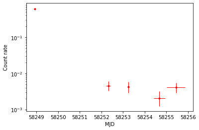
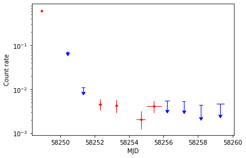

# The `swifttools.ukssdc.data.SXPS` module

[Jupyter notebook version of this page](SXPS.ipynb)

This module provides direct access to data in the [LSXPS catalogue](https://www.swift.ac.uk/LSXPS) and some functionality for [2SXPS](https://www.swift.ac.uk/2SXPS). Being part of the [`swifttools.ukssdc.data` module](../data.md) it is designed for use where you already know which elements in the catalogue you want to get data for. If you don't know that, for example you want to select them based on their characteristics, you will need the [SXPS query module](../query/SXPS.md).

I've split the page into sections, linked to from the contents page, so you don't have to read this straight thought but can jump to the point of interest. And (as with the rest of this documentation), this is designed to teach you how to use the API, not to explain details of the SXPS catalogues. For that, you should read (and cite!) the catalogue papers, and view the documentation on the relevant catalogue web pages; both can be accessed via the links above.

OK, first let's import the module, again using a short form to save our fingers and following the pattern adopted throughout:


```python
import swifttools.ukssdc.data.SXPS as uds
```

## Page contents

* [General notes](#intro)
* [Upper limits](#ul)
* [Getting the full catalogues](#fullCat)
  * [Old versions of LSXPS tables](#oldTab)
* [Sources](#sources)
  * [Source details](#sinfo)
  * [Observations lists](#sobs)
  * [Light curves](#lightcurves)
  * [Spectra](#spectra)
  * [Images](#sImages)
  * [XRTProductRequests](#xpr)
* [Datasets](#datasets)
  * [Dataset details](#dsinfo)
  * [Images](#dsImages)
  * [Superseded stacked images](#ssi)
* [Transients](#transients)
  * [Transient details](#tsinfo)
  * [Light curves](#tlightcurves)
  * [Spectra](#tspectra)
  * [Images](#tImages)
  * [XRTProductRequests](#txpr)


----

<a id='intro'></a>
## General notes

There are a number of arguments which are common to many of the functions in this module and it's worth covering them here, so that after this you can dip into the sections you care about without having missed anything important.

Firstly is `cat`. This argument lets you specify which catalogue you want to access, the default being 'LSXPS'; at the time of writing the only other one available is '2SXPS' and not all functionality exists for that catalogue. The name `cat` is deliberately chosen to make this tool ambivalent about which side of the Atlantic your spelling originates from.

Secondly is how you identify the object for which you want data, and how those data are indexed when you get them. This is a bit more complicated than it was for [GRBs](GRB.md), because for SXPS we can get data for sources, datasets or transients. The arguments by which the objects are identified are:

* **Sources**: `sourceName` or `sourceID`
* **Transients**: `sourceName` or `sourceID`
* **Datasets** : `DatasetID` or `obsID`.

You can only supply one argument, so if, for example, requesting a dataset, you supply either the `DatasetID` *or* the `obsID`, but not both: this would generate an error. Whichever argument you supply you can either give a single value, or a list/tuple of values. This affects how your data are returned, and we'll return to that in just a moment (the fourth point, below).

Thirdly is the argument `bands`. This is not ubiquitous but appears sufficiently often that we should consider it here. It is used to define which of the SXPS energy bands you want data for. This can usually be either the string 'all' (the default) or a list/tuple of band names. These refer to the SXPS bands which are:

* 'total' = 0.3-10 keV
* 'soft' = 0.3-1 keV
* 'medium' = 1-2 keV
* 'hard' = 2-10 keV

In some cases the hardness ratios 'HR1' and 'HR2' can be specified in the `bands` argument as well.

Fourthly we need to note how data are returned. Most functions in this module return a `dict` containing the data requested for the object; for example, `getSourceDetails(sourceID=1)` will return a `dict` of "sourceProperty": "value" pairs for source 1. But as I noted above, the argument specifying which object to get (`sourceID`, `sourceName` etc.) can be a list or tuple instead of a single value. In this case, the returned `dict` will contains keys for each requested object, and those entries will then contain the `dict` of results. So if we had run `getSourceDetails(sourceID=(1,5))` then the returned `dict` would have had keys '1' and '5', and those would have in turn been `dict`s with the source details. If we had supplied the `sourceName` argument instead of `sourceID`, the keys of our `dict`s would have been the source names. If this is a bit unclear in the abstract don't worry, it will be obvious what we mean when we get into the examples.

For light curves and spectra, data can be saved to disk as well as / instead of being returned as a `dict`. You can control what happens using the arguments `returnData` and `saveData`:

* `returnData` - (default `False`), whether or not the function should return a `dict` containing the data.
* `saveData` - (default: `True`), whether or not the function should download the data files from the UKSSDC website and write them to disk.

You can set both to `True` to return and save. You can also set both to `False` and waste compute time, network bandwidth and carbon dioxide, but maybe don't do this. And you can `returnData` and then subsequently save what you got, or some subset thereof. If you've read the [GRB page](GRB.md) this will all look familiar; if not, don't worry, I'm not going to assume you have. If you are using `saveData=True` you may also need the `clobber` parameter. This specifies whether existing files should be overwritten, and is `False` by default.

And lastly, many of the functions have an argument `skipErrors` which is `False` by default. This -- and I know it's going to shock you -- tells the function to skip over certain errors and just continue. This is normally use for functions that can act on multiple objects, for example when saving light curves for several sources, and you don't want an error affecting one source or curve to cause the whole process to fail. I won't point this out when it occurs below, as it just adds too much information to an already-dense document, but you can always use `help()` to check whether a function supports this argument.

Right, that was a lot of preliminary, so let's just get to work. We'll start off with calculating an upper limit.

<a id='ul'></a>
## Upper limits

You can generate upper limits at any position covered by the SXPS catalogues using the cryptically-named `getUpperLimits()` function. There are quite a lot of parameters you can play with and we'll come to them, but let's jump straight in with a demonstation.


```python
ul = uds.getUpperLimits(position='334.502058 -8.256481', cat='LSXPS')
```

`getUpperLimits()` always returns its result (there is no `saveData` option) so we captured it in the `ul` variable wich is a `dict`, let's explore it:


```python
ul.keys()
```


    dict_keys(['ResolvedRA', 'ResolvedDec', 'ResolvedInfo', 'ULData'])


The first few keys tell us how the `position` argument was parsed, and we'll come to that in a moment. The actual upper limit is contained in 'ULData', which we can examine:


```python
ul['ULData']
```


<div style='width: 95%; max-height: 200px; overflow: scroll;'><style scoped>    .dataframe tbody tr th:only-of-type {        vertical-align: middle;    }    .dataframe tbody tr th {        vertical-align: top;    }    .dataframe thead th {        text-align: right;    }</style><table border="1" class="dataframe">  <thead>    <tr style="text-align: right;">      <th></th>      <th>StartTime</th>      <th>StopTime</th>      <th>ObsID</th>      <th>SourceExposure</th>      <th>ImageExposure</th>      <th>Total_UpperLimit</th>      <th>Total_Counts</th>      <th>Total_BGCounts</th>      <th>Total_CorrectionFactor</th>    </tr>  </thead>  <tbody>    <tr>      <th>0</th>      <td>2006-04-28 02:19:58</td>      <td>2019-10-18 21:06:16</td>      <td>10000018414</td>      <td>50071.75</td>      <td>55395.777344</td>      <td>0.000321</td>      <td>17.0</td>      <td>22.100154</td>      <td>1.326975</td>    </tr>  </tbody></table></div>


This is a pandas `DataFrame` object, and it gives you the upper limit (in the total band) along with some details about where the upper limit came from - see [the online documentation](https://www.swift.ac.uk/LSXPS/uldocs.php) for details.

You may be wondering why this is a `DataFrame`, when there's only a single entry. The answer is that there is only a single entry because we just accepted the default parameters, which returns an upper limit calculated from the dataset with the deepest exposure at the source location (and only in the total band). We can change this behaviour using the parameters `whichData` and `bands`. The latter was discussed in the [General notes](#intro). `whichData` is a string and can be either:

* 'deepest' - get the upper limit from the dataset with the most exposure at the input position (default)
* 'all' - get upper limits from every dataset covering the input position.

So let's ask instead for upper limits in all bands and all datasets; this will take a few moments longer to calculate:


```python
ul = uds.getUpperLimits(position='77.969042, -62.324167',
                        cat='LSXPS',
                        bands='all',
                        whichData='all')
```

And now let's see what the 'ULData' entry looks like:


```python
ul['ULData']
```


<div style='width: 95%; max-height: 200px; overflow: scroll;'><style scoped>    .dataframe tbody tr th:only-of-type {        vertical-align: middle;    }    .dataframe tbody tr th {        vertical-align: top;    }    .dataframe thead th {        text-align: right;    }</style><table border="1" class="dataframe">  <thead>    <tr style="text-align: right;">      <th></th>      <th>StartTime</th>      <th>StopTime</th>      <th>ObsID</th>      <th>SourceExposure</th>      <th>ImageExposure</th>      <th>Total_UpperLimit</th>      <th>Total_Counts</th>      <th>Total_BGCounts</th>      <th>Total_CorrectionFactor</th>      <th>Soft_UpperLimit</th>      <th>...</th>      <th>Soft_BGCounts</th>      <th>Soft_CorrectionFactor</th>      <th>Medium_UpperLimit</th>      <th>Medium_Counts</th>      <th>Medium_BGCounts</th>      <th>Medium_CorrectionFactor</th>      <th>Hard_UpperLimit</th>      <th>Hard_Counts</th>      <th>Hard_BGCounts</th>      <th>Hard_CorrectionFactor</th>    </tr>  </thead>  <tbody>    <tr>      <th>0</th>      <td>2009-01-11 02:16:35</td>      <td>2021-03-13 23:46:13</td>      <td>10000020308</td>      <td>31007.108434</td>      <td>36730.542969</td>      <td>0.002796</td>      <td>575.0</td>      <td>579.319382</td>      <td>1.422133</td>      <td>0.001539</td>      <td>...</td>      <td>175.639068</td>      <td>1.422133</td>      <td>0.001776</td>      <td>240.0</td>      <td>233.679986</td>      <td>1.422133</td>      <td>0.001384</td>      <td>166.0</td>      <td>141.947255</td>      <td>1.422133</td>    </tr>    <tr>      <th>1</th>      <td>2018-05-10 22:06:39</td>      <td>2018-05-10 23:58:24</td>      <td>00831816000</td>      <td>1032.104819</td>      <td>1033.007600</td>      <td>0.080617</td>      <td>508.0</td>      <td>513.051351</td>      <td>1.227909</td>      <td>0.043683</td>      <td>...</td>      <td>150.637800</td>      <td>1.227909</td>      <td>0.051651</td>      <td>210.0</td>      <td>210.598484</td>      <td>1.227909</td>      <td>0.043812</td>      <td>151.0</td>      <td>151.527823</td>      <td>1.227909</td>    </tr>    <tr>      <th>2</th>      <td>2018-05-12 09:31:05</td>      <td>2018-05-12 12:47:20</td>      <td>00831816002</td>      <td>135.198780</td>      <td>190.554800</td>      <td>0.072142</td>      <td>1.0</td>      <td>0.054678</td>      <td>1.703401</td>      <td>0.052857</td>      <td>...</td>      <td>0.094047</td>      <td>1.703401</td>      <td>0.072338</td>      <td>1.0</td>      <td>0.032169</td>      <td>1.703401</td>      <td>0.052857</td>      <td>0.0</td>      <td>0.022493</td>      <td>1.703401</td>    </tr>    <tr>      <th>3</th>      <td>2018-05-13 06:14:02</td>      <td>2018-05-13 11:13:57</td>      <td>00831816003</td>      <td>1302.687500</td>      <td>1313.825200</td>      <td>0.010449</td>      <td>3.0</td>      <td>0.533764</td>      <td>1.218156</td>      <td>0.007300</td>      <td>...</td>      <td>0.305089</td>      <td>1.218156</td>      <td>0.009208</td>      <td>2.0</td>      <td>0.112232</td>      <td>1.218156</td>      <td>0.005490</td>      <td>0.0</td>      <td>0.101873</td>      <td>1.218156</td>    </tr>    <tr>      <th>4</th>      <td>2018-05-14 06:04:07</td>      <td>2018-05-14 11:10:09</td>      <td>00831816004</td>      <td>3420.219512</td>      <td>3913.895300</td>      <td>0.004883</td>      <td>13.0</td>      <td>13.770363</td>      <td>1.348728</td>      <td>0.005053</td>      <td>...</td>      <td>0.518664</td>      <td>1.348728</td>      <td>0.005114</td>      <td>5.0</td>      <td>0.348361</td>      <td>1.348728</td>      <td>0.003901</td>      <td>3.0</td>      <td>0.459833</td>      <td>1.348728</td>    </tr>    <tr>      <th>5</th>      <td>2018-05-15 06:00:45</td>      <td>2018-05-15 08:02:17</td>      <td>00831816005</td>      <td>2981.200000</td>      <td>2993.716200</td>      <td>0.005406</td>      <td>11.0</td>      <td>11.769374</td>      <td>1.212614</td>      <td>0.005320</td>      <td>...</td>      <td>0.393220</td>      <td>1.212614</td>      <td>0.005370</td>      <td>4.0</td>      <td>0.290672</td>      <td>1.212614</td>      <td>0.004587</td>      <td>3.0</td>      <td>0.459679</td>      <td>1.212614</td>    </tr>    <tr>      <th>6</th>      <td>2018-05-16 10:52:40</td>      <td>2018-05-16 23:46:36</td>      <td>00831816006</td>      <td>3458.195122</td>      <td>3565.380600</td>      <td>0.003669</td>      <td>6.0</td>      <td>7.200492</td>      <td>1.225049</td>      <td>0.002032</td>      <td>...</td>      <td>0.509580</td>      <td>1.225049</td>      <td>0.003897</td>      <td>3.0</td>      <td>0.448037</td>      <td>1.225049</td>      <td>0.003861</td>      <td>3.0</td>      <td>0.554207</td>      <td>1.225049</td>    </tr>    <tr>      <th>7</th>      <td>2018-05-17 01:13:28</td>      <td>2018-05-17 22:01:36</td>      <td>00831816007</td>      <td>3627.719512</td>      <td>3903.866100</td>      <td>0.004593</td>      <td>13.0</td>      <td>13.794047</td>      <td>1.265324</td>      <td>0.003078</td>      <td>...</td>      <td>0.559181</td>      <td>1.265324</td>      <td>0.004118</td>      <td>9.0</td>      <td>9.340048</td>      <td>1.265324</td>      <td>0.003109</td>      <td>2.0</td>      <td>0.452695</td>      <td>1.265324</td>    </tr>    <tr>      <th>8</th>      <td>2018-05-18 02:43:21</td>      <td>2018-05-18 09:18:37</td>      <td>00831816008</td>      <td>3012.913580</td>      <td>3151.676100</td>      <td>0.005775</td>      <td>5.0</td>      <td>0.830020</td>      <td>1.276016</td>      <td>0.004645</td>      <td>...</td>      <td>0.315025</td>      <td>1.276016</td>      <td>0.003214</td>      <td>1.0</td>      <td>0.208594</td>      <td>1.276016</td>      <td>0.003167</td>      <td>1.0</td>      <td>0.365036</td>      <td>1.276016</td>    </tr>    <tr>      <th>9</th>      <td>2018-05-19 02:35:28</td>      <td>2018-05-19 07:23:19</td>      <td>00831816009</td>      <td>2671.634146</td>      <td>2720.420500</td>      <td>0.005043</td>      <td>3.0</td>      <td>0.748863</td>      <td>1.241829</td>      <td>0.003598</td>      <td>...</td>      <td>0.280363</td>      <td>1.241829</td>      <td>0.003603</td>      <td>1.0</td>      <td>0.265807</td>      <td>1.241829</td>      <td>0.003587</td>      <td>1.0</td>      <td>0.315610</td>      <td>1.241829</td>    </tr>    <tr>      <th>10</th>      <td>2018-05-20 02:26:59</td>      <td>2018-05-20 07:29:29</td>      <td>00831816010</td>      <td>4908.426829</td>      <td>5282.881100</td>      <td>0.004115</td>      <td>7.0</td>      <td>1.604165</td>      <td>1.309514</td>      <td>0.003175</td>      <td>...</td>      <td>0.640918</td>      <td>1.309514</td>      <td>0.002843</td>      <td>3.0</td>      <td>0.317096</td>      <td>1.309514</td>      <td>0.001466</td>      <td>0.0</td>      <td>0.598214</td>      <td>1.309514</td>    </tr>    <tr>      <th>11</th>      <td>2018-05-21 02:19:57</td>      <td>2018-05-21 13:56:37</td>      <td>00831816011</td>      <td>4487.000000</td>      <td>4620.953900</td>      <td>0.004481</td>      <td>7.0</td>      <td>1.505219</td>      <td>1.235999</td>      <td>0.002971</td>      <td>...</td>      <td>0.686730</td>      <td>1.235999</td>      <td>0.002603</td>      <td>2.0</td>      <td>0.302586</td>      <td>1.235999</td>      <td>0.002530</td>      <td>2.0</td>      <td>0.599897</td>      <td>1.235999</td>    </tr>  </tbody></table><p>12 rows × 21 columns</p></div>


This time we have more rows (12 when I'm writing this, but LSXPS is living, so this could increase before you run it). We also have a lot more columns because of the `bands='all'` argument, you may need to scroll to the right (or give the command `ul['ULData'].columns`) to see them all, but basically you have upper limits and associated details in all of the bands now.

If you were paying close attention, you'll noticed that I gave a different position as well this time, which I did to show you something else. Let's have a look at our `ul` object returned by the above call:


```python
ul.keys()
```


    dict_keys(['ResolvedRA', 'ResolvedDec', 'ResolvedInfo', 'DetData', 'ULData'])


Note the new key 'DetData'. If this is present, it means that the input position is near to (within 30" of) a source in the catalogue you searched. If you already knew this, and wanted an upper limit close to the source then you don't need to worry about this. However, it may be telling you that your position corresponds to a known source, in which case, upper limits are probably not appropriate.

If this key is set, its value tells you about the source(s) in question:


```python
ul['DetData']
```


<div style='width: 95%; max-height: 200px; overflow: scroll;'><style scoped>    .dataframe tbody tr th:only-of-type {        vertical-align: middle;    }    .dataframe tbody tr th {        vertical-align: top;    }    .dataframe thead th {        text-align: right;    }</style><table border="1" class="dataframe">  <thead>    <tr style="text-align: right;">      <th></th>      <th>Distance</th>      <th>SourceName</th>    </tr>  </thead>  <tbody>    <tr>      <th>0</th>      <td>2.4</td>      <td>LSXPS J051152.3-621925</td>    </tr>  </tbody></table></div>


Here there is a single source 2.4" from the input position (the "Distance" field is always in arcsec), and you would often want to get the light curve for the source using the `getLightCurves()` function ([described below](#lightcurves)), rather than getting upper limits. Of course, you may not want the light curve; maybe you really are placing limits on the flux of a source really near to the catalogued ones, for this reason the upper limits were still given.

There are a few other options that let you control your upper limits:

* `sigma` (default: 3) - sets the confidence level (in Gaussian sigmas) of the desired upper limit.
* `detThresh` - only used if `detectionsAsRates` is `True`. This sets the confidence level needed to report a detection. By default it is the same as `sigma` but doesn't have to be. For example, you can set `detThresh=2, sigma=3`. This will cause a 3-sigma upper limit to be reported, unless the source is detected at the 2-sigma level, in which case the count-rate will be provided (if you think this is weird, I agree, but this feature was specifically requested, and I'm not here to judge. Much).
* `detectionsAsRates` (default: `False`) - tells the upper limit server to check if the count-rate value corresponds to a detection, and if so, to report the count-rate and 1-sigma error as well as the upper limit.
* `skipDetections` (default `False`) - causes datasets in which there is a catalogue detection within 30" of your input position to be skipped.

Let's do a quick demonstration, because `detectionsAsRates` results in more columns in the output:


```python
ul = uds.getUpperLimits(position='77.969042, -62.324167',
                        cat='LSXPS',
                        whichData='all',
                        detectionsAsRates=True)
```

(Note, I removed the `bands` argument so we just get the total band again).

Let's have a look at the results:


```python
ul['ULData']
```


<div style='width: 95%; max-height: 200px; overflow: scroll;'><style scoped>    .dataframe tbody tr th:only-of-type {        vertical-align: middle;    }    .dataframe tbody tr th {        vertical-align: top;    }    .dataframe thead th {        text-align: right;    }</style><table border="1" class="dataframe">  <thead>    <tr style="text-align: right;">      <th></th>      <th>StartTime</th>      <th>StopTime</th>      <th>ObsID</th>      <th>SourceExposure</th>      <th>ImageExposure</th>      <th>Total_UpperLimit</th>      <th>Total_Rate</th>      <th>Total_RatePos</th>      <th>Total_RateNeg</th>      <th>Total_Counts</th>      <th>Total_BGCounts</th>      <th>Total_CorrectionFactor</th>      <th>Total_IsDetected</th>    </tr>  </thead>  <tbody>    <tr>      <th>0</th>      <td>2009-01-11 02:16:35</td>      <td>2021-03-13 23:46:13</td>      <td>10000020308</td>      <td>31007.108434</td>      <td>36730.542969</td>      <td>0.002796</td>      <td>NaN</td>      <td>NaN</td>      <td>NaN</td>      <td>575.0</td>      <td>579.319382</td>      <td>1.422133</td>      <td>False</td>    </tr>    <tr>      <th>1</th>      <td>2018-05-10 22:06:39</td>      <td>2018-05-10 23:58:24</td>      <td>00831816000</td>      <td>1032.104819</td>      <td>1033.007600</td>      <td>0.080617</td>      <td>NaN</td>      <td>NaN</td>      <td>NaN</td>      <td>508.0</td>      <td>513.051351</td>      <td>1.227909</td>      <td>False</td>    </tr>    <tr>      <th>2</th>      <td>2018-05-12 09:31:05</td>      <td>2018-05-12 12:47:20</td>      <td>00831816002</td>      <td>135.198780</td>      <td>190.554800</td>      <td>0.072142</td>      <td>NaN</td>      <td>NaN</td>      <td>NaN</td>      <td>1.0</td>      <td>0.054678</td>      <td>1.703401</td>      <td>False</td>    </tr>    <tr>      <th>3</th>      <td>2018-05-13 06:14:02</td>      <td>2018-05-13 11:13:57</td>      <td>00831816003</td>      <td>1302.687500</td>      <td>1313.825200</td>      <td>0.010449</td>      <td>NaN</td>      <td>NaN</td>      <td>NaN</td>      <td>3.0</td>      <td>0.533764</td>      <td>1.218156</td>      <td>False</td>    </tr>    <tr>      <th>4</th>      <td>2018-05-14 06:04:07</td>      <td>2018-05-14 11:10:09</td>      <td>00831816004</td>      <td>3420.219512</td>      <td>3913.895300</td>      <td>0.004883</td>      <td>NaN</td>      <td>NaN</td>      <td>NaN</td>      <td>13.0</td>      <td>13.770363</td>      <td>1.348728</td>      <td>False</td>    </tr>    <tr>      <th>5</th>      <td>2018-05-15 06:00:45</td>      <td>2018-05-15 08:02:17</td>      <td>00831816005</td>      <td>2981.200000</td>      <td>2993.716200</td>      <td>0.005406</td>      <td>NaN</td>      <td>NaN</td>      <td>NaN</td>      <td>11.0</td>      <td>11.769374</td>      <td>1.212614</td>      <td>False</td>    </tr>    <tr>      <th>6</th>      <td>2018-05-16 10:52:40</td>      <td>2018-05-16 23:46:36</td>      <td>00831816006</td>      <td>3458.195122</td>      <td>3565.380600</td>      <td>0.003669</td>      <td>NaN</td>      <td>NaN</td>      <td>NaN</td>      <td>6.0</td>      <td>7.200492</td>      <td>1.225049</td>      <td>False</td>    </tr>    <tr>      <th>7</th>      <td>2018-05-17 01:13:28</td>      <td>2018-05-17 22:01:36</td>      <td>00831816007</td>      <td>3627.719512</td>      <td>3903.866100</td>      <td>0.004593</td>      <td>NaN</td>      <td>NaN</td>      <td>NaN</td>      <td>13.0</td>      <td>13.794047</td>      <td>1.265324</td>      <td>False</td>    </tr>    <tr>      <th>8</th>      <td>2018-05-18 02:43:21</td>      <td>2018-05-18 09:18:37</td>      <td>00831816008</td>      <td>3012.913580</td>      <td>3151.676100</td>      <td>0.005775</td>      <td>0.001688</td>      <td>0.001065</td>      <td>-0.000786</td>      <td>5.0</td>      <td>0.830020</td>      <td>1.276016</td>      <td>True</td>    </tr>    <tr>      <th>9</th>      <td>2018-05-19 02:35:28</td>      <td>2018-05-19 07:23:19</td>      <td>00831816009</td>      <td>2671.634146</td>      <td>2720.420500</td>      <td>0.005043</td>      <td>NaN</td>      <td>NaN</td>      <td>NaN</td>      <td>3.0</td>      <td>0.748863</td>      <td>1.241829</td>      <td>False</td>    </tr>    <tr>      <th>10</th>      <td>2018-05-20 02:26:59</td>      <td>2018-05-20 07:29:29</td>      <td>00831816010</td>      <td>4908.426829</td>      <td>5282.881100</td>      <td>0.004115</td>      <td>0.001337</td>      <td>0.000750</td>      <td>-0.000582</td>      <td>7.0</td>      <td>1.604165</td>      <td>1.309514</td>      <td>True</td>    </tr>    <tr>      <th>11</th>      <td>2018-05-21 02:19:57</td>      <td>2018-05-21 13:56:37</td>      <td>00831816011</td>      <td>4487.000000</td>      <td>4620.953900</td>      <td>0.004481</td>      <td>0.001470</td>      <td>0.000810</td>      <td>-0.000628</td>      <td>7.0</td>      <td>1.505219</td>      <td>1.235999</td>      <td>True</td>    </tr>  </tbody></table></div>


Be sure to scroll to the right to see all the columns, or run the cell below:


```python
ul['ULData'].columns.tolist()
```


    ['StartTime',
     'StopTime',
     'ObsID',
     'SourceExposure',
     'ImageExposure',
     'Total_UpperLimit',
     'Total_Rate',
     'Total_RatePos',
     'Total_RateNeg',
     'Total_Counts',
     'Total_BGCounts',
     'Total_CorrectionFactor',
     'Total_IsDetected']


This time, the `DataFrame` has extra columns. 'Total_Rate', 'Total_RatePos' and 'Total_RateNeg' columns are are NaN when the source is undetected, otherwise contains the rate and 1-sigma error. There is also a column 'Total_IsDetected' which is a boolean column indicating whether or not the source was detected in each dataset (a source is 'detected' if the lower-limit on its count rate is &gt;0, at the confidence level set by the `detThresh` parameter, above).

We're nearly done, but there are two more things to mention. 

First, let's come back to those 'Resolved' keys in the returned dict:


```python
ul.keys()
```


    dict_keys(['ResolvedRA', 'ResolvedDec', 'ResolvedInfo', 'DetData', 'ULData'])


Those keys starting "Resolved" tell you how the input position was parsed. Let's look at them:


```python
print(f"ResolvedRA:   {ul['ResolvedRA']}")
print(f"ResolvedDec:  {ul['ResolvedDec']}")
print(f"ResolvedInfo: {ul['ResolvedInfo']}")
```

    ResolvedRA:   77.96904
    ResolvedDec:  -62.32417
    ResolvedInfo: Parsed '77.969042, -62.324167' as (77.96904, -62.32417)


As you may expect, 'ResolvedRA' and '-Dec' are just the RA and Dec (in decimal degrees), ResolvedInfo gives you some text.

You don't have to use the `position` argument to give the upper limit position, the input options are the same as for a cone search in [the query module](../query.md), that is:

* `position` - as used above, a free-form coordinate string. It tries to support everything I can think of, but if you do something evil (and why would you?) like giving RA in sexagasimal and Dec in decimal then I can't promise it will work (and will be outrageously rude if you complain). But hey, that's why the Resolved* keys are returned, so you can check things.
* `name` - the name of a catalogued object, that the system will attempt to resolve using some standard services like SIMBAD, MARS and TNS.
* `RA` and `Dec` - You can explicitly provide the RA and Dec using these arguments, which can receive either a decimal number (assumed to be degrees) or an `astropy.coordinates.Angle` object.

In the latter case the 'Resolved*' keys will not be present in the returned `dict` since no parsing/resolving was needed.

I should also mention the `timeFormat` argument. In all the examples above, the 'StartTime' and 'StopTime' appeared as calendar dates, but you can change this by setting `timeFormat` to one of 'MJD', 'TDB', 'MET' (or 'cal', the default). MJD and TBD are standard timesystems and MET is Swift's Mission Elapsed Time.

Of course, as with everything else, I have tried to provide useful docstrings, so `help(uds.getUpperLimits)` will give you more information.

### When upper limits timeout

Calculation of upper limits is not instantaneous, and only a finite number can be found at once. The API waits 5 minutes for a response from the upper limit server. If the limit has not been found in that time, the `dict` returned by `getUpperLimits()` will contain the key 'TIMEOUT'. **Do not despair**! This doesn't mean you can't get an upper limitm it just means you need to wait a moment. The value of the 'TIMEOUT' entry is an identifier that can be used to get your upper limit. So, wait a minute or so, then try:

```
ul = uds.getFailedUpperLimit(ul['TIMEOUT'])
```

If the limit has now been calculated then `ul` will now be the normal upper limit `dict`. If not, then it will still have the 'TIMEOUT' key, and you can wait a bit and try again. There are two things to note about this:

1. Upper limits are deleted from the server when retrieved, so `getFailedUpperLimit()` can only return the result once.
2. Don't let your code wait forever. If there is a server-side failure, your upper limit may always show as timed out. Put some sanity in your loops!

----

### Merging upper limits

If the `whichData='all'` argument was passed, we may then want to combine upper limits from some subset of the results. For this we can use the `mergeUpperLimits()` function. This is actually one of the handful of 'common' functions in the top-level module, so we will need to import that module:


```python
import swifttools.ukssdc as uk
```

I'm not going to go into details here of how this function works, and what all the options are for it, for that you should see the [page describing the common functions](commonFunc.md). Let's just give a simple demo:


```python
merged = uk.mergeUpperLimits(ul['ULData'],
                             verbose=True,
                             conf=0.95,
                             rows=ul['ULData']['ObsID']<"10000000000"
                            )
merged
```

    Merge does not give a detection in band Total.
    Skipping band `Soft` as data are missing
    Skipping band `Medium` as data are missing
    Skipping band `Hard` as data are missing


    {'SourceExposure': 31037.299801963036,
     'ImageExposure': 32690.1774,
     'Total_UpperLimit': 0.0022251588163850447,
     'Total_Counts': 577.0,
     'Total_BGCounts': 564.8623355896407,
     'Total_CorrectionFactor': 1.2676373917501889,
     'Total_Rate': nan,
     'Total_RatePos': nan,
     'Total_RateNeg': nan,
     'Total_IsDetected': False}


First, note the `rows` argument I supplied, which told the code to merge a subset of the data only. What you actually supply is a `pandas Series` but as demonstrated above, you can use `pandas` filter syntax to create this. In this case I wanted only the individual observations, so I filtered on ObsID because I know stacked images are the only things with obsIDs>1e10 (but as ObsID is a string column, to keep the leading zeroes, I did a string comparison).

Also, just for fun, I requested a 95% confidence (~2 sigma) rather than the normal 3-sigma upper limit (which is the default).

As you can see (because I turned on verbosity), only the total band was merged because we only have the total band data in our upper limit. And the returned data is a `dict` that looks very like a single row of the upper limits supplied.

<a id='fullCat'></a>
## Getting the full catalogues

If you want to simply download the full catalogue table, you can use the function `getFullCat()`. This requires, as a minimum, which table you want to get.


```python
uds.getFullTable(table='sources',
                 saveData=True,
                 destDir='/tmp/APIDemo_SXPS_cat',
                 silent=False)
```

    Making directory /tmp/APIDemo_SXPS_cat


In the above I also turned off silent output, and specified the directory in which to save things.

`getFullTable()` is one of the functions that takes the options `saveData` and `returnData`. In the above I explicitly gave `saveData=True` even though this is the default. 

We could instead have given `returnData=True` which actually downloads the file, reads it into a `DataFrame` and then (unless `saveData=True`), deletes it. By default (unless you specify the `destDir` argument) this file will be briefly stored in a temporary directory. Let's explore this:


```python
data = uds.getFullTable(table='sources',
                        returnData=True,
                        saveData=False,
                        silent=False,
                        verbose=True)
```

    Uploading data to https://www.swift.ac.uk/API/main.php
    Returned keys: dict_keys(['OK', 'URL', 'FILE', 'APIVersion'])
    Checking returned data for required content.
    Downloading file `/tmp/tmphxk3n848/LSXPS_Sources.csv`
    Saving file `/tmp/tmphxk3n848/LSXPS_Sources.csv`
    Removing downloaded file /tmp/tmphxk3n848/LSXPS_Sources.csv


This is just about the only function in which the return type is not a `dict` but is just the `DataFrame`:


```python
data
```


<div style='width: 95%; max-height: 200px; overflow: scroll;'><style scoped>    .dataframe tbody tr th:only-of-type {        vertical-align: middle;    }    .dataframe tbody tr th {        vertical-align: top;    }    .dataframe thead th {        text-align: right;    }</style><table border="1" class="dataframe">  <thead>    <tr style="text-align: right;">      <th></th>      <th>LSXPS_ID</th>      <th>IAUName</th>      <th>RA</th>      <th>Decl</th>      <th>Err90</th>      <th>AstromType</th>      <th>l</th>      <th>b</th>      <th>MeanOffAxisAngle</th>      <th>NearestNeighbour</th>      <th>...</th>      <th>MatchIn4XMM_DR10s</th>      <th>MatchInXMMSL2</th>      <th>MatchInSwiftFT</th>      <th>MatchIn1SWXRT</th>      <th>MatchInXRTGRB</th>      <th>MatchInSDSS_QSO_DR14</th>      <th>MatchIn2MASS</th>      <th>MatchInUSNOB1</th>      <th>MatchIn2CSC</th>      <th>MatchIn2SXPS</th>    </tr>  </thead>  <tbody>    <tr>      <th>0</th>      <td>1</td>      <td>LSXPS J163700.6+073914</td>      <td>249.25254</td>      <td>7.65391</td>      <td>7.1</td>      <td>0</td>      <td>23.87352</td>      <td>33.29467</td>      <td>2.18</td>      <td>265.31</td>      <td>...</td>      <td>0</td>      <td>0</td>      <td>0</td>      <td>0</td>      <td>0</td>      <td>0</td>      <td>0</td>      <td>0</td>      <td>0</td>      <td>1</td>    </tr>    <tr>      <th>1</th>      <td>2</td>      <td>LSXPS J163647.0+074206</td>      <td>249.19612</td>      <td>7.70193</td>      <td>7.3</td>      <td>0</td>      <td>23.89358</td>      <td>33.36643</td>      <td>3.57</td>      <td>265.31</td>      <td>...</td>      <td>0</td>      <td>0</td>      <td>0</td>      <td>1</td>      <td>0</td>      <td>0</td>      <td>0</td>      <td>1</td>      <td>0</td>      <td>1</td>    </tr>    <tr>      <th>2</th>      <td>3</td>      <td>LSXPS J163710.1+074315</td>      <td>249.29248</td>      <td>7.72102</td>      <td>8.3</td>      <td>0</td>      <td>23.96660</td>      <td>33.29055</td>      <td>6.36</td>      <td>280.47</td>      <td>...</td>      <td>0</td>      <td>0</td>      <td>0</td>      <td>0</td>      <td>0</td>      <td>0</td>      <td>0</td>      <td>1</td>      <td>0</td>      <td>1</td>    </tr>    <tr>      <th>3</th>      <td>4</td>      <td>LSXPS J115006.7+641942</td>      <td>177.52833</td>      <td>64.32839</td>      <td>6.5</td>      <td>0</td>      <td>133.53886</td>      <td>51.51840</td>      <td>6.00</td>      <td>1749.80</td>      <td>...</td>      <td>0</td>      <td>0</td>      <td>0</td>      <td>0</td>      <td>0</td>      <td>0</td>      <td>0</td>      <td>1</td>      <td>0</td>      <td>1</td>    </tr>    <tr>      <th>4</th>      <td>5</td>      <td>LSXPS J155612.3-181111</td>      <td>239.05134</td>      <td>-18.18660</td>      <td>5.4</td>      <td>0</td>      <td>352.81614</td>      <td>26.29516</td>      <td>7.83</td>      <td>571.15</td>      <td>...</td>      <td>0</td>      <td>0</td>      <td>0</td>      <td>0</td>      <td>0</td>      <td>0</td>      <td>0</td>      <td>0</td>      <td>0</td>      <td>1</td>    </tr>    <tr>      <th>...</th>      <td>...</td>      <td>...</td>      <td>...</td>      <td>...</td>      <td>...</td>      <td>...</td>      <td>...</td>      <td>...</td>      <td>...</td>      <td>...</td>      <td>...</td>      <td>...</td>      <td>...</td>      <td>...</td>      <td>...</td>      <td>...</td>      <td>...</td>      <td>...</td>      <td>...</td>      <td>...</td>      <td>...</td>    </tr>    <tr>      <th>278193</th>      <td>371055</td>      <td>LSXPS J104250.9-592332</td>      <td>160.71247</td>      <td>-59.39237</td>      <td>7.1</td>      <td>0</td>      <td>287.21236</td>      <td>-0.50329</td>      <td>NaN</td>      <td>90.76</td>      <td>...</td>      <td>0</td>      <td>0</td>      <td>0</td>      <td>0</td>      <td>0</td>      <td>0</td>      <td>0</td>      <td>0</td>      <td>0</td>      <td>0</td>    </tr>    <tr>      <th>278194</th>      <td>371056</td>      <td>LSXPS J104538.3-593935</td>      <td>161.40975</td>      <td>-59.65987</td>      <td>9.9</td>      <td>0</td>      <td>287.65015</td>      <td>-0.57371</td>      <td>NaN</td>      <td>53.72</td>      <td>...</td>      <td>0</td>      <td>0</td>      <td>0</td>      <td>0</td>      <td>0</td>      <td>0</td>      <td>0</td>      <td>0</td>      <td>0</td>      <td>0</td>    </tr>    <tr>      <th>278195</th>      <td>371057</td>      <td>LSXPS J104354.6-593158</td>      <td>160.97773</td>      <td>-59.53298</td>      <td>4.3</td>      <td>0</td>      <td>287.39755</td>      <td>-0.56367</td>      <td>NaN</td>      <td>21.46</td>      <td>...</td>      <td>0</td>      <td>0</td>      <td>0</td>      <td>0</td>      <td>0</td>      <td>0</td>      <td>0</td>      <td>0</td>      <td>0</td>      <td>0</td>    </tr>    <tr>      <th>278196</th>      <td>371058</td>      <td>LSXPS J104405.1-592706</td>      <td>161.02131</td>      <td>-59.45190</td>      <td>6.5</td>      <td>0</td>      <td>287.37898</td>      <td>-0.48171</td>      <td>NaN</td>      <td>60.31</td>      <td>...</td>      <td>0</td>      <td>0</td>      <td>0</td>      <td>0</td>      <td>0</td>      <td>0</td>      <td>0</td>      <td>0</td>      <td>0</td>      <td>0</td>    </tr>    <tr>      <th>278197</th>      <td>371059</td>      <td>LSXPS J104202.9-593253</td>      <td>160.51211</td>      <td>-59.54815</td>      <td>5.4</td>      <td>0</td>      <td>287.19677</td>      <td>-0.68872</td>      <td>NaN</td>      <td>35.74</td>      <td>...</td>      <td>0</td>      <td>0</td>      <td>0</td>      <td>0</td>      <td>0</td>      <td>0</td>      <td>0</td>      <td>0</td>      <td>0</td>      <td>0</td>    </tr>  </tbody></table><p>278198 rows × 234 columns</p></div>


There are a few other options, which you can read about via the `help()` function:

* `format` - defaults to 'csv' but can be changed to 'fits', provided that `returnData=False`.
* `subset` - some tables have subsets (e.g. the sources table has a 'clean' and 'ultra-clean' subset). You can request these. 

So:


```python
data = uds.getFullTable(table='datasets',
                        destDir='/tmp/APIDemo_SXPS_cat',
                        saveData=True,
                        subset='ultra-clean',
                        format='fits',
                        silent=False,
                        verbose=True, )
```

    Uploading data to https://www.swift.ac.uk/API/main.php
    Returned keys: dict_keys(['OK', 'URL', 'FILE', 'APIVersion'])
    Checking returned data for required content.
    Downloading file `/tmp/APIDemo_SXPS_cat/LSXPS_Datasets_ultra-clean.fits`
    Saving file `/tmp/APIDemo_SXPS_cat/LSXPS_Datasets_ultra-clean.fits`


I hope the result of this hasn't surprised you!

Since these catalogues are dynamic, the website allows you to access old versions of the catalogues too. This is not yet possible through the API, but will likely be added in the near future.

<a id='oldTab'></a>
### Old versions of LSXPS tables

LSXPS is a dynamic catalogue and as such the tables are in constant flux. For this reason, snapshots of the tables are taken every hour (stored for a limited period of time) and day (stored indefinitely). You may wish to grab one of these old versions. We can do that simply by adding the `epoch` argument to the call above, where `epoch` is the timestamp of the table we want. But how do we find that out? We can use the `listOldTables()` function to see what is available.


```python
oldTabs = uds.listOldTables()
oldTabs.keys()
```


    dict_keys(['hourly', 'daily'])


As you can see, this has returned us something with keys 'hourly' and 'daily', and those themselves are `dict`s containing keys giving the epochs for which snapshots exist. These can have a lot of entries so I'll just show the first 5 here:


```python
list(oldTabs['hourly'].keys())[0:5]
```


    ['2022-08-17 10:00:01 UTC',
     '2022-08-17 11:00:02 UTC',
     '2022-08-17 12:00:01 UTC',
     '2022-08-17 13:00:01 UTC',
     '2022-08-17 14:00:02 UTC']


```python
list(oldTabs['daily'].keys())[0:5]
```


    ['2022-08-16', '2022-08-17', '2022-08-18', '2022-08-19', '2022-08-20']


If you want to you can look inside those entries too, they list all of the tables available in each snapshot and their filenames, but since every table should be available every time, we shouldn't need to bother.

Any of the keys we've just seen can be supplied as the `epoch` parameter to `getFullTable`, so '2022-08-16 21:00:02 UTC', for example, or '2022-08-16' are both valid; but they must be **exact** matches. So if we want to get a specific table we can do something like:


```python
data = uds.getFullTable(table='sources',
                        destDir='/tmp/APIDemo_SXPS_cat',
                        saveData=True,
                        subset='ultra-clean',
                        epoch='2022-08-17',
                        format='fits',
                        silent=False,
                        verbose=True, )
```

    Uploading data to https://www.swift.ac.uk/API/main.php
    Returned keys: dict_keys(['OK', 'URL', 'FILE', 'APIVersion'])
    Checking returned data for required content.
    Downloading file `/tmp/APIDemo_SXPS_cat/LSXPS_Sources_ultra-clean_20220817T000001.fits.gz`
    Saving file `/tmp/APIDemo_SXPS_cat/LSXPS_Sources_ultra-clean_20220817T000001.fits.gz`
    gunzipping /tmp/APIDemo_SXPS_cat/LSXPS_Sources_ultra-clean_20220817T000001.fits.gz


Of course, the point of providing these old tables is for reproducibility: so you can come back to some old work and still get at the same catalogue table. This means that in reality, you will probably only run the `listOldTables()` function the first time you work on something that needs a static catalogue, and you will select the most recent version (it's probably best to take a 'daily' one, since they are kept forever). You can make a note of the epoch you obtained, and then when you come back to it later, you don't need to do a look up, you just use that epoch.

---

<a id='sources'></a>
## Sources

Before we get into the details of getting products for a given SXPS source, we need to address one thing affecting the LSXPS catalogue: it's dynamic. This means that source names and IDs can change. I'm not going into details now, you can read the paper / catalogue documentation, but we do need to discuss the consequences for this module.

There are basically two ways a source can change.

1. When more data are received, the position changes (hopefully, improves!)
1. When more data are received, a 'source' is actually resolved into multiple sources.

In the first case, the source name will be changed to match the new position, and its LSXPS_ID will also change. This should not cause a problem; these changes are tracked and so, if you request a source whose identifier has changed, the server can still work out which source you meant, and send its data as requested. And, importantly, if you supplied a list of source names or IDs, the results will be indexed under the name/ID you supplied so as to avoid confusion. I will demonstrate this in a moment, under [source details](#sinfo).

The second case is a bit more complicated, but also much rarer, it generally only occurs in crowded fields with faint sources, or in fields with diffuse emission/extended sources where essentially the detections are all spurious. Obviously, in this case the server cannot work out which source you actually wanted, because there are multiple options. Instead, in this case, the returned `dict` will contain the key 'newerSources', this will list some details of all of the sources that are 'descended' from the one you requested. Let's explore that briefly now -- don't worry about the function being called, just what it returns.


```python
data = uds.getSourceDetails(sourceID=37562,
                            cat='LSXPS',
                            silent=True,
                            verbose=False
                            )
data.keys()
```


    dict_keys(['newerSources'])


```python
data['newerSources']
```


    [{'LSXPS_ID': 122876,
      'IAUName': 'LSXPS J230213.6+585406',
      'RA': 345.5570378024,
      'Decl': 58.9018094346,
      'Err90': 7.00000003739564},
     {'LSXPS_ID': 142890,
      'IAUName': 'LSXPS J230214.9+585332',
      'RA': 345.5623495238,
      'Decl': 58.8922237778,
      'Err90': 6.32696388551127},
     {'LSXPS_ID': 312964,
      'IAUName': 'LSXPS J230212.3+585332',
      'RA': 345.5512970474,
      'Decl': 58.8924563009,
      'Err90': 3.50000029414394},
     {'LSXPS_ID': 129714,
      'IAUName': 'LSXPS J230211.4+585313',
      'RA': 345.5475086656,
      'Decl': 58.8869740559,
      'Err90': 5.96659999571639}]


As you can see, the function we called returned a `dict` with the 'newerSources' key, and that contains a list of `dicts`, each entry giving the source identifiers and positions.

For the `getLightCurves()` and `getSpectra()` functions (discussed below), if called with `returnData=False` then of course you won't get this `dict`; instead you simply won't get any products saved for the affected sources; if `silent=False` you will get a printed warning, however.

----

<a id='sinfo'></a>
### Source details

**Note: This functionality only exists for LSXPS**

The first and easiest thing we can retrieve for a specific SXPS source, or set of sources, is the full set of information about that source. We do that very simply, using the `getSourceDetails()` function. This only has the standard set of arguments, `sourceID` or `sourceName` to specify the source(s) to get, `cat` to specify the catalogue (which, as noted, for now at least must be LSXPS, which is the default) and the usual `silent` and `verbose`.

So, let's jump straight in with an example:


```python
data = uds.getSourceDetails(sourceID=11375, cat='LSXPS')
```

(I said, truly, that `cat` is optional but I think it's helpful to make it explicit).

Let's see what that gave us:


```python
data
```


    {'IAUName': 'LSXPS J174527.1-290217',
     'LSXPS_ID': 129723,
     'RA': 266.3630014378,
     'Decl': -29.0381036253,
     'Err90': 6.69774772741747,
     'AstromType': 0,
     'l': 359.893861772376,
     'b': -0.0217742847003364,
     'MeanOffAxisAngle': 3.84108125,
     'Exposure': 2995288.69138474,
     'FirstObsDate': '2005-10-25 20:40:00',
     'LastObsDate': '2022-08-13 07:07:28',
     'FirstObsMET': 151962000,
     'LastObsMET': 682063677.879243,
     'FirstDetDate': '2005-10-25 20:40:00',
     'LastDetDate': '2022-07-21 21:09:30',
     'FirstDetMET': 151962000,
     'LastDetMET': 680127000,
     'FirstBlindDetDate': '2006-04-12 12:59:02',
     'LastBlindDetDate': '2022-03-21 12:55:29',
     'FirstBlindDetMET': 166535943.547143,
     'LastBlindDetMET': 669560158.636463,
     'NumObs': 3041,
     'NumBlindDetObs': 8,
     'NumDetObs': 29,
     'DetFlag': 5,
     'FieldFlag': 2,
     'DetFlag_band0': 5,
     'DetFlag_band1': -1,
     'DetFlag_band2': -1,
     'DetFlag_band3': -1,
     'BestDetectionID': 918329,
     'OpticalLoadingWarning': 3.4,
     'StrayLightWarning': 0,
     'NearBrightSourceWarning': 0,
     'IsPotentialAlias': 0,
     'Rate_band0': 0,
     'Rate_band0_pos': 8.1040430324225e-05,
     'Rate_band0_neg': 0,
     'Rate_band1': 0,
     'Rate_band1_pos': 2.22745588346762e-06,
     'Rate_band1_neg': 0,
     'Rate_band2': 0,
     'Rate_band2_pos': 2.35332416405263e-06,
     'Rate_band2_neg': 0,
     'Rate_band3': 0,
     'Rate_band3_pos': 7.68562691439001e-05,
     'Rate_band3_neg': 0,
     'Counts_band0': 12108,
     'Counts_band1': 321,
     'Counts_band2': 695,
     'Counts_band3': 11097,
     'BgCounts_band0': 12570.7137138397,
     'BgCounts_band1': 431.447706588311,
     'BgCounts_band2': 922.516402062029,
     'BgCounts_band3': 11099.3017771393,
     'RateCF_band0': 1.5454206547713,
     'RateCF_band1': 1.54537083995678,
     'RateCF_band2': 1.54537083995678,
     'RateCF_band3': 1.54541536076132,
     'NonBlindDet_band0': 0,
     'NonBlindDet_band1': 0,
     'NonBlindDet_band2': 0,
     'NonBlindDet_band3': 0,
     'UL_band0': 8.1040430324225e-05,
     'UL_band1': 1.0737492870398e-05,
     'UL_band2': 1.1585040349911e-05,
     'UL_band3': 7.68562691439001e-05,
     'PeakRate_band0': 0.0260927,
     'PeakRate_band0_pos': 0.0173638,
     'PeakRate_band0_neg': -0.0123563,
     'PeakRate_band1': 0.00503188063105722,
     'PeakRate_band1_pos': 0.00382373107360041,
     'PeakRate_band1_neg': -0.0025746574516053,
     'PeakRate_band2': 0.00459379427993472,
     'PeakRate_band2_pos': 0.00353546044905044,
     'PeakRate_band2_neg': -0.00238166260231657,
     'PeakRate_band3': 0.0252778,
     'PeakRate_band3_pos': 0.0140995,
     'PeakRate_band3_neg': -0.0106964,
     'PvarPchiSnapshot_band0': 3.567857120856388e-11,
     'PvarPchiSnapshot_band1': 0.006695645340927814,
     'PvarPchiSnapshot_band2': 0.1730414452869046,
     'PvarPchiSnapshot_band3': 2.08360328990409e-10,
     'PvarPchiSnapshot_HR1': 0,
     'PvarPchiSnapshot_HR2': 0,
     'PvarPchiObsID_band0': 0.06119498034136439,
     'PvarPchiObsID_band1': 1,
     'PvarPchiObsID_band2': 1,
     'PvarPchiObsID_band3': 1,
     'PvarPchiObsID_HR1': 0,
     'PvarPchiObsID_HR2': 0,
     'HR1': 0.436587,
     'HR1_pos': 0.292967,
     'HR1_neg': -0.348595,
     'HR2': None,
     'HR2_pos': None,
     'HR2_neg': None,
     'GalacticNH': 1.037617e+22,
     'WhichPow': 0,
     'WhichAPEC': 0,
     'PowECFO': 6.04858e-11,
     'PowECFU': 9.34817e-11,
     'PowFlux': 0,
     'PowFlux_pos': 4.90563704093089e-15,
     'PowFlux_neg': 0,
     'PowUnabsFlux': 0,
     'PowUnabsFlux_pos': 7.58173472400446e-15,
     'PowUnabsFlux_neg': 0,
     'APECECFO': 2.38338e-11,
     'APECECFU': 1.04282e-10,
     'APECFlux': 0,
     'APECFlux_pos': 1.93301522185602e-15,
     'APECFlux_neg': 0,
     'APECUnabsFlux': 0,
     'APECUnabsFlux_pos': 8.4576816691249e-15,
     'APECUnabsFlux_neg': 0,
     'PowPeakFlux': 1.57823783366e-12,
     'PowPeakFlux_pos': 1.0502633340399997e-12,
     'PowPeakFlux_neg': -7.4738069054e-13,
     'PowPeakUnabsFlux': 2.43918995359e-12,
     'PowPeakUnabsFlux_pos': 1.6231975424599997e-12,
     'PowPeakUnabsFlux_neg': -1.15508792971e-12,
     'APECPeakFlux': 6.2188819326e-13,
     'APECPeakFlux_pos': 4.1384533644e-13,
     'APECPeakFlux_neg': -2.9449758294e-13,
     'APECPeakUnabsFlux': 2.7209989414000003e-12,
     'APECPeakUnabsFlux_pos': 1.8107317916e-12,
     'APECPeakUnabsFlux_neg': -1.2885396766e-12,
     'FixedPowECFO': 6.04858e-11,
     'FixedPowECFU': 9.34817e-11,
     'FixedPowFlux': 0,
     'FixedPowFlux_pos': 4.90563704093089e-15,
     'FixedPowFlux_neg': 0,
     'FixedPowUnabsFlux': 0,
     'FixedPowUnabsFlux_pos': 7.58173472400446e-15,
     'FixedPowUnabsFlux_neg': 0,
     'FixedAPECECFO': 2.38338e-11,
     'FixedAPECECFU': 1.04282e-10,
     'FixedAPECFlux': 0,
     'FixedAPECFlux_pos': 1.93301522185602e-15,
     'FixedAPECFlux_neg': 0,
     'FixedAPECUnabsFlux': 0,
     'FixedAPECUnabsFlux_pos': 8.4576816691249e-15,
     'FixedAPECUnabsFlux_neg': 0,
     'InterpPowECFO': None,
     'InterpPowECFU': None,
     'InterpPowNH': None,
     'InterpPowNH_pos': None,
     'InterpPowNH_neg': None,
     'InterpPowGamma': None,
     'InterpPowGamma_pos': None,
     'InterpPowGamma_neg': None,
     'InterpPowFlux': None,
     'InterpPowFlux_pos': None,
     'InterpPowFlux_neg': None,
     'InterpPowUnabsFlux': None,
     'InterpPowUnabsFlux_pos': None,
     'InterpPowUnabsFlux_neg': None,
     'InterpAPECECFO': None,
     'InterpAPECECFU': None,
     'InterpAPECNH': None,
     'InterpAPECNH_pos': None,
     'InterpAPECNH_neg': None,
     'InterpAPECkT': None,
     'InterpAPECkT_pos': None,
     'InterpAPECkT_neg': None,
     'InterpAPECFlux': None,
     'InterpAPECFlux_pos': None,
     'InterpAPECFlux_neg': None,
     'InterpAPECUnabsFlux': None,
     'InterpAPECUnabsFlux_pos': None,
     'InterpAPECUnabsFlux_neg': None,
     'P_pow': 0.999999,
     'P_APEC': 0.999968,
     'FittedPowECFO': None,
     'FittedPowECFU': None,
     'FittedPowNH': None,
     'FittedPowNH_pos': None,
     'FittedPowNH_neg': None,
     'FittedPowGamma': None,
     'FittedPowGamma_pos': None,
     'FittedPowGamma_neg': None,
     'FittedPowFlux': None,
     'FittedPowFlux_pos': None,
     'FittedPowFlux_neg': None,
     'FittedPowUnabsFlux': None,
     'FittedPowUnabsFlux_pos': None,
     'FittedPowUnabsFlux_neg': None,
     'FittedPowCstat': None,
     'FittedPowDOF': None,
     'FittedPowReducedChi2': None,
     'FittedAPECECFO': None,
     'FittedAPECECFU': None,
     'FittedAPECNH': None,
     'FittedAPECNH_pos': None,
     'FittedAPECNH_neg': None,
     'FittedAPECkT': None,
     'FittedAPECkT_pos': None,
     'FittedAPECkT_neg': None,
     'FittedAPECFlux': None,
     'FittedAPECFlux_pos': None,
     'FittedAPECFlux_neg': None,
     'FittedAPECUnabsFlux': None,
     'FittedAPECUnabsFlux_pos': None,
     'FittedAPECUnabsFlux_neg': None,
     'FittedAPECCstat': None,
     'FittedAPECDOF': None,
     'FittedAPECReducedChi2': None,
     'HasSpec': 0,
     'NearestNeighbour': 26.214956,
     'NearestOKNeighbour': 560.4195,
     'NearestNeighbour_ID': 361353,
     'NearestOKNeighbour_ID': 86151,
     'NumExternalMatches': 13,
     'NumExternalMatches_slim': 8,
     'MatchInROSHRI': 0,
     'MatchIn2RXS': 0,
     'MatchIn4XMM_DR10': 1,
     'MatchIn4XMM_DR10s': 0,
     'MatchInXMMSL2': 0,
     'MatchInSwiftFT': 0,
     'MatchIn1SWXRT': 0,
     'MatchInXRTGRB': 0,
     'MatchInSDSS_QSO_DR14': 0,
     'MatchIn2MASS': 1,
     'MatchInUSNOB1': 1,
     'MatchIn2CSC': 1,
     'MatchIn2SXPS': 1,
     'ra_rad': 4.648911380584,
     'sindec': -0.4853911645911804,
     'cosdec': 0.8742970990097231,
     'HPPIX': 146043,
     'ProcessedStatus': 7,
     'WhenAdded': '2022-04-01 07:28:49',
     'WhenModified': '2022-08-23 10:37:55',
     'StillDetected': 1,
     'HasExternalMatches': 13,
     'lcRanges': {'TDB_lo': 2453791.4534803536,
      'MJD_lo': 53790.95475808638,
      'MET_lo': 162514492.134423,
      'TDB_hi': 2459804.7594539933,
      'MJD_hi': 59804.25518596347,
      'MET_hi': 682063677.8792441,
      'rate_lo': 0,
      'rate_hi': 0.794781587249083},
     'NearestNeighbour_name': 'LSXPS J174525.1-290213',
     'NearestOKNeighbour_name': 'LSXPS J174444.4-290234',
     'OK': 1,
     'Detections': {'NumStacks': 0,
      'NumObservations': 8,
      'Observations':    ObsSourceID  DatasetID  LSXPS_ID  OSNum  UsedCorrectedPosition  \
      0        20588       3681    129723     18                      0   
      1        27526       5076    129723      4                      0   
      2        95523      22539    129723      6                      0   
      3       222435      69055    129723     13                      0   
      4       259658      87005    129723      9                      0   
      5       404884     163302    129723     15                      0   
      6       429562     178529    129723      9                      0   
      7       458370     195511    129723      9                      0   
      
         NearestNeighbour  NearestOKNeighbour     Exposure       HR1   HR1_pos  ...  \
      0         65.570452        1.000000e+80  1527.104234  0.000243  0.520389  ...   
      1        111.849930        1.000000e+80  1244.026913  0.190570  0.809429  ...   
      2        203.195404        1.000000e+80  1257.150513       NaN       NaN  ...   
      3        125.186743        1.000000e+80   912.569375       NaN       NaN  ...   
      4        120.654107        1.000000e+80   860.139964       NaN       NaN  ...   
      5         84.879518        1.000000e+80   823.178839       NaN       NaN  ...   
      6        146.730525        1.000000e+80   787.462875       NaN       NaN  ...   
      7        182.487489        1.000000e+80   881.307697       NaN       NaN  ...   
      
         IsObsoleteStack  BestDetFlag  \
      0                0            6   
      1                0            6   
      2                0            6   
      3                0            5   
      4                0            6   
      5                0           22   
      6                0           22   
      7                0           22   
      
                                                Total_Info  HasBlindDetection_band0  \
      0  {'sourceID': 129723, 'dsID': 3681, 'band': 0, ...                        0   
      1  {'DetectionID': 52041, 'DatasetID': 5076, 'Ban...                        1   
      2  {'sourceID': 129723, 'dsID': 22539, 'band': 0,...                        0   
      3  {'DetectionID': 436402, 'DatasetID': 69055, 'B...                        1   
      4  {'DetectionID': 511904, 'DatasetID': 87005, 'B...                        1   
      5  {'sourceID': 129723, 'dsID': 163302, 'band': 0...                        0   
      6  {'DetectionID': 860630, 'DatasetID': 178529, '...                        1   
      7  {'DetectionID': 918329, 'DatasetID': 195511, '...                        1   
      
                                                 Soft_Info HasBlindDetection_band1  \
      0  {'sourceID': 129723, 'dsID': 3681, 'band': 1, ...                       0   
      1  {'sourceID': 129723, 'dsID': 5076, 'band': 1, ...                       0   
      2  {'sourceID': 129723, 'dsID': 22539, 'band': 1,...                       0   
      3  {'sourceID': 129723, 'dsID': 69055, 'band': 1,...                       0   
      4  {'sourceID': 129723, 'dsID': 87005, 'band': 1,...                       0   
      5  {'sourceID': 129723, 'dsID': 163302, 'band': 1...                       0   
      6  {'sourceID': 129723, 'dsID': 178529, 'band': 1...                       0   
      7  {'sourceID': 129723, 'dsID': 195511, 'band': 1...                       0   
      
                                               Medium_Info  HasBlindDetection_band2  \
      0  {'sourceID': 129723, 'dsID': 3681, 'band': 2, ...                        0   
      1  {'sourceID': 129723, 'dsID': 5076, 'band': 2, ...                        0   
      2  {'sourceID': 129723, 'dsID': 22539, 'band': 2,...                        0   
      3  {'sourceID': 129723, 'dsID': 69055, 'band': 2,...                        0   
      4  {'sourceID': 129723, 'dsID': 87005, 'band': 2,...                        0   
      5  {'sourceID': 129723, 'dsID': 163302, 'band': 2...                        0   
      6  {'sourceID': 129723, 'dsID': 178529, 'band': 2...                        0   
      7  {'sourceID': 129723, 'dsID': 195511, 'band': 2...                        0   
      
                                                 Hard_Info  HasBlindDetection_band3  
      0  {'DetectionID': 39231, 'DatasetID': 3681, 'Ban...                        1  
      1  {'sourceID': 129723, 'dsID': 5076, 'band': 3, ...                        0  
      2  {'DetectionID': 180923, 'DatasetID': 22539, 'B...                        1  
      3  {'DetectionID': 436414, 'DatasetID': 69055, 'B...                        1  
      4  {'DetectionID': 511913, 'DatasetID': 87005, 'B...                        1  
      5  {'DetectionID': 810646, 'DatasetID': 163302, '...                        1  
      6  {'DetectionID': 860639, 'DatasetID': 178529, '...                        1  
      7  {'sourceID': 129723, 'dsID': 195511, 'band': 3...                        0  
      
      [8 rows x 71 columns]},
     'NonDetections': {'NumStacks': 12,
      'NumObservations': 3021,
      'Stacks':           ObsID  DatasetID  IsStackedImage  \
      0   10000024081     224562               1   
      1   10000024086     224720               1   
      2   10000024340     224800               1   
      3   10000024087     224852               1   
      4   10000024502     224854               1   
      5   10000024503     224887               1   
      6   10000024881     225061               1   
      7   10000024216     225219               1   
      8   10000024881     225481               1   
      9   10000024502     225492               1   
      10  10000024216     226661               1   
      11  10000024881     226665               1   
      
                                                 Total_Info  \
      0   {'sourceID': 129723, 'dsID': 224562, 'band': 0...   
      1   {'sourceID': 129723, 'dsID': 224720, 'band': 0...   
      2   {'sourceID': 129723, 'dsID': 224800, 'band': 0...   
      3   {'sourceID': 129723, 'dsID': 224852, 'band': 0...   
      4   {'sourceID': 129723, 'dsID': 224854, 'band': 0...   
      5   {'sourceID': 129723, 'dsID': 224887, 'band': 0...   
      6   {'sourceID': 129723, 'dsID': 225061, 'band': 0...   
      7   {'sourceID': 129723, 'dsID': 225219, 'band': 0...   
      8   {'sourceID': 129723, 'dsID': 225481, 'band': 0...   
      9   {'sourceID': 129723, 'dsID': 225492, 'band': 0...   
      10  {'sourceID': 129723, 'dsID': 226661, 'band': 0...   
      11  {'sourceID': 129723, 'dsID': 226665, 'band': 0...   
      
                                                  Soft_Info  \
      0   {'sourceID': 129723, 'dsID': 224562, 'band': 1...   
      1   {'sourceID': 129723, 'dsID': 224720, 'band': 1...   
      2   {'sourceID': 129723, 'dsID': 224800, 'band': 1...   
      3   {'sourceID': 129723, 'dsID': 224852, 'band': 1...   
      4   {'sourceID': 129723, 'dsID': 224854, 'band': 1...   
      5   {'sourceID': 129723, 'dsID': 224887, 'band': 1...   
      6   {'sourceID': 129723, 'dsID': 225061, 'band': 1...   
      7   {'sourceID': 129723, 'dsID': 225219, 'band': 1...   
      8   {'sourceID': 129723, 'dsID': 225481, 'band': 1...   
      9   {'sourceID': 129723, 'dsID': 225492, 'band': 1...   
      10  {'sourceID': 129723, 'dsID': 226661, 'band': 1...   
      11  {'sourceID': 129723, 'dsID': 226665, 'band': 1...   
      
                                                Medium_Info  \
      0   {'sourceID': 129723, 'dsID': 224562, 'band': 2...   
      1   {'sourceID': 129723, 'dsID': 224720, 'band': 2...   
      2   {'sourceID': 129723, 'dsID': 224800, 'band': 2...   
      3   {'sourceID': 129723, 'dsID': 224852, 'band': 2...   
      4   {'sourceID': 129723, 'dsID': 224854, 'band': 2...   
      5   {'sourceID': 129723, 'dsID': 224887, 'band': 2...   
      6   {'sourceID': 129723, 'dsID': 225061, 'band': 2...   
      7   {'sourceID': 129723, 'dsID': 225219, 'band': 2...   
      8   {'sourceID': 129723, 'dsID': 225481, 'band': 2...   
      9   {'sourceID': 129723, 'dsID': 225492, 'band': 2...   
      10  {'sourceID': 129723, 'dsID': 226661, 'band': 2...   
      11  {'sourceID': 129723, 'dsID': 226665, 'band': 2...   
      
                                                  Hard_Info  
      0   {'sourceID': 129723, 'dsID': 224562, 'band': 3...  
      1   {'sourceID': 129723, 'dsID': 224720, 'band': 3...  
      2   {'sourceID': 129723, 'dsID': 224800, 'band': 3...  
      3   {'sourceID': 129723, 'dsID': 224852, 'band': 3...  
      4   {'sourceID': 129723, 'dsID': 224854, 'band': 3...  
      5   {'sourceID': 129723, 'dsID': 224887, 'band': 3...  
      6   {'sourceID': 129723, 'dsID': 225061, 'band': 3...  
      7   {'sourceID': 129723, 'dsID': 225219, 'band': 3...  
      8   {'sourceID': 129723, 'dsID': 225481, 'band': 3...  
      9   {'sourceID': 129723, 'dsID': 225492, 'band': 3...  
      10  {'sourceID': 129723, 'dsID': 226661, 'band': 3...  
      11  {'sourceID': 129723, 'dsID': 226665, 'band': 3...  ,
      'Observations':          ObsID  DatasetID  IsStackedImage  \
      0     35063001       3259               0   
      1     35063002       3265               0   
      2     35063003       3273               0   
      3     35063004       3284               0   
      4     35063005       3292               0   
      ...        ...        ...             ...   
      3016  96726007     227364               0   
      3017  96721116     227713               0   
      3018  96721117     227825               0   
      3019  96721118     227881               0   
      3020  96721119     227998               0   
      
                                                   Total_Info  \
      0     {'sourceID': 129723, 'dsID': 3259, 'band': 0, ...   
      1     {'sourceID': 129723, 'dsID': 3265, 'band': 0, ...   
      2     {'sourceID': 129723, 'dsID': 3273, 'band': 0, ...   
      3     {'sourceID': 129723, 'dsID': 3284, 'band': 0, ...   
      4     {'sourceID': 129723, 'dsID': 3292, 'band': 0, ...   
      ...                                                 ...   
      3016  {'sourceID': 129723, 'dsID': 227364, 'band': 0...   
      3017  {'sourceID': 129723, 'dsID': 227713, 'band': 0...   
      3018  {'sourceID': 129723, 'dsID': 227825, 'band': 0...   
      3019  {'sourceID': 129723, 'dsID': 227881, 'band': 0...   
      3020  {'sourceID': 129723, 'dsID': 227998, 'band': 0...   
      
                                                    Soft_Info  \
      0     {'sourceID': 129723, 'dsID': 3259, 'band': 1, ...   
      1     {'sourceID': 129723, 'dsID': 3265, 'band': 1, ...   
      2     {'sourceID': 129723, 'dsID': 3273, 'band': 1, ...   
      3     {'sourceID': 129723, 'dsID': 3284, 'band': 1, ...   
      4     {'sourceID': 129723, 'dsID': 3292, 'band': 1, ...   
      ...                                                 ...   
      3016  {'sourceID': 129723, 'dsID': 227364, 'band': 1...   
      3017  {'sourceID': 129723, 'dsID': 227713, 'band': 1...   
      3018  {'sourceID': 129723, 'dsID': 227825, 'band': 1...   
      3019  {'sourceID': 129723, 'dsID': 227881, 'band': 1...   
      3020  {'sourceID': 129723, 'dsID': 227998, 'band': 1...   
      
                                                  Medium_Info  \
      0     {'sourceID': 129723, 'dsID': 3259, 'band': 2, ...   
      1     {'sourceID': 129723, 'dsID': 3265, 'band': 2, ...   
      2     {'sourceID': 129723, 'dsID': 3273, 'band': 2, ...   
      3     {'sourceID': 129723, 'dsID': 3284, 'band': 2, ...   
      4     {'sourceID': 129723, 'dsID': 3292, 'band': 2, ...   
      ...                                                 ...   
      3016  {'sourceID': 129723, 'dsID': 227364, 'band': 2...   
      3017  {'sourceID': 129723, 'dsID': 227713, 'band': 2...   
      3018  {'sourceID': 129723, 'dsID': 227825, 'band': 2...   
      3019  {'sourceID': 129723, 'dsID': 227881, 'band': 2...   
      3020  {'sourceID': 129723, 'dsID': 227998, 'band': 2...   
      
                                                    Hard_Info  
      0     {'sourceID': 129723, 'dsID': 3259, 'band': 3, ...  
      1     {'sourceID': 129723, 'dsID': 3265, 'band': 3, ...  
      2     {'sourceID': 129723, 'dsID': 3273, 'band': 3, ...  
      3     {'sourceID': 129723, 'dsID': 3284, 'band': 3, ...  
      4     {'sourceID': 129723, 'dsID': 3292, 'band': 3, ...  
      ...                                                 ...  
      3016  {'sourceID': 129723, 'dsID': 227364, 'band': 3...  
      3017  {'sourceID': 129723, 'dsID': 227713, 'band': 3...  
      3018  {'sourceID': 129723, 'dsID': 227825, 'band': 3...  
      3019  {'sourceID': 129723, 'dsID': 227881, 'band': 3...  
      3020  {'sourceID': 129723, 'dsID': 227998, 'band': 3...  
      
      [3021 rows x 7 columns]},
     'CrossMatch':     LSXPS_ID   Distance               ExtCat_ID  Catalogue      Ext_RA  \
     0     129723   2.310000             0609.286946      2MASS  266.362268   
     1     129723   3.408908   2CXO J174527.2-290214       2CSC  266.363700   
     2     129723   4.535610   4XMM J174526.7-290217  4XMM_DR10  266.361561   
     3     129723   6.070000            0609.0602516     USNOB1  266.361128   
     4     129723   6.386022   2CXO J174526.7-290220       2CSC  266.361300   
     5     129723   6.634397   2CXO J174526.6-290216       2CSC  266.360900   
     6     129723   7.300000             0609.286973      2MASS  266.363915   
     7     129723   7.400000             0609.286923      2MASS  266.361073   
     8     129723   8.473705   2CXO J174526.6-290223       2CSC  266.361100   
     9     129723   8.768994   2CXO J174527.3-290208       2CSC  266.363800   
     10    129723   9.590000             0609.286907      2MASS  266.360623   
     11    129723   9.763594   2CXO J174526.3-290216       2CSC  266.359900   
     12    129723  15.764050  2SXPS J174526.7-290202      2SXPS  266.361508   
     
          Ext_Decl  Ext_Err90  
     0  -29.038139        NaN  
     1  -29.037380   0.681888  
     2  -29.038142   3.415725  
     3  -29.037700        NaN  
     4  -29.039070   0.614541  
     5  -29.037960   0.681888  
     6  -29.039967        NaN  
     7  -29.036928        NaN  
     8  -29.039770   0.622960  
     9  -29.035770   0.698725  
     10 -29.039768        NaN  
     11 -29.038050   0.648215  
     12 -29.033924   9.850933  }


Yowsers that's a lot of information! Not all of it will be of interest -- essentially this is everything needed to build the web page for the source.

I'll let you explore it at your leisure, with just a few notes. Firstly, those things which appear as tables on the web page are `DataFrame`s in here. For example, let's look at the information about the datasets in which this source was detected.


```python
data['Detections'].keys()
```


    dict_keys(['NumStacks', 'NumObservations', 'Observations'])


This tells me how many stacks and normal observations the source was detected in, and then contains the `DataFrames` of the details. Given that there is an 'Observations' entry but no 'Stacks' entry, I can guess that 'NumStacks' will be 0, but let's prove it, then view the observations:


```python
data['Detections']['NumStacks']
```


    0


```python
data['Detections']['Observations']
```


<div style='width: 95%; max-height: 200px; overflow: scroll;'><style scoped>    .dataframe tbody tr th:only-of-type {        vertical-align: middle;    }    .dataframe tbody tr th {        vertical-align: top;    }    .dataframe thead th {        text-align: right;    }</style><table border="1" class="dataframe">  <thead>    <tr style="text-align: right;">      <th></th>      <th>ObsSourceID</th>      <th>DatasetID</th>      <th>LSXPS_ID</th>      <th>OSNum</th>      <th>UsedCorrectedPosition</th>      <th>NearestNeighbour</th>      <th>NearestOKNeighbour</th>      <th>Exposure</th>      <th>HR1</th>      <th>HR1_pos</th>      <th>...</th>      <th>IsObsoleteStack</th>      <th>BestDetFlag</th>      <th>Total_Info</th>      <th>HasBlindDetection_band0</th>      <th>Soft_Info</th>      <th>HasBlindDetection_band1</th>      <th>Medium_Info</th>      <th>HasBlindDetection_band2</th>      <th>Hard_Info</th>      <th>HasBlindDetection_band3</th>    </tr>  </thead>  <tbody>    <tr>      <th>0</th>      <td>20588</td>      <td>3681</td>      <td>129723</td>      <td>18</td>      <td>0</td>      <td>65.570452</td>      <td>1.000000e+80</td>      <td>1527.104234</td>      <td>0.000243</td>      <td>0.520389</td>      <td>...</td>      <td>0</td>      <td>6</td>      <td>{'sourceID': 129723, 'dsID': 3681, 'band': 0, ...</td>      <td>0</td>      <td>{'sourceID': 129723, 'dsID': 3681, 'band': 1, ...</td>      <td>0</td>      <td>{'sourceID': 129723, 'dsID': 3681, 'band': 2, ...</td>      <td>0</td>      <td>{'DetectionID': 39231, 'DatasetID': 3681, 'Ban...</td>      <td>1</td>    </tr>    <tr>      <th>1</th>      <td>27526</td>      <td>5076</td>      <td>129723</td>      <td>4</td>      <td>0</td>      <td>111.849930</td>      <td>1.000000e+80</td>      <td>1244.026913</td>      <td>0.190570</td>      <td>0.809429</td>      <td>...</td>      <td>0</td>      <td>6</td>      <td>{'DetectionID': 52041, 'DatasetID': 5076, 'Ban...</td>      <td>1</td>      <td>{'sourceID': 129723, 'dsID': 5076, 'band': 1, ...</td>      <td>0</td>      <td>{'sourceID': 129723, 'dsID': 5076, 'band': 2, ...</td>      <td>0</td>      <td>{'sourceID': 129723, 'dsID': 5076, 'band': 3, ...</td>      <td>0</td>    </tr>    <tr>      <th>2</th>      <td>95523</td>      <td>22539</td>      <td>129723</td>      <td>6</td>      <td>0</td>      <td>203.195404</td>      <td>1.000000e+80</td>      <td>1257.150513</td>      <td>NaN</td>      <td>NaN</td>      <td>...</td>      <td>0</td>      <td>6</td>      <td>{'sourceID': 129723, 'dsID': 22539, 'band': 0,...</td>      <td>0</td>      <td>{'sourceID': 129723, 'dsID': 22539, 'band': 1,...</td>      <td>0</td>      <td>{'sourceID': 129723, 'dsID': 22539, 'band': 2,...</td>      <td>0</td>      <td>{'DetectionID': 180923, 'DatasetID': 22539, 'B...</td>      <td>1</td>    </tr>    <tr>      <th>3</th>      <td>222435</td>      <td>69055</td>      <td>129723</td>      <td>13</td>      <td>0</td>      <td>125.186743</td>      <td>1.000000e+80</td>      <td>912.569375</td>      <td>NaN</td>      <td>NaN</td>      <td>...</td>      <td>0</td>      <td>5</td>      <td>{'DetectionID': 436402, 'DatasetID': 69055, 'B...</td>      <td>1</td>      <td>{'sourceID': 129723, 'dsID': 69055, 'band': 1,...</td>      <td>0</td>      <td>{'sourceID': 129723, 'dsID': 69055, 'band': 2,...</td>      <td>0</td>      <td>{'DetectionID': 436414, 'DatasetID': 69055, 'B...</td>      <td>1</td>    </tr>    <tr>      <th>4</th>      <td>259658</td>      <td>87005</td>      <td>129723</td>      <td>9</td>      <td>0</td>      <td>120.654107</td>      <td>1.000000e+80</td>      <td>860.139964</td>      <td>NaN</td>      <td>NaN</td>      <td>...</td>      <td>0</td>      <td>6</td>      <td>{'DetectionID': 511904, 'DatasetID': 87005, 'B...</td>      <td>1</td>      <td>{'sourceID': 129723, 'dsID': 87005, 'band': 1,...</td>      <td>0</td>      <td>{'sourceID': 129723, 'dsID': 87005, 'band': 2,...</td>      <td>0</td>      <td>{'DetectionID': 511913, 'DatasetID': 87005, 'B...</td>      <td>1</td>    </tr>    <tr>      <th>5</th>      <td>404884</td>      <td>163302</td>      <td>129723</td>      <td>15</td>      <td>0</td>      <td>84.879518</td>      <td>1.000000e+80</td>      <td>823.178839</td>      <td>NaN</td>      <td>NaN</td>      <td>...</td>      <td>0</td>      <td>22</td>      <td>{'sourceID': 129723, 'dsID': 163302, 'band': 0...</td>      <td>0</td>      <td>{'sourceID': 129723, 'dsID': 163302, 'band': 1...</td>      <td>0</td>      <td>{'sourceID': 129723, 'dsID': 163302, 'band': 2...</td>      <td>0</td>      <td>{'DetectionID': 810646, 'DatasetID': 163302, '...</td>      <td>1</td>    </tr>    <tr>      <th>6</th>      <td>429562</td>      <td>178529</td>      <td>129723</td>      <td>9</td>      <td>0</td>      <td>146.730525</td>      <td>1.000000e+80</td>      <td>787.462875</td>      <td>NaN</td>      <td>NaN</td>      <td>...</td>      <td>0</td>      <td>22</td>      <td>{'DetectionID': 860630, 'DatasetID': 178529, '...</td>      <td>1</td>      <td>{'sourceID': 129723, 'dsID': 178529, 'band': 1...</td>      <td>0</td>      <td>{'sourceID': 129723, 'dsID': 178529, 'band': 2...</td>      <td>0</td>      <td>{'DetectionID': 860639, 'DatasetID': 178529, '...</td>      <td>1</td>    </tr>    <tr>      <th>7</th>      <td>458370</td>      <td>195511</td>      <td>129723</td>      <td>9</td>      <td>0</td>      <td>182.487489</td>      <td>1.000000e+80</td>      <td>881.307697</td>      <td>NaN</td>      <td>NaN</td>      <td>...</td>      <td>0</td>      <td>22</td>      <td>{'DetectionID': 918329, 'DatasetID': 195511, '...</td>      <td>1</td>      <td>{'sourceID': 129723, 'dsID': 195511, 'band': 1...</td>      <td>0</td>      <td>{'sourceID': 129723, 'dsID': 195511, 'band': 2...</td>      <td>0</td>      <td>{'sourceID': 129723, 'dsID': 195511, 'band': 3...</td>      <td>0</td>    </tr>  </tbody></table><p>8 rows × 71 columns</p></div>


The other thing I want to point out about this relates to the notes above about when source identifiers change. You see, I somewhat sneakily chose a superseded source for this example. We asked for the details of source 11375, and we got source details but:


```python
data['LSXPS_ID']
```


    129723


This source is not source 11375 anymore! But that's OK, this is the source you were looking for, it's just got a new name/number.

Another useful aspect of the data this function returns is that it contains the details of any sources from other catalogues that were found as part of the automated lookup. Unfortunately, source 11375 wasn't very helpful in this regard (there are no external matches) so let's get a different source:


```python
data = uds.getSourceDetails(sourceID=106107, cat='LSXPS')
data['CrossMatch']
```


<div style='width: 95%; max-height: 200px; overflow: scroll;'><style scoped>    .dataframe tbody tr th:only-of-type {        vertical-align: middle;    }    .dataframe tbody tr th {        vertical-align: top;    }    .dataframe thead th {        text-align: right;    }</style><table border="1" class="dataframe">  <thead>    <tr style="text-align: right;">      <th></th>      <th>LSXPS_ID</th>      <th>Distance</th>      <th>ExtCat_ID</th>      <th>Catalogue</th>      <th>Ext_RA</th>      <th>Ext_Decl</th>      <th>Ext_Err90</th>    </tr>  </thead>  <tbody>    <tr>      <th>0</th>      <td>106107</td>      <td>2.258150</td>      <td>1SWXRT J221755.2-082058</td>      <td>1SWXRT</td>      <td>334.480400</td>      <td>-8.349700</td>      <td>7.399635</td>    </tr>    <tr>      <th>1</th>      <td>106107</td>      <td>2.629610</td>      <td>1SWXRT J221755.4-082103 a</td>      <td>1SWXRT</td>      <td>334.480867</td>      <td>-8.350843</td>      <td>4.912901</td>    </tr>    <tr>      <th>2</th>      <td>106107</td>      <td>2.720092</td>      <td>1RXH J221755.5-082102</td>      <td>ROSHRI</td>      <td>334.481361</td>      <td>-8.350697</td>      <td>10.123260</td>    </tr>    <tr>      <th>3</th>      <td>106107</td>      <td>2.875038</td>      <td>2SXPS J221755.3-082103</td>      <td>2SXPS</td>      <td>334.480808</td>      <td>-8.350908</td>      <td>3.500000</td>    </tr>    <tr>      <th>4</th>      <td>106107</td>      <td>3.364204</td>      <td>4XMM J221755.3-082103</td>      <td>4XMM_DR10</td>      <td>334.480772</td>      <td>-8.351041</td>      <td>0.187498</td>    </tr>    <tr>      <th>5</th>      <td>106107</td>      <td>3.370000</td>      <td>0816.0702838</td>      <td>USNOB1</td>      <td>334.480728</td>      <td>-8.351036</td>      <td>NaN</td>    </tr>    <tr>      <th>6</th>      <td>106107</td>      <td>3.375030</td>      <td>1SWXRT J221755.4-082103</td>      <td>1SWXRT</td>      <td>334.480917</td>      <td>-8.351049</td>      <td>4.535022</td>    </tr>    <tr>      <th>7</th>      <td>106107</td>      <td>3.480000</td>      <td>0816.333109</td>      <td>2MASS</td>      <td>334.480763</td>      <td>-8.351073</td>      <td>NaN</td>    </tr>    <tr>      <th>8</th>      <td>106107</td>      <td>3.902853</td>      <td>1SWXRT J221755.3-082104 a</td>      <td>1SWXRT</td>      <td>334.480829</td>      <td>-8.351196</td>      <td>4.788412</td>    </tr>    <tr>      <th>9</th>      <td>106107</td>      <td>4.076989</td>      <td>1SWXRT J221755.3-082104 b</td>      <td>1SWXRT</td>      <td>334.480671</td>      <td>-8.351227</td>      <td>4.457084</td>    </tr>    <tr>      <th>10</th>      <td>106107</td>      <td>4.314952</td>      <td>1SWXRT J221755.3-082104</td>      <td>1SWXRT</td>      <td>334.480717</td>      <td>-8.351301</td>      <td>4.536789</td>    </tr>    <tr>      <th>11</th>      <td>106107</td>      <td>28.146582</td>      <td>2RXS J221753.8-082115</td>      <td>2RXS</td>      <td>334.474188</td>      <td>-8.354276</td>      <td>38.637817</td>    </tr>  </tbody></table></div>


Remember, this is not an exhaustive list of every catalogued source near the LSXPS soruce.

There's not really much more to say for `getSourceDetails()`, except a reminder that you could have supplied the `sourceName` instead of `sourceID` parameter, and it could have been a list. Actually, let's quickly demo both of these points:


```python
data = uds.getSourceDetails(sourceName=('LSXPS J163700.6+073914', 'LSXPS J163647.0+074206'),
                         cat='LSXPS')
```


```python
data.keys()
```


    dict_keys(['LSXPS J163700.6+073914', 'LSXPS J163647.0+074206'])


This result should not be unexpected -- I warned you right at the top of this notebook and it's been seen for the GRB modules -- but if you've started with this notebook it's your first view, so I'll be explicit. We supplied multiple sourceNames, and so what we get back is a `dict` with one entry for each name we supplied, and the contents of each of those is the requested set of information. So:


```python
data['LSXPS J163700.6+073914']
```


    {'IAUName': 'LSXPS J163700.6+073914',
     'LSXPS_ID': 1,
     'RA': 249.2525355614,
     'Decl': 7.6539136659,
     'Err90': 7.11571681152209,
     'AstromType': 0,
     'l': 23.8735245731387,
     'b': 33.2946669385987,
     'MeanOffAxisAngle': 2.17696,
     'Exposure': 2658.6742458,
     'FirstObsDate': '2005-01-07 03:18:19',
     'LastObsDate': '2005-01-07 15:00:13',
     'FirstObsMET': 126760698.697603,
     'LastObsMET': 126802813.183743,
     'FirstDetDate': '2005-01-07 03:18:19',
     'LastDetDate': '2005-01-07 15:00:13',
     'FirstDetMET': 126760698.697603,
     'LastDetMET': 126802813.183743,
     'FirstBlindDetDate': '2005-01-07 03:18:19',
     'LastBlindDetDate': '2005-01-07 15:00:13',
     'FirstBlindDetMET': 126760698.697603,
     'LastBlindDetMET': 126802813.183743,
     'NumObs': 1,
     'NumBlindDetObs': 1,
     'NumDetObs': 1,
     'DetFlag': 0,
     'FieldFlag': 0,
     'DetFlag_band0': 0,
     'DetFlag_band1': -1,
     'DetFlag_band2': -1,
     'DetFlag_band3': -1,
     'BestDetectionID': 4,
     'OpticalLoadingWarning': 0,
     'StrayLightWarning': 0,
     'NearBrightSourceWarning': 0,
     'IsPotentialAlias': 0,
     'Rate_band0': 0.00301609430890933,
     'Rate_band0_pos': 0.00150757706494268,
     'Rate_band0_neg': -0.00118885637581542,
     'Rate_band1': 0.000471026472290546,
     'Rate_band1_pos': 0.000781283430086714,
     'Rate_band1_neg': -0.000471026472290546,
     'Rate_band2': 0.00130966043093958,
     'Rate_band2_pos': 0.00101021545803631,
     'Rate_band2_neg': -0.000679744789353423,
     'Rate_band3': 0.00119354911491586,
     'Rate_band3_pos': 0.00100786502653785,
     'Rate_band3_neg': -0.000679274703053732,
     'Counts_band0': 8,
     'Counts_band1': 2,
     'Counts_band2': 3,
     'Counts_band3': 3,
     'BgCounts_band0': 1.58444273471832,
     'BgCounts_band1': 0.99823522567749,
     'BgCounts_band2': 0.21358197927475,
     'BgCounts_band3': 0.461401104927063,
     'RateCF_band0': 1.262331366539,
     'RateCF_band1': 1.26233134313997,
     'RateCF_band2': 1.26233134313997,
     'RateCF_band3': 1.26233134313997,
     'NonBlindDet_band0': 1,
     'NonBlindDet_band1': 0,
     'NonBlindDet_band2': 1,
     'NonBlindDet_band3': 0,
     'UL_band0': 0.00850815007745481,
     'UL_band1': 0.00423359721501862,
     'UL_band2': 0.00539283003005703,
     'UL_band3': 0.00526073577984381,
     'PeakRate_band0': 0.0043817,
     'PeakRate_band0_pos': 0.00247962,
     'PeakRate_band0_neg': -0.00188112,
     'PeakRate_band1': 0.000471026472290546,
     'PeakRate_band1_pos': 0.000781283430086714,
     'PeakRate_band1_neg': -0.000471026472290546,
     'PeakRate_band2': 0.00250583,
     'PeakRate_band2_pos': 0.00187762,
     'PeakRate_band2_neg': -0.00126427,
     'PeakRate_band3': 0.00119354911491586,
     'PeakRate_band3_pos': 0.00100786502653785,
     'PeakRate_band3_neg': -0.000679274703053732,
     'PvarPchiSnapshot_band0': 0.266418084903665,
     'PvarPchiSnapshot_band1': 0.8102458874137682,
     'PvarPchiSnapshot_band2': 0.1130839850417589,
     'PvarPchiSnapshot_band3': 0.6694086490392102,
     'PvarPchiSnapshot_HR1': 0.0001555921832623319,
     'PvarPchiSnapshot_HR2': 0.0983768578442934,
     'PvarPchiObsID_band0': 0.3222290424614127,
     'PvarPchiObsID_band1': 0.7174997282044917,
     'PvarPchiObsID_band2': 0.7174997282044917,
     'PvarPchiObsID_band3': 0.7174997282044917,
     'PvarPchiObsID_HR1': None,
     'PvarPchiObsID_HR2': None,
     'HR1': 0.340902,
     'HR1_pos': 0.659098,
     'HR1_neg': -0.209542,
     'HR2': 0.01114,
     'HR2_pos': 0.519912,
     'HR2_neg': -0.43819,
     'GalacticNH': 7.422117e+20,
     'WhichPow': 1,
     'WhichAPEC': 1,
     'PowECFO': 5.1283e-11,
     'PowECFU': 6.08475e-11,
     'PowFlux': 1.54674364443797e-13,
     'PowFlux_pos': 7.73130746214555e-14,
     'PowFlux_neg': -6.09681215209422e-14,
     'PowUnabsFlux': 1.8352179846136e-13,
     'PowUnabsFlux_pos': 9.17322954590997e-14,
     'PowUnabsFlux_neg': -7.23389383274288e-14,
     'APECECFO': 4.99246e-11,
     'APECECFU': 5.58256e-11,
     'APECFlux': 1.50577301934575e-13,
     'APECFlux_pos': 7.52651819364373e-14,
     'APECFlux_neg': -5.93531790200345e-14,
     'APECUnabsFlux': 1.68375274451449e-13,
     'APECUnabsFlux_pos': 8.41613941966641e-14,
     'APECUnabsFlux_neg': -6.63686204937213e-14,
     'PowPeakFlux': 2.2470672109999998e-13,
     'PowPeakFlux_pos': 1.2716235246e-13,
     'PowPeakFlux_neg': -9.646947696000001e-14,
     'PowPeakUnabsFlux': 2.6661549075e-13,
     'PowPeakUnabsFlux_pos': 1.5087867795e-13,
     'PowPeakUnabsFlux_neg': -1.144614492e-13,
     'APECPeakFlux': 2.1875461982e-13,
     'APECPeakFlux_pos': 1.23794036652e-13,
     'APECPeakFlux_neg': -9.3914163552e-14,
     'APECPeakUnabsFlux': 2.4461103152e-13,
     'APECPeakUnabsFlux_pos': 1.3842627427200002e-13,
     'APECPeakUnabsFlux_neg': -1.05014652672e-13,
     'FixedPowECFO': 4.51484e-11,
     'FixedPowECFU': 5.03245e-11,
     'FixedPowFlux': 1.36171832296362e-13,
     'FixedPowFlux_pos': 6.80646923588581e-14,
     'FixedPowFlux_neg': -5.36749631978649e-14,
     'FixedPowUnabsFlux': 1.51783438048708e-13,
     'FixedPowUnabsFlux_pos': 7.58680620047079e-14,
     'FixedPowUnabsFlux_neg': -5.98286026847231e-14,
     'FixedAPECECFO': 2.29751e-11,
     'FixedAPECECFU': 2.79899e-11,
     'FixedAPECFlux': 6.92950683566227e-14,
     'FixedAPECFlux_pos': 3.46367338247646e-14,
     'FixedAPECFlux_neg': -2.73140941199969e-14,
     'FixedAPECUnabsFlux': 8.44201780969412e-14,
     'FixedAPECUnabsFlux_pos': 4.21969312900391e-14,
     'FixedAPECUnabsFlux_neg': -3.3275971073436e-14,
     'InterpPowECFO': 5.1283e-11,
     'InterpPowECFU': 6.08475e-11,
     'InterpPowNH': 1.89339e+21,
     'InterpPowNH_pos': -1,
     'InterpPowNH_neg': 1,
     'InterpPowGamma': 1.59334,
     'InterpPowGamma_pos': -1,
     'InterpPowGamma_neg': 1,
     'InterpPowFlux': 1.54674364443797e-13,
     'InterpPowFlux_pos': 7.73130746214555e-14,
     'InterpPowFlux_neg': -6.09681215209422e-14,
     'InterpPowUnabsFlux': 1.8352179846136e-13,
     'InterpPowUnabsFlux_pos': 9.17322954590997e-14,
     'InterpPowUnabsFlux_neg': -7.23389383274288e-14,
     'InterpAPECECFO': 4.99246e-11,
     'InterpAPECECFU': 5.58256e-11,
     'InterpAPECNH': 1.32655e+21,
     'InterpAPECNH_pos': -1,
     'InterpAPECNH_neg': 1,
     'InterpAPECkT': 9.5356,
     'InterpAPECkT_pos': -1,
     'InterpAPECkT_neg': 1,
     'InterpAPECFlux': 1.50577301934575e-13,
     'InterpAPECFlux_pos': 7.52651819364373e-14,
     'InterpAPECFlux_neg': -5.93531790200345e-14,
     'InterpAPECUnabsFlux': 1.68375274451449e-13,
     'InterpAPECUnabsFlux_pos': 8.41613941966641e-14,
     'InterpAPECUnabsFlux_neg': -6.63686204937213e-14,
     'P_pow': 1,
     'P_APEC': 1,
     'FittedPowECFO': None,
     'FittedPowECFU': None,
     'FittedPowNH': None,
     'FittedPowNH_pos': None,
     'FittedPowNH_neg': None,
     'FittedPowGamma': None,
     'FittedPowGamma_pos': None,
     'FittedPowGamma_neg': None,
     'FittedPowFlux': None,
     'FittedPowFlux_pos': None,
     'FittedPowFlux_neg': None,
     'FittedPowUnabsFlux': None,
     'FittedPowUnabsFlux_pos': None,
     'FittedPowUnabsFlux_neg': None,
     'FittedPowCstat': None,
     'FittedPowDOF': None,
     'FittedPowReducedChi2': None,
     'FittedAPECECFO': None,
     'FittedAPECECFU': None,
     'FittedAPECNH': None,
     'FittedAPECNH_pos': None,
     'FittedAPECNH_neg': None,
     'FittedAPECkT': None,
     'FittedAPECkT_pos': None,
     'FittedAPECkT_neg': None,
     'FittedAPECFlux': None,
     'FittedAPECFlux_pos': None,
     'FittedAPECFlux_neg': None,
     'FittedAPECUnabsFlux': None,
     'FittedAPECUnabsFlux_pos': None,
     'FittedAPECUnabsFlux_neg': None,
     'FittedAPECCstat': None,
     'FittedAPECDOF': None,
     'FittedAPECReducedChi2': None,
     'HasSpec': 0,
     'NearestNeighbour': 265.30963,
     'NearestOKNeighbour': 265.30963,
     'NearestNeighbour_ID': 2,
     'NearestOKNeighbour_ID': 2,
     'NumExternalMatches': 1,
     'NumExternalMatches_slim': 1,
     'MatchInROSHRI': 0,
     'MatchIn2RXS': 0,
     'MatchIn4XMM_DR10': 0,
     'MatchIn4XMM_DR10s': 0,
     'MatchInXMMSL2': 0,
     'MatchInSwiftFT': 0,
     'MatchIn1SWXRT': 0,
     'MatchInXRTGRB': 0,
     'MatchInSDSS_QSO_DR14': 0,
     'MatchIn2MASS': 0,
     'MatchInUSNOB1': 0,
     'MatchIn2CSC': 0,
     'MatchIn2SXPS': 1,
     'ra_rad': 4.350277414490683,
     'sindec': 0.13318903662789883,
     'cosdec': 0.991090652020355,
     'HPPIX': 85090,
     'ProcessedStatus': 7,
     'WhenAdded': '2022-03-31 12:09:40',
     'WhenModified': '2022-04-22 07:36:37',
     'StillDetected': 1,
     'HasExternalMatches': 1,
     'lcRanges': {'TDB_lo': 2453377.6347191166,
      'MJD_lo': 53377.13772402102,
      'MET_lo': 126760698.69760299,
      'TDB_hi': 2453378.1221552985,
      'MJD_hi': 53377.62516020319,
      'MET_hi': 126802813.183743,
      'rate_lo': 0,
      'rate_hi': 0.00686132},
     'NearestNeighbour_name': 'LSXPS J163647.0+074206',
     'NearestOKNeighbour_name': 'LSXPS J163647.0+074206',
     'OK': 1,
     'Detections': {'NumStacks': 0,
      'NumObservations': 1,
      'Observations':    ObsSourceID  DatasetID  LSXPS_ID  OSNum  UsedCorrectedPosition  \
      0            2         25         1      1                      0   
      
         NearestNeighbour  NearestOKNeighbour     Exposure       HR1   HR1_pos  ...  \
      0         265.30963           265.30963  2658.674246  0.379183  0.620816  ...   
      
         IsObsoleteStack  BestDetFlag  \
      0                0            0   
      
                                                Total_Info  HasBlindDetection_band0  \
      0  {'DetectionID': 4, 'DatasetID': 25, 'Band': 0,...                        1   
      
                                                 Soft_Info HasBlindDetection_band1  \
      0  {'sourceID': 1, 'dsID': 25, 'band': 1, 'C': 2,...                       0   
      
                                               Medium_Info  HasBlindDetection_band2  \
      0  {'sourceID': 1, 'dsID': 25, 'band': 2, 'C': 3,...                        0   
      
                                                 Hard_Info  HasBlindDetection_band3  
      0  {'sourceID': 1, 'dsID': 25, 'band': 3, 'C': 3,...                        0  
      
      [1 rows x 71 columns]},
     'NonDetections': {'NumStacks': 0, 'NumObservations': 0},
     'CrossMatch':    LSXPS_ID  Distance               ExtCat_ID Catalogue      Ext_RA  Ext_Decl  \
     0         1  0.019439  2SXPS J163700.6+073914     2SXPS  249.252535  7.653919   
     
        Ext_Err90  
     0   5.405237  }


If we had supplied `sourceID=(1,2)` instead of `sourceName=(...)` then the returned `dict` would have keys 1 and 2, instead of the names.


----
<a id='sobs'></a>
#### Observation lists

From the lists of detections, non-detections etc in the data returned above, it is possible to derive the list of observations (and targetIDs) corresponding to catalogued dataset covering the source. It's a little bit involved though, as it involves iterating through some of the tables so, because I'm nice, I've given you a function to get this information out:


```python
what = uds.getObsList(sourceName='LSXPS J073006.9-193710', useObs='allCat')
what
```


    {'targList': ['03103545', '00015190', '00086462', '03102486'],
     'obsList': ['03103545001',
      '00015190001',
      '00015190002',
      '00015190003',
      '00015190005',
      '00015190006',
      '00015190007',
      '00015190010',
      '00015190012',
      '00086462001',
      '03102486001',
      '03102486002',
      '03102486003',
      '00015190008',
      '00015190009',
      '00015190011',
      '00015190013',
      '00015190014',
      '00015190015']}


And you can see it has given a `dict` containing `targList` and `obsList` which are lists of the targetIDs or obsIDs covering the source.

This function can take the normal `sourceID` or `sourceName` arguments, or instead `sourceDetails=data`, where `data` is the value returned by a `getSourceDetails()` call.

The only other argument (beyond the usual `cat`, `silent` and `verbose`) is `useObs`, which tells you which observations of the source you want included in the list. This can be one of (case insensitive):

* `allCat` - get all catalogued observations of the source position.
* `blind` - get only observations with a blind detection of the source.
* `allDet` - get observations with blind or retrospective detections.
* `retro` - get only observations with retrospective detections.
* `nonDet` - get only observations with no detection (blind or retrospective).

Let me give you one important warning that may sound counter-intuitive at first: it is possible for `useObs='blind'` to return no observations.

This sounds impossible - how can a source be in the catalogue and yet have no blind detections? Well, of course, it can't. But a source can be in the catalogue and have *no single observations in which it is blindly detected*, if it is only detected in a stacked image. I did consider in this situation making `getObs()` return the list of observations making up the stack in which the source was detected, but I decided this would be incorrect: the source was *not* blindly detected in those. You can get that set of observations by setting `useObs='allCat'`, and so of course you can always do a simple check, as in this example:


```python
for sid in (209851, 209220):
    print(f"Source {sid}:")
    what = uds.getObsList(sourceID=sid, useObs='blind')
    if len(what['obsList']) == 0:
        print("No blind detections found, getting allCat")
        what = uds.getObsList(sourceID=sid, useObs='allCat')
    print(f"  * Targets: {what['targList']}\n  * Observations: {what['obsList']}\n\n")
```

    Source 209851:
      * Targets: ['00221755']
      * Observations: ['00221755000', '00221755001', '00221755002', '00221755003', '00221755004', '00221755005', '00221755006', '00221755007', '00221755008', '00221755009', '00221755010', '00221755011', '00221755012', '00221755013', '00221755014', '00221755015', '00221755016', '00221755017', '00221755018', '00221755020', '00221755022', '00221755023', '00221755024', '00221755025', '00221755026', '00221755027', '00221755028', '00221755029', '00221755030', '00221755031', '00221755032', '00221755033', '00221755034', '00221755035', '00221755036', '00221755037', '00221755038', '00221755041', '00221755043', '00221755044']
    
    
    Source 209220:
    No blind detections found, getting allCat
      * Targets: ['00031635']
      * Observations: ['00031635001', '00031635002', '00031635003', '00031635004']
    
    


#### Downloading the obs data

Having got the obs list you may want to download the actual data, we can do that using the functions introduced the  [parent `swifttools.ukssdc.data` module](../data.md) which let us get data either by supplying obsID(s) or targetID(s). So having just got the obslist above, we could do:


```python
import swifttools.ukssdc.data as ud
ud.downloadObsData(what['obsList'],
                   instruments=('xrt',),
                   destDir='/tmp/APIDemo_SXPS_data',
                   silent=False
                  )
```

    Making directory /tmp/APIDemo_SXPS_data
    Downloading 4 datasets
    Making directory /tmp/APIDemo_SXPS_data/00031635001
    Making directory /tmp/APIDemo_SXPS_data/00031635001/xrt/
    Making directory /tmp/APIDemo_SXPS_data/00031635001/xrt/event/
    Making directory /tmp/APIDemo_SXPS_data/00031635001/xrt/hk/
    Making directory /tmp/APIDemo_SXPS_data/00031635001/auxil/


    Downloading 00031635001:   0%|          | 0/30 [00:00<?, ?files/s]


    Making directory /tmp/APIDemo_SXPS_data/00031635002
    Making directory /tmp/APIDemo_SXPS_data/00031635002/xrt/
    Making directory /tmp/APIDemo_SXPS_data/00031635002/xrt/event/
    Making directory /tmp/APIDemo_SXPS_data/00031635002/xrt/hk/
    Making directory /tmp/APIDemo_SXPS_data/00031635002/auxil/


    Downloading 00031635002:   0%|          | 0/30 [00:00<?, ?files/s]


    Making directory /tmp/APIDemo_SXPS_data/00031635003
    Making directory /tmp/APIDemo_SXPS_data/00031635003/xrt/
    Making directory /tmp/APIDemo_SXPS_data/00031635003/xrt/event/
    Making directory /tmp/APIDemo_SXPS_data/00031635003/xrt/hk/
    Making directory /tmp/APIDemo_SXPS_data/00031635003/auxil/


    Downloading 00031635003:   0%|          | 0/30 [00:00<?, ?files/s]


    Making directory /tmp/APIDemo_SXPS_data/00031635004
    Making directory /tmp/APIDemo_SXPS_data/00031635004/xrt/
    Making directory /tmp/APIDemo_SXPS_data/00031635004/xrt/event/
    Making directory /tmp/APIDemo_SXPS_data/00031635004/xrt/hk/
    Making directory /tmp/APIDemo_SXPS_data/00031635004/auxil/


    Downloading 00031635004:   0%|          | 0/30 [00:00<?, ?files/s]


Where I have taken advantage of the fact that `what` was set by the previous cell to something without too many observations.

I have not added a wrapper function in `swifttools.ukssdc.data.SXPS` to automatically call this function for a set of objects, you'd have to do that in a loop yourself (it's not hard!). If you think that such an addition would really help you, drop me a line and, if enough people ask, I'll consider it.

<a id='lightcurves'></a>

### Light curves

We will get light curves using a function called `getLightCurves()`.

Sources in the SXPS catalogues have light curves created with two different binning methods (one bin per snapshot or one per obsid) and with three options for the units on the time axis (MJD, MET or TDB). This means that when we get light curves, using `getLightCurves()` we will have to specify which binning and time option we want. As well as specifying the object(s) we want to get light curves for of course, using the `sourceName` or `sourceID` argument, as ever.

As noted in the [General notes](#intro), for light curves we have the option of saving them to disk, storing them in a variable, or both, controlled via the standard `saveData` and `returnData` arguments.

We'll start off by exploring how the latter option, getting data into a variable.

(If you have already read the [GRB documentation](GRB.md) and are wondering why I've swapped the order over, it will make sense in a bit.)

#### Storing light curves in a variable

To get the light curve data into a variable we will need to set `returnData=True`, and we'll also set `saveData=False` so that we introduce one thing at a time.

All light curves returned by anything in the `swifttools.ukssdc` module have a common structure which I call a "light curve `dict`", and you can [read about this here](https://www.swift.ac.uk/API/ukssdc/structures.md#the-light-curve-dict), but let's get ourselves a light curve `dict` shall we?


```python
lcs = uds.getLightCurves(sourceName='LSXPS J062131.8-622213',
                         cat='LSXPS',
                         binning='obsid',
                         timeFormat='MJD',
                         saveData=False,
                         returnData=True
                        )
```

I'm not going to spend much time unpacking this, because you can [read about the light curve `dict` elsewhere](https://www.swift.ac.uk/API/ukssdc/structures.md#the-light-curve-dict) but we'll take a quick look.


```python
list(lcs.keys())
```


    ['Total_rates',
     'Total_UL',
     'Soft_rates',
     'Soft_UL',
     'Medium_rates',
     'Medium_UL',
     'Hard_rates',
     'Hard_UL',
     'HR1',
     'HR2',
     'TimeFormat',
     'T0',
     'Binning',
     'Datasets']


If you did read up on the light curve `dict` then this should be as expected. Let's look at some of the details of what we've downloaded.


```python
print(f"TimeFormat: {lcs['TimeFormat']}")
print(f"Binning: {lcs['Binning']}")
print(f"T0: {lcs['T0']}")
```

    TimeFormat: MJD
    Binning: Observation
    T0: 0


Well, that's a relief, the time format and binning method are what we requested. 'obsid' was a convenient abbreviation for 'Observation' which I provided because I'm nice. You can buy me a beer next time we meet.

The 'Datasets' key, as I'm sure you know, tells you what light curves we actually have, and the entries in this list will correspond to other keys in the `dict`:


```python
lcs['Datasets']
```


    ['Total_rates',
     'Total_UL',
     'Soft_rates',
     'Soft_UL',
     'Medium_rates',
     'Medium_UL',
     'Hard_rates',
     'Hard_UL',
     'HR1',
     'HR2']


Hopefully these names are fairly self-explanatory; there are the four SXPS bands and then either '\_rates' or '\_UL'. The former contain count-rate bins and 1-sigma errors, the latter contain 3-sigma upper limits. 

Let's have a quick look at one each of these:


```python
lcs['Total_rates']
```


<div style='width: 95%; max-height: 200px; overflow: scroll;'><style scoped>    .dataframe tbody tr th:only-of-type {        vertical-align: middle;    }    .dataframe tbody tr th {        vertical-align: top;    }    .dataframe thead th {        text-align: right;    }</style><table border="1" class="dataframe">  <thead>    <tr style="text-align: right;">      <th></th>      <th>Time</th>      <th>TimePos</th>      <th>TimeNeg</th>      <th>Rate</th>      <th>RatePos</th>      <th>RateNeg</th>      <th>CtsInSrc</th>      <th>BGInSrc</th>      <th>CorrFact</th>      <th>Exposure</th>    </tr>  </thead>  <tbody>    <tr>      <th>0</th>      <td>53945.873326</td>      <td>0.068862</td>      <td>-0.068862</td>      <td>0.764142</td>      <td>0.015921</td>      <td>-0.015921</td>      <td>2354.0</td>      <td>16.95460</td>      <td>1.586330</td>      <td>4851.6000</td>    </tr>    <tr>      <th>1</th>      <td>53946.917497</td>      <td>0.973284</td>      <td>-0.973284</td>      <td>0.292977</td>      <td>0.002783</td>      <td>-0.002783</td>      <td>11815.0</td>      <td>249.80200</td>      <td>1.232100</td>      <td>48636.6000</td>    </tr>    <tr>      <th>2</th>      <td>53948.487426</td>      <td>0.477115</td>      <td>-0.477115</td>      <td>0.088098</td>      <td>0.002977</td>      <td>-0.002977</td>      <td>915.0</td>      <td>13.24040</td>      <td>1.214730</td>      <td>12433.7000</td>    </tr>    <tr>      <th>3</th>      <td>53949.497626</td>      <td>0.479412</td>      <td>-0.479412</td>      <td>0.050993</td>      <td>0.002131</td>      <td>-0.002131</td>      <td>618.0</td>      <td>15.56590</td>      <td>1.394350</td>      <td>16473.0000</td>    </tr>    <tr>      <th>4</th>      <td>53951.004909</td>      <td>0.979716</td>      <td>-0.979716</td>      <td>0.031649</td>      <td>0.001227</td>      <td>-0.001227</td>      <td>732.0</td>      <td>23.31430</td>      <td>1.183030</td>      <td>26489.6000</td>    </tr>    <tr>      <th>5</th>      <td>53953.471155</td>      <td>1.446181</td>      <td>-1.446181</td>      <td>0.017280</td>      <td>0.000818</td>      <td>-0.000818</td>      <td>547.0</td>      <td>36.54720</td>      <td>1.362890</td>      <td>40259.7000</td>    </tr>    <tr>      <th>6</th>      <td>53955.587241</td>      <td>0.409244</td>      <td>-0.409244</td>      <td>0.013712</td>      <td>0.001153</td>      <td>-0.001153</td>      <td>178.0</td>      <td>13.44010</td>      <td>1.237220</td>      <td>14848.2000</td>    </tr>    <tr>      <th>7</th>      <td>53956.518565</td>      <td>0.477924</td>      <td>-0.477924</td>      <td>0.012569</td>      <td>0.001006</td>      <td>-0.001006</td>      <td>194.0</td>      <td>13.84700</td>      <td>1.210530</td>      <td>17350.5000</td>    </tr>    <tr>      <th>8</th>      <td>53957.523285</td>      <td>0.476671</td>      <td>-0.476671</td>      <td>0.011100</td>      <td>0.000995</td>      <td>-0.000995</td>      <td>146.0</td>      <td>7.65277</td>      <td>1.373980</td>      <td>17124.9000</td>    </tr>    <tr>      <th>9</th>      <td>53958.526869</td>      <td>0.473061</td>      <td>-0.473061</td>      <td>0.008568</td>      <td>0.000964</td>      <td>-0.000901</td>      <td>96.0</td>      <td>5.88043</td>      <td>1.269270</td>      <td>13351.4000</td>    </tr>    <tr>      <th>10</th>      <td>53960.529247</td>      <td>1.470660</td>      <td>-1.470660</td>      <td>0.007378</td>      <td>0.000575</td>      <td>-0.000575</td>      <td>239.0</td>      <td>29.01420</td>      <td>1.215610</td>      <td>34608.3000</td>    </tr>    <tr>      <th>11</th>      <td>53962.510137</td>      <td>0.430792</td>      <td>-0.430792</td>      <td>0.005643</td>      <td>0.001244</td>      <td>-0.001094</td>      <td>27.0</td>      <td>1.81502</td>      <td>1.641540</td>      <td>7326.3000</td>    </tr>    <tr>      <th>12</th>      <td>53963.483788</td>      <td>0.465422</td>      <td>-0.465422</td>      <td>0.004356</td>      <td>0.000820</td>      <td>-0.000735</td>      <td>38.0</td>      <td>3.35956</td>      <td>1.348240</td>      <td>10723.7000</td>    </tr>    <tr>      <th>13</th>      <td>53964.491166</td>      <td>0.476128</td>      <td>-0.476128</td>      <td>0.005676</td>      <td>0.000974</td>      <td>-0.000881</td>      <td>44.0</td>      <td>3.31592</td>      <td>1.695590</td>      <td>12152.9000</td>    </tr>    <tr>      <th>14</th>      <td>53965.487157</td>      <td>0.473143</td>      <td>-0.473143</td>      <td>0.004569</td>      <td>0.000711</td>      <td>-0.000649</td>      <td>53.0</td>      <td>3.96059</td>      <td>1.417040</td>      <td>15201.8000</td>    </tr>    <tr>      <th>15</th>      <td>53967.495869</td>      <td>1.471383</td>      <td>-1.471383</td>      <td>0.003947</td>      <td>0.000506</td>      <td>-0.000471</td>      <td>87.0</td>      <td>11.59110</td>      <td>1.289500</td>      <td>24639.2000</td>    </tr>    <tr>      <th>16</th>      <td>53969.503154</td>      <td>0.466175</td>      <td>-0.466175</td>      <td>0.003994</td>      <td>0.000866</td>      <td>-0.000765</td>      <td>29.0</td>      <td>2.51574</td>      <td>1.422350</td>      <td>9427.4000</td>    </tr>    <tr>      <th>17</th>      <td>53970.507336</td>      <td>0.468258</td>      <td>-0.468258</td>      <td>0.003699</td>      <td>0.000783</td>      <td>-0.000693</td>      <td>30.0</td>      <td>2.42715</td>      <td>1.418080</td>      <td>10573.3000</td>    </tr>    <tr>      <th>18</th>      <td>53971.508083</td>      <td>0.472396</td>      <td>-0.472396</td>      <td>0.005005</td>      <td>0.000866</td>      <td>-0.000781</td>      <td>42.0</td>      <td>2.51125</td>      <td>1.362980</td>      <td>10751.3000</td>    </tr>    <tr>      <th>19</th>      <td>53974.722583</td>      <td>1.277315</td>      <td>-1.277315</td>      <td>0.002389</td>      <td>0.000404</td>      <td>-0.000368</td>      <td>51.0</td>      <td>6.73629</td>      <td>1.564250</td>      <td>28986.9000</td>    </tr>    <tr>      <th>20</th>      <td>53984.518025</td>      <td>0.475666</td>      <td>-0.475666</td>      <td>0.001479</td>      <td>0.000567</td>      <td>-0.000471</td>      <td>13.0</td>      <td>2.63040</td>      <td>1.446080</td>      <td>10139.5000</td>    </tr>    <tr>      <th>21</th>      <td>53985.524246</td>      <td>0.475637</td>      <td>-0.475637</td>      <td>0.002057</td>      <td>0.000480</td>      <td>-0.000423</td>      <td>28.0</td>      <td>3.77880</td>      <td>1.396480</td>      <td>16442.9000</td>    </tr>    <tr>      <th>22</th>      <td>53986.526374</td>      <td>0.473524</td>      <td>-0.473524</td>      <td>0.001064</td>      <td>0.000422</td>      <td>-0.000353</td>      <td>14.0</td>      <td>3.64981</td>      <td>1.426250</td>      <td>13872.9000</td>    </tr>    <tr>      <th>23</th>      <td>53987.533304</td>      <td>0.478443</td>      <td>-0.478443</td>      <td>0.002124</td>      <td>0.000506</td>      <td>-0.000445</td>      <td>27.0</td>      <td>3.70659</td>      <td>1.479720</td>      <td>16224.7000</td>    </tr>    <tr>      <th>24</th>      <td>53988.539526</td>      <td>0.477025</td>      <td>-0.477025</td>      <td>0.001092</td>      <td>0.000360</td>      <td>-0.000308</td>      <td>18.0</td>      <td>4.03919</td>      <td>1.322680</td>      <td>16901.7000</td>    </tr>    <tr>      <th>25</th>      <td>53989.534317</td>      <td>0.465567</td>      <td>-0.465567</td>      <td>0.000939</td>      <td>0.000395</td>      <td>-0.000330</td>      <td>14.0</td>      <td>4.23648</td>      <td>1.576030</td>      <td>16387.7000</td>    </tr>    <tr>      <th>26</th>      <td>53990.510034</td>      <td>0.443663</td>      <td>-0.443663</td>      <td>0.001437</td>      <td>0.000439</td>      <td>-0.000376</td>      <td>19.0</td>      <td>3.53192</td>      <td>1.410500</td>      <td>15179.2000</td>    </tr>    <tr>      <th>27</th>      <td>53991.482346</td>      <td>0.478724</td>      <td>-0.478724</td>      <td>0.000841</td>      <td>0.000419</td>      <td>-0.000339</td>      <td>10.0</td>      <td>2.91185</td>      <td>1.464140</td>      <td>12345.9000</td>    </tr>    <tr>      <th>28</th>      <td>53992.481806</td>      <td>0.477445</td>      <td>-0.477445</td>      <td>0.001341</td>      <td>0.000409</td>      <td>-0.000352</td>      <td>20.0</td>      <td>4.16574</td>      <td>1.317290</td>      <td>15550.3000</td>    </tr>    <tr>      <th>29</th>      <td>53993.488863</td>      <td>0.475670</td>      <td>-0.475670</td>      <td>0.001342</td>      <td>0.000426</td>      <td>-0.000366</td>      <td>19.0</td>      <td>4.13623</td>      <td>1.272810</td>      <td>14098.5000</td>    </tr>    <tr>      <th>30</th>      <td>53995.493384</td>      <td>1.481591</td>      <td>-1.481591</td>      <td>0.001223</td>      <td>0.000251</td>      <td>-0.000227</td>      <td>44.0</td>      <td>9.97016</td>      <td>1.309060</td>      <td>36413.5000</td>    </tr>    <tr>      <th>31</th>      <td>53997.500696</td>      <td>0.477749</td>      <td>-0.477749</td>      <td>0.001312</td>      <td>0.000383</td>      <td>-0.000334</td>      <td>23.0</td>      <td>5.36184</td>      <td>1.335870</td>      <td>17959.8000</td>    </tr>    <tr>      <th>32</th>      <td>53998.509044</td>      <td>0.474263</td>      <td>-0.474263</td>      <td>0.001412</td>      <td>0.000515</td>      <td>-0.000433</td>      <td>15.0</td>      <td>3.37360</td>      <td>1.319820</td>      <td>10866.6000</td>    </tr>    <tr>      <th>33</th>      <td>54000.010655</td>      <td>0.980987</td>      <td>-0.980987</td>      <td>0.001529</td>      <td>0.000315</td>      <td>-0.000283</td>      <td>39.0</td>      <td>6.95204</td>      <td>1.296090</td>      <td>27159.1000</td>    </tr>    <tr>      <th>34</th>      <td>54001.515253</td>      <td>0.474994</td>      <td>-0.474994</td>      <td>0.000924</td>      <td>0.000573</td>      <td>-0.000477</td>      <td>13.0</td>      <td>6.68239</td>      <td>1.319230</td>      <td>9023.8000</td>    </tr>    <tr>      <th>35</th>      <td>54002.520797</td>      <td>0.477074</td>      <td>-0.477074</td>      <td>0.001175</td>      <td>0.000392</td>      <td>-0.000336</td>      <td>19.0</td>      <td>4.86250</td>      <td>1.397177</td>      <td>16816.4611</td>    </tr>    <tr>      <th>36</th>      <td>54003.523947</td>      <td>0.476023</td>      <td>-0.476023</td>      <td>0.000902</td>      <td>0.000386</td>      <td>-0.000324</td>      <td>15.0</td>      <td>5.08597</td>      <td>1.352240</td>      <td>14863.3000</td>    </tr>    <tr>      <th>37</th>      <td>54006.473985</td>      <td>0.470341</td>      <td>-0.470341</td>      <td>0.000864</td>      <td>0.000433</td>      <td>-0.000350</td>      <td>10.0</td>      <td>2.95052</td>      <td>1.297510</td>      <td>10583.3000</td>    </tr>    <tr>      <th>38</th>      <td>54009.485802</td>      <td>1.482193</td>      <td>-1.482193</td>      <td>0.000379</td>      <td>0.000177</td>      <td>-0.000152</td>      <td>20.0</td>      <td>9.66569</td>      <td>1.362140</td>      <td>37145.6000</td>    </tr>    <tr>      <th>39</th>      <td>54011.495094</td>      <td>0.476751</td>      <td>-0.476751</td>      <td>0.001115</td>      <td>0.000681</td>      <td>-0.000518</td>      <td>6.0</td>      <td>1.36028</td>      <td>1.395510</td>      <td>5804.4000</td>    </tr>    <tr>      <th>40</th>      <td>54012.424384</td>      <td>0.402432</td>      <td>-0.402432</td>      <td>0.001179</td>      <td>0.000399</td>      <td>-0.000341</td>      <td>18.0</td>      <td>4.39095</td>      <td>1.278874</td>      <td>14765.4897</td>    </tr>    <tr>      <th>41</th>      <td>54023.338587</td>      <td>1.334991</td>      <td>-1.334991</td>      <td>0.000550</td>      <td>0.000275</td>      <td>-0.000228</td>      <td>13.0</td>      <td>5.04527</td>      <td>1.350570</td>      <td>19519.3305</td>    </tr>    <tr>      <th>42</th>      <td>54056.494603</td>      <td>0.465791</td>      <td>-0.465791</td>      <td>0.000814</td>      <td>0.000385</td>      <td>-0.000314</td>      <td>11.0</td>      <td>3.20266</td>      <td>1.315218</td>      <td>12601.6898</td>    </tr>    <tr>      <th>43</th>      <td>54060.509081</td>      <td>0.473524</td>      <td>-0.473524</td>      <td>0.000905</td>      <td>0.000485</td>      <td>-0.000388</td>      <td>9.0</td>      <td>2.70163</td>      <td>1.442428</td>      <td>10034.2146</td>    </tr>  </tbody></table></div>


We have a `pandas DataFrame` with the light curve data in it. The upper limit entries are similar:


```python
lcs['Total_UL']
```


<div style='width: 95%; max-height: 200px; overflow: scroll;'><style scoped>    .dataframe tbody tr th:only-of-type {        vertical-align: middle;    }    .dataframe tbody tr th {        vertical-align: top;    }    .dataframe thead th {        text-align: right;    }</style><table border="1" class="dataframe">  <thead>    <tr style="text-align: right;">      <th></th>      <th>Time</th>      <th>TimePos</th>      <th>TimeNeg</th>      <th>UpperLimit</th>      <th>CtsInSrc</th>      <th>BGInSrc</th>      <th>CorrFact</th>      <th>Exposure</th>    </tr>  </thead>  <tbody>    <tr>      <th>0</th>      <td>53972.115185</td>      <td>0.002146</td>      <td>-0.002146</td>      <td>0.033719</td>      <td>1.0</td>      <td>0.117833</td>      <td>1.297271</td>      <td>308.3979</td>    </tr>    <tr>      <th>1</th>      <td>53983.583592</td>      <td>0.402257</td>      <td>-0.402257</td>      <td>0.005793</td>      <td>1.0</td>      <td>0.783649</td>      <td>1.550901</td>      <td>2028.4057</td>    </tr>    <tr>      <th>2</th>      <td>54004.529811</td>      <td>0.470081</td>      <td>-0.470081</td>      <td>0.002118</td>      <td>8.0</td>      <td>2.979070</td>      <td>1.281389</td>      <td>10049.2584</td>    </tr>    <tr>      <th>3</th>      <td>54005.505694</td>      <td>0.441811</td>      <td>-0.441811</td>      <td>0.002482</td>      <td>7.0</td>      <td>3.148930</td>      <td>1.302565</td>      <td>7862.8928</td>    </tr>    <tr>      <th>4</th>      <td>54007.479178</td>      <td>0.471441</td>      <td>-0.471441</td>      <td>0.001361</td>      <td>8.0</td>      <td>4.350830</td>      <td>1.310057</td>      <td>14710.3291</td>    </tr>    <tr>      <th>5</th>      <td>54013.899705</td>      <td>0.079428</td>      <td>-0.079428</td>      <td>0.002864</td>      <td>3.0</td>      <td>1.258730</td>      <td>1.294858</td>      <td>4783.9284</td>    </tr>    <tr>      <th>6</th>      <td>54014.364350</td>      <td>0.333522</td>      <td>-0.333522</td>      <td>0.002067</td>      <td>3.0</td>      <td>2.070700</td>      <td>1.288252</td>      <td>6193.0310</td>    </tr>    <tr>      <th>7</th>      <td>54016.220166</td>      <td>0.034669</td>      <td>-0.034669</td>      <td>0.025967</td>      <td>0.0</td>      <td>0.178008</td>      <td>1.662100</td>      <td>378.6023</td>    </tr>    <tr>      <th>8</th>      <td>54019.519253</td>      <td>0.468909</td>      <td>-0.468909</td>      <td>0.002533</td>      <td>6.0</td>      <td>2.209460</td>      <td>1.309719</td>      <td>7446.6810</td>    </tr>    <tr>      <th>9</th>      <td>54020.522711</td>      <td>0.468235</td>      <td>-0.468235</td>      <td>0.003906</td>      <td>7.0</td>      <td>2.063620</td>      <td>1.297032</td>      <td>5328.0125</td>    </tr>    <tr>      <th>10</th>      <td>54021.531198</td>      <td>0.263198</td>      <td>-0.263198</td>      <td>0.002760</td>      <td>6.0</td>      <td>1.853840</td>      <td>1.322800</td>      <td>7068.0787</td>    </tr>    <tr>      <th>11</th>      <td>54025.480183</td>      <td>0.476017</td>      <td>-0.476017</td>      <td>0.001063</td>      <td>11.0</td>      <td>5.880080</td>      <td>1.269216</td>      <td>21532.6924</td>    </tr>    <tr>      <th>12</th>      <td>54026.511163</td>      <td>0.306173</td>      <td>-0.306173</td>      <td>0.001524</td>      <td>3.0</td>      <td>2.384890</td>      <td>1.334519</td>      <td>8512.2835</td>    </tr>    <tr>      <th>13</th>      <td>54027.553192</td>      <td>0.342612</td>      <td>-0.342612</td>      <td>0.023784</td>      <td>0.0</td>      <td>0.108319</td>      <td>1.401367</td>      <td>348.5147</td>    </tr>    <tr>      <th>14</th>      <td>54028.591359</td>      <td>0.373880</td>      <td>-0.373880</td>      <td>0.001921</td>      <td>3.0</td>      <td>1.809190</td>      <td>1.355842</td>      <td>7150.8196</td>    </tr>    <tr>      <th>15</th>      <td>54036.007690</td>      <td>0.004092</td>      <td>-0.004092</td>      <td>0.010649</td>      <td>0.0</td>      <td>0.283920</td>      <td>1.272987</td>      <td>707.0586</td>    </tr>    <tr>      <th>16</th>      <td>54038.484385</td>      <td>0.469053</td>      <td>-0.469053</td>      <td>0.001710</td>      <td>3.0</td>      <td>2.268550</td>      <td>1.652575</td>      <td>9467.5648</td>    </tr>    <tr>      <th>17</th>      <td>54039.484920</td>      <td>0.474059</td>      <td>-0.474059</td>      <td>0.001656</td>      <td>7.0</td>      <td>2.649130</td>      <td>1.265282</td>      <td>11819.4122</td>    </tr>    <tr>      <th>18</th>      <td>54040.490127</td>      <td>0.475101</td>      <td>-0.475101</td>      <td>0.001222</td>      <td>5.0</td>      <td>3.185050</td>      <td>1.267645</td>      <td>12466.2956</td>    </tr>    <tr>      <th>19</th>      <td>54041.286575</td>      <td>0.271148</td>      <td>-0.271148</td>      <td>0.005062</td>      <td>1.0</td>      <td>0.637675</td>      <td>2.120338</td>      <td>3204.3294</td>    </tr>    <tr>      <th>20</th>      <td>54042.763095</td>      <td>0.204929</td>      <td>-0.204929</td>      <td>0.001569</td>      <td>0.0</td>      <td>1.426380</td>      <td>1.607898</td>      <td>6062.6514</td>    </tr>    <tr>      <th>21</th>      <td>54043.504793</td>      <td>0.464583</td>      <td>-0.464583</td>      <td>0.001483</td>      <td>4.0</td>      <td>2.282300</td>      <td>1.274420</td>      <td>9695.7291</td>    </tr>    <tr>      <th>22</th>      <td>54044.501642</td>      <td>0.474025</td>      <td>-0.474025</td>      <td>0.001276</td>      <td>4.0</td>      <td>2.811490</td>      <td>1.485202</td>      <td>12646.8212</td>    </tr>    <tr>      <th>23</th>      <td>54045.504761</td>      <td>0.474369</td>      <td>-0.474369</td>      <td>0.001598</td>      <td>7.0</td>      <td>3.730210</td>      <td>1.576513</td>      <td>14246.4786</td>    </tr>    <tr>      <th>24</th>      <td>54046.508530</td>      <td>0.474711</td>      <td>-0.474711</td>      <td>0.001537</td>      <td>6.0</td>      <td>3.075950</td>      <td>1.401871</td>      <td>12388.5693</td>    </tr>    <tr>      <th>25</th>      <td>54047.512386</td>      <td>0.474393</td>      <td>-0.474393</td>      <td>0.000814</td>      <td>1.0</td>      <td>2.790930</td>      <td>1.506115</td>      <td>12869.9709</td>    </tr>    <tr>      <th>26</th>      <td>54048.515458</td>      <td>0.473396</td>      <td>-0.473396</td>      <td>0.002447</td>      <td>6.0</td>      <td>2.212960</td>      <td>1.371360</td>      <td>8068.4914</td>    </tr>    <tr>      <th>27</th>      <td>54049.494503</td>      <td>0.490868</td>      <td>-0.490868</td>      <td>0.002499</td>      <td>3.0</td>      <td>1.734400</td>      <td>1.303667</td>      <td>5315.4760</td>    </tr>    <tr>      <th>28</th>      <td>54050.497280</td>      <td>0.493658</td>      <td>-0.493658</td>      <td>0.002820</td>      <td>1.0</td>      <td>1.225020</td>      <td>1.280589</td>      <td>3349.7528</td>    </tr>    <tr>      <th>29</th>      <td>54051.526132</td>      <td>0.468956</td>      <td>-0.468956</td>      <td>0.011335</td>      <td>2.0</td>      <td>0.454937</td>      <td>1.398840</td>      <td>1183.4456</td>    </tr>    <tr>      <th>30</th>      <td>54052.535227</td>      <td>0.464723</td>      <td>-0.464723</td>      <td>0.004418</td>      <td>3.0</td>      <td>0.853124</td>      <td>1.472001</td>      <td>3648.1215</td>    </tr>    <tr>      <th>31</th>      <td>54053.601508</td>      <td>0.341499</td>      <td>-0.341499</td>      <td>0.002004</td>      <td>5.0</td>      <td>2.108230</td>      <td>1.364737</td>      <td>8833.2179</td>    </tr>    <tr>      <th>32</th>      <td>54054.474640</td>      <td>0.471170</td>      <td>-0.471170</td>      <td>0.001553</td>      <td>2.0</td>      <td>1.980040</td>      <td>1.464412</td>      <td>8028.3746</td>    </tr>    <tr>      <th>33</th>      <td>54055.483015</td>      <td>0.473895</td>      <td>-0.473895</td>      <td>0.001473</td>      <td>6.0</td>      <td>3.397540</td>      <td>1.365396</td>      <td>12320.8722</td>    </tr>    <tr>      <th>34</th>      <td>54058.628317</td>      <td>1.348039</td>      <td>-1.348039</td>      <td>0.000694</td>      <td>12.0</td>      <td>8.451180</td>      <td>1.410559</td>      <td>34543.0721</td>    </tr>    <tr>      <th>35</th>      <td>54061.599343</td>      <td>0.308939</td>      <td>-0.308939</td>      <td>0.001946</td>      <td>4.0</td>      <td>2.700270</td>      <td>1.451537</td>      <td>8168.7834</td>    </tr>    <tr>      <th>36</th>      <td>54063.101831</td>      <td>0.740505</td>      <td>-0.740505</td>      <td>0.001041</td>      <td>1.0</td>      <td>3.000460</td>      <td>1.545185</td>      <td>10267.3935</td>    </tr>    <tr>      <th>37</th>      <td>54065.511660</td>      <td>1.343496</td>      <td>-1.343496</td>      <td>0.000841</td>      <td>7.0</td>      <td>5.573930</td>      <td>1.304707</td>      <td>19973.1518</td>    </tr>    <tr>      <th>38</th>      <td>54067.559580</td>      <td>0.378577</td>      <td>-0.378577</td>      <td>0.002432</td>      <td>3.0</td>      <td>1.457760</td>      <td>1.307466</td>      <td>5596.2936</td>    </tr>    <tr>      <th>39</th>      <td>54068.624855</td>      <td>0.238987</td>      <td>-0.238987</td>      <td>0.002196</td>      <td>3.0</td>      <td>1.779640</td>      <td>1.285235</td>      <td>5942.3010</td>    </tr>    <tr>      <th>40</th>      <td>54069.461654</td>      <td>0.339701</td>      <td>-0.339701</td>      <td>0.002186</td>      <td>4.0</td>      <td>2.792960</td>      <td>1.286905</td>      <td>6406.1515</td>    </tr>    <tr>      <th>41</th>      <td>54070.432043</td>      <td>0.233711</td>      <td>-0.233711</td>      <td>0.001818</td>      <td>0.0</td>      <td>1.333560</td>      <td>1.274132</td>      <td>4144.5669</td>    </tr>    <tr>      <th>42</th>      <td>54072.014098</td>      <td>0.001103</td>      <td>-0.001103</td>      <td>0.039673</td>      <td>0.0</td>      <td>0.058285</td>      <td>1.278075</td>      <td>190.5548</td>    </tr>    <tr>      <th>43</th>      <td>54077.300627</td>      <td>0.202120</td>      <td>-0.202120</td>      <td>0.003752</td>      <td>0.0</td>      <td>0.670689</td>      <td>1.288309</td>      <td>2030.9130</td>    </tr>    <tr>      <th>44</th>      <td>54079.211638</td>      <td>1.173732</td>      <td>-1.173732</td>      <td>0.001239</td>      <td>4.0</td>      <td>2.910770</td>      <td>1.299411</td>      <td>11322.9668</td>    </tr>    <tr>      <th>45</th>      <td>54081.052000</td>      <td>0.008575</td>      <td>-0.008575</td>      <td>0.006685</td>      <td>1.0</td>      <td>0.517624</td>      <td>1.282892</td>      <td>1481.8143</td>    </tr>    <tr>      <th>46</th>      <td>54088.492384</td>      <td>0.469389</td>      <td>-0.469389</td>      <td>0.002129</td>      <td>0.0</td>      <td>0.929418</td>      <td>1.407998</td>      <td>3911.3880</td>    </tr>    <tr>      <th>47</th>      <td>54089.495969</td>      <td>0.472737</td>      <td>-0.472737</td>      <td>0.001945</td>      <td>2.0</td>      <td>1.216940</td>      <td>1.347583</td>      <td>6218.1040</td>    </tr>    <tr>      <th>48</th>      <td>54090.509868</td>      <td>0.474129</td>      <td>-0.474129</td>      <td>0.001714</td>      <td>1.0</td>      <td>1.406950</td>      <td>1.275728</td>      <td>5440.8410</td>    </tr>    <tr>      <th>49</th>      <td>54092.012685</td>      <td>0.980340</td>      <td>-0.980340</td>      <td>0.000738</td>      <td>8.0</td>      <td>6.143210</td>      <td>1.408027</td>      <td>26226.3580</td>    </tr>    <tr>      <th>50</th>      <td>54096.496788</td>      <td>0.495529</td>      <td>-0.495529</td>      <td>0.001764</td>      <td>3.0</td>      <td>2.138070</td>      <td>1.336990</td>      <td>7494.3197</td>    </tr>  </tbody></table></div>


The basic difference here being that the 'UpperLimit' column has replaced the 'Rate' and errors.


In the above call we got all data in all bands, but we didn't have to, because of the `bands` argument (see the [General notes](#intro)). Let's use it:


```python
lcs = uds.getLightCurves(sourceName='LSXPS J221755.4-082100',
                         cat='LSXPS',
                         binning='snapshot',
                         timeFormat='TDB',
                         bands=('total', 'hard', 'HR1'),
                         saveData=False,
                         returnData=True
                        )
```


```python
lcs.keys()
```


    dict_keys(['Total_rates', 'Hard_rates', 'HR1', 'TimeFormat', 'T0', 'Binning', 'Datasets'])


You'll note in this case there are no 'UL' datasets, and that's because for this object (FO Aqr, the subject of [my first ever paper](https://ui.adsabs.harvard.edu/abs/2004MNRAS.349..715E/abstract)), there are no upper limits, only detections.

This leads us nicely onto the somewhat thorny question of when something is a rate, and when it's an upper limit and what we get. There are essentially 3 classes of bin in an SXPS light curve:

* Blind detections - These correspond to a dataset in which the source was found by the blind detection used to create the catalogue.
* Retrospecitve detections - These correspond to a dataset in which the source was NOT found in the blind detection but where forced photometry at the source's location shows a detection (by which I mean that the 3-sigma confidence interval lower limit on the count-rate is &gt;0).
* Non-detections - Neither of the above.

Just like on the web pages for a given source, this API gives you some control over how the different classes of bin are returned. The default (like on the website) is that blind and retrospective detections are all given as count-rate bins and grouped together in the same curve (e.g. 'Total_rates'), whereas non-detections come as upper limits. If you are happy with this then I strongly advise you to skip ahead a bit, because we're about to dive into a rabbit hole.

You read on? You brave soul.

Seriously though, the above behaviour is a good default, but there are plenty of cases where you will want to drill down into the details a bit more, or customise how you handle data, and I've done my best to make this a) possible and b) easy. It is definitely much easier to do than to explain, but I'll do my best.

As on the website, the API gives you some options about how the different class of bin should be given. Blind detections will always be returned as 'rates' in the light curve, i.e. a bin with a count-rate and 1-sigma confidence errors; for the other two categories, it's up to you - you can get rates or upper limits, or both!
For the hardness ratio the situation is a little different as we don't run source detection in a hardness ratio (a meaningless concept), and we don't get upper limits for HRs. Instead you have a choice: do you want to get HRs only for datasets with a blind detection of the source, or those with blind or retrospective detections?

As well as choosing how each class of bin is returned, you can decide whether you want to group all rates and ULs together (the default) or not. i.e. in the example we showed above which used all the defaults, there was a single 'Total_rates' light curve and this contained both blind and retrospective detections, but you may well want to keep those separate.

You can control these factors through a set of boolean arguments to `getLightCurves()`. 

The easiest is `getAllTypes`. If this is `True` then you will get all possible light curves, and all kept separately. That is, blind detections will be rates in their own dataset. Retrospective detections will be returned as rates, separate to the blind detections, *and* returned a second time, as upper limits. The same will be true of the non-detections, which will also be kept separate from the retrospective ones (this will make more sense when I demonstrate in a moment). `getAllTypes` is `False` by default.

If you don't set `getAllTypes` you can instead control what you get with these arguments:

* `groupRates` (default: `True`) - whether all of bins returned as count-rates and errors should be grouped into the same light curve.
* `groupULs` (default: `True`) - whether all upper limits (non-detection, and retrospective only) should be grouped into the same light curve.
* `groupHRs` (default: `True`) - whether all HRs (blind and retrospective dets) should be grouped into the same light curve.
* `retroAsUL` (default: `False`) - whether to return upper limits, instead of count-rate bins, for retrospective detections
* `nondetAsUL` (default: `True`) - whether to return upper limits, instead of count-rate bins, for non detections
* `getRetroHR` (default: `True`) - whether to include HRs from retrospective detections.

Note that the `group*` parameters only group bins within an energy band, the different bands' data will always be kept separate.

Before I move on to some examples, let me quickly outline three more arguments you can set:

* showObs (default: `False`) - whether the obsID for each bin should also be returned as a column in the data.
* hideBadPup (default: `True`) - whether bins with the "pupWarn" flag set should be rejected.
* mergeAliases (default: `True`) - whether to include points from sources identified as aliases of the selected source.

If you don't know what these mean, you'll have to read the SXPS documentation, or accept the defaults and trust me.

Right, assuming you are still conscious, enthusiastic and ready to go, let's try a few of these options. For ease, I'm always only going to get the total band data in these examples. 

Let's start with `getAllTypes`, as it shows us everything!


```python
lcs = uds.getLightCurves(sourceName='LSXPS J051152.3-621925',
                         cat='LSXPS',
                         bands=('total',),
                         binning='obsid',
                         timeFormat='MJD',
                         saveData=False,
                         returnData=True,
                         getAllTypes=True
                        )
```


```python
lcs['Datasets']
```


    ['Total_blind_rates',
     'Total_retro_rates',
     'Total_nondet_rates',
     'Total_retro_UL',
     'Total_nondet_UL']


We have 5 datasets here for the total band which I hope is what you expected. The blind detections are given only as rates, and the retrospective and non-detections appear both as count-rates and as upper limits. **Please be aware** that this means we have duplicated time bins. That is, every dataset with a retrospective detection appears in both the 'Total_retro_rates' *and* 'Total_retro_UL' - because we set `getAllTypes=True`.

If we don't set this flag, we won't get duplicated data, so we can instead select whether retrospective/non detections appear as rates or limit, and whether all rates or limits are grouped into one dataset or not. I'm not going to explore every option here, but let's really explicitly probe the grouping thing:


```python
lcs = uds.getLightCurves(sourceName='LSXPS J051152.3-621925',
                         cat='LSXPS',
                         bands=('total',),
                         binning='obsid',
                         timeFormat='MJD',
                         saveData=False,
                         returnData=True,
                         retroAsUL = True,
                         groupULs = False                         
                        )
```

Here we have asked for the retrospective detections to be given as upper limits. The non-detections will also be upper limits (the default), but we also said `groupULs=False`, so instead of having a `Total_UL` light curve containing the retrospective and non-detections, we expect these to have been kept separate. Let's confirm this:


```python
lcs['Datasets']
```


    ['Total_rates', 'Total_retro_UL', 'Total_nondet_UL']


Great! Now, to hammer home this point about grouping: how many of each type of bin was there?


```python
print(f"Retro: {len(lcs['Total_retro_UL'])}")
print(f"Nondet: {len(lcs['Total_nondet_UL'])}")
```

    Retro: 2
    Nondet: 4


So if we give the same command as above, but with the grouping of upper limits enabled, we should get a single 'Total_UL' light curve, containing the bins from those two light curves above. Let's prove this:


```python
lcs = uds.getLightCurves(sourceName='LSXPS J051152.3-621925',
                         cat='LSXPS',
                         bands=('total',),
                         binning='obsid',
                         timeFormat='MJD',
                         saveData=False,
                         returnData=True,
                         retroAsUL = True,
                         groupULs = True, ## This is the default, but I'm being explicit                         
                        )
lcs['Datasets']
```


    ['Total_rates', 'Total_UL']


So we now just have a 'Total_UL' dataset with all of the upper limits in it. Let's really verify that, shall we?


```python
len(lcs['Total_UL'])
```


    6


And unless something has broken between me writing this, and you running it, the number above should be the sum of the number from a few cells ago. Obviously, the analogue is true for the rate and HR grouping too but you can explore that in your own time, or we'll never finish this notebook. And there's lots still to get through, starting with:

#### Plotting light curves

Since we have our light curve data in a variable, we can make use of the [module-level `plotLightCurve()` function](https://www.swift.ac.uk/API/ukssdc/commonFunc.md#plotlightcurve) to give us a quick plot. I'm not going to repeat the `plotLightCurve()` documentation here, just show it in action:


```python
from swifttools.ukssdc import plotLightCurve
```


```python
fig, ax = plotLightCurve(lcs, whichCurves=('Total_rates',),
                         ylog=True,
                         verbose=True)
```

    Creating new subplot object
    Plotting Total_rates as upper rates


    

    


And I'll take this chance to show you something about that function; as well as returning `fig, ax` it can *receive* them if you want to add to the plot. So I may want to plot upper limits as well:


```python
fig, ax = plotLightCurve(lcs, whichCurves=('Total_UL',),
                         ylog=True,
                         verbose=True,
                         fig=fig,
                         cols={"Total_UL": "blue"},
                         ax=ax)
fig
```

    Plotting Total_UL as upper limits


    

    


For reasons I don't fully understand, Jupyter only plots this again if I put the `fig` line at the end of the cell, which is why I did it. I hope you noticed that this function automatically realised that the upper limits were, er, upper limits; I also used the 'cols' argument to specify the colour for my upper limits.

---

#### Saving directly to disk

It may be that you didn't want to handle the data in a variable at all, but just grab the light curves into files on disk. We can do this by calling `getLightCurves(saveData=True)`, like this:


```python
uds.getLightCurves(sourceName='LSXPS J062131.8-622213',
                   cat='LSXPS',
                   saveData=True,
                   binning='obsid',
                   timeFormat='MJD',
                   destDir='/tmp/APIDemo_SXPS_LC',
                   verbose=True,
                   )
```

    Getting data for sourceName = `LSXPS J062131.8-622213`
    Uploading data to https://www.swift.ac.uk/API/main.php
    Returned keys: dict_keys(['TimeFormat', 'T0', 'Binning', 'Datasets', 'Total_ratesData', 'Total_ULData', 'Soft_ratesData', 'Soft_ULData', 'Medium_ratesData', 'Medium_ULData', 'Hard_ratesData', 'Hard_ULData', 'HR1Data', 'HR2Data', 'OK', 'APIVersion'])
    Making directory /tmp/APIDemo_SXPS_LC
    Writing file: `/tmp/APIDemo_SXPS_LC/Total_rates_MJD_Observation.dat`
    Writing file: `/tmp/APIDemo_SXPS_LC/Total_UL_MJD_Observation.dat`
    Writing file: `/tmp/APIDemo_SXPS_LC/Soft_rates_MJD_Observation.dat`
    Writing file: `/tmp/APIDemo_SXPS_LC/Soft_UL_MJD_Observation.dat`
    Writing file: `/tmp/APIDemo_SXPS_LC/Medium_rates_MJD_Observation.dat`
    Writing file: `/tmp/APIDemo_SXPS_LC/Medium_UL_MJD_Observation.dat`
    Writing file: `/tmp/APIDemo_SXPS_LC/Hard_rates_MJD_Observation.dat`
    Writing file: `/tmp/APIDemo_SXPS_LC/Hard_UL_MJD_Observation.dat`
    Writing file: `/tmp/APIDemo_SXPS_LC/HR1_MJD_Observation.dat`
    Writing file: `/tmp/APIDemo_SXPS_LC/HR2_MJD_Observation.dat`


I turned `verbose` on so you could see what was happening, and feel free to go and look at those files.

This function actually doesn't do very much itself, most of the work is done by another common function:
[`saveLightCurveFromDict()`](https://www.swift.ac.uk/API/ukssdc/commonFunc.md#savelightcurvefromdict), and most of the arguments
you may pass to `saveLightCurves()` are just keyword arguments that will get passed straight through. The
`uds.getLightCuvres` function will override the default values for the `timeFormatInFname` and `binningInFname`
arguments for `saveLightCurveFromDict()`, setting them both to ``False`` unless you explicitly specify them. 

As well as the arguments we pass to [`saveLightCurveFromDict()`](https://www.swift.ac.uk/API/ukssdc/commonFunc.md#savelightcurvefromdict),
we can use all of those complicated controls over how data are grouped and formatted that we discussed earlier as well, for example:


```python
uds.getLightCurves(sourceName='LSXPS J062131.8-622213',
                   cat='LSXPS',
                   saveData=True,
                   binning='obsid',
                   timeFormat='MJD',
                   destDir='/tmp/APIDemo_SXPS_LC2',
                   verbose=True,
                   getAllTypes=True
                   )
```

    Getting data for sourceName = `LSXPS J062131.8-622213`
    Uploading data to https://www.swift.ac.uk/API/main.php
    Returned keys: dict_keys(['TimeFormat', 'T0', 'Binning', 'Datasets', 'Total_blind_ratesData', 'Total_retro_ratesData', 'Total_nondet_ratesData', 'Total_retro_ULData', 'Total_nondet_ULData', 'Soft_blind_ratesData', 'Soft_retro_ratesData', 'Soft_nondet_ratesData', 'Soft_retro_ULData', 'Soft_nondet_ULData', 'Medium_blind_ratesData', 'Medium_retro_ratesData', 'Medium_nondet_ratesData', 'Medium_retro_ULData', 'Medium_nondet_ULData', 'Hard_blind_ratesData', 'Hard_retro_ratesData', 'Hard_nondet_ratesData', 'Hard_retro_ULData', 'Hard_nondet_ULData', 'HR1_blindData', 'HR1_retroData', 'HR2_blindData', 'HR2_retroData', 'OK', 'APIVersion'])
    Making directory /tmp/APIDemo_SXPS_LC2
    Writing file: `/tmp/APIDemo_SXPS_LC2/Total_blind_rates_MJD_Observation.dat`
    Writing file: `/tmp/APIDemo_SXPS_LC2/Total_retro_rates_MJD_Observation.dat`
    Writing file: `/tmp/APIDemo_SXPS_LC2/Total_nondet_rates_MJD_Observation.dat`
    Writing file: `/tmp/APIDemo_SXPS_LC2/Total_retro_UL_MJD_Observation.dat`
    Writing file: `/tmp/APIDemo_SXPS_LC2/Total_nondet_UL_MJD_Observation.dat`
    Writing file: `/tmp/APIDemo_SXPS_LC2/Soft_blind_rates_MJD_Observation.dat`
    Writing file: `/tmp/APIDemo_SXPS_LC2/Soft_retro_rates_MJD_Observation.dat`
    Writing file: `/tmp/APIDemo_SXPS_LC2/Soft_nondet_rates_MJD_Observation.dat`
    Writing file: `/tmp/APIDemo_SXPS_LC2/Soft_retro_UL_MJD_Observation.dat`
    Writing file: `/tmp/APIDemo_SXPS_LC2/Soft_nondet_UL_MJD_Observation.dat`
    Writing file: `/tmp/APIDemo_SXPS_LC2/Medium_blind_rates_MJD_Observation.dat`
    Writing file: `/tmp/APIDemo_SXPS_LC2/Medium_retro_rates_MJD_Observation.dat`
    Writing file: `/tmp/APIDemo_SXPS_LC2/Medium_nondet_rates_MJD_Observation.dat`
    Writing file: `/tmp/APIDemo_SXPS_LC2/Medium_retro_UL_MJD_Observation.dat`
    Writing file: `/tmp/APIDemo_SXPS_LC2/Medium_nondet_UL_MJD_Observation.dat`
    Writing file: `/tmp/APIDemo_SXPS_LC2/Hard_blind_rates_MJD_Observation.dat`
    Writing file: `/tmp/APIDemo_SXPS_LC2/Hard_retro_rates_MJD_Observation.dat`
    Writing file: `/tmp/APIDemo_SXPS_LC2/Hard_nondet_rates_MJD_Observation.dat`
    Writing file: `/tmp/APIDemo_SXPS_LC2/Hard_retro_UL_MJD_Observation.dat`
    Writing file: `/tmp/APIDemo_SXPS_LC2/Hard_nondet_UL_MJD_Observation.dat`
    Writing file: `/tmp/APIDemo_SXPS_LC2/HR1_blind_MJD_Observation.dat`
    Writing file: `/tmp/APIDemo_SXPS_LC2/HR1_retro_MJD_Observation.dat`
    Writing file: `/tmp/APIDemo_SXPS_LC2/HR2_blind_MJD_Observation.dat`
    Writing file: `/tmp/APIDemo_SXPS_LC2/HR2_retro_MJD_Observation.dat`


Let me also demonstrate the `subDirs` issue which only comes into play when we get mutliple light curves. It is `True` by default but I'll be explicit:


```python
uds.getLightCurves(sourceName=('LSXPS J062131.8-622213','LSXPS J051152.3-621925'),
                   cat='LSXPS',
                   saveData=True,
                   binning='obsid',
                   timeFormat='MJD',
                   destDir='/tmp/APIDemo_SXPS_LC3',
                   verbose=True,
                   subDirs=True
                   )
```

    Getting data for sourceName = `LSXPS J062131.8-622213`
    Uploading data to https://www.swift.ac.uk/API/main.php
    Returned keys: dict_keys(['TimeFormat', 'T0', 'Binning', 'Datasets', 'Total_ratesData', 'Total_ULData', 'Soft_ratesData', 'Soft_ULData', 'Medium_ratesData', 'Medium_ULData', 'Hard_ratesData', 'Hard_ULData', 'HR1Data', 'HR2Data', 'OK', 'APIVersion'])
    Getting data for sourceName = `LSXPS J051152.3-621925`
    Uploading data to https://www.swift.ac.uk/API/main.php
    Returned keys: dict_keys(['TimeFormat', 'T0', 'Binning', 'Datasets', 'Total_ratesData', 'Total_ULData', 'Soft_ratesData', 'Soft_ULData', 'Medium_ratesData', 'Medium_ULData', 'Hard_ratesData', 'Hard_ULData', 'HR1Data', 'HR2Data', 'OK', 'APIVersion'])
    Making directory /tmp/APIDemo_SXPS_LC3
    Making directory /tmp/APIDemo_SXPS_LC3/LSXPS J062131.8-622213
    Writing file: `/tmp/APIDemo_SXPS_LC3/LSXPS J062131.8-622213/Total_rates_MJD_Observation.dat`
    Writing file: `/tmp/APIDemo_SXPS_LC3/LSXPS J062131.8-622213/Total_UL_MJD_Observation.dat`
    Writing file: `/tmp/APIDemo_SXPS_LC3/LSXPS J062131.8-622213/Soft_rates_MJD_Observation.dat`
    Writing file: `/tmp/APIDemo_SXPS_LC3/LSXPS J062131.8-622213/Soft_UL_MJD_Observation.dat`
    Writing file: `/tmp/APIDemo_SXPS_LC3/LSXPS J062131.8-622213/Medium_rates_MJD_Observation.dat`
    Writing file: `/tmp/APIDemo_SXPS_LC3/LSXPS J062131.8-622213/Medium_UL_MJD_Observation.dat`
    Writing file: `/tmp/APIDemo_SXPS_LC3/LSXPS J062131.8-622213/Hard_rates_MJD_Observation.dat`
    Writing file: `/tmp/APIDemo_SXPS_LC3/LSXPS J062131.8-622213/Hard_UL_MJD_Observation.dat`
    Writing file: `/tmp/APIDemo_SXPS_LC3/LSXPS J062131.8-622213/HR1_MJD_Observation.dat`
    Writing file: `/tmp/APIDemo_SXPS_LC3/LSXPS J062131.8-622213/HR2_MJD_Observation.dat`
    Making directory /tmp/APIDemo_SXPS_LC3/LSXPS J051152.3-621925
    Writing file: `/tmp/APIDemo_SXPS_LC3/LSXPS J051152.3-621925/Total_rates_MJD_Observation.dat`
    Writing file: `/tmp/APIDemo_SXPS_LC3/LSXPS J051152.3-621925/Total_UL_MJD_Observation.dat`
    Writing file: `/tmp/APIDemo_SXPS_LC3/LSXPS J051152.3-621925/Soft_rates_MJD_Observation.dat`
    Writing file: `/tmp/APIDemo_SXPS_LC3/LSXPS J051152.3-621925/Soft_UL_MJD_Observation.dat`
    Writing file: `/tmp/APIDemo_SXPS_LC3/LSXPS J051152.3-621925/Medium_rates_MJD_Observation.dat`
    Writing file: `/tmp/APIDemo_SXPS_LC3/LSXPS J051152.3-621925/Medium_UL_MJD_Observation.dat`
    Writing file: `/tmp/APIDemo_SXPS_LC3/LSXPS J051152.3-621925/Hard_rates_MJD_Observation.dat`
    Writing file: `/tmp/APIDemo_SXPS_LC3/LSXPS J051152.3-621925/Hard_UL_MJD_Observation.dat`
    Writing file: `/tmp/APIDemo_SXPS_LC3/LSXPS J051152.3-621925/HR1_MJD_Observation.dat`
    Writing file: `/tmp/APIDemo_SXPS_LC3/LSXPS J051152.3-621925/HR2_MJD_Observation.dat`


As you saw, I asked for light curves for two sources, and each was saved in its own subdirectory. Since I requested sources by name, the names are used to index the directories.

You have probably noticed that the file names are the same for the two sources, which means that if I had `subDirs=False` we'd have an issue, so in that case the source names are prepended to the file names, thus:


```python
uds.getLightCurves(sourceName=('LSXPS J062131.8-622213','LSXPS J051152.3-621925'),
                   cat='LSXPS',
                   saveData=True,
                   binning='obsid',
                   timeFormat='MJD',
                   destDir='/tmp/APIDemo_SXPS_LC4',
                   verbose=True,
                   subDirs=False
                   )
```

    Getting data for sourceName = `LSXPS J062131.8-622213`
    Uploading data to https://www.swift.ac.uk/API/main.php
    Returned keys: dict_keys(['TimeFormat', 'T0', 'Binning', 'Datasets', 'Total_ratesData', 'Total_ULData', 'Soft_ratesData', 'Soft_ULData', 'Medium_ratesData', 'Medium_ULData', 'Hard_ratesData', 'Hard_ULData', 'HR1Data', 'HR2Data', 'OK', 'APIVersion'])
    Getting data for sourceName = `LSXPS J051152.3-621925`
    Uploading data to https://www.swift.ac.uk/API/main.php
    Returned keys: dict_keys(['TimeFormat', 'T0', 'Binning', 'Datasets', 'Total_ratesData', 'Total_ULData', 'Soft_ratesData', 'Soft_ULData', 'Medium_ratesData', 'Medium_ULData', 'Hard_ratesData', 'Hard_ULData', 'HR1Data', 'HR2Data', 'OK', 'APIVersion'])
    Making directory /tmp/APIDemo_SXPS_LC4
    Writing file: `/tmp/APIDemo_SXPS_LC4/LSXPS J062131.8-622213_Total_rates_MJD_Observation.dat`
    Writing file: `/tmp/APIDemo_SXPS_LC4/LSXPS J062131.8-622213_Total_UL_MJD_Observation.dat`
    Writing file: `/tmp/APIDemo_SXPS_LC4/LSXPS J062131.8-622213_Soft_rates_MJD_Observation.dat`
    Writing file: `/tmp/APIDemo_SXPS_LC4/LSXPS J062131.8-622213_Soft_UL_MJD_Observation.dat`
    Writing file: `/tmp/APIDemo_SXPS_LC4/LSXPS J062131.8-622213_Medium_rates_MJD_Observation.dat`
    Writing file: `/tmp/APIDemo_SXPS_LC4/LSXPS J062131.8-622213_Medium_UL_MJD_Observation.dat`
    Writing file: `/tmp/APIDemo_SXPS_LC4/LSXPS J062131.8-622213_Hard_rates_MJD_Observation.dat`
    Writing file: `/tmp/APIDemo_SXPS_LC4/LSXPS J062131.8-622213_Hard_UL_MJD_Observation.dat`
    Writing file: `/tmp/APIDemo_SXPS_LC4/LSXPS J062131.8-622213_HR1_MJD_Observation.dat`
    Writing file: `/tmp/APIDemo_SXPS_LC4/LSXPS J062131.8-622213_HR2_MJD_Observation.dat`
    Writing file: `/tmp/APIDemo_SXPS_LC4/LSXPS J051152.3-621925_Total_rates_MJD_Observation.dat`
    Writing file: `/tmp/APIDemo_SXPS_LC4/LSXPS J051152.3-621925_Total_UL_MJD_Observation.dat`
    Writing file: `/tmp/APIDemo_SXPS_LC4/LSXPS J051152.3-621925_Soft_rates_MJD_Observation.dat`
    Writing file: `/tmp/APIDemo_SXPS_LC4/LSXPS J051152.3-621925_Soft_UL_MJD_Observation.dat`
    Writing file: `/tmp/APIDemo_SXPS_LC4/LSXPS J051152.3-621925_Medium_rates_MJD_Observation.dat`
    Writing file: `/tmp/APIDemo_SXPS_LC4/LSXPS J051152.3-621925_Medium_UL_MJD_Observation.dat`
    Writing file: `/tmp/APIDemo_SXPS_LC4/LSXPS J051152.3-621925_Hard_rates_MJD_Observation.dat`
    Writing file: `/tmp/APIDemo_SXPS_LC4/LSXPS J051152.3-621925_Hard_UL_MJD_Observation.dat`
    Writing file: `/tmp/APIDemo_SXPS_LC4/LSXPS J051152.3-621925_HR1_MJD_Observation.dat`
    Writing file: `/tmp/APIDemo_SXPS_LC4/LSXPS J051152.3-621925_HR2_MJD_Observation.dat`


Notice now that everything is in `/tmp/APIDemo_SXPS_LC3/` but with unique file names.

#### Saving light curves after downloading them.

There is a third way ('yesss, yesss, we found it we did') to deal with light curves, which is that you can download them using the `getLightCurves()` function with `returnData=True` and then save them with a function`saveLightCurves()`. You may wonder why you would want to do this, instead of just letting `getLightCurves()` save the data for you -- the answer is that you may want to only save some of the data you downloaded.

There are two extra arguments we can add when saving this way:

* `whichSources` allows you to specify which of the sources in your lc variable to save.
* `whichCurves` allows you to specify which of the curves (entries in the 'Datasets' array) to save.

Obviously, the former argument only makes sense if we downloaded a few light curves, so, let's plunge in with one example, covering everything. First, I'm going to download all light curve stuff for three objects.


```python
lcs = uds.getLightCurves(sourceName=('LSXPS J051152.3-621925','LSXPS J221755.4-082100', 'LSXPS J062131.8-622213'),
                         cat='LSXPS',
                         bands='all',
                         binning='obsid',
                         timeFormat='MJD',
                         saveData=False,
                         returnData=True,
                         getAllTypes=True
                        )
```

Let's remind ourself what this looks like:


```python
lcs.keys()
```


    dict_keys(['LSXPS J051152.3-621925', 'LSXPS J221755.4-082100', 'LSXPS J062131.8-622213'])


```python
lcs['LSXPS J051152.3-621925']['Datasets']
```


    ['Total_blind_rates',
     'Total_retro_rates',
     'Total_nondet_rates',
     'Total_retro_UL',
     'Total_nondet_UL',
     'Soft_blind_rates',
     'Soft_retro_rates',
     'Soft_nondet_rates',
     'Soft_retro_UL',
     'Soft_nondet_UL',
     'Medium_blind_rates',
     'Medium_retro_rates',
     'Medium_nondet_rates',
     'Medium_retro_UL',
     'Medium_nondet_UL',
     'Hard_blind_rates',
     'Hard_retro_rates',
     'Hard_nondet_rates',
     'Hard_retro_UL',
     'Hard_nondet_UL',
     'HR1_blind',
     'HR1_retro',
     'HR2_blind',
     'HR2_retro']


But now, for whatever reason, I only want to save the light curves of the first and third sources, and I only want to save the total-band blind rates, and the hard band non-detection upper limits.


```python
uds.saveLightCurves(lcs,
                    whichSources=('LSXPS J051152.3-621925','LSXPS J062131.8-622213'),
                    whichCurves=('Total_blind_rates', 'Hard_nondet_UL'),
                    destDir='/tmp/APIDemo_SXPS_LC5',
                    subDirs=True,
                    verbose=True
                   )
```

    Making directory /tmp/APIDemo_SXPS_LC5
    Making directory /tmp/APIDemo_SXPS_LC5/LSXPS J051152.3-621925
    Writing file: `/tmp/APIDemo_SXPS_LC5/LSXPS J051152.3-621925/Total_blind_rates_MJD_Observation.dat`
    Writing file: `/tmp/APIDemo_SXPS_LC5/LSXPS J051152.3-621925/Total_retro_rates_MJD_Observation.dat`
    Writing file: `/tmp/APIDemo_SXPS_LC5/LSXPS J051152.3-621925/Total_nondet_rates_MJD_Observation.dat`
    Writing file: `/tmp/APIDemo_SXPS_LC5/LSXPS J051152.3-621925/Total_retro_UL_MJD_Observation.dat`
    Writing file: `/tmp/APIDemo_SXPS_LC5/LSXPS J051152.3-621925/Total_nondet_UL_MJD_Observation.dat`
    Writing file: `/tmp/APIDemo_SXPS_LC5/LSXPS J051152.3-621925/Soft_blind_rates_MJD_Observation.dat`
    Writing file: `/tmp/APIDemo_SXPS_LC5/LSXPS J051152.3-621925/Soft_retro_rates_MJD_Observation.dat`
    Writing file: `/tmp/APIDemo_SXPS_LC5/LSXPS J051152.3-621925/Soft_nondet_rates_MJD_Observation.dat`
    Writing file: `/tmp/APIDemo_SXPS_LC5/LSXPS J051152.3-621925/Soft_retro_UL_MJD_Observation.dat`
    Writing file: `/tmp/APIDemo_SXPS_LC5/LSXPS J051152.3-621925/Soft_nondet_UL_MJD_Observation.dat`
    Writing file: `/tmp/APIDemo_SXPS_LC5/LSXPS J051152.3-621925/Medium_blind_rates_MJD_Observation.dat`
    Writing file: `/tmp/APIDemo_SXPS_LC5/LSXPS J051152.3-621925/Medium_retro_rates_MJD_Observation.dat`
    Writing file: `/tmp/APIDemo_SXPS_LC5/LSXPS J051152.3-621925/Medium_nondet_rates_MJD_Observation.dat`
    Writing file: `/tmp/APIDemo_SXPS_LC5/LSXPS J051152.3-621925/Medium_retro_UL_MJD_Observation.dat`
    Writing file: `/tmp/APIDemo_SXPS_LC5/LSXPS J051152.3-621925/Medium_nondet_UL_MJD_Observation.dat`
    Writing file: `/tmp/APIDemo_SXPS_LC5/LSXPS J051152.3-621925/Hard_blind_rates_MJD_Observation.dat`
    Writing file: `/tmp/APIDemo_SXPS_LC5/LSXPS J051152.3-621925/Hard_retro_rates_MJD_Observation.dat`
    Writing file: `/tmp/APIDemo_SXPS_LC5/LSXPS J051152.3-621925/Hard_nondet_rates_MJD_Observation.dat`
    Writing file: `/tmp/APIDemo_SXPS_LC5/LSXPS J051152.3-621925/Hard_retro_UL_MJD_Observation.dat`
    Writing file: `/tmp/APIDemo_SXPS_LC5/LSXPS J051152.3-621925/Hard_nondet_UL_MJD_Observation.dat`
    Writing file: `/tmp/APIDemo_SXPS_LC5/LSXPS J051152.3-621925/HR1_blind_MJD_Observation.dat`
    Writing file: `/tmp/APIDemo_SXPS_LC5/LSXPS J051152.3-621925/HR1_retro_MJD_Observation.dat`
    Writing file: `/tmp/APIDemo_SXPS_LC5/LSXPS J051152.3-621925/HR2_blind_MJD_Observation.dat`
    Writing file: `/tmp/APIDemo_SXPS_LC5/LSXPS J051152.3-621925/HR2_retro_MJD_Observation.dat`
    Making directory /tmp/APIDemo_SXPS_LC5/LSXPS J062131.8-622213
    Writing file: `/tmp/APIDemo_SXPS_LC5/LSXPS J062131.8-622213/Total_blind_rates_MJD_Observation.dat`
    Writing file: `/tmp/APIDemo_SXPS_LC5/LSXPS J062131.8-622213/Total_retro_rates_MJD_Observation.dat`
    Writing file: `/tmp/APIDemo_SXPS_LC5/LSXPS J062131.8-622213/Total_nondet_rates_MJD_Observation.dat`
    Writing file: `/tmp/APIDemo_SXPS_LC5/LSXPS J062131.8-622213/Total_retro_UL_MJD_Observation.dat`
    Writing file: `/tmp/APIDemo_SXPS_LC5/LSXPS J062131.8-622213/Total_nondet_UL_MJD_Observation.dat`
    Writing file: `/tmp/APIDemo_SXPS_LC5/LSXPS J062131.8-622213/Soft_blind_rates_MJD_Observation.dat`
    Writing file: `/tmp/APIDemo_SXPS_LC5/LSXPS J062131.8-622213/Soft_retro_rates_MJD_Observation.dat`
    Writing file: `/tmp/APIDemo_SXPS_LC5/LSXPS J062131.8-622213/Soft_nondet_rates_MJD_Observation.dat`
    Writing file: `/tmp/APIDemo_SXPS_LC5/LSXPS J062131.8-622213/Soft_retro_UL_MJD_Observation.dat`
    Writing file: `/tmp/APIDemo_SXPS_LC5/LSXPS J062131.8-622213/Soft_nondet_UL_MJD_Observation.dat`
    Writing file: `/tmp/APIDemo_SXPS_LC5/LSXPS J062131.8-622213/Medium_blind_rates_MJD_Observation.dat`
    Writing file: `/tmp/APIDemo_SXPS_LC5/LSXPS J062131.8-622213/Medium_retro_rates_MJD_Observation.dat`
    Writing file: `/tmp/APIDemo_SXPS_LC5/LSXPS J062131.8-622213/Medium_nondet_rates_MJD_Observation.dat`
    Writing file: `/tmp/APIDemo_SXPS_LC5/LSXPS J062131.8-622213/Medium_retro_UL_MJD_Observation.dat`
    Writing file: `/tmp/APIDemo_SXPS_LC5/LSXPS J062131.8-622213/Medium_nondet_UL_MJD_Observation.dat`
    Writing file: `/tmp/APIDemo_SXPS_LC5/LSXPS J062131.8-622213/Hard_blind_rates_MJD_Observation.dat`
    Writing file: `/tmp/APIDemo_SXPS_LC5/LSXPS J062131.8-622213/Hard_retro_rates_MJD_Observation.dat`
    Writing file: `/tmp/APIDemo_SXPS_LC5/LSXPS J062131.8-622213/Hard_nondet_rates_MJD_Observation.dat`
    Writing file: `/tmp/APIDemo_SXPS_LC5/LSXPS J062131.8-622213/Hard_retro_UL_MJD_Observation.dat`
    Writing file: `/tmp/APIDemo_SXPS_LC5/LSXPS J062131.8-622213/Hard_nondet_UL_MJD_Observation.dat`
    Writing file: `/tmp/APIDemo_SXPS_LC5/LSXPS J062131.8-622213/HR1_blind_MJD_Observation.dat`
    Writing file: `/tmp/APIDemo_SXPS_LC5/LSXPS J062131.8-622213/HR1_retro_MJD_Observation.dat`
    Writing file: `/tmp/APIDemo_SXPS_LC5/LSXPS J062131.8-622213/HR2_blind_MJD_Observation.dat`
    Writing file: `/tmp/APIDemo_SXPS_LC5/LSXPS J062131.8-622213/HR2_retro_MJD_Observation.dat`


I turned on verbosity so you can see what its doing. 

Just a few things to note:

1. The first argument to `saveLightCurves` is the `dict` retured by `getLightCurves()`.
1. If our `getLightCurves()` call had specified `sourceID` instead of `sourceName` then in the above, `whichCurves` would have been a list of sourceIDs.
1. Both `whichCurves` and `whichSources` can be 'all', instead of a list; indeed, this is their default value.

For those of you who had read the [GRB documentation](GRB.md) and have been wondering for a while why I introduced getting things into a variable before saving to disk, I'm hoping you may have worked it out now&hellip; Essentially the reason is that for GRBs, `saveData=True` literally grabbed light curve files from the server and saved them to disk. You had no control over the format or anything of the files, you got what the server has. For SXPS, there are no such files (the light curves are compiled on the fly from some rather huge database tables), so `saveData=True` is completely identical to doing `returnData=True` and then calling `saveLightCurves()`. I'm sure you were desperate to know that.

Right, that took a while but you'll be glad to know that the worst is out of the way. SXPS source light curves are probably the second most complicated thing in the entire `swifttools.ukssdc` module (the most complicated being the [GRB burst analyser data](GRB.md#ban) and we've got to the end of it. So take a breath, get a drink (I'll have a Hobgoblin Ruby please) and then we can move on...

<a id='spectra'></a>
### Spectra

What, we're still not done with sources? No, but nearly!

SXPS sources deemed bright enough have automatically-created and fitted spectra. You can access the data for these in a manner analogous to the light curves: save them directly to disk, return as a variable (or both), or return as a variable and then save to disk!

Spectra also differ a bit from light curves, in that the data we save and the data we get into a variable are not quite the same. When saving data to disk we save the spectral files (ready for use in `xspec`) but we don't return these raw data to a variable due to the specific nature of spectral data. Instead, the variable we return contains information about the spectrum, and its fit.

If you've already read [GRB spectrum information](GRB.md#spectra) you probably don't need to re-read all of this, you just need to know that for SXPS spectra there is only one rname, called 'interval0', and only one mode (PC) but there can be 2 models ('PowerLaw' and 'APEC'). If that didn't make sense to you, you need to read on.

#### Saving spectra to disk

We get spectra via a function called `getSpectra()` (bet you didn't see that coming), and as normal, the default behaviour is to save the spectral data to disk. Behind the scenes, this uses the [`saveSpectrum()` common function](https://www.swift.ac.uk/API/ukssdc/commonFunc.md#commonFunc).

For spectra we can choose to save a `gif` image of the spectrum and fit, and/or a `.tar.gz` archive containing the spectral files. There are various arguments you can provide to control how things are saved:

* `extract` (default `False`) - whether to extract the spectral data from the tar file they are downloaded in.
* `removeTar` (default `False`) - whether to delete the tar file after extracting (this is ignored if `extract` is `False`)
* `saveImages` (default `True`) - whether to downoad the `gif` images of the automated spectral fits.
* `prefix` (default `None`) - an optional prefix to prepend to the names of the downloaded files. NOTE: this is not prepended to things extracted from the tar archive.

The usual `subDirs` parameter is not listed here (you can supply it; you will be ignored). Because the contents of each tar file have the same name, if downloading spectra from multiple sources they will always be put in their own subdirectory, you cannot disable this.

Anyway, "A little less conversation a little more action" seems appropriate here, so let's get to work:


```python
uds.getSpectra(sourceName='LSXPS J221755.4-082100',
               cat='LSXPS',
               destDir='/tmp/APIDemo_SXPS_spec',
               verbose=True,
               extract=True,
               removeTar=True
              )
```

    Getting data for sourceName = `LSXPS J221755.4-082100`
    Uploading data to https://www.swift.ac.uk/API/main.php
    Returned keys: dict_keys(['T0', 'DeltaFitStat', 'GalNH_unfitted', 'rnames', 'interval0', 'OK', 'APIVersion'])
    Making directory /tmp/APIDemo_SXPS_spec
    Transient False
    Saving `interval0` spectrum
    Downloading file `/tmp/APIDemo_SXPS_spec/interval0.tar.gz`
    Saving file `/tmp/APIDemo_SXPS_spec/interval0.tar.gz`
    Extracting `/tmp/APIDemo_SXPS_spec/interval0.tar.gz`
    README.txt
    interval0pcsource.pi
    interval0pcback.pi
    interval0pc.pi
    interval0pc.arf
    interval0pc.rmf
    interval0.areas
    GRB_info.txt
    models/interval0pc_apec.xcm
    models/interval0pc_pow.xcm
    interval0pc_apec_fit.fit
    interval0pc_pow_fit.fit
    
    
    Removing file /tmp/APIDemo_SXPS_spec/interval0.tar.gz
    Downloading file `/tmp/APIDemo_SXPS_spec/interval0pc_pow_plot.gif`
    Saving file `/tmp/APIDemo_SXPS_spec/interval0pc_pow_plot.gif`
    Downloading file `/tmp/APIDemo_SXPS_spec/interval0pc_apec_plot.gif`
    Saving file `/tmp/APIDemo_SXPS_spec/interval0pc_apec_plot.gif`


I turned on verbose mode so that you can see what's happening. Because we only requested one object the data were saved directly into the `destDir`, and then extracted as requested. If we had requested multiple spectra they would have been saved in multiple directories, named for the sourceID or name, depending on how we called the function, so:


```python
uds.getSpectra(sourceName=('LSXPS J221755.4-082100', 'LSXPS J033112.0+435414'),
               cat='LSXPS',
               destDir='/tmp/APIDemo_SXPS_spec2',
               verbose=True,
               extract=True,
               removeTar=True
              )
```

    Getting data for sourceName = `LSXPS J221755.4-082100`
    Uploading data to https://www.swift.ac.uk/API/main.php
    Returned keys: dict_keys(['T0', 'DeltaFitStat', 'GalNH_unfitted', 'rnames', 'interval0', 'OK', 'APIVersion'])
    Getting data for sourceName = `LSXPS J033112.0+435414`
    Uploading data to https://www.swift.ac.uk/API/main.php
    Returned keys: dict_keys(['T0', 'DeltaFitStat', 'GalNH_unfitted', 'rnames', 'interval0', 'OK', 'APIVersion'])
    Making directory /tmp/APIDemo_SXPS_spec2
    Making directory /tmp/APIDemo_SXPS_spec2/LSXPS J221755.4-082100
    Transient False
    Saving `interval0` spectrum
    Downloading file `/tmp/APIDemo_SXPS_spec2/LSXPS J221755.4-082100/interval0.tar.gz`
    Saving file `/tmp/APIDemo_SXPS_spec2/LSXPS J221755.4-082100/interval0.tar.gz`
    Extracting `/tmp/APIDemo_SXPS_spec2/LSXPS J221755.4-082100/interval0.tar.gz`
    README.txt
    interval0pcsource.pi
    interval0pcback.pi
    interval0pc.pi
    interval0pc.arf
    interval0pc.rmf
    interval0.areas
    GRB_info.txt
    models/interval0pc_apec.xcm
    models/interval0pc_pow.xcm
    interval0pc_apec_fit.fit
    interval0pc_pow_fit.fit
    
    
    Removing file /tmp/APIDemo_SXPS_spec2/LSXPS J221755.4-082100/interval0.tar.gz
    Downloading file `/tmp/APIDemo_SXPS_spec2/LSXPS J221755.4-082100/interval0pc_pow_plot.gif`
    Saving file `/tmp/APIDemo_SXPS_spec2/LSXPS J221755.4-082100/interval0pc_pow_plot.gif`
    Downloading file `/tmp/APIDemo_SXPS_spec2/LSXPS J221755.4-082100/interval0pc_apec_plot.gif`
    Saving file `/tmp/APIDemo_SXPS_spec2/LSXPS J221755.4-082100/interval0pc_apec_plot.gif`
    Making directory /tmp/APIDemo_SXPS_spec2/LSXPS J033112.0+435414
    Transient False
    Saving `interval0` spectrum
    Downloading file `/tmp/APIDemo_SXPS_spec2/LSXPS J033112.0+435414/interval0.tar.gz`
    Saving file `/tmp/APIDemo_SXPS_spec2/LSXPS J033112.0+435414/interval0.tar.gz`
    Extracting `/tmp/APIDemo_SXPS_spec2/LSXPS J033112.0+435414/interval0.tar.gz`
    README.txt
    interval0pcsource.pi
    interval0pcback.pi
    interval0pc.pi
    interval0pc.arf
    interval0pc.rmf
    interval0.areas
    GRB_info.txt
    models/interval0pc_apec.xcm
    models/interval0pc_pow.xcm
    interval0pc_apec_fit.fit
    interval0pc_pow_fit.fit
    
    
    Removing file /tmp/APIDemo_SXPS_spec2/LSXPS J033112.0+435414/interval0.tar.gz
    Downloading file `/tmp/APIDemo_SXPS_spec2/LSXPS J033112.0+435414/interval0pc_pow_plot.gif`
    Saving file `/tmp/APIDemo_SXPS_spec2/LSXPS J033112.0+435414/interval0pc_pow_plot.gif`
    Downloading file `/tmp/APIDemo_SXPS_spec2/LSXPS J033112.0+435414/interval0pc_apec_plot.gif`
    Saving file `/tmp/APIDemo_SXPS_spec2/LSXPS J033112.0+435414/interval0pc_apec_plot.gif`


Hopefully you spotted the subdirectories above.

You can explore those files yourselves, I'm not giving an X-ray spectroscopy primer here!

One little note: if you want just the images and no tar file, you can set `saveData=False`, you will still get the images unless you also say `saveImages=False`.

#### Storing spectra in variables

As with light curves, we can grab the spectral information into a variable instead of (or as well as) saving to disk. In this case most of what we get is information about the spectral fit. As with pretty much everything in this API, when we do this we get a `dict`, and, in a shocking feat of imaginative naming, I call this a 'spectral `dict`', and [it is documented with the other common data structures in this module](https://www.swift.ac.uk/API/ukssdc/structures.md#the-spectrum-dict).


So, let's get an spectrum:


```python
specData = uds.getSpectra(sourceName='LSXPS J221755.4-082100',
                          cat='LSXPS',
                          saveData=False,
                          saveImages=False,
                          returnData=True,
                          )
```

Note that I have set both `saveData` and `saveImages` to `False` so all I have got is the spectral data. This follows the spectral `dict` and I'm not going to detail this much because of the [dedicated documentation](https://www.swift.ac.uk/API/ukssdc/structures.md#the-spectrum-dict), but let's at least look at something. I want to know what the results of the APEC fit to this object was, and I know that, for all SXPS spectra, we only have one time interval (called interval0) and only one mode (PC), so I can jump straight to it:


```python
specData['interval0']['PC']['APEC']
```


    {'NH': 2.4225699999999997e+22,
     'NHPos': 1.0006478800000008e+21,
     'NHNeg': -7.268195799999999e+20,
     'KT': 64,
     'KTPos': 0,
     'KTNeg': -1.1800726499999996,
     'ObsFlux': 2.941710969752721e-11,
     'ObsFluxPos': 4.866421422665964e-13,
     'ObsFluxNeg': -5.005015402383723e-13,
     'UnabsFlux': 4.1658151973796153e-11,
     'UnabsFluxPos': 7.043380918691522e-13,
     'UnabsFluxNeg': -7.226010160274717e-13,
     'Cstat': 2619.411827,
     'Dof': 876,
     'FitChi': 2020.220249,
     'Image': 'https://www.swift.ac.uk/LSXPS/sources/source106107/spectrum/interval0pc_apec_plot.gif'}


The only other thing to say here is a reminder that if you supplied a list/tuple of source IDs or names in the `getSpectra()` call then `specData` will have an extra level - the top level will have one entry for each source you requested.

#### Saving after download

As with light curves, you can separate the `get` and `save` phases, by calling `getSpectra(returnData=True)` and then calling `saveSpectra()`. The arguments for `saveSpectra()` are as discussed above when saving via the `getSpectra()` function, with one addition, `whichSources`. As for light curves, this lets you choose to save the spectra only of a subset of the sources you downloaded, thus:


```python
specData = uds.getSpectra(sourceName=('LSXPS J051152.3-621925','LSXPS J221755.4-082100', 'LSXPS J062131.8-622213'),
                          cat='LSXPS',
                          saveData=False,
                          saveImages=False,
                          returnData=True,
                        )
```


```python
uds.saveSpectra(specData,
                whichSources=('LSXPS J051152.3-621925','LSXPS J221755.4-082100'),
                destDir='/tmp/APIDemo_SXPS_spec3',
                verbose=True,
                extract=True,
                removeTar=True
                )
```

    Making directory /tmp/APIDemo_SXPS_spec3
    Making directory /tmp/APIDemo_SXPS_spec3/LSXPS J051152.3-621925
    Transient False
    Saving `interval0` spectrum
    Downloading file `/tmp/APIDemo_SXPS_spec3/LSXPS J051152.3-621925/interval0.tar.gz`
    Saving file `/tmp/APIDemo_SXPS_spec3/LSXPS J051152.3-621925/interval0.tar.gz`
    Extracting `/tmp/APIDemo_SXPS_spec3/LSXPS J051152.3-621925/interval0.tar.gz`
    README.txt
    interval0pcsource.pi
    interval0pcback.pi
    interval0pc.pi
    interval0pc.arf
    interval0pc.rmf
    interval0.areas
    GRB_info.txt
    models/interval0pc_apec.xcm
    models/interval0pc_pow.xcm
    interval0pc_apec_fit.fit
    interval0pc_pow_fit.fit
    
    
    Removing file /tmp/APIDemo_SXPS_spec3/LSXPS J051152.3-621925/interval0.tar.gz
    Downloading file `/tmp/APIDemo_SXPS_spec3/LSXPS J051152.3-621925/interval0pc_pow_plot.gif`
    Saving file `/tmp/APIDemo_SXPS_spec3/LSXPS J051152.3-621925/interval0pc_pow_plot.gif`
    Downloading file `/tmp/APIDemo_SXPS_spec3/LSXPS J051152.3-621925/interval0pc_apec_plot.gif`
    Saving file `/tmp/APIDemo_SXPS_spec3/LSXPS J051152.3-621925/interval0pc_apec_plot.gif`
    Making directory /tmp/APIDemo_SXPS_spec3/LSXPS J221755.4-082100
    Transient False
    Saving `interval0` spectrum
    Downloading file `/tmp/APIDemo_SXPS_spec3/LSXPS J221755.4-082100/interval0.tar.gz`
    Saving file `/tmp/APIDemo_SXPS_spec3/LSXPS J221755.4-082100/interval0.tar.gz`
    Extracting `/tmp/APIDemo_SXPS_spec3/LSXPS J221755.4-082100/interval0.tar.gz`
    README.txt
    interval0pcsource.pi
    interval0pcback.pi
    interval0pc.pi
    interval0pc.arf
    interval0pc.rmf
    interval0.areas
    GRB_info.txt
    models/interval0pc_apec.xcm
    models/interval0pc_pow.xcm
    interval0pc_apec_fit.fit
    interval0pc_pow_fit.fit
    
    
    Removing file /tmp/APIDemo_SXPS_spec3/LSXPS J221755.4-082100/interval0.tar.gz
    Downloading file `/tmp/APIDemo_SXPS_spec3/LSXPS J221755.4-082100/interval0pc_pow_plot.gif`
    Saving file `/tmp/APIDemo_SXPS_spec3/LSXPS J221755.4-082100/interval0pc_pow_plot.gif`
    Downloading file `/tmp/APIDemo_SXPS_spec3/LSXPS J221755.4-082100/interval0pc_apec_plot.gif`
    Saving file `/tmp/APIDemo_SXPS_spec3/LSXPS J221755.4-082100/interval0pc_apec_plot.gif`


----
<a id='sImages'></a>
### Source Images

You can also download the png-format thumbnail images of the sources. These can only be saved to disk, not returned, and therefore the function is `saveSourceImages()`. Its arguments should be familiar by now, so let's just get on with it:


```python
uds.saveSourceImages(sourceName='LSXPS J051152.3-621925',
                     cat='LSXPS',
                     destDir='/tmp/APIDemo_SXPS_image',
                     verbose=True)
```

    Making directory /tmp/APIDemo_SXPS_image
    Getting images for sourceName = `LSXPS J051152.3-621925`
    Uploading data to https://www.swift.ac.uk/API/main.php
    Returned keys: dict_keys(['Total', 'Soft', 'Medium', 'Hard', 'Expmap', 'OK', 'APIVersion'])
    Making directory /tmp/APIDemo_SXPS_image/LSXPS J051152.3-621925
    Downloading file `/tmp/APIDemo_SXPS_image/LSXPS J051152.3-621925/Total.png`
    Saving file `/tmp/APIDemo_SXPS_image/LSXPS J051152.3-621925/Total.png`
    Downloading file `/tmp/APIDemo_SXPS_image/LSXPS J051152.3-621925/Soft.png`
    Saving file `/tmp/APIDemo_SXPS_image/LSXPS J051152.3-621925/Soft.png`
    Downloading file `/tmp/APIDemo_SXPS_image/LSXPS J051152.3-621925/Medium.png`
    Saving file `/tmp/APIDemo_SXPS_image/LSXPS J051152.3-621925/Medium.png`
    Downloading file `/tmp/APIDemo_SXPS_image/LSXPS J051152.3-621925/Hard.png`
    Saving file `/tmp/APIDemo_SXPS_image/LSXPS J051152.3-621925/Hard.png`
    Downloading file `/tmp/APIDemo_SXPS_image/LSXPS J051152.3-621925/Expmap.png`
    Saving file `/tmp/APIDemo_SXPS_image/LSXPS J051152.3-621925/Expmap.png`


As usual, `cat` is not mandatory but I think it's helpful, and I turned on verbosity so you can see what was happening.

One thing which I hope you noted above: as well as the usual bands (total, soft, etc) there is "Expmap" - which is the exposure map. So if you set the `bands` argument to something other than `all` then you can include 'expmap' (case insensitive), as well as the usual 'hard', 'total' etc.

As usual, this function includes a `subDirs` parameter (default: `True`) which is used if you supply a list of sourceNames or IDs. If `True` the images go into a separate directory for each source; if `False`, the source name or ID is prepended to the file name, as below:


```python
uds.saveSourceImages(sourceName=('LSXPS J051152.3-621925','LSXPS J221755.4-082100'),
                     cat='LSXPS',
                     destDir='/tmp/APIDemo_SXPS_image2',
                     subDirs=False,
                     verbose=True)
```

    Making directory /tmp/APIDemo_SXPS_image2
    Getting images for sourceName = `LSXPS J051152.3-621925`
    Uploading data to https://www.swift.ac.uk/API/main.php
    Returned keys: dict_keys(['Total', 'Soft', 'Medium', 'Hard', 'Expmap', 'OK', 'APIVersion'])
    Downloading file `/tmp/APIDemo_SXPS_image2/LSXPS J051152.3-621925_Total.png`
    Saving file `/tmp/APIDemo_SXPS_image2/LSXPS J051152.3-621925_Total.png`
    Downloading file `/tmp/APIDemo_SXPS_image2/LSXPS J051152.3-621925_Soft.png`
    Saving file `/tmp/APIDemo_SXPS_image2/LSXPS J051152.3-621925_Soft.png`
    Downloading file `/tmp/APIDemo_SXPS_image2/LSXPS J051152.3-621925_Medium.png`
    Saving file `/tmp/APIDemo_SXPS_image2/LSXPS J051152.3-621925_Medium.png`
    Downloading file `/tmp/APIDemo_SXPS_image2/LSXPS J051152.3-621925_Hard.png`
    Saving file `/tmp/APIDemo_SXPS_image2/LSXPS J051152.3-621925_Hard.png`
    Downloading file `/tmp/APIDemo_SXPS_image2/LSXPS J051152.3-621925_Expmap.png`
    Saving file `/tmp/APIDemo_SXPS_image2/LSXPS J051152.3-621925_Expmap.png`
    Getting images for sourceName = `LSXPS J221755.4-082100`
    Uploading data to https://www.swift.ac.uk/API/main.php
    Returned keys: dict_keys(['Total', 'Soft', 'Medium', 'Hard', 'Expmap', 'OK', 'APIVersion'])
    Downloading file `/tmp/APIDemo_SXPS_image2/LSXPS J221755.4-082100_Total.png`
    Saving file `/tmp/APIDemo_SXPS_image2/LSXPS J221755.4-082100_Total.png`
    Downloading file `/tmp/APIDemo_SXPS_image2/LSXPS J221755.4-082100_Soft.png`
    Saving file `/tmp/APIDemo_SXPS_image2/LSXPS J221755.4-082100_Soft.png`
    Downloading file `/tmp/APIDemo_SXPS_image2/LSXPS J221755.4-082100_Medium.png`
    Saving file `/tmp/APIDemo_SXPS_image2/LSXPS J221755.4-082100_Medium.png`
    Downloading file `/tmp/APIDemo_SXPS_image2/LSXPS J221755.4-082100_Hard.png`
    Saving file `/tmp/APIDemo_SXPS_image2/LSXPS J221755.4-082100_Hard.png`
    Downloading file `/tmp/APIDemo_SXPS_image2/LSXPS J221755.4-082100_Expmap.png`
    Saving file `/tmp/APIDemo_SXPS_image2/LSXPS J221755.4-082100_Expmap.png`


Note the "Saving file" lines - all the files went into the same directory, but with the source name in the file. (Random aside: I hate spaces in directories and filenames, so I always supply 'sourceID' when I actually use this API myself).

----


<a id='xpr'></a>
### XRTProductRequest objects for sources

You may want to build some custom products of a given SXPS source, using the `XRTProductRequest` object in the [`swifttools.ukssdc.xrt_prods` module](../xrt_prods.md). To aid in this, there is a function `makeProductRequest()`, which will generate `XRTProductRequest`s for you, supplying what information it can from the catalogue. 

**NOTE** The function aims to return a submittable `XRTProductRequest` object for you, based on the catalogue information. This means that if you don't specify the T0 or observation list via the arguments below, the global parameters `getT0` or `getTargs` will be set to `True`. Obviously, the `XRTProductRequest` can be manipulated before submission. If you don't know what I'm talking about, you should read the [xrt_prods documentation](../xrt_prods.md) before using this function.

In order to get this information, the function needs some information from you, so you must provide either the result of an earlier `getSourceDetails()` function call, or the name of the catalogue so that `getSourceDetails()` can be called internally. Or, if you are requesting multiple sources, you can always supply both and then `getSourceDetails()` will be called for any sources not in your sourceDetails dataset.

The information automatically applied to the product request is some subset of:

* Name
* Position
* Whether to centroid
* T0
* TargetID list
* Observation list

The first two of these are self-explanatory. 

"Whether to centroid" is set to `False`, since the position determined from the catalogue should be the best position (the analysis tools will still check for snapshot-to-snapshot variability).

For T0, you have a few options, which are controlled by the `T0` parameter to `makeProductRequest()`. This can be:

* `None` (default): Let the user objects software set T0. This leaves the `T0` global parameter in the `XRTProductRequest` object unset, but sets `getT0` to `True`.
* "firstObs": Set `T0` the start time of the first SXPS observation of the source location.
* "firstBlindDet": Set `T0` the start time of the first SXPS observation in which this source was blindly detected.
* "firstDet": Set `T0` the start time of the first SXPS observation in which this source was detected, blindly or retrospectively.

The targetID list and observation list are correlated, they determine which data should be used to build the product. This can be controlled by the `useObs` argument to `makeProductRequest()`. The behaviour of this is slightly more complex than T0. It sets the `getTargs` and `targ` global parameters in the `XRTProductRequest`, and it will also set the `whichData` and `useObs` arguments of any products you request (discussed in a minute). **But please note** those keys are only set for products you request in the `makeProductRequest()` call. If you then edit the returned `XRTProductRequest` object to add more products, those parameters will not be set, you will have to do this yourself (I will note how, below).

If not specified, the `useObs` argument is set to "all". This is the easiest case, and SXPS data are basically not used, because "all" means "use all data, including any not in SXPS". In this case the `getTargs` global parameter in the `XRTProductRequest` is set to `True`, and the `targ` value will be unset. All requested products will have `whichData` set to "all". 

For all of the other `useObs` values, `getTargs` will be set to `False`, `targ` will be set to specific values, and for the requested products, `whichData` will be "user" and the product's `useObs` parameter will be set to the string giving the requested observations.

In full, the possible values for the `useObs` argument to `makeProductRequest()` are:

* "all": as described above.
* "allCat": use all observations in the SXPS catalogue that cover the source position.
* "allDet": use all observations in the SXPS catalogue in which the source was detected, blindly or retrospectively.
* "blind": use all observations in the SXPS catalogue in which the source was blindly detected.

I have mentioned products several times; by default the `XRTProductRequest` will be returned with the global parameters set, but nothing else. However, the `addProds` argument to `makeProductRequest()` allows you to specify some products as well. If you do this, those products are added to the request, and their `whichData` and `useObs` parameters set as discussed above.

If you do not specify products, or don't specify all of them, then the "useObs" parameter is essentially pointless if it is not "all" (the default), since the restricted obs list is only applied to products. However, I have given an argument `returnObsList`. This is `False` by default, but if set to `True` then instead of returning an `XRTProductRequest` object, `makeProductRequest()` will return a `dict` with two keys: `request` will be the `XRTProductRequest` object, and `useObs` will be the string to pass to any products' `useObs` parameter if you add parameters.

Of course, the requests are not submitted, so you can view and play with them. And, like with all of these functions, you can supply a single sourceID (or name) and get back a single `XRTProductRequest`, or you can supply a list of IDs (or names) and get back a `dict`, indexed by ID or name. 

Right, that is comprehensively far too much talk, so let's get to some demos:

First, a simple one:


```python
myReq = uds.makeProductRequest('MY_EMAIL_ADDRESS',
                               cat='LSXPS',
                               sourceID=17092,
                               useObs='all',
                               silent=False
                              )
myReq.getGlobalPars()
```

    Have to get sourceDetails for sourceID=17092


    {'name': 'LSXPS J132527.7-430212',
     'RA': 201.365762,
     'Dec': -43.03672808,
     'centroid': False,
     'posErr': 1,
     'useSXPS': True,
     'getTargs': True,
     'getT0': True}


Don't forget that you have to be [registered](https://www.swift.ac.uk/user_objects/register.php) to use the on-demand product tools, and to put the correct email address above.

In the above call, I did not provide any source information, instead I provided the catalogue, so the data lookup happened in the background. Let's see what it gave me:


```python
print(myReq)
myReq.getGlobalPars()
```

    XRTProductRequest object for user `MY_EMAIL_ADDRESS`, with the following products requested:
    


    {'name': 'LSXPS J132527.7-430212',
     'RA': 201.365762,
     'Dec': -43.03672808,
     'centroid': False,
     'posErr': 1,
     'useSXPS': True,
     'getTargs': True,
     'getT0': True}


OK, good, this made us a single request, and the default parameters have been set. Obviously, you can now edit this object, add products, submit it etc., but we're not doing that now (if you don't know how to, you need to [read the xrt_prods documentation](../xrt_prods.md).

Let's explore a few more ways of using this function. First, we will specify that the product should only be built using observations in which our source was blindly detected, and we'll also say what products we want. Oh, and let's set `silent` to suppress all the output.


```python
myReq = uds.makeProductRequest('MY_EMAIL_ADDRESS',
                               cat='LSXPS',
                               sourceID=17092,
                               T0='firstBlindDet',
                               useObs='blind',
                               addProds=['LightCurve', 'StandardPos'],
                               silent=True, 
                              )
print(myReq)
print(f"Globals: {myReq.getGlobalPars()}\n")
for p in myReq.productList:
    print(f"{p}:\t{myReq.getProductPars(p)}")
```

    XRTProductRequest object for user `MY_EMAIL_ADDRESS`, with the following products requested:
    * light curve
    * standard position
    
    Globals: {'name': 'LSXPS J132527.7-430212', 'targ': '00050950,00031312,00034314,00088977', 'T0': 129528000.0, 'RA': 201.365762, 'Dec': -43.03672808, 'centroid': False, 'posErr': 1, 'useSXPS': True, 'getTargs': False, 'getT0': False}
    
    lc:	{'whichData': 'user', 'useObs': '00050950004,00050950006,00031312122,00034314001,00034314003,00088977001'}
    psf:	{'whichData': 'user', 'useObs': '00050950004,00050950006,00031312122,00034314001,00034314003,00088977001'}


This all looks pretty good; notice how having supplied `useObs='blind'`, the API has worked out for us which observations correspond to a blind detection. There is a problem, however: this information is only applied to products requested via `uds.makeProductRequest()`. The `xrt_prods` module does not copy information about observations between products (because it's easy to do yourself). So, for example, if we now decide to add a spectrum:


```python
myReq.addSpectrum()
for p in myReq.productList:
    print(f"{p}:\t{myReq.getProductPars(p)}")
```

    lc:	{'whichData': 'user', 'useObs': '00050950004,00050950006,00031312122,00034314001,00034314003,00088977001'}
    psf:	{'whichData': 'user', 'useObs': '00050950004,00050950006,00031312122,00034314001,00034314003,00088977001'}
    spec:	{'deltaFitStat': 2.706}


You can see that the spectrum parameters don't include the observation list. Of course, you can set it by yourself easily enough:


```python
myReq.setSpectrumPars(whichData='user', useObs = myReq.getLightCurvePars()['useObs'])
for p in myReq.productList:
    print(f"{p}:\t{myReq.getProductPars(p)}")
```

    lc:	{'whichData': 'user', 'useObs': '00050950004,00050950006,00031312122,00034314001,00034314003,00088977001'}
    psf:	{'whichData': 'user', 'useObs': '00050950004,00050950006,00031312122,00034314001,00034314003,00088977001'}
    spec:	{'deltaFitStat': 2.706, 'whichData': 'user', 'useObs': '00050950004,00050950006,00031312122,00034314001,00034314003,00088977001'}


OK, two more things. First, I said above you don't have to supply the `cat` argument, you can instead get the source information yourself and then pass that directly to `makeProductRequest()`. We do that via the `sourceDetails` argument, as below:


```python
info = uds.getSourceDetails(sourceID=17092,
                         cat='LSXPS',
                         silent=True,
                         verbose=False
)

myReq = uds.makeProductRequest('MY_EMAIL_ADDRESS',
                               sourceDetails=info,
                               sourceID=17092,
                               T0='firstBlindDet',
                               useObs='blind',
                               addProds=['LightCurve','Spectrum', 'StandardPos'],
                               silent=True, 
                              )
print(myReq)
print(f"Globals: {myReq.getGlobalPars()}\n")
for p in myReq.productList:
    print(f"{p}:\t{myReq.getProductPars(p)}")
```

    XRTProductRequest object for user `MY_EMAIL_ADDRESS`, with the following products requested:
    * light curve
    * spectrum
    * standard position
    
    Globals: {'name': 'LSXPS J132527.7-430212', 'targ': '00050950,00031312,00034314,00088977', 'T0': 129528000.0, 'RA': 201.365762, 'Dec': -43.03672808, 'centroid': False, 'posErr': 1, 'useSXPS': True, 'getTargs': False, 'getT0': False}
    
    lc:	{'whichData': 'user', 'useObs': '00050950004,00050950006,00031312122,00034314001,00034314003,00088977001'}
    spec:	{'deltaFitStat': 2.706, 'whichData': 'user', 'useObs': '00050950004,00050950006,00031312122,00034314001,00034314003,00088977001'}
    psf:	{'whichData': 'user', 'useObs': '00050950004,00050950006,00031312122,00034314001,00034314003,00088977001'}


Not surprisingly, this worked just as above. One note: if you do this - if you use the `sourceDetails` argument - and you gave a single value for `sourceID` (rather than a list) then it will be this source for which the request is built *even if the sourceID parameter passed to makeProductRequest is different*. i.e. `sourceDetails` trumps `sourceID`. If you're worried about making an error because of this, either don't use `sourceDetails` or always use a tuple. i.e. if you replace the `sourceID` argument (in both function calls) with `sourceID=(17092,)` then everything will be all right.

The last thing to show, related to what I've just said, is that we can of course pass in multiple sources as I said before. I'm actually going to combine one other thing in this demo: if you pass in sourceInfo, but it does not contain the info for the source you submitted, then a `getSourceDetails()` call will again be done in the background. I will turn verbosity on to make this clear:


```python
data = uds.getSourceDetails(sourceID=(17092,),
                   cat='LSXPS',
                   silent=True,
                   verbose=False
)

rlist = uds.makeProductRequest('MY_EMAIL_ADDRESS',
                               sourceDetails=info,
                               sourceID=(17092,128791),
                               cat='LSXPS',  # This is actually the default, but explicit is good
                               T0='firstBlindDet',
                               useObs='blind',
                               addProds=['LightCurve'],
                               silent=False, 
                               verbose=False
                              )
```

    Have to get sourceDetails for sourceID=17092
    Also setting global getT0 = False
    Also setting global getTargs = False
    Successfully created a light curve
    OK, setting whichData = user
    OK, setting useObs = 00050950004,00050950006,00031312122,00034314001,00034314003,00088977001
    Also setting lc whichData = user, because useObs = 00050950004,00050950006,00031312122,00034314001,00034314003,00088977001 (ANY)
    Have to get sourceDetails for sourceID=128791
    Also setting global getT0 = False
    Also setting global getTargs = False
    Successfully created a light curve
    OK, setting whichData = user
    OK, setting useObs = 00015016002
    Also setting lc whichData = user, because useObs = 00015016002 (ANY)


As you see, we did a sourceInfo look up for 17006. You'll also notice that when I turned `silent` off, it was disabled for the `XRTProductRequest` objects as well, hence the extra blurb. We'll sort that in a second, first, let's look at what we got:


```python
rlist
```


    {17092: XRTProductRequest object, 128791: XRTProductRequest object}


Hopefully you were expecting that: we got a `dict`, and the keys were the supplied sourceIDs. If we have given `sourceName` not ID then the keys would be the names -- and the sourceInfo object would also need to be indexed by name or look ups would be done in the background.

I mentioned that we may want to make the actual `XRTProductRequest`s be silent. Let's do that, and also just check them out:


```python
for sourceID in rlist.keys():
    print(f"\n{sourceID}\n======")
    rlist[sourceID].silent=True
    print(f"{rlist[sourceID]}")
    print(f"Globals: {rlist[sourceID].getGlobalPars()}\n")
    for p in rlist[sourceID].productList:
        print(f"{p}:\t{rlist[sourceID].getProductPars(p)}")

```

    
    17092
    ======
    XRTProductRequest object for user `MY_EMAIL_ADDRESS`, with the following products requested:
    * light curve
    
    Globals: {'name': 'LSXPS J132527.7-430212', 'targ': '00050950,00031312,00034314,00088977', 'T0': 129528000.0, 'RA': 201.365762, 'Dec': -43.03672808, 'centroid': False, 'posErr': 1, 'useSXPS': True, 'getTargs': False, 'getT0': False}
    
    lc:	{'whichData': 'user', 'useObs': '00050950004,00050950006,00031312122,00034314001,00034314003,00088977001'}
    
    128791
    ======
    XRTProductRequest object for user `MY_EMAIL_ADDRESS`, with the following products requested:
    * light curve
    
    Globals: {'name': 'LSXPS J130059.3+275850', 'targ': '00015016', 'T0': 663928360.997203, 'RA': 195.2473611251, 'Dec': 27.9805846866, 'centroid': False, 'posErr': 1, 'useSXPS': True, 'getTargs': False, 'getT0': False}
    
    lc:	{'whichData': 'user', 'useObs': '00015016002'}


And you can see that we have two separate requests with their own parameters.

**IMPORTANT REMINDER**

This system allows you to easily create large numbers of `XRTProductRequest` objects, but please do not submit large numbers at once. [The xrt_prods documentation](https://www.swift.ac.uk/user_objects/API) gives advice on how to throttle your submissions. Users who overload the system will be given a stern talking to...

----


<a id='datasets'></a>
## Datasets

Datasets can be directly accessed through this module, either by their ObsID, or their DatasetID (LSXPS only). ObsIDs are the Swift standard 11-digit identifier of an observation, except for stacked images (which are built by combining observations); these have been given a 'fake' ObsID which begins with a 1 (normal Swift observations begin with 0), so if an obsID is &gt;1e10, then it is a stacked image.

At present there are two things you can get for a dataset: the [full set of information about it](#dsinfo), and [the images](#dsImages)

Because LSXPS is dynamic, an observation may be analysed several times as new data are received on the quicklook site, thus each version of an observation is assigned a unique DatasetID for LSXPS. For normal observations, only a single DatasetID will enter the catalogue. Stacked images in LSXPS are more complex, because they can change as new data are added, as discussed in Sections 2.2 and 3.3 of [the LSXPS paper](https://www.swift.ac.uk/LSXPS/paper.php). If you request products for a stacked image which has been superseded then you will get back details of the superseding stacks, rather than the products you asked for. We will return to this [below](#superseded-stacked-images).


<a id='dsinfo'></a>
### Dataset details

**Note: This functionality only exists for LSXPS**

To get information about a dataset, we simply call the function `getDatasetDetails()`. As for sources, this does not have an option to save data to disk, simply always returning a `dict`. It has only the standard arguments (`DatasetID` or `ObsID`, `cat`, `silent` and `verbose`). So, let's go exploring:


```python
dsInfo = uds.getDatasetDetails(ObsID='00282445000', cat='LSXPS')
```


```python
dsInfo
```


    {'DatasetID': 9725,
     'OriginalExposure': 35894.5068000853,
     'ExposureUsed': 34467.9,
     'RA': 32.21544,
     'Decl': 56.93269,
     'l': 133.381153413184,
     'b': -4.36002927363241,
     'ImageSize': 1000,
     'FieldBG_band0': 7.11205e-07,
     'FieldBG_band1': 2.1145e-07,
     'FieldBG_band2': 1.82208e-07,
     'FieldBG_band3': 3.73284e-07,
     'NumSrc_band0': 25,
     'NumOK_band0': 20,
     'MedianDist_band0': 91.7497659255654,
     'NumSrc_band1': 8,
     'NumOK_band1': 8,
     'MedianDist_band1': 138.714538299276,
     'NumSrc_band2': 13,
     'NumOK_band2': 12,
     'MedianDist_band2': 189.714643932916,
     'NumSrc_band3': 8,
     'NumOK_band3': 7,
     'MedianDist_band3': 171.341923374331,
     'StartTime_MET': 203705152.477843,
     'StopTime_MET': 203803699.977843,
     'MidTime_MET': 203754426.227843,
     'MidTime_TDB': 2454268.765854076,
     'MidTime_MJD': 54268.2687986174,
     'AstromError': 2.78977,
     'NumberOfSnapshots': 18,
     'FieldFlag': 0,
     'StartTime_UTC': '2007-06-16 16:45:50',
     'StopTime_UTC': '2007-06-17 20:08:17',
     'CRVAL1_corr': 32.2154431843056,
     'CRVAL2_corr': 56.93269,
     'CROTA2_corr': 0,
     'ra_rad': 0.5622654979786821,
     'sindec': 0.8380301577082725,
     'cosdec': 0.5456239133060867,
     'IsStackedImage': 0,
     'DataVersion': 23,
     'LiveDate': '2021-12-03 01:44:14',
     'ObsID': '00282445000',
     'IsObsoleteStack': 0,
     'TargetID': 282445,
     'FieldName': 'Observation 00282445000',
     'inStack': [10000014634],
     'TargetObjectName': 'GRB070616',
     'TargetObjectRA': 32.152917,
     'TargetObjectDec': 56.945528,
     'SourcesThisField': 29,
     'NumAllSources': 74,
     'OK': 1,
     'Sources':     ObsSourceID  DatasetID  LSXPS_ID  OSNum  UsedCorrectedPosition  \
     0         46570       9725    209540      1                      1   
     1         46571       9725    209541      2                      1   
     2         46572       9725    209542      3                      1   
     3         46573       9725    209543      4                      1   
     4         46574       9725    209545      5                      1   
     5         46575       9725    209546      6                      1   
     6         46576       9725    209547      7                      1   
     7         46577       9725    209549      8                      1   
     8         46578       9725    209559      9                      1   
     9         46579       9725    209548     10                      1   
     10        46580       9725    209555     11                      1   
     11        46581       9725    209554     12                      1   
     12        46582       9725    209560     13                      1   
     13        46583       9725    209563     14                      1   
     14        46584       9725    209550     15                      1   
     15        46585       9725     18290     16                      1   
     16        46586       9725    209558     17                      1   
     17        46587       9725    209597     18                      1   
     18        46588       9725    209589     19                      1   
     19        46589       9725    209557     20                      1   
     20        46590       9725     18293     21                      1   
     21        46591       9725    209592     22                      1   
     22        46592       9725    209562     23                      1   
     23        46593       9725    209565     24                      1   
     24        46594       9725     18301     25                      1   
     25        46595       9725    209551     26                      1   
     26        46596       9725    209591     27                      1   
     27        46597       9725     18299     28                      1   
     28        46598       9725    209564     29                      1   
     
         NearestNeighbour  NearestOKNeighbour      Exposure       HR1   HR1_pos  \
     0         110.101900          110.101900  32102.128118  0.516215  0.042264   
     1          89.995404          201.328988  33061.088535 -0.597976  0.095367   
     2         222.880233          222.880233  28478.506739  0.405930  0.212163   
     3         150.160784          150.160784  26745.223986 -0.233273  0.158398   
     4          77.397100           77.397100  21595.810139 -0.231272  0.168748   
     5          72.059941           72.059941  21984.717057 -0.375948  0.184374   
     6         135.690083          201.029179  31446.808901  0.358638  0.235176   
     7         122.507402          122.507402  29171.375936  0.726274  0.273726   
     8          77.397100           77.397100  22326.967995 -0.313068  0.200934   
     9         159.421949          159.421949  26993.766380  0.447692  0.552305   
     10         63.232022           63.232022  31872.987296  0.675949  0.324051   
     11         60.132402           60.132402  31978.553625  0.811390  0.188610   
     12         60.143177           60.143177  30606.106041  0.499421  0.500579   
     13         60.143177           60.143177  29394.399412  0.331574  0.668426   
     14        150.160784          150.160784  28791.075780  0.523849  0.476151   
     15         89.995404           89.995404  32725.469768  0.385756  0.614244   
     16        166.674287          166.674287  32459.877461  0.641984  0.358016   
     17        110.101900          110.101900  29683.549978 -0.376178  0.191742   
     18         39.510825           39.510825  26408.051620 -0.894065  0.005309   
     19        127.275033          127.275033  29718.765098  0.046989  0.953007   
     20         39.510825           39.510825  25872.578658 -0.387948  0.165393   
     21         91.749766           91.749766  32507.058046  0.371633  0.628367   
     22         72.059941           72.059941  19784.732284 -0.525536  0.116494   
     23        236.886571          236.886571  27733.857594  0.349695  0.650305   
     24        127.275033          231.297224  31562.068196  0.232981  0.767019   
     25         60.132402           60.132402  31077.930362  0.706806  0.293194   
     26        104.380965          104.380965  26880.390981 -0.717652  0.046959   
     27        135.690083          135.690083  27212.816935  0.681760  0.318240   
     28        233.366200          233.366200  27573.874754  0.553807  0.446193   
     
         ...     Err90                              Soft_DetectionDetails  \
     0   ...  2.840053  {'DetectionID': 87018, 'Rate': 0.00640934, 'Ra...   
     1   ...  3.262042  {'DetectionID': 87019, 'Rate': 0.00216024, 'Ra...   
     2   ...  3.604375                                                NaN   
     3   ...  4.074014  {'DetectionID': 87020, 'Rate': 0.000903818, 'R...   
     4   ...  4.726320  {'DetectionID': 87021, 'Rate': 0.000928608, 'R...   
     5   ...  3.728157  {'DetectionID': 87022, 'Rate': 0.0008459, 'Rat...   
     6   ...  4.049135  {'DetectionID': 87024, 'Rate': 0.000242089, 'R...   
     7   ...  4.511424                                                NaN   
     8   ...  5.102136  {'DetectionID': 87023, 'Rate': 0.000621925, 'R...   
     9   ...  4.740798                                                NaN   
     10  ...  4.919220                                                NaN   
     11  ...  5.828070                                                NaN   
     12  ...  6.870564                                                NaN   
     13  ...  5.034856                                                NaN   
     14  ...  5.274784                                                NaN   
     15  ...  6.437954                                                NaN   
     16  ...  5.835620                                                NaN   
     17  ...  5.408675                                                NaN   
     18  ...  7.209561                                                NaN   
     19  ...  5.525174                                                NaN   
     20  ...  7.030090                                                NaN   
     21  ...  6.270896                                                NaN   
     22  ...  5.268523  {'DetectionID': 87025, 'Rate': 0.000397444, 'R...   
     23  ...  4.984001                                                NaN   
     24  ...  6.398952                                                NaN   
     25  ...  6.288322                                                NaN   
     26  ...  5.595802                                                NaN   
     27  ...  7.311984                                                NaN   
     28  ...  5.606083                                                NaN   
     
                                   Medium_DetectionDetails  \
     0   {'DetectionID': 87026, 'Rate': 0.0200874, 'Rat...   
     1   {'DetectionID': 87027, 'Rate': 0.000512571, 'R...   
     2   {'DetectionID': 87028, 'Rate': 0.000627753, 'R...   
     3   {'DetectionID': 87029, 'Rate': 0.000580526, 'R...   
     4   {'DetectionID': 87031, 'Rate': 0.000562418, 'R...   
     5   {'DetectionID': 87033, 'Rate': 0.000343186, 'R...   
     6   {'DetectionID': 87030, 'Rate': 0.000542825, 'R...   
     7   {'DetectionID': 87034, 'Rate': 0.000241131, 'R...   
     8                                                 NaN   
     9   {'DetectionID': 87032, 'Rate': 0.000300101, 'R...   
     10                                                NaN   
     11                                                NaN   
     12                                                NaN   
     13  {'DetectionID': 87036, 'Rate': 0.000143923, 'R...   
     14                                                NaN   
     15                                                NaN   
     16  {'DetectionID': 87038, 'Rate': 0.000207209, 'R...   
     17                                                NaN   
     18                                                NaN   
     19                                                NaN   
     20                                                NaN   
     21                                                NaN   
     22                                                NaN   
     23                                                NaN   
     24                                                NaN   
     25  {'DetectionID': 87035, 'Rate': 0.000227899, 'R...   
     26                                                NaN   
     27  {'DetectionID': 87037, 'Rate': 0.000224495, 'R...   
     28                                                NaN   
     
                                     Hard_DetectionDetails  RA_sexagesimal  \
     0   {'DetectionID': 87039, 'Rate': 0.0146539, 'Rat...     02 08 36.30   
     1                                                 NaN     02 08 35.79   
     2   {'DetectionID': 87040, 'Rate': 0.000877273, 'R...     02 08 09.10   
     3                                                 NaN     02 08 17.73   
     4                                                 NaN     02 07 42.71   
     5                                                 NaN     02 09 55.63   
     6                                                 NaN     02 09 29.04   
     7   {'DetectionID': 87043, 'Rate': 0.000457565, 'R...     02 09 40.73   
     8                                                 NaN     02 07 35.48   
     9                                                 NaN     02 09 41.96   
     10  {'DetectionID': 87041, 'Rate': 0.00047556, 'Ra...     02 09 09.59   
     11  {'DetectionID': 87042, 'Rate': 0.000443849, 'R...     02 09 02.45   
     12                                                NaN     02 08 24.55   
     13                                                NaN     02 08 27.63   
     14                                                NaN     02 08 10.33   
     15                                                NaN     02 08 42.02   
     16                                                NaN     02 08 50.37   
     17  {'DetectionID': 87044, 'Rate': 0.000351108, 'R...     02 08 49.74   
     18                                                NaN     02 09 05.77   
     19                                                NaN     02 08 21.16   
     20                                                NaN     02 09 06.00   
     21                                                NaN     02 09 01.11   
     22                                                NaN     02 09 57.08   
     23                                                NaN     02 07 44.10   
     24  {'DetectionID': 87045, 'Rate': 0.000258448, 'R...     02 08 05.82   
     25                                                NaN     02 09 05.44   
     26                                                NaN     02 08 40.15   
     27                                                NaN     02 09 41.22   
     28  {'DetectionID': 87046, 'Rate': 0.000218285, 'R...     02 08 15.85   
     
        Decl_sexagesimal                           Hard_NonDetectionDetails  \
     0       +56 56 44.6                                                NaN   
     1       +56 53 23.3  {'sourceID': 209541, 'dsID': 9725, 'band': 3, ...   
     2       +56 52 40.3                                                NaN   
     3       +57 05 19.8  {'sourceID': 209543, 'dsID': 9725, 'band': 3, ...   
     4       +56 49 48.5  {'sourceID': 209545, 'dsID': 9725, 'band': 3, ...   
     5       +57 00 10.9  {'sourceID': 209546, 'dsID': 9725, 'band': 3, ...   
     6       +56 57 27.8  {'sourceID': 209547, 'dsID': 9725, 'band': 3, ...   
     7       +57 00 24.7                                                NaN   
     8       +56 50 38.2  {'sourceID': 209559, 'dsID': 9725, 'band': 3, ...   
     9       +57 03 03.8  {'sourceID': 209548, 'dsID': 9725, 'band': 3, ...   
     10      +56 51 48.2                                                NaN   
     11      +56 51 24.4                                                NaN   
     12      +57 01 12.9  {'sourceID': 209560, 'dsID': 9725, 'band': 3, ...   
     13      +57 00 18.2  {'sourceID': 209563, 'dsID': 9725, 'band': 3, ...   
     14      +57 03 02.3  {'sourceID': 209550, 'dsID': 9725, 'band': 3, ...   
     15      +56 54 37.4  {'sourceID': 18290, 'dsID': 9725, 'band': 3, '...   
     16      +57 00 02.7  {'sourceID': 209558, 'dsID': 9725, 'band': 3, ...   
     17      +56 56 50.2                                                NaN   
     18      +57 01 52.0  {'sourceID': 209589, 'dsID': 9725, 'band': 3, ...   
     19      +56 57 29.3  {'sourceID': 209557, 'dsID': 9725, 'band': 3, ...   
     20      +57 02 31.4  {'sourceID': 18293, 'dsID': 9725, 'band': 3, '...   
     21      +56 52 55.5  {'sourceID': 209592, 'dsID': 9725, 'band': 3, ...   
     22      +56 58 59.8  {'sourceID': 209562, 'dsID': 9725, 'band': 3, ...   
     23      +56 55 14.2  {'sourceID': 209565, 'dsID': 9725, 'band': 3, ...   
     24      +56 57 50.9                                                NaN   
     25      +56 50 29.5  {'sourceID': 209551, 'dsID': 9725, 'band': 3, ...   
     26      +56 51 45.2  {'sourceID': 209591, 'dsID': 9725, 'band': 3, ...   
     27      +56 55 55.8  {'sourceID': 18299, 'dsID': 9725, 'band': 3, '...   
     28      +56 48 53.6                                                NaN   
     
                                  Soft_NonDetectionDetails  \
     0                                                 NaN   
     1                                                 NaN   
     2   {'sourceID': 209542, 'dsID': 9725, 'band': 1, ...   
     3                                                 NaN   
     4                                                 NaN   
     5                                                 NaN   
     6                                                 NaN   
     7   {'sourceID': 209549, 'dsID': 9725, 'band': 1, ...   
     8                                                 NaN   
     9   {'sourceID': 209548, 'dsID': 9725, 'band': 1, ...   
     10  {'sourceID': 209555, 'dsID': 9725, 'band': 1, ...   
     11  {'sourceID': 209554, 'dsID': 9725, 'band': 1, ...   
     12  {'sourceID': 209560, 'dsID': 9725, 'band': 1, ...   
     13  {'sourceID': 209563, 'dsID': 9725, 'band': 1, ...   
     14  {'sourceID': 209550, 'dsID': 9725, 'band': 1, ...   
     15  {'sourceID': 18290, 'dsID': 9725, 'band': 1, '...   
     16  {'sourceID': 209558, 'dsID': 9725, 'band': 1, ...   
     17  {'sourceID': 209597, 'dsID': 9725, 'band': 1, ...   
     18  {'sourceID': 209589, 'dsID': 9725, 'band': 1, ...   
     19  {'sourceID': 209557, 'dsID': 9725, 'band': 1, ...   
     20  {'sourceID': 18293, 'dsID': 9725, 'band': 1, '...   
     21  {'sourceID': 209592, 'dsID': 9725, 'band': 1, ...   
     22                                                NaN   
     23  {'sourceID': 209565, 'dsID': 9725, 'band': 1, ...   
     24  {'sourceID': 18301, 'dsID': 9725, 'band': 1, '...   
     25  {'sourceID': 209551, 'dsID': 9725, 'band': 1, ...   
     26  {'sourceID': 209591, 'dsID': 9725, 'band': 1, ...   
     27  {'sourceID': 18299, 'dsID': 9725, 'band': 1, '...   
     28  {'sourceID': 209564, 'dsID': 9725, 'band': 1, ...   
     
                                Medium_NonDetectionDetails  \
     0                                                 NaN   
     1                                                 NaN   
     2                                                 NaN   
     3                                                 NaN   
     4                                                 NaN   
     5                                                 NaN   
     6                                                 NaN   
     7                                                 NaN   
     8   {'sourceID': 209559, 'dsID': 9725, 'band': 2, ...   
     9                                                 NaN   
     10  {'sourceID': 209555, 'dsID': 9725, 'band': 2, ...   
     11  {'sourceID': 209554, 'dsID': 9725, 'band': 2, ...   
     12  {'sourceID': 209560, 'dsID': 9725, 'band': 2, ...   
     13                                                NaN   
     14  {'sourceID': 209550, 'dsID': 9725, 'band': 2, ...   
     15  {'sourceID': 18290, 'dsID': 9725, 'band': 2, '...   
     16                                                NaN   
     17  {'sourceID': 209597, 'dsID': 9725, 'band': 2, ...   
     18  {'sourceID': 209589, 'dsID': 9725, 'band': 2, ...   
     19  {'sourceID': 209557, 'dsID': 9725, 'band': 2, ...   
     20  {'sourceID': 18293, 'dsID': 9725, 'band': 2, '...   
     21  {'sourceID': 209592, 'dsID': 9725, 'band': 2, ...   
     22  {'sourceID': 209562, 'dsID': 9725, 'band': 2, ...   
     23  {'sourceID': 209565, 'dsID': 9725, 'band': 2, ...   
     24  {'sourceID': 18301, 'dsID': 9725, 'band': 2, '...   
     25                                                NaN   
     26  {'sourceID': 209591, 'dsID': 9725, 'band': 2, ...   
     27                                                NaN   
     28  {'sourceID': 209564, 'dsID': 9725, 'band': 2, ...   
     
                                 Total_NonDetectionDetails  
     0                                                 NaN  
     1                                                 NaN  
     2                                                 NaN  
     3                                                 NaN  
     4                                                 NaN  
     5                                                 NaN  
     6                                                 NaN  
     7                                                 NaN  
     8                                                 NaN  
     9                                                 NaN  
     10                                                NaN  
     11                                                NaN  
     12                                                NaN  
     13                                                NaN  
     14                                                NaN  
     15                                                NaN  
     16                                                NaN  
     17  {'sourceID': 209597, 'dsID': 9725, 'band': 0, ...  
     18                                                NaN  
     19                                                NaN  
     20                                                NaN  
     21                                                NaN  
     22                                                NaN  
     23                                                NaN  
     24                                                NaN  
     25  {'sourceID': 209551, 'dsID': 9725, 'band': 0, ...  
     26                                                NaN  
     27  {'sourceID': 18299, 'dsID': 9725, 'band': 0, '...  
     28  {'sourceID': 209564, 'dsID': 9725, 'band': 0, ...  
     
     [29 rows x 34 columns]}


As you can see from the above, this is largely a `dict` containing the information that is provided in the dataset web pages (in fact, those web pages are built from this `dict`). Let's explore a few of the entries here. 

If you scroll down in the above you'll see one thing that look like a tables -- 'Sources'. This is indeed a table (the list of sources in the dataset you can see on the webpage) and this has been converted into a `DataFrame`:


```python
dsInfo['Sources']
```


<div style='width: 95%; max-height: 200px; overflow: scroll;'><style scoped>    .dataframe tbody tr th:only-of-type {        vertical-align: middle;    }    .dataframe tbody tr th {        vertical-align: top;    }    .dataframe thead th {        text-align: right;    }</style><table border="1" class="dataframe">  <thead>    <tr style="text-align: right;">      <th></th>      <th>ObsSourceID</th>      <th>DatasetID</th>      <th>LSXPS_ID</th>      <th>OSNum</th>      <th>UsedCorrectedPosition</th>      <th>NearestNeighbour</th>      <th>NearestOKNeighbour</th>      <th>Exposure</th>      <th>HR1</th>      <th>HR1_pos</th>      <th>...</th>      <th>Err90</th>      <th>Soft_DetectionDetails</th>      <th>Medium_DetectionDetails</th>      <th>Hard_DetectionDetails</th>      <th>RA_sexagesimal</th>      <th>Decl_sexagesimal</th>      <th>Hard_NonDetectionDetails</th>      <th>Soft_NonDetectionDetails</th>      <th>Medium_NonDetectionDetails</th>      <th>Total_NonDetectionDetails</th>    </tr>  </thead>  <tbody>    <tr>      <th>0</th>      <td>46570</td>      <td>9725</td>      <td>209540</td>      <td>1</td>      <td>1</td>      <td>110.101900</td>      <td>110.101900</td>      <td>32102.128118</td>      <td>0.516215</td>      <td>0.042264</td>      <td>...</td>      <td>2.840053</td>      <td>{'DetectionID': 87018, 'Rate': 0.00640934, 'Ra...</td>      <td>{'DetectionID': 87026, 'Rate': 0.0200874, 'Rat...</td>      <td>{'DetectionID': 87039, 'Rate': 0.0146539, 'Rat...</td>      <td>02 08 36.30</td>      <td>+56 56 44.6</td>      <td>NaN</td>      <td>NaN</td>      <td>NaN</td>      <td>NaN</td>    </tr>    <tr>      <th>1</th>      <td>46571</td>      <td>9725</td>      <td>209541</td>      <td>2</td>      <td>1</td>      <td>89.995404</td>      <td>201.328988</td>      <td>33061.088535</td>      <td>-0.597976</td>      <td>0.095367</td>      <td>...</td>      <td>3.262042</td>      <td>{'DetectionID': 87019, 'Rate': 0.00216024, 'Ra...</td>      <td>{'DetectionID': 87027, 'Rate': 0.000512571, 'R...</td>      <td>NaN</td>      <td>02 08 35.79</td>      <td>+56 53 23.3</td>      <td>{'sourceID': 209541, 'dsID': 9725, 'band': 3, ...</td>      <td>NaN</td>      <td>NaN</td>      <td>NaN</td>    </tr>    <tr>      <th>2</th>      <td>46572</td>      <td>9725</td>      <td>209542</td>      <td>3</td>      <td>1</td>      <td>222.880233</td>      <td>222.880233</td>      <td>28478.506739</td>      <td>0.405930</td>      <td>0.212163</td>      <td>...</td>      <td>3.604375</td>      <td>NaN</td>      <td>{'DetectionID': 87028, 'Rate': 0.000627753, 'R...</td>      <td>{'DetectionID': 87040, 'Rate': 0.000877273, 'R...</td>      <td>02 08 09.10</td>      <td>+56 52 40.3</td>      <td>NaN</td>      <td>{'sourceID': 209542, 'dsID': 9725, 'band': 1, ...</td>      <td>NaN</td>      <td>NaN</td>    </tr>    <tr>      <th>3</th>      <td>46573</td>      <td>9725</td>      <td>209543</td>      <td>4</td>      <td>1</td>      <td>150.160784</td>      <td>150.160784</td>      <td>26745.223986</td>      <td>-0.233273</td>      <td>0.158398</td>      <td>...</td>      <td>4.074014</td>      <td>{'DetectionID': 87020, 'Rate': 0.000903818, 'R...</td>      <td>{'DetectionID': 87029, 'Rate': 0.000580526, 'R...</td>      <td>NaN</td>      <td>02 08 17.73</td>      <td>+57 05 19.8</td>      <td>{'sourceID': 209543, 'dsID': 9725, 'band': 3, ...</td>      <td>NaN</td>      <td>NaN</td>      <td>NaN</td>    </tr>    <tr>      <th>4</th>      <td>46574</td>      <td>9725</td>      <td>209545</td>      <td>5</td>      <td>1</td>      <td>77.397100</td>      <td>77.397100</td>      <td>21595.810139</td>      <td>-0.231272</td>      <td>0.168748</td>      <td>...</td>      <td>4.726320</td>      <td>{'DetectionID': 87021, 'Rate': 0.000928608, 'R...</td>      <td>{'DetectionID': 87031, 'Rate': 0.000562418, 'R...</td>      <td>NaN</td>      <td>02 07 42.71</td>      <td>+56 49 48.5</td>      <td>{'sourceID': 209545, 'dsID': 9725, 'band': 3, ...</td>      <td>NaN</td>      <td>NaN</td>      <td>NaN</td>    </tr>    <tr>      <th>5</th>      <td>46575</td>      <td>9725</td>      <td>209546</td>      <td>6</td>      <td>1</td>      <td>72.059941</td>      <td>72.059941</td>      <td>21984.717057</td>      <td>-0.375948</td>      <td>0.184374</td>      <td>...</td>      <td>3.728157</td>      <td>{'DetectionID': 87022, 'Rate': 0.0008459, 'Rat...</td>      <td>{'DetectionID': 87033, 'Rate': 0.000343186, 'R...</td>      <td>NaN</td>      <td>02 09 55.63</td>      <td>+57 00 10.9</td>      <td>{'sourceID': 209546, 'dsID': 9725, 'band': 3, ...</td>      <td>NaN</td>      <td>NaN</td>      <td>NaN</td>    </tr>    <tr>      <th>6</th>      <td>46576</td>      <td>9725</td>      <td>209547</td>      <td>7</td>      <td>1</td>      <td>135.690083</td>      <td>201.029179</td>      <td>31446.808901</td>      <td>0.358638</td>      <td>0.235176</td>      <td>...</td>      <td>4.049135</td>      <td>{'DetectionID': 87024, 'Rate': 0.000242089, 'R...</td>      <td>{'DetectionID': 87030, 'Rate': 0.000542825, 'R...</td>      <td>NaN</td>      <td>02 09 29.04</td>      <td>+56 57 27.8</td>      <td>{'sourceID': 209547, 'dsID': 9725, 'band': 3, ...</td>      <td>NaN</td>      <td>NaN</td>      <td>NaN</td>    </tr>    <tr>      <th>7</th>      <td>46577</td>      <td>9725</td>      <td>209549</td>      <td>8</td>      <td>1</td>      <td>122.507402</td>      <td>122.507402</td>      <td>29171.375936</td>      <td>0.726274</td>      <td>0.273726</td>      <td>...</td>      <td>4.511424</td>      <td>NaN</td>      <td>{'DetectionID': 87034, 'Rate': 0.000241131, 'R...</td>      <td>{'DetectionID': 87043, 'Rate': 0.000457565, 'R...</td>      <td>02 09 40.73</td>      <td>+57 00 24.7</td>      <td>NaN</td>      <td>{'sourceID': 209549, 'dsID': 9725, 'band': 1, ...</td>      <td>NaN</td>      <td>NaN</td>    </tr>    <tr>      <th>8</th>      <td>46578</td>      <td>9725</td>      <td>209559</td>      <td>9</td>      <td>1</td>      <td>77.397100</td>      <td>77.397100</td>      <td>22326.967995</td>      <td>-0.313068</td>      <td>0.200934</td>      <td>...</td>      <td>5.102136</td>      <td>{'DetectionID': 87023, 'Rate': 0.000621925, 'R...</td>      <td>NaN</td>      <td>NaN</td>      <td>02 07 35.48</td>      <td>+56 50 38.2</td>      <td>{'sourceID': 209559, 'dsID': 9725, 'band': 3, ...</td>      <td>NaN</td>      <td>{'sourceID': 209559, 'dsID': 9725, 'band': 2, ...</td>      <td>NaN</td>    </tr>    <tr>      <th>9</th>      <td>46579</td>      <td>9725</td>      <td>209548</td>      <td>10</td>      <td>1</td>      <td>159.421949</td>      <td>159.421949</td>      <td>26993.766380</td>      <td>0.447692</td>      <td>0.552305</td>      <td>...</td>      <td>4.740798</td>      <td>NaN</td>      <td>{'DetectionID': 87032, 'Rate': 0.000300101, 'R...</td>      <td>NaN</td>      <td>02 09 41.96</td>      <td>+57 03 03.8</td>      <td>{'sourceID': 209548, 'dsID': 9725, 'band': 3, ...</td>      <td>{'sourceID': 209548, 'dsID': 9725, 'band': 1, ...</td>      <td>NaN</td>      <td>NaN</td>    </tr>    <tr>      <th>10</th>      <td>46580</td>      <td>9725</td>      <td>209555</td>      <td>11</td>      <td>1</td>      <td>63.232022</td>      <td>63.232022</td>      <td>31872.987296</td>      <td>0.675949</td>      <td>0.324051</td>      <td>...</td>      <td>4.919220</td>      <td>NaN</td>      <td>NaN</td>      <td>{'DetectionID': 87041, 'Rate': 0.00047556, 'Ra...</td>      <td>02 09 09.59</td>      <td>+56 51 48.2</td>      <td>NaN</td>      <td>{'sourceID': 209555, 'dsID': 9725, 'band': 1, ...</td>      <td>{'sourceID': 209555, 'dsID': 9725, 'band': 2, ...</td>      <td>NaN</td>    </tr>    <tr>      <th>11</th>      <td>46581</td>      <td>9725</td>      <td>209554</td>      <td>12</td>      <td>1</td>      <td>60.132402</td>      <td>60.132402</td>      <td>31978.553625</td>      <td>0.811390</td>      <td>0.188610</td>      <td>...</td>      <td>5.828070</td>      <td>NaN</td>      <td>NaN</td>      <td>{'DetectionID': 87042, 'Rate': 0.000443849, 'R...</td>      <td>02 09 02.45</td>      <td>+56 51 24.4</td>      <td>NaN</td>      <td>{'sourceID': 209554, 'dsID': 9725, 'band': 1, ...</td>      <td>{'sourceID': 209554, 'dsID': 9725, 'band': 2, ...</td>      <td>NaN</td>    </tr>    <tr>      <th>12</th>      <td>46582</td>      <td>9725</td>      <td>209560</td>      <td>13</td>      <td>1</td>      <td>60.143177</td>      <td>60.143177</td>      <td>30606.106041</td>      <td>0.499421</td>      <td>0.500579</td>      <td>...</td>      <td>6.870564</td>      <td>NaN</td>      <td>NaN</td>      <td>NaN</td>      <td>02 08 24.55</td>      <td>+57 01 12.9</td>      <td>{'sourceID': 209560, 'dsID': 9725, 'band': 3, ...</td>      <td>{'sourceID': 209560, 'dsID': 9725, 'band': 1, ...</td>      <td>{'sourceID': 209560, 'dsID': 9725, 'band': 2, ...</td>      <td>NaN</td>    </tr>    <tr>      <th>13</th>      <td>46583</td>      <td>9725</td>      <td>209563</td>      <td>14</td>      <td>1</td>      <td>60.143177</td>      <td>60.143177</td>      <td>29394.399412</td>      <td>0.331574</td>      <td>0.668426</td>      <td>...</td>      <td>5.034856</td>      <td>NaN</td>      <td>{'DetectionID': 87036, 'Rate': 0.000143923, 'R...</td>      <td>NaN</td>      <td>02 08 27.63</td>      <td>+57 00 18.2</td>      <td>{'sourceID': 209563, 'dsID': 9725, 'band': 3, ...</td>      <td>{'sourceID': 209563, 'dsID': 9725, 'band': 1, ...</td>      <td>NaN</td>      <td>NaN</td>    </tr>    <tr>      <th>14</th>      <td>46584</td>      <td>9725</td>      <td>209550</td>      <td>15</td>      <td>1</td>      <td>150.160784</td>      <td>150.160784</td>      <td>28791.075780</td>      <td>0.523849</td>      <td>0.476151</td>      <td>...</td>      <td>5.274784</td>      <td>NaN</td>      <td>NaN</td>      <td>NaN</td>      <td>02 08 10.33</td>      <td>+57 03 02.3</td>      <td>{'sourceID': 209550, 'dsID': 9725, 'band': 3, ...</td>      <td>{'sourceID': 209550, 'dsID': 9725, 'band': 1, ...</td>      <td>{'sourceID': 209550, 'dsID': 9725, 'band': 2, ...</td>      <td>NaN</td>    </tr>    <tr>      <th>15</th>      <td>46585</td>      <td>9725</td>      <td>18290</td>      <td>16</td>      <td>1</td>      <td>89.995404</td>      <td>89.995404</td>      <td>32725.469768</td>      <td>0.385756</td>      <td>0.614244</td>      <td>...</td>      <td>6.437954</td>      <td>NaN</td>      <td>NaN</td>      <td>NaN</td>      <td>02 08 42.02</td>      <td>+56 54 37.4</td>      <td>{'sourceID': 18290, 'dsID': 9725, 'band': 3, '...</td>      <td>{'sourceID': 18290, 'dsID': 9725, 'band': 1, '...</td>      <td>{'sourceID': 18290, 'dsID': 9725, 'band': 2, '...</td>      <td>NaN</td>    </tr>    <tr>      <th>16</th>      <td>46586</td>      <td>9725</td>      <td>209558</td>      <td>17</td>      <td>1</td>      <td>166.674287</td>      <td>166.674287</td>      <td>32459.877461</td>      <td>0.641984</td>      <td>0.358016</td>      <td>...</td>      <td>5.835620</td>      <td>NaN</td>      <td>{'DetectionID': 87038, 'Rate': 0.000207209, 'R...</td>      <td>NaN</td>      <td>02 08 50.37</td>      <td>+57 00 02.7</td>      <td>{'sourceID': 209558, 'dsID': 9725, 'band': 3, ...</td>      <td>{'sourceID': 209558, 'dsID': 9725, 'band': 1, ...</td>      <td>NaN</td>      <td>NaN</td>    </tr>    <tr>      <th>17</th>      <td>46587</td>      <td>9725</td>      <td>209597</td>      <td>18</td>      <td>1</td>      <td>110.101900</td>      <td>110.101900</td>      <td>29683.549978</td>      <td>-0.376178</td>      <td>0.191742</td>      <td>...</td>      <td>5.408675</td>      <td>NaN</td>      <td>NaN</td>      <td>{'DetectionID': 87044, 'Rate': 0.000351108, 'R...</td>      <td>02 08 49.74</td>      <td>+56 56 50.2</td>      <td>NaN</td>      <td>{'sourceID': 209597, 'dsID': 9725, 'band': 1, ...</td>      <td>{'sourceID': 209597, 'dsID': 9725, 'band': 2, ...</td>      <td>{'sourceID': 209597, 'dsID': 9725, 'band': 0, ...</td>    </tr>    <tr>      <th>18</th>      <td>46588</td>      <td>9725</td>      <td>209589</td>      <td>19</td>      <td>1</td>      <td>39.510825</td>      <td>39.510825</td>      <td>26408.051620</td>      <td>-0.894065</td>      <td>0.005309</td>      <td>...</td>      <td>7.209561</td>      <td>NaN</td>      <td>NaN</td>      <td>NaN</td>      <td>02 09 05.77</td>      <td>+57 01 52.0</td>      <td>{'sourceID': 209589, 'dsID': 9725, 'band': 3, ...</td>      <td>{'sourceID': 209589, 'dsID': 9725, 'band': 1, ...</td>      <td>{'sourceID': 209589, 'dsID': 9725, 'band': 2, ...</td>      <td>NaN</td>    </tr>    <tr>      <th>19</th>      <td>46589</td>      <td>9725</td>      <td>209557</td>      <td>20</td>      <td>1</td>      <td>127.275033</td>      <td>127.275033</td>      <td>29718.765098</td>      <td>0.046989</td>      <td>0.953007</td>      <td>...</td>      <td>5.525174</td>      <td>NaN</td>      <td>NaN</td>      <td>NaN</td>      <td>02 08 21.16</td>      <td>+56 57 29.3</td>      <td>{'sourceID': 209557, 'dsID': 9725, 'band': 3, ...</td>      <td>{'sourceID': 209557, 'dsID': 9725, 'band': 1, ...</td>      <td>{'sourceID': 209557, 'dsID': 9725, 'band': 2, ...</td>      <td>NaN</td>    </tr>    <tr>      <th>20</th>      <td>46590</td>      <td>9725</td>      <td>18293</td>      <td>21</td>      <td>1</td>      <td>39.510825</td>      <td>39.510825</td>      <td>25872.578658</td>      <td>-0.387948</td>      <td>0.165393</td>      <td>...</td>      <td>7.030090</td>      <td>NaN</td>      <td>NaN</td>      <td>NaN</td>      <td>02 09 06.00</td>      <td>+57 02 31.4</td>      <td>{'sourceID': 18293, 'dsID': 9725, 'band': 3, '...</td>      <td>{'sourceID': 18293, 'dsID': 9725, 'band': 1, '...</td>      <td>{'sourceID': 18293, 'dsID': 9725, 'band': 2, '...</td>      <td>NaN</td>    </tr>    <tr>      <th>21</th>      <td>46591</td>      <td>9725</td>      <td>209592</td>      <td>22</td>      <td>1</td>      <td>91.749766</td>      <td>91.749766</td>      <td>32507.058046</td>      <td>0.371633</td>      <td>0.628367</td>      <td>...</td>      <td>6.270896</td>      <td>NaN</td>      <td>NaN</td>      <td>NaN</td>      <td>02 09 01.11</td>      <td>+56 52 55.5</td>      <td>{'sourceID': 209592, 'dsID': 9725, 'band': 3, ...</td>      <td>{'sourceID': 209592, 'dsID': 9725, 'band': 1, ...</td>      <td>{'sourceID': 209592, 'dsID': 9725, 'band': 2, ...</td>      <td>NaN</td>    </tr>    <tr>      <th>22</th>      <td>46592</td>      <td>9725</td>      <td>209562</td>      <td>23</td>      <td>1</td>      <td>72.059941</td>      <td>72.059941</td>      <td>19784.732284</td>      <td>-0.525536</td>      <td>0.116494</td>      <td>...</td>      <td>5.268523</td>      <td>{'DetectionID': 87025, 'Rate': 0.000397444, 'R...</td>      <td>NaN</td>      <td>NaN</td>      <td>02 09 57.08</td>      <td>+56 58 59.8</td>      <td>{'sourceID': 209562, 'dsID': 9725, 'band': 3, ...</td>      <td>NaN</td>      <td>{'sourceID': 209562, 'dsID': 9725, 'band': 2, ...</td>      <td>NaN</td>    </tr>    <tr>      <th>23</th>      <td>46593</td>      <td>9725</td>      <td>209565</td>      <td>24</td>      <td>1</td>      <td>236.886571</td>      <td>236.886571</td>      <td>27733.857594</td>      <td>0.349695</td>      <td>0.650305</td>      <td>...</td>      <td>4.984001</td>      <td>NaN</td>      <td>NaN</td>      <td>NaN</td>      <td>02 07 44.10</td>      <td>+56 55 14.2</td>      <td>{'sourceID': 209565, 'dsID': 9725, 'band': 3, ...</td>      <td>{'sourceID': 209565, 'dsID': 9725, 'band': 1, ...</td>      <td>{'sourceID': 209565, 'dsID': 9725, 'band': 2, ...</td>      <td>NaN</td>    </tr>    <tr>      <th>24</th>      <td>46594</td>      <td>9725</td>      <td>18301</td>      <td>25</td>      <td>1</td>      <td>127.275033</td>      <td>231.297224</td>      <td>31562.068196</td>      <td>0.232981</td>      <td>0.767019</td>      <td>...</td>      <td>6.398952</td>      <td>NaN</td>      <td>NaN</td>      <td>{'DetectionID': 87045, 'Rate': 0.000258448, 'R...</td>      <td>02 08 05.82</td>      <td>+56 57 50.9</td>      <td>NaN</td>      <td>{'sourceID': 18301, 'dsID': 9725, 'band': 1, '...</td>      <td>{'sourceID': 18301, 'dsID': 9725, 'band': 2, '...</td>      <td>NaN</td>    </tr>    <tr>      <th>25</th>      <td>46595</td>      <td>9725</td>      <td>209551</td>      <td>26</td>      <td>1</td>      <td>60.132402</td>      <td>60.132402</td>      <td>31077.930362</td>      <td>0.706806</td>      <td>0.293194</td>      <td>...</td>      <td>6.288322</td>      <td>NaN</td>      <td>{'DetectionID': 87035, 'Rate': 0.000227899, 'R...</td>      <td>NaN</td>      <td>02 09 05.44</td>      <td>+56 50 29.5</td>      <td>{'sourceID': 209551, 'dsID': 9725, 'band': 3, ...</td>      <td>{'sourceID': 209551, 'dsID': 9725, 'band': 1, ...</td>      <td>NaN</td>      <td>{'sourceID': 209551, 'dsID': 9725, 'band': 0, ...</td>    </tr>    <tr>      <th>26</th>      <td>46596</td>      <td>9725</td>      <td>209591</td>      <td>27</td>      <td>1</td>      <td>104.380965</td>      <td>104.380965</td>      <td>26880.390981</td>      <td>-0.717652</td>      <td>0.046959</td>      <td>...</td>      <td>5.595802</td>      <td>NaN</td>      <td>NaN</td>      <td>NaN</td>      <td>02 08 40.15</td>      <td>+56 51 45.2</td>      <td>{'sourceID': 209591, 'dsID': 9725, 'band': 3, ...</td>      <td>{'sourceID': 209591, 'dsID': 9725, 'band': 1, ...</td>      <td>{'sourceID': 209591, 'dsID': 9725, 'band': 2, ...</td>      <td>NaN</td>    </tr>    <tr>      <th>27</th>      <td>46597</td>      <td>9725</td>      <td>18299</td>      <td>28</td>      <td>1</td>      <td>135.690083</td>      <td>135.690083</td>      <td>27212.816935</td>      <td>0.681760</td>      <td>0.318240</td>      <td>...</td>      <td>7.311984</td>      <td>NaN</td>      <td>{'DetectionID': 87037, 'Rate': 0.000224495, 'R...</td>      <td>NaN</td>      <td>02 09 41.22</td>      <td>+56 55 55.8</td>      <td>{'sourceID': 18299, 'dsID': 9725, 'band': 3, '...</td>      <td>{'sourceID': 18299, 'dsID': 9725, 'band': 1, '...</td>      <td>NaN</td>      <td>{'sourceID': 18299, 'dsID': 9725, 'band': 0, '...</td>    </tr>    <tr>      <th>28</th>      <td>46598</td>      <td>9725</td>      <td>209564</td>      <td>29</td>      <td>1</td>      <td>233.366200</td>      <td>233.366200</td>      <td>27573.874754</td>      <td>0.553807</td>      <td>0.446193</td>      <td>...</td>      <td>5.606083</td>      <td>NaN</td>      <td>NaN</td>      <td>{'DetectionID': 87046, 'Rate': 0.000218285, 'R...</td>      <td>02 08 15.85</td>      <td>+56 48 53.6</td>      <td>NaN</td>      <td>{'sourceID': 209564, 'dsID': 9725, 'band': 1, ...</td>      <td>{'sourceID': 209564, 'dsID': 9725, 'band': 2, ...</td>      <td>{'sourceID': 209564, 'dsID': 9725, 'band': 0, ...</td>    </tr>  </tbody></table><p>29 rows × 34 columns</p></div>


And you may note that the columns 'Total_DetectionDetails', 'Soft_DetectionDetails' etc are `dict`s giving summary details of the detection of this source in this dataset in the named band. I have to admit, having a `dict` inside a `DataFrame` seems a little inelegant to me, but I didn't like the idea of expanding these properties out and making the `DataFrame` really wide. If any readers have suggestions as to how to handle this better: I'm listening! As it is, it's not so hard to access the details, e.g. to see the total-band details for the first source:


```python
dsInfo['Sources']['Total_DetectionDetails'][0]
```


    {'DetectionID': 86993,
     'Rate': 0.0413669,
     'Rate_pos': 0.00124418,
     'Rate_neg': -0.00124418,
     'DetFlag': 0,
     'CtsInRate': 1209,
     'BGCtsInRate': 35.8986,
     'SNR': 31.0509,
     'PileupFitted': 0,
     'RA': 32.1512389564,
     'Decl': 56.9457126989,
     'Err90': 3.5402098243551,
     'RA_corrected': 32.15124247,
     'Decl_corrected': 56.94571277,
     'Err90_corrected': 2.840053213}


And of course we can access a specific property:


```python
dsInfo['Sources']['Total_DetectionDetails'][0]['SNR']
```


    31.0509


As with all of the data access functions (see the [General notes](#intro)) we can get details of multiple objects by supplying a list/tuple to `getDatasetDetails()`. In this case, we get a `dict` of `dict`s back, the outer layer being indexed by the obsID or datasetID, whichever we supplied, as we see here:


```python
dsInfo = uds.getDatasetDetails(ObsID=('00282445000','00015231001'),
                               cat='LSXPS')
dsInfo.keys()
```


    dict_keys(['00282445000', '00015231001'])


<a id='dsImages'></a>
### Dataset images

You can also download the FITS images and source regions (ds9 format) for your datasets, using the `saveDatasetImages()` function. As with source images, this is called `save` not `get` because you can only save data to disk.

Let's start with a quick demo:


```python
uds.saveDatasetImages(ObsID='00282445000',
                      cat='LSXPS',
                      destDir='/tmp/APIDemo_SXPS_Im', 
                      verbose=True,
                      getRegions=True)
```

    Making directory /tmp/APIDemo_SXPS_Im
    Getting data for ObsID = `00282445000`
    Uploading data to https://www.swift.ac.uk/API/main.php
    Returned keys: dict_keys(['Total', 'Soft', 'Medium', 'Hard', 'Expmap', 'OK', 'APIVersion'])
    Making directory /tmp/APIDemo_SXPS_Im/00282445000
    Downloading file `/tmp/APIDemo_SXPS_Im/00282445000/00282445000_total.img.gz`
    Saving file `/tmp/APIDemo_SXPS_Im/00282445000/00282445000_total.img.gz`
    Downloading file `/tmp/APIDemo_SXPS_Im/00282445000/00282445000_total_final_BGmap.img.gz`
    Saving file `/tmp/APIDemo_SXPS_Im/00282445000/00282445000_total_final_BGmap.img.gz`
    Downloading file `/tmp/APIDemo_SXPS_Im/00282445000/00282445000_total_final_BGmap_w_source.img.gz`
    Saving file `/tmp/APIDemo_SXPS_Im/00282445000/00282445000_total_final_BGmap_w_source.img.gz`
    Downloading file `/tmp/APIDemo_SXPS_Im/00282445000/total.reg`
    Saving file `/tmp/APIDemo_SXPS_Im/00282445000/total.reg`
    Downloading file `/tmp/APIDemo_SXPS_Im/00282445000/00282445000_band1.img.gz`
    Saving file `/tmp/APIDemo_SXPS_Im/00282445000/00282445000_band1.img.gz`
    Downloading file `/tmp/APIDemo_SXPS_Im/00282445000/00282445000_band1_final_BGmap.img.gz`
    Saving file `/tmp/APIDemo_SXPS_Im/00282445000/00282445000_band1_final_BGmap.img.gz`
    Downloading file `/tmp/APIDemo_SXPS_Im/00282445000/00282445000_band1_final_BGmap_w_source.img.gz`
    Saving file `/tmp/APIDemo_SXPS_Im/00282445000/00282445000_band1_final_BGmap_w_source.img.gz`
    Downloading file `/tmp/APIDemo_SXPS_Im/00282445000/band1.reg`
    Saving file `/tmp/APIDemo_SXPS_Im/00282445000/band1.reg`
    Downloading file `/tmp/APIDemo_SXPS_Im/00282445000/00282445000_band2.img.gz`
    Saving file `/tmp/APIDemo_SXPS_Im/00282445000/00282445000_band2.img.gz`
    Downloading file `/tmp/APIDemo_SXPS_Im/00282445000/00282445000_band2_final_BGmap.img.gz`
    Saving file `/tmp/APIDemo_SXPS_Im/00282445000/00282445000_band2_final_BGmap.img.gz`
    Downloading file `/tmp/APIDemo_SXPS_Im/00282445000/00282445000_band2_final_BGmap_w_source.img.gz`
    Saving file `/tmp/APIDemo_SXPS_Im/00282445000/00282445000_band2_final_BGmap_w_source.img.gz`
    Downloading file `/tmp/APIDemo_SXPS_Im/00282445000/band2.reg`
    Saving file `/tmp/APIDemo_SXPS_Im/00282445000/band2.reg`
    Downloading file `/tmp/APIDemo_SXPS_Im/00282445000/00282445000_band3.img.gz`
    Saving file `/tmp/APIDemo_SXPS_Im/00282445000/00282445000_band3.img.gz`
    Downloading file `/tmp/APIDemo_SXPS_Im/00282445000/00282445000_band3_final_BGmap.img.gz`
    Saving file `/tmp/APIDemo_SXPS_Im/00282445000/00282445000_band3_final_BGmap.img.gz`
    Downloading file `/tmp/APIDemo_SXPS_Im/00282445000/00282445000_band3_final_BGmap_w_source.img.gz`
    Saving file `/tmp/APIDemo_SXPS_Im/00282445000/00282445000_band3_final_BGmap_w_source.img.gz`
    Downloading file `/tmp/APIDemo_SXPS_Im/00282445000/band3.reg`
    Saving file `/tmp/APIDemo_SXPS_Im/00282445000/band3.reg`
    Downloading file `/tmp/APIDemo_SXPS_Im/00282445000/00282445000_ex.img.gz`
    Saving file `/tmp/APIDemo_SXPS_Im/00282445000/00282445000_ex.img.gz`


As ever, I've turned on verbosity so you can see what is going on.

The default settings (used above) get all of the images for the specified dataset(s), and I added `getRegions=True` (it defaults to `False`) to get the ds9 region files as well.

Apart from the normal arguments, (`subDirs`, `destDir` etc), note that like for source images, `bands` can include "Expmap" - which is the exposure map.

The other useful parameter is 'types', which specifies which images you want to get. The default is 'all', but can instead be a (case insensitive) list/tuple of:

* 'Image' - the actual image
* 'BackgroundMap' - the background map ('bgmap' is also accepted).
* 'BackgroundMapWithSources' - the background map ('bgmap_wsrc' is also accepted).

Let's do one more quick demo, exploting these features and reminding you that you can get more than one dataset in a single request.


```python
uds.saveDatasetImages(ObsID=('00282445000','00221755001'),
                      cat='LSXPS',
                      destDir='/tmp/APIDemo_SXPS_Im2', 
                      types=('image','backgroundmap'),
                      bands=('total', 'soft'),
                      verbose=True,
                      getRegions=True)
```

    Making directory /tmp/APIDemo_SXPS_Im2
    Getting data for ObsID = `00282445000`
    Uploading data to https://www.swift.ac.uk/API/main.php
    Returned keys: dict_keys(['Total', 'Soft', 'OK', 'APIVersion'])
    Making directory /tmp/APIDemo_SXPS_Im2/00282445000
    Downloading file `/tmp/APIDemo_SXPS_Im2/00282445000/00282445000_total.img.gz`
    Saving file `/tmp/APIDemo_SXPS_Im2/00282445000/00282445000_total.img.gz`
    Downloading file `/tmp/APIDemo_SXPS_Im2/00282445000/00282445000_total_final_BGmap.img.gz`
    Saving file `/tmp/APIDemo_SXPS_Im2/00282445000/00282445000_total_final_BGmap.img.gz`
    Downloading file `/tmp/APIDemo_SXPS_Im2/00282445000/total.reg`
    Saving file `/tmp/APIDemo_SXPS_Im2/00282445000/total.reg`
    Downloading file `/tmp/APIDemo_SXPS_Im2/00282445000/00282445000_band1.img.gz`
    Saving file `/tmp/APIDemo_SXPS_Im2/00282445000/00282445000_band1.img.gz`
    Downloading file `/tmp/APIDemo_SXPS_Im2/00282445000/00282445000_band1_final_BGmap.img.gz`
    Saving file `/tmp/APIDemo_SXPS_Im2/00282445000/00282445000_band1_final_BGmap.img.gz`
    Downloading file `/tmp/APIDemo_SXPS_Im2/00282445000/band1.reg`
    Saving file `/tmp/APIDemo_SXPS_Im2/00282445000/band1.reg`
    Getting data for ObsID = `00221755001`
    Uploading data to https://www.swift.ac.uk/API/main.php
    Returned keys: dict_keys(['Total', 'Soft', 'OK', 'APIVersion'])
    Making directory /tmp/APIDemo_SXPS_Im2/00221755001
    Downloading file `/tmp/APIDemo_SXPS_Im2/00221755001/00221755001_total.img.gz`
    Saving file `/tmp/APIDemo_SXPS_Im2/00221755001/00221755001_total.img.gz`
    Downloading file `/tmp/APIDemo_SXPS_Im2/00221755001/00221755001_total_final_BGmap.img.gz`
    Saving file `/tmp/APIDemo_SXPS_Im2/00221755001/00221755001_total_final_BGmap.img.gz`
    Downloading file `/tmp/APIDemo_SXPS_Im2/00221755001/total.reg`
    Saving file `/tmp/APIDemo_SXPS_Im2/00221755001/total.reg`
    Downloading file `/tmp/APIDemo_SXPS_Im2/00221755001/00221755001_band1.img.gz`
    Saving file `/tmp/APIDemo_SXPS_Im2/00221755001/00221755001_band1.img.gz`
    Downloading file `/tmp/APIDemo_SXPS_Im2/00221755001/00221755001_band1_final_BGmap.img.gz`
    Saving file `/tmp/APIDemo_SXPS_Im2/00221755001/00221755001_band1_final_BGmap.img.gz`
    Downloading file `/tmp/APIDemo_SXPS_Im2/00221755001/band1.reg`
    Saving file `/tmp/APIDemo_SXPS_Im2/00221755001/band1.reg`


<a id='ssi'></a>
### Superseded stacked images

As mentioned above, in the dynamic LSXPS catalogue, stacked images can be superseded (see Sections 2.2 and 3.3 of [the LSXPS paper](https://www.swift.ac.uk/LSXPS/paper.php)). So, what happens if you try to get the products for a superseded dataset?

First, we have to remember that there are two types of superseded stacks:

1. Those which, being superseded, have been removed from the catalogue.
1. Those which, although superseded, are the only dataset in which a source was detected, so are retained but marked as 'obsolete'.

What happens if you try to access one of these images depends on which function you called. 

`saveDatasetImages()` has no return type, so if you try to get a non-existent dataset (including a superseded stack) you will just get an error. If you try to get an obsolete stacked image then you will get the data, but with a warning message.

For `getDatasetDetails()` things are slightly different. Again, if you request a non-existent data you will just get an error, but if you ask for a superseded or obsolete one, the returned `dict` will contain the key "SupersedingStacks", which tells us that the stack is superseded, and by what.

I will demonstrate these points but **be aware** due to the above-mentioned dynamic nature of the catalogue, the stacks I've used in the demos below may themselves change. If you're reading the web page, then the output for these examples is fixed so all is well. If you are using the Jupyter notebook, you may not get the same results that I did!

Let's start by getting images. I'm going to request an image which I know is a superseded stack.


```python
uds.saveDatasetImages(ObsID='10000000668',
                      cat='LSXPS',
                      destDir='/tmp/APIDemo_SXPS_Im3', 
                      verbose=True,
                      getRegions=True)
```

    Making directory /tmp/APIDemo_SXPS_Im3
    Getting data for ObsID = `10000000668`
    Uploading data to https://www.swift.ac.uk/API/main.php
    Returned keys: dict_keys(['ERROR', 'ERRORTEXT'])


    ---------------------------------------------------------------------------

    RuntimeError                              Traceback (most recent call last)

    <ipython-input-90-754083b5eba4> in <module>
    ----> 1 uds.saveDatasetImages(ObsID='10000000668',
          2                       cat='LSXPS',
          3                       destDir='/tmp/APIDemo_SXPS_Im3',
          4                       verbose=True,
          5                       getRegions=True)


    /fast/pae9/soft/src/notebooks/testAPI/data/swifttools/ukssdc/data/SXPS.py in saveDatasetImages(DatasetID, ObsID, cat, bands, types, getRegions, destDir, subDirs, clobber, skipErrors, silent, verbose)
       1770         # We can just accept this result, as the only key we have to have is "OK", and
       1771         # if that wasn't set we will already have hit an error.
    -> 1772         tmp = base.submitAPICall("getSXPSDatasetImages", sendData, verbose=verbose)
       1773         if 'SupersededBy' in tmp:
       1774             print("\n ** WARNING: This dataset is an obsolete stack ** \n")


    /fast/pae9/soft/src/notebooks/testAPI/data/swifttools/ukssdc/main.py in submitAPICall(func, data, minKeys, skipErrors, verbose)
        148         if "ERRORTEXT" in ret:
        149             msg = msg + f" Message: `{ret['ERRORTEXT']}`"
    --> 150         raise RuntimeError(msg)
        151 
        152     if "OK" not in ret and not skipErrors:


    RuntimeError: An error occurred processing your request. Code 1. Message: `Dataset with obsid: `10000000668` is not found in the LSXPS catalogue.`


As predicted, I got an error, and the error message tells me that the dataset cannot be found. What if I'd tried an obsolete stack?


```python
uds.saveDatasetImages(ObsID='10000000189',
                      cat='LSXPS',
                      destDir='/tmp/APIDemo_SXPS_Im3', 
                      verbose=True,
                      getRegions=True)
```

    Getting data for ObsID = `10000000189`
    Uploading data to https://www.swift.ac.uk/API/main.php
    Returned keys: dict_keys(['SupersededBy', 'Total', 'Soft', 'Medium', 'Hard', 'Missingexpmap', 'OK', 'APIVersion'])
    
     ** WARNING: This dataset is an obsolete stack ** 
    
    Making directory /tmp/APIDemo_SXPS_Im3/10000000189
    No Image image exists for the Total band for `10000000189`.
    No BackgroundMap image exists for the Total band for `10000000189`.
    No BackgroundMapWithSources image exists for the Total band for `10000000189`.
    Downloading file `/tmp/APIDemo_SXPS_Im3/10000000189/total.reg`
    Saving file `/tmp/APIDemo_SXPS_Im3/10000000189/total.reg`
    No Image image exists for the Soft band for `10000000189`.
    No BackgroundMap image exists for the Soft band for `10000000189`.
    No BackgroundMapWithSources image exists for the Soft band for `10000000189`.
    Downloading file `/tmp/APIDemo_SXPS_Im3/10000000189/band1.reg`
    Saving file `/tmp/APIDemo_SXPS_Im3/10000000189/band1.reg`
    No Image image exists for the Medium band for `10000000189`.
    No BackgroundMap image exists for the Medium band for `10000000189`.
    No BackgroundMapWithSources image exists for the Medium band for `10000000189`.
    Downloading file `/tmp/APIDemo_SXPS_Im3/10000000189/band2.reg`
    Saving file `/tmp/APIDemo_SXPS_Im3/10000000189/band2.reg`
    No Image image exists for the Hard band for `10000000189`.
    No BackgroundMap image exists for the Hard band for `10000000189`.
    No BackgroundMapWithSources image exists for the Hard band for `10000000189`.
    Downloading file `/tmp/APIDemo_SXPS_Im3/10000000189/band3.reg`
    Saving file `/tmp/APIDemo_SXPS_Im3/10000000189/band3.reg`


Hopefully you can see the warning line above -- with `verbose` mode enabled, it can get lost, so be careful!

Now lets explore these same two datasets with `getDatasetDetails()`:


```python
dsInfo = uds.getDatasetDetails(ObsID='10000000668', cat='LSXPS')
dsInfo.keys()
```


    dict_keys(['SupersedingStacks'])


This was a case of a stack that has been superseded and removed, and we know this because the returned `dict` has the key "SupersedingStacks". Let's see what's in there:


```python
dsInfo['SupersedingStacks']
```


    {'OtherStacks': [{'DatasetID': 229389,
       'DataVersion': 8,
       'ObsID': 10000025185,
       'ExposureUsed': 48359.9}]}


We have the key "OtherStacks", which contains a list giving some details of which stacks have superseded the one we requested; in this case there was only one of them. The key "OtherStacks" tells us that the superseding images are actually different stacks, that is, stack 668 is dead, and has been replaced with 25185. Sometimes when a stack is superseded it can be split up into multiple stacks, hence "OtherStacks" is a list.

I don't want to get bogged down here in the details of stacked image management in LSXPS, but you should be aware that if you request a stack by its ObsID, as here, the only way you can get this "SupersedingStacks" key is because the stack itself has been replaced, because querying by ObsID will always get you the latest version of a stack. But if you query by DatasetID, which is tied to a specific version of a stack, you can find that your requested image has been superseded not by a new stack, just by a new version of it. Like in this case:


```python
dsInfo = uds.getDatasetDetails(DatasetID=229018, cat='LSXPS')
dsInfo['SupersedingStacks']
```


    {'LatestVersion': {'DatasetID': 229389,
      'DataVersion': 8,
      'ObsID': 10000025185,
      'ExposureUsed': 48359.9}}


Here, instead of the "OtherStacks" key we have the "LatestVersion" entry. This tells us that the stack that dataset 229018 was in still exists, but there is a newer version.

If we asked for the dataset details for an obsolete stack we would get the full set of data - that stack is still in LSXPS - but the "IsObsoleteStack" value will be 1, rather than 0, which tells us that the stack is obsolete.


```python
dsInfo = uds.getDatasetDetails(DatasetID=228895, cat='LSXPS')
dsInfo["IsObsoleteStack"]
```


    1


------
<a id='transients'></a>
## Transients

The final SXPS product currently supported for direct access are transients, which are an **LSXPS product only**. To obtain transient data, we use the same functions as for sources, but pass the argument `transient=True` (except in one case). Since these functions were all discussed at length in the [sources section](#sources) I am not going to go into huge detail here, beyond identifying some transient-specific arguments, **so I advise you to read the [sources section](#sources)** if you want to understand what follows (yes, I know, it's long. Sorry).

The first of these is `transAsSource`, which defaults to `False` and needs a few words of explanation. XRT data are searched for transients as soon as they are received, and transients made public as soon as possible, so the transients can (and usually will) be made public before the dataset they were discovered in is marked as 'complete' and added to LSXPS. Thus, transients are given a Transient ID and a "Swift J" name, rather than an LSXPS ID and "LSXPS J" name. However, the transient source will of course appear in LSXPS when its dataset is complete, so at this point the transient record is updated to point to the relevant LSXPS entry -- and the transient light curve and spectra stop being updated (since these products are now curated for the source entry instead) unless the XRT team explicitly request otherwise.

The `transAsSource` argument lets you obtain information from the LSXPS source, accessed via its transient ID. That is, if I know I am interested in transient "Swift J123456.7+891011", but I actually want the spectra created once it entered LSXPS, I can say `getSpectra(sourceName='Swift J123456.7+891011', transient=True, transAsSource=True)`. **But beware** if this transient is not yet in LSXPS, you will get an error (unless you also said `skipErrors=True`, in which case you'll just get an empty `dict`). **Also beware** if you supply a list of sourceID/sourceName values with `transAsSource=True` then the products saved/returned will be indexed by their *LSXPS* ID or name, not the transient ID you supplied. Generally, I will not demonstrate this argument, since it literally reproduces the behaviour already shown in the [sources section](#sources).

Right, with that introduction out of the way, let's have a brief ramble through the transient products.


<a id='tsinfo'></a>
### Transient details

The one exception to the 'just use the sources function' is the function to get the `dict` of transient information. For that we have a dedicated transients function, but I think you can probably guess both its name, and its action.


```python
data = uds.getTransientDetails(sourceID=576)
```

You'll note that I didn't bother giving `cat='LSXPS'` in this case, since transients are only in LSXPS. Let's have a look at what we got:


```python
data
```


    {'TransientID': 576,
     'IAUName': 'Swift J073006.8-193709',
     'LSXPS_ID': 366116,
     'Classification': 'Confirmed transient',
     'RA': 112.5284106332,
     'Decl': -19.6192622721,
     'Err90': 5.68740477879596,
     'l': 234.708996950239,
     'b': -0.705047035949943,
     'DiscoveryDatasetID': 220793,
     'ObsSourceID': 749043,
     'PeakRateAtDetection': 0.0160416440644274,
     'PeakRateAtDetection_pos': 0.0049906500083039,
     'PeakRateAtDetection_neg': -0.00414192562953323,
     'PeakSoftMedBandRateAtDetection': 0.0111489237921355,
     'PeakSoftMedBandRateAtDetection_pos': 0.00423985536554523,
     'PeakSoftMedBandRateAtDetection_neg': -0.0033873644584664,
     'UpperLimitSource_Canned': 'LSXPS',
     'UpperLimitSource_DiscoverySpectrum': 'LSXPS',
     'UpperLimitSource_FullSpectrum': 'LSXPS',
     'Significance': 3.02347,
     'InitSpecNH': 1.72226e+21,
     'InitSpecGamma': 1.59935,
     'InitSpecCstat': 10.37244981,
     'InitSpecTestStat': 5.568326163,
     'InitSpecDof': 10,
     'FullSpecNH': 1.75759e+21,
     'FullSpecGamma': 1.15274,
     'FullSpecCstat': 114.4372468,
     'FullSpecTestStat': 118.2043202,
     'FullSpecDof': 139,
     'DiscoveryDate': '2022-05-30 11:18:21',
     'DetectionMET': 675591242.228083,
     'DetectionDate': '2022-05-30 09:13:32',
     'LSXPS_UpperLimit': 0.003518672440790348,
     'LSXPS_UpperLimit_ObsID': '10000020072',
     'XMM_UpperLimit_native': 1.062817,
     'XMM_UpperLimit_ObsMode': 'SLEW',
     'XMM_UpperLimit_Instrument': 'pn_Medium',
     'XMM_UpperLimit_asXRTTotal_DiscoverySpectrum': 0.08195381886999999,
     'XMM_UpperLimit_asXRTTotal_FullSpectrum': 0.08524855157,
     'XMM_UpperLimit_asXRTTotal_Canned': 0.0682222,
     'RASS_UpperLimit_native': 0.03586536,
     'RASS_UpperLimit_asXRTSoftMed_DiscoverySpectrum': 0.020106120816,
     'RASS_UpperLimit_asXRTSoftMed_FullSpectrum': 0.020629755072,
     'RASS_UpperLimit_asXRTSoftMed_Canned': 0.016505238672,
     'RASS_UpperLimit_asXRTTotal_DiscoverySpectrum': 0.035280754632,
     'RASS_UpperLimit_asXRTTotal_FullSpectrum': 0.0462663144,
     'RASS_UpperLimit_asXRTTotal_Canned': 0.0237485849675838,
     'LSXPSName': 'LSXPS J073006.8-193710',
     'Notes': 'This appears to be a recurrent transient optically - see ATEL   15404.',
     'ClassificationCode': 1,
     'DiscoveryObs': '03103545001',
     'DiscoveryDatasetProgress': 'live',
     'DetFlag': 0,
     'OpticalLoadingWarning': 0,
     'StrayLightWarning': 0,
     'NearBrightSourceWarning': 0,
     'LSXPS_UpperLimit_ObsID_Live': 0,
     'BestUpperLimitSource': 'LSXPS',
     'BestUpperLimit': 0.003518672440790348,
     'BestUpperLimitBand': '0.3 &#8212; 10 keV',
     'HasLC': 1,
     'HasLCCountBin': 1,
     'HasLCObsBin': 1,
     'HasLCSnapshotBin': 1,
     'HasInitialSpectrum': 1,
     'HasFullSpectrum': 1,
     'AllNewObs': ['00015190001',
      '00015190002',
      '00015190003',
      '00015190005',
      '00015190006',
      '00015190007',
      '00015190008',
      '00015190009',
      '00015190010',
      '00015190011',
      '00015190012',
      '00015190013',
      '00015190014',
      '00015190015',
      '00044002095',
      '01110865000',
      '03103197001',
      '03103545001'],
     'AllNewTargs': [15190, 44002, 1110865, 3103197, 3103545]}


There are no tables/`DataFrame`s in there to worry about, just information. You will also note that this has a valid 'LSXPS_ID' entry, i.e. it is now in LSXPS, so we could have used that `transAsSource` argument. Let's do that:


```python
data = uds.getTransientDetails(sourceID=576, transAsSource=True)
data
```


    {'IAUName': 'LSXPS J073006.8-193710',
     'LSXPS_ID': 366116,
     'RA': 112.5286087,
     'Decl': -19.61960257,
     'Err90': 2.880784335,
     'AstromType': 1,
     'l': 234.709385064657,
     'b': -0.705046593110074,
     'MeanOffAxisAngle': 2.435,
     'Exposure': 61778.2777932775,
     'FirstObsDate': None,
     'LastObsDate': '2022-06-21 21:09:30',
     'FirstObsMET': None,
     'LastObsMET': 677535000,
     'FirstDetDate': '2017-08-18 18:43:00',
     'LastDetDate': '2022-06-21 21:09:30',
     'FirstDetMET': 524771000,
     'LastDetMET': 677535000,
     'FirstBlindDetDate': '2017-08-18 18:43:00',
     'LastBlindDetDate': '2022-06-21 21:09:30',
     'FirstBlindDetMET': 524771000,
     'LastBlindDetMET': 677535000,
     'NumObs': 23,
     'NumBlindDetObs': 11,
     'NumDetObs': 12,
     'DetFlag': 0,
     'FieldFlag': 0,
     'DetFlag_band0': 0,
     'DetFlag_band1': 0,
     'DetFlag_band2': 0,
     'DetFlag_band3': 0,
     'BestDetectionID': 1523307,
     'OpticalLoadingWarning': 0,
     'StrayLightWarning': 0,
     'NearBrightSourceWarning': 0,
     'IsPotentialAlias': 0,
     'Rate_band0': 0.00502152629386046,
     'Rate_band0_pos': 0.000379747158498282,
     'Rate_band0_neg': -0.000379747158498282,
     'Rate_band1': 0.000788295187445924,
     'Rate_band1_pos': 0.000168154711960014,
     'Rate_band1_neg': -0.000152242068867608,
     'Rate_band2': 0.00209067800650082,
     'Rate_band2_pos': 0.00023617653176094,
     'Rate_band2_neg': -0.000220277749335092,
     'Rate_band3': 0.00204179770941655,
     'Rate_band3_pos': 0.000237165451345535,
     'Rate_band3_neg': -0.000221329095749632,
     'Counts_band0': 232,
     'Counts_band1': 45,
     'Counts_band2': 92,
     'Counts_band3': 93,
     'BgCounts_band0': 21.4732538461685,
     'BgCounts_band1': 11.9082392118871,
     'BgCounts_band2': 4.02694429457188,
     'BgCounts_band3': 7.00313729047775,
     'RateCF_band0': 1.4536698890085,
     'RateCF_band1': 1.45178868236289,
     'RateCF_band2': 1.44835567047346,
     'RateCF_band3': 1.44699692404985,
     'NonBlindDet_band0': 1,
     'NonBlindDet_band1': 1,
     'NonBlindDet_band2': 1,
     'NonBlindDet_band3': 1,
     'UL_band0': 0.00540127345235875,
     'UL_band1': 0.00133604266539019,
     'UL_band2': 0.00283941797527322,
     'UL_band3': 0.00279346664766345,
     'PeakRate_band0': 0.0200761,
     'PeakRate_band0_pos': 0.00430174,
     'PeakRate_band0_neg': -0.00377348,
     'PeakRate_band1': 0.00540739,
     'PeakRate_band1_pos': 0.00510469,
     'PeakRate_band1_neg': -0.00312611,
     'PeakRate_band2': 0.00774533,
     'PeakRate_band2_pos': 0.00279031,
     'PeakRate_band2_neg': -0.00225544,
     'PeakRate_band3': 0.0109377,
     'PeakRate_band3_pos': 0.0032368,
     'PeakRate_band3_neg': -0.00270586,
     'PvarPchiSnapshot_band0': 0,
     'PvarPchiSnapshot_band1': 0.01639483636066086,
     'PvarPchiSnapshot_band2': 4.259329555722502e-10,
     'PvarPchiSnapshot_band3': 0,
     'PvarPchiSnapshot_HR1': None,
     'PvarPchiSnapshot_HR2': None,
     'PvarPchiObsID_band0': 0,
     'PvarPchiObsID_band1': 0.0003099477587816812,
     'PvarPchiObsID_band2': 0,
     'PvarPchiObsID_band3': 0,
     'PvarPchiObsID_HR1': 4.207196921068856e-06,
     'PvarPchiObsID_HR2': 0,
     'HR1': 0.418532,
     'HR1_pos': 0.0828,
     'HR1_neg': -0.098073,
     'HR2': -0.007257,
     'HR2_pos': 0.076511,
     'HR2_neg': -0.077046,
     'GalacticNH': 8.681859e+21,
     'WhichPow': 2,
     'WhichAPEC': 2,
     'PowECFO': 5.32064181809699e-11,
     'PowECFU': 5.82457207207057e-11,
     'PowFlux': 2.671774278978756e-13,
     'PowFlux_pos': 2.020498611809465e-14,
     'PowFlux_neg': -2.020498611809465e-14,
     'PowUnabsFlux': 2.924824181038767e-13,
     'PowUnabsFlux_pos': 2.2118646938372494e-14,
     'PowUnabsFlux_neg': -2.2118646938372494e-14,
     'APECECFO': 4.9120640774802e-11,
     'APECECFU': 5.48357797634314e-11,
     'APECFlux': 2.466605892219425e-13,
     'APECFlux_pos': 1.8653423757845908e-14,
     'APECFlux_neg': -1.8653423757845908e-14,
     'APECUnabsFlux': 2.753593099264121e-13,
     'APECUnabsFlux_pos': 2.0823731549200668e-14,
     'APECUnabsFlux_neg': -2.0823731549200668e-14,
     'PowPeakFlux': 1.0681773720429698e-12,
     'PowPeakFlux_pos': 2.2888017734580544e-13,
     'PowPeakFlux_neg': -2.007733548775263e-13,
     'PowPeakUnabsFlux': 1.1693469137609596e-12,
     'PowPeakUnabsFlux_pos': 2.5055794665308853e-13,
     'PowPeakUnabsFlux_neg': -2.1978906222516854e-13,
     'APECPeakFlux': 9.861508962590025e-13,
     'APECPeakFlux_pos': 2.1130422524659677e-13,
     'APECPeakFlux_neg': -1.8535575555089986e-13,
     'APECPeakUnabsFlux': 1.100888598108625e-12,
     'APECPeakUnabsFlux_pos': 2.358892672395434e-13,
     'APECPeakUnabsFlux_neg': -2.0692171822171313e-13,
     'FixedPowECFO': 5.80073e-11,
     'FixedPowECFU': 8.71581e-11,
     'FixedPowFlux': 2.91285182185852e-13,
     'FixedPowFlux_pos': 2.20281073471574e-14,
     'FixedPowFlux_neg': -2.20281073471574e-14,
     'FixedPowUnabsFlux': 4.37666690872919e-13,
     'FixedPowUnabsFlux_pos': 3.30980408151091e-14,
     'FixedPowUnabsFlux_neg': -3.30980408151091e-14,
     'FixedAPECECFO': 2.31507e-11,
     'FixedAPECECFU': 8.66171e-11,
     'FixedAPECFlux': 1.16251848771275e-13,
     'FixedAPECFlux_pos': 8.79141254224618e-15,
     'FixedAPECFlux_neg': -8.79141254224618e-15,
     'FixedAPECUnabsFlux': 4.34950045147941e-13,
     'FixedAPECUnabsFlux_pos': 3.28925976023615e-14,
     'FixedAPECUnabsFlux_neg': -3.28925976023615e-14,
     'InterpPowECFO': 5.04534e-11,
     'InterpPowECFU': 6.02659e-11,
     'InterpPowNH': 2.18329e+21,
     'InterpPowNH_pos': 1.14271e+21,
     'InterpPowNH_neg': -1.01433e+21,
     'InterpPowGamma': 1.56392,
     'InterpPowGamma_pos': 0.21484,
     'InterpPowGamma_neg': -0.20576,
     'InterpPowFlux': 2.53353074714659e-13,
     'InterpPowFlux_pos': 1.91595352865772e-14,
     'InterpPowFlux_neg': -1.91595352865772e-14,
     'InterpPowUnabsFlux': 3.02626801473165e-13,
     'InterpPowUnabsFlux_pos': 2.28858042793416e-14,
     'InterpPowUnabsFlux_neg': -2.28858042793416e-14,
     'InterpAPECECFO': 4.90399e-11,
     'InterpAPECECFU': 5.55781e-11,
     'InterpAPECNH': 1.64437e+21,
     'InterpAPECNH_pos': 9.3774e+20,
     'InterpAPECNH_neg': -8.56368e+20,
     'InterpAPECkT': 10.4418,
     'InterpAPECkT_pos': 18.8625,
     'InterpAPECkT_neg': -4.06975,
     'InterpAPECFlux': 2.46255147298288e-13,
     'InterpAPECFlux_pos': 1.86227626780399e-14,
     'InterpAPECFlux_neg': -1.86227626780399e-14,
     'InterpAPECUnabsFlux': 2.79086890512806e-13,
     'InterpAPECUnabsFlux_pos': 2.11056255497334e-14,
     'InterpAPECUnabsFlux_neg': -2.11056255497334e-14,
     'P_pow': 1,
     'P_APEC': 1,
     'FittedPowECFO': 5.32064181809699e-11,
     'FittedPowECFU': 5.82457207207057e-11,
     'FittedPowNH': 1.5254e+21,
     'FittedPowNH_pos': 1.3059715343465046e+21,
     'FittedPowNH_neg': -8.419145325835867e+20,
     'FittedPowGamma': 1.28437,
     'FittedPowGamma_pos': 0.19957148145896655,
     'FittedPowGamma_neg': -0.17551513665653493,
     'FittedPowFlux': 2.671774278978756e-13,
     'FittedPowFlux_pos': 2.020498611809465e-14,
     'FittedPowFlux_neg': -2.020498611809465e-14,
     'FittedPowUnabsFlux': 2.924824181038767e-13,
     'FittedPowUnabsFlux_pos': 2.2118646938372494e-14,
     'FittedPowUnabsFlux_neg': -2.2118646938372494e-14,
     'FittedPowCstat': 142.1016777,
     'FittedPowDOF': 169,
     'FittedPowReducedChi2': 0.844379887573964,
     'FittedAPECECFO': 4.9120640774802e-11,
     'FittedAPECECFU': 5.48357797634314e-11,
     'FittedAPECNH': 1.76532e+21,
     'FittedAPECNH_pos': 9.22735333130699e+20,
     'FittedAPECNH_neg': -7.173157326443769e+20,
     'FittedAPECkT': 21.2815,
     'FittedAPECkT_pos': -12.937082066869301,
     'FittedAPECkT_neg': -7.411332529483283,
     'FittedAPECFlux': 2.466605892219425e-13,
     'FittedAPECFlux_pos': 1.8653423757845908e-14,
     'FittedAPECFlux_neg': -1.8653423757845908e-14,
     'FittedAPECUnabsFlux': 2.753593099264121e-13,
     'FittedAPECUnabsFlux_pos': 2.0823731549200668e-14,
     'FittedAPECUnabsFlux_neg': -2.0823731549200668e-14,
     'FittedAPECCstat': 140.8932297,
     'FittedAPECDOF': 169,
     'FittedAPECReducedChi2': 0.828203044378698,
     'HasSpec': 1,
     'NearestNeighbour': 30.028733,
     'NearestOKNeighbour': 85.223651,
     'NearestNeighbour_ID': 366142,
     'NearestOKNeighbour_ID': 366118,
     'NumExternalMatches': 0,
     'NumExternalMatches_slim': 0,
     'MatchInROSHRI': 0,
     'MatchIn2RXS': 0,
     'MatchIn4XMM_DR10': 0,
     'MatchIn4XMM_DR10s': 0,
     'MatchInXMMSL2': 0,
     'MatchInSwiftFT': 0,
     'MatchIn1SWXRT': 0,
     'MatchInXRTGRB': 0,
     'MatchInSDSS_QSO_DR14': 0,
     'MatchIn2MASS': 0,
     'MatchInUSNOB1': 0,
     'MatchIn2CSC': 0,
     'MatchIn2SXPS': 0,
     'ra_rad': 1.9639947245033362,
     'sindec': -0.3357738556513571,
     'cosdec': 0.941942629814057,
     'HPPIX': 131488,
     'ProcessedStatus': 7,
     'WhenAdded': '2022-08-14 04:36:37',
     'WhenModified': '2022-08-14 05:03:53',
     'StillDetected': 1,
     'HasExternalMatches': 0,
     'lcRanges': {'TDB_lo': 2457984.238930345,
      'MJD_lo': 57983.74205611114,
      'MET_lo': 524771333.195803,
      'TDB_hi': 2459752.3361591264,
      'MJD_hi': 59751.83923312228,
      'MET_hi': 677534939.2707645,
      'rate_lo': 0,
      'rate_hi': 0.024377839999999998},
     'NearestNeighbour_name': 'LSXPS J073007.8-193737',
     'NearestOKNeighbour_name': 'LSXPS J073000.8-193720',
     'OK': 1,
     'Detections': {'NumStacks': 2,
      'NumObservations': 9,
      'Stacks':    ObsSourceID  DatasetID  LSXPS_ID  OSNum  UsedCorrectedPosition  \
      0       792138     228142    366116      3                      1   
      1       792027     228141    366116      3                      1   
      
         NearestNeighbour  NearestOKNeighbour      Exposure       HR1   HR1_pos  \
      0         85.500933           85.500933  54256.347768  0.383896  0.092297   
      1         30.154481           85.224263  51216.215002  0.408530  0.099186   
      
         ...  IsObsoleteStack  BestDetFlag  \
      0  ...                0            0   
      1  ...                0            0   
      
                                                Total_Info  HasBlindDetection_band0  \
      0  {'DetectionID': 1523307, 'DatasetID': 228142, ...                        1   
      1  {'DetectionID': 1523065, 'DatasetID': 228141, ...                        1   
      
                                                 Soft_Info HasBlindDetection_band1  \
      0  {'DetectionID': 1523341, 'DatasetID': 228142, ...                       1   
      1  {'DetectionID': 1523091, 'DatasetID': 228141, ...                       1   
      
                                               Medium_Info  HasBlindDetection_band2  \
      0  {'DetectionID': 1523352, 'DatasetID': 228142, ...                        1   
      1  {'DetectionID': 1523100, 'DatasetID': 228141, ...                        1   
      
                                                 Hard_Info  HasBlindDetection_band3  
      0  {'DetectionID': 1523361, 'DatasetID': 228142, ...                        1  
      1  {'DetectionID': 1523105, 'DatasetID': 228141, ...                        1  
      
      [2 rows x 71 columns],
      'Observations':    ObsSourceID  DatasetID  LSXPS_ID  OSNum  UsedCorrectedPosition  \
      0       749043     220793    366116      1                      0   
      1       749096     220833    366116      1                      0   
      2       749258     220907    366116      1                      0   
      3       749425     220995    366116      1                      0   
      4       749465     221033    366116      2                      0   
      5       749720     221279    366116      3                      0   
      6       749690     221250    366116      3                      0   
      7       750043     221515    366116      4                      0   
      8       750955     221951    366116      1                      0   
      
         NearestNeighbour  NearestOKNeighbour     Exposure       HR1   HR1_pos  ...  \
      0      1.000000e+80        1.000000e+80   814.007556  0.327592  0.360160  ...   
      1      3.823000e+02        3.823000e+02  3148.517415  0.337117  0.209317  ...   
      2      4.277373e+02        4.423895e+02  4838.287365  0.714705  0.285295  ...   
      3      3.395647e+02        3.395647e+02  3959.676065  0.458438  0.214943  ...   
      4      3.335399e+02        3.335399e+02  4017.034048  0.470151  0.328438  ...   
      5      3.455588e+02        3.455588e+02  4988.235127  0.205528  0.386526  ...   
      6      7.922934e+01        7.922934e+01  2750.272421  0.650255  0.349745  ...   
      7      3.414023e+02        3.414023e+02  3953.420273  0.113588  0.459811  ...   
      8      5.492380e+02        5.492380e+02  4298.483700 -0.224153  0.245883  ...   
      
         IsObsoleteStack  BestDetFlag  \
      0                0            0   
      1                0            0   
      2                0            0   
      3                0            0   
      4                0            0   
      5                0            0   
      6                0            0   
      7                0            0   
      8                0            0   
      
                                                Total_Info  HasBlindDetection_band0  \
      0  {'DetectionID': 1447508, 'DatasetID': 220793, ...                        1   
      1  {'DetectionID': 1447603, 'DatasetID': 220833, ...                        1   
      2  {'DetectionID': 1447891, 'DatasetID': 220907, ...                        1   
      3  {'DetectionID': 1448199, 'DatasetID': 220995, ...                        1   
      4  {'DetectionID': 1448296, 'DatasetID': 221033, ...                        1   
      5  {'DetectionID': 1448841, 'DatasetID': 221279, ...                        1   
      6  {'DetectionID': 1448773, 'DatasetID': 221250, ...                        1   
      7  {'DetectionID': 1449441, 'DatasetID': 221515, ...                        1   
      8  {'DetectionID': 1451392, 'DatasetID': 221951, ...                        1   
      
                                                 Soft_Info HasBlindDetection_band1  \
      0  {'sourceID': 366116, 'dsID': 220793, 'band': 1...                       0   
      1  {'DetectionID': 1447607, 'DatasetID': 220833, ...                       1   
      2  {'sourceID': 366116, 'dsID': 220907, 'band': 1...                       0   
      3  {'DetectionID': 1448203, 'DatasetID': 220995, ...                       1   
      4  {'sourceID': 366116, 'dsID': 221033, 'band': 1...                       0   
      5  {'sourceID': 366116, 'dsID': 221279, 'band': 1...                       0   
      6  {'sourceID': 366116, 'dsID': 221250, 'band': 1...                       0   
      7  {'sourceID': 366116, 'dsID': 221515, 'band': 1...                       0   
      8  {'sourceID': 366116, 'dsID': 221951, 'band': 1...                       0   
      
                                               Medium_Info  HasBlindDetection_band2  \
      0  {'DetectionID': 1447509, 'DatasetID': 220793, ...                        1   
      1  {'DetectionID': 1447608, 'DatasetID': 220833, ...                        1   
      2  {'DetectionID': 1447899, 'DatasetID': 220907, ...                        1   
      3  {'DetectionID': 1448204, 'DatasetID': 220995, ...                        1   
      4  {'DetectionID': 1448302, 'DatasetID': 221033, ...                        1   
      5  {'DetectionID': 1448845, 'DatasetID': 221279, ...                        1   
      6  {'DetectionID': 1448777, 'DatasetID': 221250, ...                        1   
      7  {'sourceID': 366116, 'dsID': 221515, 'band': 2...                        0   
      8  {'sourceID': 366116, 'dsID': 221951, 'band': 2...                        0   
      
                                                 Hard_Info  HasBlindDetection_band3  
      0  {'sourceID': 366116, 'dsID': 220793, 'band': 3...                        0  
      1  {'DetectionID': 1447609, 'DatasetID': 220833, ...                        1  
      2  {'DetectionID': 1447901, 'DatasetID': 220907, ...                        1  
      3  {'sourceID': 366116, 'dsID': 220995, 'band': 3...                        0  
      4  {'DetectionID': 1448304, 'DatasetID': 221033, ...                        1  
      5  {'sourceID': 366116, 'dsID': 221279, 'band': 3...                        0  
      6  {'sourceID': 366116, 'dsID': 221250, 'band': 3...                        0  
      7  {'sourceID': 366116, 'dsID': 221515, 'band': 3...                        0  
      8  {'sourceID': 366116, 'dsID': 221951, 'band': 3...                        0  
      
      [9 rows x 71 columns]},
     'NonDetections': {'NumStacks': 1,
      'NumObservations': 10,
      'Stacks':          ObsID  DatasetID  IsStackedImage  \
      0  10000019357     212110               1   
      
                                                Total_Info  \
      0  {'sourceID': 366116, 'dsID': 212110, 'band': 0...   
      
                                                 Soft_Info  \
      0  {'sourceID': 366116, 'dsID': 212110, 'band': 1...   
      
                                               Medium_Info  \
      0  {'sourceID': 366116, 'dsID': 212110, 'band': 2...   
      
                                                 Hard_Info  
      0  {'sourceID': 366116, 'dsID': 212110, 'band': 3...  ,
      'Observations':         ObsID  DatasetID  IsStackedImage  \
      0    86462001     114866               0   
      1  3102486001     127139               0   
      2  3102486002     144796               0   
      3  3102486003     144830               0   
      4    15190008     221320               0   
      5    15190009     221435               0   
      6    15190011     221593               0   
      7    15190013     222189               0   
      8    15190014     222465               0   
      9    15190015     222727               0   
      
                                                Total_Info  \
      0  {'sourceID': 366116, 'dsID': 114866, 'band': 0...   
      1  {'sourceID': 366116, 'dsID': 127139, 'band': 0...   
      2  {'sourceID': 366116, 'dsID': 144796, 'band': 0...   
      3  {'sourceID': 366116, 'dsID': 144830, 'band': 0...   
      4  {'sourceID': 366116, 'dsID': 221320, 'band': 0...   
      5  {'sourceID': 366116, 'dsID': 221435, 'band': 0...   
      6  {'sourceID': 366116, 'dsID': 221593, 'band': 0...   
      7  {'sourceID': 366116, 'dsID': 222189, 'band': 0...   
      8  {'sourceID': 366116, 'dsID': 222465, 'band': 0...   
      9  {'sourceID': 366116, 'dsID': 222727, 'band': 0...   
      
                                                 Soft_Info  \
      0  {'sourceID': 366116, 'dsID': 114866, 'band': 1...   
      1  {'sourceID': 366116, 'dsID': 127139, 'band': 1...   
      2  {'sourceID': 366116, 'dsID': 144796, 'band': 1...   
      3  {'sourceID': 366116, 'dsID': 144830, 'band': 1...   
      4  {'sourceID': 366116, 'dsID': 221320, 'band': 1...   
      5  {'sourceID': 366116, 'dsID': 221435, 'band': 1...   
      6  {'sourceID': 366116, 'dsID': 221593, 'band': 1...   
      7  {'sourceID': 366116, 'dsID': 222189, 'band': 1...   
      8  {'sourceID': 366116, 'dsID': 222465, 'band': 1...   
      9  {'sourceID': 366116, 'dsID': 222727, 'band': 1...   
      
                                               Medium_Info  \
      0  {'sourceID': 366116, 'dsID': 114866, 'band': 2...   
      1  {'sourceID': 366116, 'dsID': 127139, 'band': 2...   
      2  {'sourceID': 366116, 'dsID': 144796, 'band': 2...   
      3  {'sourceID': 366116, 'dsID': 144830, 'band': 2...   
      4  {'sourceID': 366116, 'dsID': 221320, 'band': 2...   
      5  {'sourceID': 366116, 'dsID': 221435, 'band': 2...   
      6  {'sourceID': 366116, 'dsID': 221593, 'band': 2...   
      7  {'sourceID': 366116, 'dsID': 222189, 'band': 2...   
      8  {'sourceID': 366116, 'dsID': 222465, 'band': 2...   
      9  {'sourceID': 366116, 'dsID': 222727, 'band': 2...   
      
                                                 Hard_Info  
      0  {'sourceID': 366116, 'dsID': 114866, 'band': 3...  
      1  {'sourceID': 366116, 'dsID': 127139, 'band': 3...  
      2  {'sourceID': 366116, 'dsID': 144796, 'band': 3...  
      3  {'sourceID': 366116, 'dsID': 144830, 'band': 3...  
      4  {'sourceID': 366116, 'dsID': 221320, 'band': 3...  
      5  {'sourceID': 366116, 'dsID': 221435, 'band': 3...  
      6  {'sourceID': 366116, 'dsID': 221593, 'band': 3...  
      7  {'sourceID': 366116, 'dsID': 222189, 'band': 3...  
      8  {'sourceID': 366116, 'dsID': 222465, 'band': 3...  
      9  {'sourceID': 366116, 'dsID': 222727, 'band': 3...  },
     'CrossMatch': Empty DataFrame
     Columns: []
     Index: []}


You can see that what we got here was the same as if we'd done `getSourceDetails(sourceID=349111)`.

----
<a id='tlightcurves'></a>
### Light curves

Transient light curves are obtained and saved as for [source light curves](#lightcurves); apart from the addition of the `transient=True` argument (essential to explain we are getting a transient), the only changes relate to the differences between transient light curves and source light curves. Transient light curves are built for rapid analysis, using the [on-demand XRT analysis tools](https://www.swift.ac.uk/user_objects). This results in a few differences to how we call `getLightCurves()`:

* `bands` is ignored (only total-band curves are made for transients)
* `timeFormat` is ignored; only MJD is available for transients;
* `binning` supports an extra option, 'counts', which gives light curves binned to a minimum number of counts per bin.

For the first two, you will not get an error if you supply an unsupported band or timeFormat, you'll just get the total-band, MJD data. If `silent=False` you will at least be warned that your input is being ignored. All the arguments about whether to get limits or bins and grouping them etc are silently ignored, as they are meaningless in the context of transients.

As usual, the files are either written to disk (default), returned as a variable, or both. We will just explore the return option, so that I can show you what the returned object looks like:


```python
lcs = uds.getLightCurves(sourceName=('Swift J073006.8-193709', 'Swift J175737.4-070600'),
                         transient=True,
                         cat='LSXPS',
                         binning='counts',
                         saveData=False,
                         returnData=True,
                        )
lcs.keys()
```


    dict_keys(['Swift J073006.8-193709', 'Swift J175737.4-070600'])


I got two transients, just to remind you that we can, so as you can see, the top-level of the returned `dict` has an entry per source. Those entries are each a [standard light curve `dict`](https://www.swift.ac.uk/API/ukssdc/structures.md#the-light-curve-dict), so for example we can view the list of light curves:


```python
lcs['Swift J073006.8-193709']['Datasets']
```


    ['PC_incbad',
     'PCUL_incbad',
     'PCHard_incbad',
     'PCSoft_incbad',
     'PCHR_incbad',
     'PC_nosys_incbad',
     'PCUL_nosys_incbad',
     'PCHard_nosys_incbad',
     'PCSoft_nosys_incbad',
     'PCHR_nosys_incbad']


This automatically gave us all of the possible datasets from the transient light curves. The dataset name components '\_nosys' and '\_incbad' indicate that those datasets have had systematic errors removed, or times  with poor/no centroid information included. For more details you will need to read up on the product generator.

The other thing to note -- sorry -- is that "hard", "soft" and "HR" here are again as used in the on-demand tool, not the catalogue. So "soft" is 0.3-1.5 keV, "hard" is 1.5-10 keV and the HR is just hard/soft.

If you find this annoying, there is a reason, but it's too boring to write here. Similarly let's check an actual light curve:


```python
lcs['Swift J073006.8-193709']['PC_incbad']
```


<div style='width: 95%; max-height: 200px; overflow: scroll;'><style scoped>    .dataframe tbody tr th:only-of-type {        vertical-align: middle;    }    .dataframe tbody tr th {        vertical-align: top;    }    .dataframe thead th {        text-align: right;    }</style><table border="1" class="dataframe">  <thead>    <tr style="text-align: right;">      <th></th>      <th>Time</th>      <th>TimePos</th>      <th>TimeNeg</th>      <th>Rate</th>      <th>RatePos</th>      <th>RateNeg</th>      <th>FracExp</th>      <th>BGrate</th>      <th>BGerr</th>      <th>CorrFact</th>      <th>CtsInSrc</th>      <th>BGInSrc</th>      <th>Exposure</th>      <th>Sigma</th>      <th>SNR</th>    </tr>  </thead>  <tbody>    <tr>      <th>0</th>      <td>59729.403065</td>      <td>0.338300</td>      <td>-0.060323</td>      <td>0.015596</td>      <td>0.004049</td>      <td>-0.004049</td>      <td>0.050523</td>      <td>0.000047</td>      <td>0.000013</td>      <td>1.819264</td>      <td>15.0</td>      <td>0.082616</td>      <td>1740.06656</td>      <td>651.026624</td>      <td>3.851585</td>    </tr>    <tr>      <th>1</th>      <td>59729.751906</td>      <td>0.007480</td>      <td>-0.010541</td>      <td>0.017725</td>      <td>0.003920</td>      <td>-0.003920</td>      <td>1.000000</td>      <td>0.000505</td>      <td>0.000052</td>      <td>1.300949</td>      <td>22.0</td>      <td>0.786480</td>      <td>1557.03294</td>      <td>260.115585</td>      <td>4.522054</td>    </tr>    <tr>      <th>2</th>      <td>59729.815188</td>      <td>0.009194</td>      <td>-0.009495</td>      <td>0.020317</td>      <td>0.004113</td>      <td>-0.004113</td>      <td>1.000000</td>      <td>0.000502</td>      <td>0.000050</td>      <td>1.302390</td>      <td>26.0</td>      <td>0.810808</td>      <td>1614.70120</td>      <td>309.110494</td>      <td>4.939376</td>    </tr>    <tr>      <th>3</th>      <td>59730.684521</td>      <td>0.009008</td>      <td>-0.011016</td>      <td>0.015637</td>      <td>0.003528</td>      <td>-0.003528</td>      <td>1.000000</td>      <td>0.000698</td>      <td>0.000058</td>      <td>1.301092</td>      <td>22.0</td>      <td>1.208052</td>      <td>1730.03700</td>      <td>205.815223</td>      <td>4.431830</td>    </tr>    <tr>      <th>4</th>      <td>59730.750967</td>      <td>0.008581</td>      <td>-0.011443</td>      <td>0.017166</td>      <td>0.003872</td>      <td>-0.003872</td>      <td>1.000000</td>      <td>0.001955</td>      <td>0.000096</td>      <td>1.313061</td>      <td>26.0</td>      <td>3.382433</td>      <td>1730.03700</td>      <td>136.711412</td>      <td>4.433337</td>    </tr>    <tr>      <th>5</th>      <td>59730.813288</td>      <td>0.004828</td>      <td>-0.007099</td>      <td>0.018343</td>      <td>0.004886</td>      <td>-0.004886</td>      <td>1.000000</td>      <td>0.000444</td>      <td>0.000060</td>      <td>1.299888</td>      <td>15.0</td>      <td>0.457998</td>      <td>1030.50672</td>      <td>233.322726</td>      <td>3.754243</td>    </tr>    <tr>      <th>6</th>      <td>59730.820798</td>      <td>0.002860</td>      <td>-0.002682</td>      <td>0.031557</td>      <td>0.010571</td>      <td>-0.010571</td>      <td>1.000000</td>      <td>0.007155</td>      <td>0.000356</td>      <td>1.305766</td>      <td>15.0</td>      <td>3.426507</td>      <td>478.88788</td>      <td>67.889640</td>      <td>2.985372</td>    </tr>    <tr>      <th>7</th>      <td>59731.466261</td>      <td>0.352834</td>      <td>-0.198170</td>      <td>0.008104</td>      <td>0.001662</td>      <td>-0.001662</td>      <td>0.090534</td>      <td>0.000263</td>      <td>0.000018</td>      <td>1.404684</td>      <td>26.0</td>      <td>1.132701</td>      <td>4310.04870</td>      <td>327.106875</td>      <td>4.876337</td>    </tr>    <tr>      <th>8</th>      <td>59732.116372</td>      <td>0.226323</td>      <td>-0.114388</td>      <td>0.006416</td>      <td>0.001580</td>      <td>-0.001580</td>      <td>0.152717</td>      <td>0.000171</td>      <td>0.000011</td>      <td>1.673851</td>      <td>18.0</td>      <td>0.767120</td>      <td>4495.58890</td>      <td>336.965892</td>      <td>4.061534</td>    </tr>    <tr>      <th>9</th>      <td>59733.702422</td>      <td>0.501397</td>      <td>-0.242141</td>      <td>0.004126</td>      <td>0.001048</td>      <td>-0.001048</td>      <td>0.091992</td>      <td>0.000220</td>      <td>0.000012</td>      <td>1.459888</td>      <td>18.0</td>      <td>1.298394</td>      <td>5909.70610</td>      <td>227.937972</td>      <td>3.936019</td>    </tr>    <tr>      <th>10</th>      <td>59735.743050</td>      <td>1.184327</td>      <td>-1.023557</td>      <td>0.002026</td>      <td>0.000830</td>      <td>-0.000830</td>      <td>0.038918</td>      <td>0.000746</td>      <td>0.000018</td>      <td>1.589993</td>      <td>15.0</td>      <td>5.540165</td>      <td>7424.11530</td>      <td>71.409464</td>      <td>2.441091</td>    </tr>    <tr>      <th>11</th>      <td>59737.808680</td>      <td>0.640959</td>      <td>-0.105611</td>      <td>0.002391</td>      <td>0.001095</td>      <td>-0.000939</td>      <td>0.090957</td>      <td>0.001482</td>      <td>0.000053</td>      <td>1.360940</td>      <td>19.0</td>      <td>8.694409</td>      <td>5867.08200</td>      <td>3.094026</td>      <td>2.546578</td>    </tr>  </tbody></table></div>


As you can see, this light curve has a few extra columns compared to the source light curves, but the fundamentals are the same.

<a id='tspectra'></a>
### Spectra

Again the spectra are very similar to [source spectra](#spectra), with just two differences:

* There is only a power-law model fitted
* There is a new argument to `getSpectra()`: `specType`.

The latter exists because two spectra are created for transients, one using only the dataset in which the transient was discovered, and one using also any subsequent observations covering the transient. `specType` is a string, and should be one of 'discovery' 'full' or 'both'. In the latter case, the returned `dict` will contain a new top-level per transient, with keys 'Discovery' and 'Full' and the contents being the spectrum `dict`.

Let's explore this:


```python
specSet = uds.getSpectra(sourceID=(30, 576),
                         destDir='/tmp/APIDemo_transSpec2',
                         transient=True,
                         silent=False,
                         specType='both',
                         verbose=True,
                         returnData=True
                       )
```

    Getting data for sourceID = `30`
    Uploading data to https://www.swift.ac.uk/API/main.php
    Returned keys: dict_keys(['Discovery', 'Full', 'OK', 'APIVersion'])
    Getting data for sourceID = `576`
    Uploading data to https://www.swift.ac.uk/API/main.php
    Returned keys: dict_keys(['Discovery', 'Full', 'OK', 'APIVersion'])
    Making directory /tmp/APIDemo_transSpec2
    Making directory /tmp/APIDemo_transSpec2/30
    Transient True
    Source `30` has no `Full` spectrum.
    Making directory /tmp/APIDemo_transSpec2/30/Discovery
    Saving `interval0` spectrum
    Downloading file `/tmp/APIDemo_transSpec2/30/Discovery/interval0.tar.gz`
    Saving file `/tmp/APIDemo_transSpec2/30/Discovery/interval0.tar.gz`
    Downloading file `/tmp/APIDemo_transSpec2/30/Discovery/interval0pc_plot.gif`
    Saving file `/tmp/APIDemo_transSpec2/30/Discovery/interval0pc_plot.gif`
    Making directory /tmp/APIDemo_transSpec2/576
    Transient True
    Making directory /tmp/APIDemo_transSpec2/576/Full
    Saving `interval0` spectrum
    Downloading file `/tmp/APIDemo_transSpec2/576/Full/interval0.tar.gz`
    Saving file `/tmp/APIDemo_transSpec2/576/Full/interval0.tar.gz`
    Downloading file `/tmp/APIDemo_transSpec2/576/Full/interval0pc_plot.gif`
    Saving file `/tmp/APIDemo_transSpec2/576/Full/interval0pc_plot.gif`
    Making directory /tmp/APIDemo_transSpec2/576/Discovery
    Saving `interval0` spectrum
    Downloading file `/tmp/APIDemo_transSpec2/576/Discovery/interval0.tar.gz`
    Saving file `/tmp/APIDemo_transSpec2/576/Discovery/interval0.tar.gz`
    Downloading file `/tmp/APIDemo_transSpec2/576/Discovery/interval0pc_plot.gif`
    Saving file `/tmp/APIDemo_transSpec2/576/Discovery/interval0pc_plot.gif`


Note that I set `returnData=True` and did not set `saveData` to `False`, so we saved and returned. You can see from the above the structure of saved files; remember I got multiple transients which is where there is a separate directory for each. Let's just confirm what the returned data look like.


```python
specSet.keys()
```


    dict_keys([30, 576])


OK, that's expected, an entry per transient.


```python
specSet[30].keys()
```


    dict_keys(['Discovery', 'Full'])


As I warned you, `specSet[30]` is not [a spectrum `dict`](https://www.swift.ac.uk/API/ukssdc/structures.md#the-spectrum-dict) as it would have been for sources, but simply a `dict` indexing the two types of spectra we got. Those two entries, however, *are* spectrum `dict`s.


```python
specSet[30]['Discovery'].keys()
```


    dict_keys(['T0', 'DeltaFitStat', 'GalNH_unfitted', 'rnames', 'interval0'])


```python
specSet[30]['Full'].keys()
```


    dict_keys(['NoSpectrum'])


There was no full spectrum for source 30 (probably meaning that there were no observations apart from the discovery one), so we get the null spectral `dict` instead.

The only other thing to tell you about transient spectra is that, should you decide to separate the download and save steps you have to provide `transient=True` to `saveSpectra` as well.

----

<a id='tImages'></a>
### Images

Let's see if you can guess how we get the images of a transient. I will request only the soft band and exposure map, just for fun (look, it's 4pm on a Friday, anything feels like fun now).


```python
uds.saveSourceImages(sourceName='Swift J073006.8-193709',
                     transient=True,
                     bands=('soft', 'expmap'),
                     destDir='/tmp/APIDemo_SXPS_image2',
                     verbose=True)
```

    Making directory /tmp/APIDemo_SXPS_image2
    Getting images for sourceName = `Swift J073006.8-193709`
    Uploading data to https://www.swift.ac.uk/API/main.php
    Returned keys: dict_keys(['Soft', 'Expmap', 'OK', 'APIVersion'])
    Making directory /tmp/APIDemo_SXPS_image2/Swift J073006.8-193709
    Downloading file `/tmp/APIDemo_SXPS_image2/Swift J073006.8-193709/Soft.png`
    Saving file `/tmp/APIDemo_SXPS_image2/Swift J073006.8-193709/Soft.png`
    Downloading file `/tmp/APIDemo_SXPS_image2/Swift J073006.8-193709/Expmap.png`
    Saving file `/tmp/APIDemo_SXPS_image2/Swift J073006.8-193709/Expmap.png`


----

<a id='txpr'></a>
### XRTProductRequest

The final thing is to be able to make an XRTProductRequest. I think you can guess how we do this as well:


```python
myReq = uds.makeProductRequest('MY_EMAIL_ADDRESS',
                               transient=True,
                               sourceID=576,
                               T0='Discovery',
                               useObs='new',
                               addProds=['LightCurve',]
                              )
print(myReq)
print(f"Globals: {myReq.getGlobalPars()}\n")
for p in myReq.productList:
    print(f"{p}:\t{myReq.getProductPars(p)}")
```

    XRTProductRequest object for user `MY_EMAIL_ADDRESS`, with the following products requested:
    * light curve
    
    Globals: {'name': 'Swift J073006.8-193709', 'targ': '15190,44002,1110865,3103197,3103545', 'T0': 675591242.228083, 'RA': 112.5284106332, 'Dec': -19.6192622721, 'centroid': False, 'posErr': 1, 'useSXPS': True, 'getTargs': False, 'getT0': False}
    
    lc:	{'whichData': 'user', 'useObs': '00015190001,00015190002,00015190003,00015190005,00015190006,00015190007,00015190008,00015190009,00015190010,00015190011,00015190012,00015190013,00015190014,00015190015,00044002095,01110865000,03103197001,03103545001'}


Where, above, we created an XRTProductRequest with a light curve.

The two (optional) parameters to set the T0 and observation list differ slightly for transients compared to for sources. 

`T0` can only be 'Discovery' or `None` (the default): 'Discovery' this will set it to the start time of the observation in which the transient was discovered, `None` will not set the T0 in the `XRTProductRequest`.

`useObs` can be (case insensitive):

* 'discovery' = Only the discovery observation.
* 'all' = all observations covering the source.
* 'new' = all observations covering the source, from the discovery time onwards.

**Important note** in this case 'all' and 'new' will get their observations from the full set of Swift observations, *not* only those in the LSXPS catalogue (as when calling this function for sources). This is because transients may not yet be in the catalogue, as already discussed above.

----

Well, you made it! Well done. Hopefully you didn't die of boredom during the above. If you spotted any mistakes, do let me know and I'll try not to curse you under my breath while I fix them.
