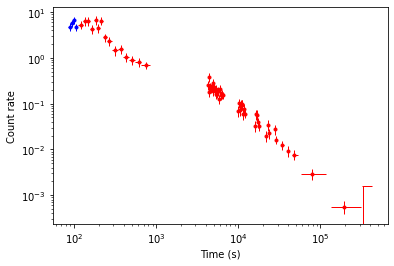
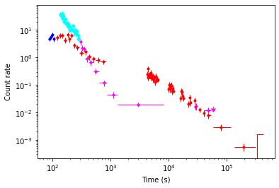

# The `swifttools.ukssdc.query.GRB` class

[Jupyter notebook version of this page](GRB.ipynb)

The `GRBQuery` class is a child class of the [`swifttools.ukssdc.query` class](../query.md) extending its functionality to give some GRB-specific options. It makes use of the [`swifttools.ukssdc.data.GRB` module](../data/GRB.md) to allow you to download GRB data products for objects found by querying.

This combination of features means that you can now very easily carry out tasks such as downloading all XRT light curves for GRBs with T90&lt;2 s - something many people have requested.

In this guide I am going to cover the GRB-specific query features and show you some examples of how to get data, but I am not going into all the details of the generic query syntax, or the product access functions. For those I refer you to the [`query`](../query.md) and [`data.GRB`](../data/GRB.md) documentation.

First we will import the module:


```python
import swifttools.ukssdc.query as uq
```

## Page contents

* [The `GRBQuery` class](#grbquery)
* [The catalogues](#cats)
* [Combining catalogues](#aux)
* [GRB Products](#prods)
  * [Light curves](#curves)
  * [Spectra](#spectra)
  * [Burst analyser](#ban)
  * [Positions](#positions)
  * [Obs data](#data)

----

<a id='grbquery'></a>
## The `GRBQuery` class

For querying the GRB catalogues we use the `GRBQuery` class. We can create an object of this just like [we did for `ObsQuery`](../query.md#obsquery):


```python
q = uq.GRBQuery(silent=False)
```

    Resetting query details


I've again set `silent=False` as for interactive, and especially pedagogical use, this is helpful.

Whereas for `ObsQuery` we had a choice of which table in the catalogue we wanted to query, for `GRBQuery` the situation is slightly different, we have to first choose which GRB catalogue we want to query. At the present time, there is only one table in each catalogue, so this effectively replaces the table controls we saw for `ObsQuery`. Before we go any further, I should introduce these catalogues.


<a id='cats'></a>
## The catalogues

There is only one GRB catalogue produced by the UKSSDC, and this is limited to GRB data. However, as there has been (much!) demand for a way to access XRT products for samples derived from other information, I've provided tools to use two other catalogues provided by [the SDC](https://swift.gsfc.nasa.gov) as well. So, the `GRBQuery` module lets use select the following catalogues:

* [The live XRT GRB catalogue](https://www.swift.ac.uk/xrt_live_cat) "UK_XRT"
* [The SDC Data Table](https://swift.gsfc.nasa.gov/archive/grb_table.html/) "SDC_GRB"
* [The Swift/BAT GRB catalog](https://swift.gsfc.nasa.gov/results/batgrbcat/) "SDC_BAT"

The labels at the end of each row above are the names by which these catalogues are accessed, as you'll see in a moment.

Because the SDC tables are provided externally (i.e. by the SDC), in order to fit them nicely into my API back end, I have actually set up CRON jobs that run hourly to download the latest versions from the above sources and ingest them into my own database system. This means that there is always the possibility that things are slightly out of sync, but never by more than an hour. I also created the metadata myself, so any errors therein are entirely my own fault.

There are also a couple of warnings and caveats related to these tables.

The Swift Data Table is curated by JD Myers at GSFC, and is essentially manually compiled from information contained in GCN circulars. This has presented the occasional challenge ingesting everything into a form that can be queried by this API. For example, how will a T90 value of "~2" fare with a ">" operator? To resolve this, I strip out the non-numeric characters from columns like this, and set some warning columns [which we will look at presently](#dtcaveat).

The BAT GRB catalogue is a machine-readable catalogue without these issues and so is just ingested directly, but again there a couple of warnings. First and most importantly, at the time of writing the catalogue only includes GRBs up to the end of 2023. Secondly, when I ingested that table I found a couple of GRBs with duplicate rows; only the first row is ingested ('name' is required as a unique column for combining catalogues).

Right, with those preliminaries out of the way, let's get to business.

Managing which catalogue we are querying is directly analogous to managing tables, except that we replace "table" with "cat". So (in case you didn't to it above) let's create a query:


```python
q = uq.GRBQuery(silent=False)
```

    Resetting query details


And then find out which catalogue was selected by default.


```python
q.cat
```


    'UK_XRT'


I listed all of the catalogues above, but you can get their labels directly from the class too:


```python
q.cats
```


    dict_keys(['UK_XRT', 'SDC_GRB', 'BAT_GRB'])


We can change catalogue in two ways, either changing the cat variable, or supplying it to the constructor. For example:


```python
q = uq.GRBQuery(cat='BAT_GRB',
                silent=False)
q.cat = 'SDC_GRB'
```

    Resetting query details
    Resetting query details


So in the above I created a query using the BAT GRB catalogue, and then decided I actually wanted the SDC data table catalogue instead.

You may be wondering why this is a catalogue and not a "table", whereas in the `ObsQuery` case we used tables. The answer is that the `query` module actually has both, and the heirarchy is `catalogue` -> `tables`. In the `ObsQuery` module we have a single catalogue that has multiple tables; in this case we have multiple catalogues that each have (at present) a single table. [The `SXPSQuery` class](SXPS.md) contains multiple catalogues with multiple tables each.

Of course, we can jump right in with a simple query now, but I'm guessing you're not often going to want to select GRB data by a cone search and so the 'advanced' method will be more useful, and for that you will probably want to check out the metadata.


```python
q.metadata
```

    Need to get the metadata.


<div style='width: 95%; max-height: 200px; overflow: scroll;'><style scoped>    .dataframe tbody tr th:only-of-type {        vertical-align: middle;    }    .dataframe tbody tr th {        vertical-align: top;    }    .dataframe thead th {        text-align: right;    }</style><table border="1" class="dataframe">  <thead>    <tr style="text-align: right;">      <th></th>      <th>ColName</th>      <th>IsError</th>      <th>Class</th>      <th>Description</th>      <th>Type</th>      <th>Nullable</th>      <th>Fstring</th>      <th>IsTargetCol</th>      <th>IsNameCol</th>    </tr>  </thead>  <tbody>    <tr>      <th>0</th>      <td>Name</td>      <td>0</td>      <td>BASIC</td>      <td>The GRB name.</td>      <td>TXT</td>      <td>0</td>      <td>%s</td>      <td>0</td>      <td>1</td>    </tr>    <tr>      <th>1</th>      <td>TriggerTime</td>      <td>0</td>      <td>BASIC</td>      <td>The GRB trigger time, on the day of the trigger.</td>      <td>UTC</td>      <td>1</td>      <td>%s</td>      <td>0</td>      <td>0</td>    </tr>    <tr>      <th>2</th>      <td>TriggerNumber</td>      <td>0</td>      <td>BASIC</td>      <td>The BAT trigger number; for GRBs which did not...</td>      <td>NUM</td>      <td>1</td>      <td>%d</td>      <td>1</td>      <td>0</td>    </tr>    <tr>      <th>3</th>      <td>BAT_RA</td>      <td>0</td>      <td>BASIC BAT</td>      <td>The RA (J2000) of the GRB according to BAT.</td>      <td>COORDH</td>      <td>1</td>      <td>%.1f</td>      <td>0</td>      <td>0</td>    </tr>    <tr>      <th>4</th>      <td>BAT_Dec</td>      <td>0</td>      <td>BASIC BAT</td>      <td>The declination (J2000) of the GRB according t...</td>      <td>COORDD</td>      <td>1</td>      <td>%+.1f</td>      <td>0</td>      <td>0</td>    </tr>    <tr>      <th>...</th>      <td>...</td>      <td>...</td>      <td>...</td>      <td>...</td>      <td>...</td>      <td>...</td>      <td>...</td>      <td>...</td>      <td>...</td>    </tr>    <tr>      <th>76</th>      <td>UVOT_StartTime_warn</td>      <td>0</td>      <td>WARN</td>      <td>Whether UVOT_StartTime was non-numeric and may...</td>      <td>NUM</td>      <td>0</td>      <td>%d</td>      <td>0</td>      <td>0</td>    </tr>    <tr>      <th>77</th>      <td>BAT_warn</td>      <td>0</td>      <td>WARN</td>      <td>Whether any BAT-related warnings were set.</td>      <td>NUM</td>      <td>0</td>      <td>%d</td>      <td>0</td>      <td>0</td>    </tr>    <tr>      <th>78</th>      <td>XRT_warn</td>      <td>0</td>      <td>WARN</td>      <td>Whether any XRT-related warnings were set.</td>      <td>NUM</td>      <td>0</td>      <td>%d</td>      <td>0</td>      <td>0</td>    </tr>    <tr>      <th>79</th>      <td>UVOT_warn</td>      <td>0</td>      <td>WARN</td>      <td>Whether any UVOT-related warnings were set.</td>      <td>NUM</td>      <td>0</td>      <td>%d</td>      <td>0</td>      <td>0</td>    </tr>    <tr>      <th>80</th>      <td>Any_warn</td>      <td>0</td>      <td>WARN</td>      <td>Whether any warnings were set.</td>      <td>NUM</td>      <td>0</td>      <td>%d</td>      <td>0</td>      <td>0</td>    </tr>  </tbody></table><p>81 rows × 9 columns</p></div>


Here I've shown the metadata for the SDC Data Table, and slightly annoyingly, Jupyter compresses the output. You can explore it yourself of course, or we can just extract the 'ColName' data, i.e. what columns does the SDC Data Table supply?


```python
list(q.metadata['ColName'])
```


    ['Name',
     'TriggerTime',
     'TriggerNumber',
     'BAT_RA',
     'BAT_Dec',
     'BAT_Err90',
     'BAT_T90',
     'BAT_Fluence',
     'BAT_Fluence_Err',
     'BAT_1s_Peak_Photon_Flux',
     'BAT_1s_Peak_Photon_Flux_err',
     'BAT_Gamma',
     'BAT_Gamma_Err',
     'BAT_SpectralModel',
     'XRT_RA',
     'XRT_Dec',
     'XRT_Err90',
     'XRT_StartTime',
     'XRT_Early_Flux',
     'XRT_11_Hr_Flux',
     'XRT_24_Hr_Flux',
     'XRT_Initial_Alpha',
     'XRT_Gamma',
     'XRT_NH',
     'UVOT_RA',
     'UVOT_Dec',
     'UVOT_Err90',
     'UVOT_StartTime',
     'UVOT_mag_v',
     'UVOT_limit_v',
     'UVOT_mag_white',
     'UVOT_limit_white',
     'UVOT_mag_b',
     'UVOT_limit_b',
     'UVOT_mag_u',
     'UVOT_limit_u',
     'UVOT_mag_uvw1',
     'UVOT_limit_uvw1',
     'UVOT_mag_uvm2',
     'UVOT_limit_uvm2',
     'UVOT_mag_uvw2',
     'UVOT_limit_uvw2',
     'Redshift',
     'BAT_T90_orig',
     'BAT_T90_warn',
     'BAT_Err90_orig',
     'BAT_Err90_warn',
     'XRT_Err90_orig',
     'XRT_Err90_warn',
     'UVOT_Err90_orig',
     'UVOT_Err90_warn',
     'BAT_Gamma_orig',
     'BAT_Gamma_warn',
     'BAT_Fluence_orig',
     'BAT_Fluence_warn',
     'BAT_Fluence_Err_orig',
     'BAT_Fluence_Err_warn',
     'BAT_1s_Peak_Photon_Flux_orig',
     'BAT_1s_Peak_Photon_Flux_warn',
     'BAT_1s_Peak_Photon_Flux_err_orig',
     'BAT_1s_Peak_Photon_Flux_err_warn',
     'XRT_StartTime_orig',
     'XRT_StartTime_warn',
     'XRT_Early_Flux_orig',
     'XRT_Early_Flux_warn',
     'XRT_11_Hr_Flux_orig',
     'XRT_11_Hr_Flux_warn',
     'XRT_24_Hr_Flux_orig',
     'XRT_24_Hr_Flux_warn',
     'XRT_Initial_Alpha_orig',
     'XRT_Initial_Alpha_warn',
     'XRT_Gamma_orig',
     'XRT_Gamma_warn',
     'XRT_NH_orig',
     'XRT_NH_warn',
     'UVOT_StartTime_orig',
     'UVOT_StartTime_warn',
     'BAT_warn',
     'XRT_warn',
     'UVOT_warn',
     'Any_warn']


<a id='dtcaveat'></a>
### SDC data table caveats

For the "SDC_GRB" table used above there are some caveats which I've alluded to above - some fields in the original table cannot be directly ingested into my database. The columns ending '\_warn' and '\_orig' which you can see above tell us when that happened. Any time a field cannot be ingested 'as is' (for example a numerical field that contained a non-numerical character), then the '\_warn' column for that row is set to `True` and the '\_orig' field is populated - this is a text field containing the original string. So, for example, if there was a problem with "BAT_T90" then the "BAT_T90" column will be replaced with my code's "best guess" as to the correct numerical value, "BAT_T90_orig" will be set to the original value, and "BAT_T90_warn" will be 1.

The last 4 columns listed in the metadata are summaries, they tell you if any warnings related to each instrument, or any warnings at all, were set. So one may, for example, want to filter out such rows, either in the query or after getting the results. Let's take a moment to explore this just a bit more.

First, we'll get all the data for a query and then filter it:


```python
q.addFilter(('BAT_T90', '<', 2))
q.addCol('*')
q.submit()
q.results
```

    Calling DB look-up for rows 0 -- 1000
    Received 134 rows.


<div style='width: 95%; max-height: 200px; overflow: scroll;'><style scoped>    .dataframe tbody tr th:only-of-type {        vertical-align: middle;    }    .dataframe tbody tr th {        vertical-align: top;    }    .dataframe thead th {        text-align: right;    }</style><table border="1" class="dataframe">  <thead>    <tr style="text-align: right;">      <th></th>      <th>Name</th>      <th>TriggerTime</th>      <th>TriggerNumber</th>      <th>BAT_RA</th>      <th>BAT_Dec</th>      <th>BAT_Err90</th>      <th>BAT_T90</th>      <th>BAT_Fluence</th>      <th>BAT_Fluence_Err</th>      <th>BAT_1s_Peak_Photon_Flux</th>      <th>...</th>      <th>BAT_Dec_s</th>      <th>BAT_Dec_apy</th>      <th>XRT_RA_s</th>      <th>XRT_RA_apy</th>      <th>XRT_Dec_s</th>      <th>XRT_Dec_apy</th>      <th>UVOT_RA_s</th>      <th>UVOT_RA_apy</th>      <th>UVOT_Dec_s</th>      <th>UVOT_Dec_apy</th>    </tr>  </thead>  <tbody>    <tr>      <th>0</th>      <td>GRB 050202</td>      <td>2005-02-02 03:35:15</td>      <td>104298</td>      <td>290.584</td>      <td>-38.730</td>      <td>2.3</td>      <td>0.270</td>      <td>3.000000e-08</td>      <td>6.000000e-09</td>      <td>0.55</td>      <td>...</td>      <td>-38d 43m 48.0s</td>      <td>-38d43m48s</td>      <td>None</td>      <td>None</td>      <td>None</td>      <td>None</td>      <td>None</td>      <td>None</td>      <td>None</td>      <td>None</td>    </tr>    <tr>      <th>1</th>      <td>GRB 050509B</td>      <td>2005-05-09 04:00:19</td>      <td>118749</td>      <td>189.046</td>      <td>28.974</td>      <td>2.5</td>      <td>0.073</td>      <td>9.000000e-09</td>      <td>2.000000e-09</td>      <td>0.28</td>      <td>...</td>      <td>+28d 58m 26.4s</td>      <td>28d58m26.4s</td>      <td>+12h 36m 13.92s</td>      <td>189d03m28.8s</td>      <td>+28d 59m 3.8s</td>      <td>28d59m03.84s</td>      <td>None</td>      <td>None</td>      <td>None</td>      <td>None</td>    </tr>    <tr>      <th>2</th>      <td>GRB 050813</td>      <td>2005-08-13 06:45:10</td>      <td>150139</td>      <td>242.001</td>      <td>11.244</td>      <td>2.8</td>      <td>0.450</td>      <td>4.400000e-08</td>      <td>1.100000e-08</td>      <td>0.94</td>      <td>...</td>      <td>+11d 14m 38.4s</td>      <td>11d14m38.4s</td>      <td>+16h 07m 56.88s</td>      <td>241d59m13.2s</td>      <td>+11d 14m 57.1s</td>      <td>11d14m57.12s</td>      <td>None</td>      <td>None</td>      <td>None</td>      <td>None</td>    </tr>    <tr>      <th>3</th>      <td>GRB 050906</td>      <td>2005-09-06 10:32:05</td>      <td>153866</td>      <td>52.802</td>      <td>-14.621</td>      <td>3.3</td>      <td>0.258</td>      <td>6.000000e-09</td>      <td>2.000000e-09</td>      <td>NaN</td>      <td>...</td>      <td>-14d 37m 15.6s</td>      <td>-14d37m15.6s</td>      <td>+03h 31m 15.60s</td>      <td>52d48m54s</td>      <td>-14d 36m 37.1s</td>      <td>-14d36m37.08s</td>      <td>None</td>      <td>None</td>      <td>None</td>      <td>None</td>    </tr>    <tr>      <th>4</th>      <td>GRB 050925</td>      <td>2005-09-25 09:04:34</td>      <td>156838</td>      <td>303.490</td>      <td>34.329</td>      <td>1.4</td>      <td>0.070</td>      <td>7.600000e-08</td>      <td>9.000000e-09</td>      <td>10.00</td>      <td>...</td>      <td>+34d 19m 44.4s</td>      <td>34d19m44.4s</td>      <td>None</td>      <td>None</td>      <td>None</td>      <td>None</td>      <td>None</td>      <td>None</td>      <td>None</td>      <td>None</td>    </tr>    <tr>      <th>...</th>      <td>...</td>      <td>...</td>      <td>...</td>      <td>...</td>      <td>...</td>      <td>...</td>      <td>...</td>      <td>...</td>      <td>...</td>      <td>...</td>      <td>...</td>      <td>...</td>      <td>...</td>      <td>...</td>      <td>...</td>      <td>...</td>      <td>...</td>      <td>...</td>      <td>...</td>      <td>...</td>      <td>...</td>    </tr>    <tr>      <th>129</th>      <td>GRB 210919A</td>      <td>2021-09-19 00:28:33</td>      <td>1073893</td>      <td>80.242</td>      <td>1.286</td>      <td>2.0</td>      <td>0.160</td>      <td>8.800000e-08</td>      <td>1.700000e-08</td>      <td>1.50</td>      <td>...</td>      <td>+01d 17m 9.6s</td>      <td>1d17m09.6s</td>      <td>+05h 21m 1.06s</td>      <td>80d15m15.84s</td>      <td>+01d 18m 42.1s</td>      <td>1d18m42.084s</td>      <td>None</td>      <td>None</td>      <td>None</td>      <td>None</td>    </tr>    <tr>      <th>130</th>      <td>GRB 211023B</td>      <td>2021-10-23 21:05:52</td>      <td>1080859</td>      <td>170.314</td>      <td>39.133</td>      <td>2.0</td>      <td>1.300</td>      <td>1.700000e-07</td>      <td>3.000000e-08</td>      <td>2.20</td>      <td>...</td>      <td>+39d 07m 58.8s</td>      <td>39d07m58.8s</td>      <td>+11h 21m 14.16s</td>      <td>170d18m32.4s</td>      <td>+39d 08m 7.1s</td>      <td>39d08m07.08s</td>      <td>+11h 21m 14.40s</td>      <td>170d18m36s</td>      <td>+39d 08m 8.9s</td>      <td>39d08m08.88s</td>    </tr>    <tr>      <th>131</th>      <td>GRB 211106A</td>      <td>2021-11-06 04:37:31</td>      <td>-1</td>      <td>343.643</td>      <td>-53.236</td>      <td>7.0</td>      <td>1.750</td>      <td>NaN</td>      <td>NaN</td>      <td>NaN</td>      <td>...</td>      <td>-53d 14m 9.6s</td>      <td>-53d14m09.6s</td>      <td>+22h 54m 20.40s</td>      <td>343d35m06s</td>      <td>-53d 13m 49.1s</td>      <td>-53d13m49.08s</td>      <td>None</td>      <td>None</td>      <td>None</td>      <td>None</td>    </tr>    <tr>      <th>132</th>      <td>GRB 220412B</td>      <td>2022-04-12 17:06:49</td>      <td>1102329</td>      <td>320.758</td>      <td>-0.261</td>      <td>1.6</td>      <td>0.140</td>      <td>8.900000e-08</td>      <td>1.200000e-08</td>      <td>1.00</td>      <td>...</td>      <td>-00d 15m 39.6s</td>      <td>-0d15m39.6s</td>      <td>None</td>      <td>None</td>      <td>None</td>      <td>None</td>      <td>None</td>      <td>None</td>      <td>None</td>      <td>None</td>    </tr>    <tr>      <th>133</th>      <td>GRB 220730A</td>      <td>2022-07-30 15:48:55</td>      <td>1118357</td>      <td>224.988</td>      <td>-69.496</td>      <td>1.7</td>      <td>0.190</td>      <td>1.600000e-07</td>      <td>2.000000e-08</td>      <td>1.60</td>      <td>...</td>      <td>-69d 29m 45.6s</td>      <td>-69d29m45.6s</td>      <td>+15h 00m 3.36s</td>      <td>225d00m50.4s</td>      <td>-69d 29m 45.2s</td>      <td>-69d29m45.24s</td>      <td>None</td>      <td>None</td>      <td>None</td>      <td>None</td>    </tr>  </tbody></table><p>134 rows × 93 columns</p></div>


I could now define a subset of only those with no BAT_T90_warning value set, so I only have the cases that definitely match my query. Subsets were [discussed in the `ObsQuery` documentation](../query.md#subsets).


```python
subset=q.results['BAT_T90_warn'] == False
```

(Quick Python note: to build the subset on a boolean column we don't need a comparison, so `q.results['some_col']` returns the indices where `some_col` is `True`, the `~` above returns instead where it is `False`. The 'boolean' columns in the database are actually integers with values 1 or 0 (blame MariaDB) hence the `astype()` call).

I could pass this subset to any of the product functions that we will come to later, or just take a look at it:


```python
q.results.loc[subset]
```


<div style='width: 95%; max-height: 200px; overflow: scroll;'><style scoped>    .dataframe tbody tr th:only-of-type {        vertical-align: middle;    }    .dataframe tbody tr th {        vertical-align: top;    }    .dataframe thead th {        text-align: right;    }</style><table border="1" class="dataframe">  <thead>    <tr style="text-align: right;">      <th></th>      <th>Name</th>      <th>TriggerTime</th>      <th>TriggerNumber</th>      <th>BAT_RA</th>      <th>BAT_Dec</th>      <th>BAT_Err90</th>      <th>BAT_T90</th>      <th>BAT_Fluence</th>      <th>BAT_Fluence_Err</th>      <th>BAT_1s_Peak_Photon_Flux</th>      <th>...</th>      <th>BAT_Dec_s</th>      <th>BAT_Dec_apy</th>      <th>XRT_RA_s</th>      <th>XRT_RA_apy</th>      <th>XRT_Dec_s</th>      <th>XRT_Dec_apy</th>      <th>UVOT_RA_s</th>      <th>UVOT_RA_apy</th>      <th>UVOT_Dec_s</th>      <th>UVOT_Dec_apy</th>    </tr>  </thead>  <tbody>    <tr>      <th>0</th>      <td>GRB 050202</td>      <td>2005-02-02 03:35:15</td>      <td>104298</td>      <td>290.584</td>      <td>-38.730</td>      <td>2.3</td>      <td>0.270</td>      <td>3.000000e-08</td>      <td>6.000000e-09</td>      <td>0.55</td>      <td>...</td>      <td>-38d 43m 48.0s</td>      <td>-38d43m48s</td>      <td>None</td>      <td>None</td>      <td>None</td>      <td>None</td>      <td>None</td>      <td>None</td>      <td>None</td>      <td>None</td>    </tr>    <tr>      <th>1</th>      <td>GRB 050509B</td>      <td>2005-05-09 04:00:19</td>      <td>118749</td>      <td>189.046</td>      <td>28.974</td>      <td>2.5</td>      <td>0.073</td>      <td>9.000000e-09</td>      <td>2.000000e-09</td>      <td>0.28</td>      <td>...</td>      <td>+28d 58m 26.4s</td>      <td>28d58m26.4s</td>      <td>+12h 36m 13.92s</td>      <td>189d03m28.8s</td>      <td>+28d 59m 3.8s</td>      <td>28d59m03.84s</td>      <td>None</td>      <td>None</td>      <td>None</td>      <td>None</td>    </tr>    <tr>      <th>2</th>      <td>GRB 050813</td>      <td>2005-08-13 06:45:10</td>      <td>150139</td>      <td>242.001</td>      <td>11.244</td>      <td>2.8</td>      <td>0.450</td>      <td>4.400000e-08</td>      <td>1.100000e-08</td>      <td>0.94</td>      <td>...</td>      <td>+11d 14m 38.4s</td>      <td>11d14m38.4s</td>      <td>+16h 07m 56.88s</td>      <td>241d59m13.2s</td>      <td>+11d 14m 57.1s</td>      <td>11d14m57.12s</td>      <td>None</td>      <td>None</td>      <td>None</td>      <td>None</td>    </tr>    <tr>      <th>3</th>      <td>GRB 050906</td>      <td>2005-09-06 10:32:05</td>      <td>153866</td>      <td>52.802</td>      <td>-14.621</td>      <td>3.3</td>      <td>0.258</td>      <td>6.000000e-09</td>      <td>2.000000e-09</td>      <td>NaN</td>      <td>...</td>      <td>-14d 37m 15.6s</td>      <td>-14d37m15.6s</td>      <td>+03h 31m 15.60s</td>      <td>52d48m54s</td>      <td>-14d 36m 37.1s</td>      <td>-14d36m37.08s</td>      <td>None</td>      <td>None</td>      <td>None</td>      <td>None</td>    </tr>    <tr>      <th>4</th>      <td>GRB 050925</td>      <td>2005-09-25 09:04:34</td>      <td>156838</td>      <td>303.490</td>      <td>34.329</td>      <td>1.4</td>      <td>0.070</td>      <td>7.600000e-08</td>      <td>9.000000e-09</td>      <td>10.00</td>      <td>...</td>      <td>+34d 19m 44.4s</td>      <td>34d19m44.4s</td>      <td>None</td>      <td>None</td>      <td>None</td>      <td>None</td>      <td>None</td>      <td>None</td>      <td>None</td>      <td>None</td>    </tr>    <tr>      <th>...</th>      <td>...</td>      <td>...</td>      <td>...</td>      <td>...</td>      <td>...</td>      <td>...</td>      <td>...</td>      <td>...</td>      <td>...</td>      <td>...</td>      <td>...</td>      <td>...</td>      <td>...</td>      <td>...</td>      <td>...</td>      <td>...</td>      <td>...</td>      <td>...</td>      <td>...</td>      <td>...</td>      <td>...</td>    </tr>    <tr>      <th>129</th>      <td>GRB 210919A</td>      <td>2021-09-19 00:28:33</td>      <td>1073893</td>      <td>80.242</td>      <td>1.286</td>      <td>2.0</td>      <td>0.160</td>      <td>8.800000e-08</td>      <td>1.700000e-08</td>      <td>1.50</td>      <td>...</td>      <td>+01d 17m 9.6s</td>      <td>1d17m09.6s</td>      <td>+05h 21m 1.06s</td>      <td>80d15m15.84s</td>      <td>+01d 18m 42.1s</td>      <td>1d18m42.084s</td>      <td>None</td>      <td>None</td>      <td>None</td>      <td>None</td>    </tr>    <tr>      <th>130</th>      <td>GRB 211023B</td>      <td>2021-10-23 21:05:52</td>      <td>1080859</td>      <td>170.314</td>      <td>39.133</td>      <td>2.0</td>      <td>1.300</td>      <td>1.700000e-07</td>      <td>3.000000e-08</td>      <td>2.20</td>      <td>...</td>      <td>+39d 07m 58.8s</td>      <td>39d07m58.8s</td>      <td>+11h 21m 14.16s</td>      <td>170d18m32.4s</td>      <td>+39d 08m 7.1s</td>      <td>39d08m07.08s</td>      <td>+11h 21m 14.40s</td>      <td>170d18m36s</td>      <td>+39d 08m 8.9s</td>      <td>39d08m08.88s</td>    </tr>    <tr>      <th>131</th>      <td>GRB 211106A</td>      <td>2021-11-06 04:37:31</td>      <td>-1</td>      <td>343.643</td>      <td>-53.236</td>      <td>7.0</td>      <td>1.750</td>      <td>NaN</td>      <td>NaN</td>      <td>NaN</td>      <td>...</td>      <td>-53d 14m 9.6s</td>      <td>-53d14m09.6s</td>      <td>+22h 54m 20.40s</td>      <td>343d35m06s</td>      <td>-53d 13m 49.1s</td>      <td>-53d13m49.08s</td>      <td>None</td>      <td>None</td>      <td>None</td>      <td>None</td>    </tr>    <tr>      <th>132</th>      <td>GRB 220412B</td>      <td>2022-04-12 17:06:49</td>      <td>1102329</td>      <td>320.758</td>      <td>-0.261</td>      <td>1.6</td>      <td>0.140</td>      <td>8.900000e-08</td>      <td>1.200000e-08</td>      <td>1.00</td>      <td>...</td>      <td>-00d 15m 39.6s</td>      <td>-0d15m39.6s</td>      <td>None</td>      <td>None</td>      <td>None</td>      <td>None</td>      <td>None</td>      <td>None</td>      <td>None</td>      <td>None</td>    </tr>    <tr>      <th>133</th>      <td>GRB 220730A</td>      <td>2022-07-30 15:48:55</td>      <td>1118357</td>      <td>224.988</td>      <td>-69.496</td>      <td>1.7</td>      <td>0.190</td>      <td>1.600000e-07</td>      <td>2.000000e-08</td>      <td>1.60</td>      <td>...</td>      <td>-69d 29m 45.6s</td>      <td>-69d29m45.6s</td>      <td>+15h 00m 3.36s</td>      <td>225d00m50.4s</td>      <td>-69d 29m 45.2s</td>      <td>-69d29m45.24s</td>      <td>None</td>      <td>None</td>      <td>None</td>      <td>None</td>    </tr>  </tbody></table><p>133 rows × 93 columns</p></div>


This only has one fewer row than the original query. It may be more informative to look at that row, so lets find the row which did have the warning set:


```python
subset=q.results['BAT_T90_warn'].astype(bool)
myFrame = q.results.loc[subset]
myRow = myFrame.iloc[0]
print(myRow['Name'])
print(myRow['BAT_T90'])
print(myRow['BAT_T90_orig'])
```

    GRB 161004A
    1.3
    ~1.3 to ~3


Here you can see the problem: GRB 161004A has a T90 value in the SDC_GRB table of "~1.3 to ~3". Since I want T90 to be a number, my ingestion code took "1.3" but set the warning flag.

How you choose to handle such cases is entirely up to you, and depends on your specific needs; all I'm trying to do here is to show you the tools I have provided to help you in this.

<a id='aux'></a>
## Combining catalogues

While all of these catalogues are, in themselves, great, I think we're often going to want to select GRBs using data from multiple catalogues. For example, maybe you want to get all short GRBs with at least one break in their XRT light curve, or something like that. In this case, we're going to have to combine the catalogues. And for this purpose the `GRBQuery` class includes the concept of auxilliary catalogues. The premise here is very simple: you define a `GRBQuery` and select the catalogue to query on, I will call this the 'primary catalogue'. Then you can add a second catalogue, which we call the 'auxilliary catalogue'. Then you define filters and submit, and the only results returned will be those which met the criteria in both catalogues.

As always an example teaches better than my blethering, so let's do exactly what I just said, get all GRBs with T90<2 and at least one break in their XRT light curve fit.

I'm going to use the BAT GRB catalogue for T90 (even though it stops in 2020) for this demo and I'll make that the primary catalogue, although which is primary and which auxilliary makes very little difference.

First up, let's create a query object for the primary catalogue. As ever for the demos, I'll turn off silent mode.


```python
q = uq.GRBQuery(cat='BAT_GRB',
                silent=False)
```

    Resetting query details


Now I will add the XRT catalogue as be an auxilliary:


```python
q.setAuxCat('UK_XRT')
```

    Resetting query details


`setAuxCat()` requires a catalogue  name, and optionally `silent` and `verbose`; if these latter are not specified, they are set to the values of the primary catalogue.

The auxilliary catalogue is literally just another `GRBQuery` object, and we can access it via `q.auxCat` so anything we can do to the primary catalogue we can also do to the auxilliary catalogue. This is handy because we need to add filters to both.

**Important note** filters must be added to the correct catalogue; I have not made a mechanism to infer from the column name which catalogue you meant, because it is possible for both catalogues to share column names. So it is your reponsibility to get the right filters in the right place.

So, let's do that. FIrst we want a T90 filter, which applies to our primary catalogue:


```python
q.addFilter(('T90', '<', 2))
```

    Need to get the metadata.


and we want a filter on the number of light curve breaks for the auxilliary catalogue:


```python
q.auxCat.addFilter( ('NumLCBreaks', '>=', 1))
```

    Need to get the metadata.


If you're wondering what the filter syntax should be, or how I knew the names of the columns to filter on, you should read the [top-level `query` documentation](../query.md) which explains both of these things.

Now we can submit the query.


```python
q.submit()
```

    Calling DB look-up for rows 0 -- 1000
    Received 146 rows.
    Calling DB look-up for rows 0 -- 1000
    Received 808 rows.


Because we had `silent=False` you can see that there were two queries done, and they received different number of rows, however:


```python
print (len(q.results))
print (len(q.auxCat.results))

```

    16
    16


You can also see that the results - of both catalogues - have been filtered to contain only matches. By default, the results are kept separate:


```python
q.results
```


<div style='width: 95%; max-height: 200px; overflow: scroll;'><style scoped>    .dataframe tbody tr th:only-of-type {        vertical-align: middle;    }    .dataframe tbody tr th {        vertical-align: top;    }    .dataframe thead th {        text-align: right;    }</style><table border="1" class="dataframe">  <thead>    <tr style="text-align: right;">      <th></th>      <th>GRBname</th>      <th>Trig_ID</th>      <th>Trig_time_met</th>      <th>Trig_time_UTC</th>      <th>RA_ground</th>      <th>DEC_ground</th>      <th>Image_position_err</th>      <th>Image_SNR</th>      <th>T90</th>      <th>RA_ground_s</th>      <th>RA_ground_apy</th>      <th>DEC_ground_s</th>      <th>DEC_ground_apy</th>    </tr>  </thead>  <tbody>    <tr>      <th>8</th>      <td>GRB 051221A</td>      <td>173780</td>      <td>1.568227e+08</td>      <td>2005-12-21 01:51:15</td>      <td>328.712000</td>      <td>16.89120</td>      <td>0.616931</td>      <td>60.64290</td>      <td>1.392</td>      <td>+21h 54m 50.88s</td>      <td>328d42m43.2s</td>      <td>+16d 53m 28.3s</td>      <td>16d53m28.32s</td>    </tr>    <tr>      <th>10</th>      <td>GRB 060218</td>      <td>191157</td>      <td>1.619265e+08</td>      <td>2006-02-18 03:34:30</td>      <td>50.383800</td>      <td>16.91080</td>      <td>2.594400</td>      <td>7.79180</td>      <td>0.000</td>      <td>+03h 21m 32.11s</td>      <td>50d23m01.68s</td>      <td>+16d 54m 38.9s</td>      <td>16d54m38.88s</td>    </tr>    <tr>      <th>11</th>      <td>GRB 060313</td>      <td>201487</td>      <td>1.639015e+08</td>      <td>2006-03-13 00:12:06</td>      <td>66.628600</td>      <td>-10.85900</td>      <td>0.737779</td>      <td>46.96730</td>      <td>0.744</td>      <td>+04h 26m 30.86s</td>      <td>66d37m42.96s</td>      <td>-10d 51m 32.4s</td>      <td>-10d51m32.4s</td>    </tr>    <tr>      <th>16</th>      <td>GRB 061201</td>      <td>241840</td>      <td>1.866815e+08</td>      <td>2006-12-01 15:58:36</td>      <td>332.088000</td>      <td>-74.57340</td>      <td>1.203350</td>      <td>23.34920</td>      <td>0.776</td>      <td>+22h 08m 21.12s</td>      <td>332d05m16.8s</td>      <td>-74d 34m 24.2s</td>      <td>-74d34m24.24s</td>    </tr>    <tr>      <th>49</th>      <td>GRB 100117A</td>      <td>382941</td>      <td>2.854552e+08</td>      <td>2010-01-17 21:06:19</td>      <td>11.280200</td>      <td>-1.58656</td>      <td>1.741070</td>      <td>13.77510</td>      <td>0.292</td>      <td>+00h 45m 7.25s</td>      <td>11d16m48.72s</td>      <td>-01d 35m 11.6s</td>      <td>-1d35m11.616s</td>    </tr>    <tr>      <th>61</th>      <td>GRB 101225A</td>      <td>441015</td>      <td>3.149951e+08</td>      <td>2010-12-25 18:37:45</td>      <td>0.234179</td>      <td>44.60160</td>      <td>3.281720</td>      <td>5.57042</td>      <td>0.000</td>      <td>+00h 00m 56.20s</td>      <td>0d14m03.0444s</td>      <td>+44d 36m 5.8s</td>      <td>44d36m05.76s</td>    </tr>    <tr>      <th>69</th>      <td>GRB 120305A</td>      <td>516997</td>      <td>3.526691e+08</td>      <td>2012-03-05 19:37:30</td>      <td>47.549000</td>      <td>28.49480</td>      <td>0.927686</td>      <td>33.86010</td>      <td>0.100</td>      <td>+03h 10m 11.76s</td>      <td>47d32m56.4s</td>      <td>+28d 29m 41.3s</td>      <td>28d29m41.28s</td>    </tr>    <tr>      <th>78</th>      <td>GRB 130603B</td>      <td>557310</td>      <td>3.919674e+08</td>      <td>2013-06-03 15:49:14</td>      <td>172.221000</td>      <td>17.06320</td>      <td>0.717475</td>      <td>48.87750</td>      <td>0.176</td>      <td>+11h 28m 53.04s</td>      <td>172d13m15.6s</td>      <td>+17d 03m 47.5s</td>      <td>17d03m47.52s</td>    </tr>    <tr>      <th>81</th>      <td>GRB 130912A</td>      <td>570465</td>      <td>4.006677e+08</td>      <td>2013-09-12 08:34:57</td>      <td>47.606500</td>      <td>13.99840</td>      <td>1.647340</td>      <td>14.90830</td>      <td>0.284</td>      <td>+03h 10m 25.56s</td>      <td>47d36m23.4s</td>      <td>+13d 59m 54.2s</td>      <td>13d59m54.24s</td>    </tr>    <tr>      <th>90</th>      <td>GRB 140903A</td>      <td>611599</td>      <td>4.314492e+08</td>      <td>2014-09-03 15:00:30</td>      <td>238.021000</td>      <td>27.60760</td>      <td>1.034460</td>      <td>28.98010</td>      <td>0.296</td>      <td>+15h 52m 5.04s</td>      <td>238d01m15.6s</td>      <td>+27d 36m 27.4s</td>      <td>27d36m27.36s</td>    </tr>    <tr>      <th>98</th>      <td>GRB 150301A</td>      <td>632995</td>      <td>4.468647e+08</td>      <td>2015-03-01 01:04:28</td>      <td>244.280000</td>      <td>-48.73190</td>      <td>1.865280</td>      <td>12.48370</td>      <td>0.484</td>      <td>+16h 17m 7.20s</td>      <td>244d16m48s</td>      <td>-48d 43m 54.8s</td>      <td>-48d43m54.84s</td>    </tr>    <tr>      <th>108</th>      <td>GRB 151229A</td>      <td>668689</td>      <td>4.730646e+08</td>      <td>2015-12-29 06:50:27</td>      <td>329.364000</td>      <td>-20.73200</td>      <td>1.031320</td>      <td>29.10610</td>      <td>1.440</td>      <td>+21h 57m 27.36s</td>      <td>329d21m50.4s</td>      <td>-20d 43m 55.2s</td>      <td>-20d43m55.2s</td>    </tr>    <tr>      <th>111</th>      <td>GRB 160501A</td>      <td>684679</td>      <td>4.837560e+08</td>      <td>2016-05-01 00:40:31</td>      <td>286.380000</td>      <td>-17.24010</td>      <td>2.059580</td>      <td>10.83590</td>      <td>0.000</td>      <td>+19h 05m 31.20s</td>      <td>286d22m48s</td>      <td>-17d 14m 24.4s</td>      <td>-17d14m24.36s</td>    </tr>    <tr>      <th>116</th>      <td>GRB 160623A</td>      <td>0</td>      <td>0.000000e+00</td>      <td>0000-00-00 00:00:00</td>      <td>0.000000</td>      <td>0.00000</td>      <td>0.000000</td>      <td>0.00000</td>      <td>0.000</td>      <td>+00h 00m 0.00s</td>      <td>0d00m00s</td>      <td>+00d 00m 0.0s</td>      <td>0d00m00s</td>    </tr>    <tr>      <th>133</th>      <td>GRB 180402A</td>      <td>821103</td>      <td>5.443551e+08</td>      <td>2018-04-02 09:44:59</td>      <td>251.923000</td>      <td>-14.92820</td>      <td>1.952180</td>      <td>11.69740</td>      <td>0.180</td>      <td>+16h 47m 41.52s</td>      <td>251d55m22.8s</td>      <td>-14d 55m 41.5s</td>      <td>-14d55m41.52s</td>    </tr>    <tr>      <th>143</th>      <td>GRB 200324A</td>      <td>963260</td>      <td>6.067608e+08</td>      <td>2020-03-24 16:39:07</td>      <td>222.661000</td>      <td>35.92220</td>      <td>1.448780</td>      <td>17.91090</td>      <td>0.000</td>      <td>+14h 50m 38.64s</td>      <td>222d39m39.6s</td>      <td>+35d 55m 19.9s</td>      <td>35d55m19.92s</td>    </tr>  </tbody></table></div>


```python
q.auxCat.results
```


<div style='width: 95%; max-height: 200px; overflow: scroll;'><style scoped>    .dataframe tbody tr th:only-of-type {        vertical-align: middle;    }    .dataframe tbody tr th {        vertical-align: top;    }    .dataframe thead th {        text-align: right;    }</style><table border="1" class="dataframe">  <thead>    <tr style="text-align: right;">      <th></th>      <th>targetID</th>      <th>name</th>      <th>RA</th>      <th>Decl</th>      <th>Err90</th>      <th>NumLCBreaks</th>      <th>RA_s</th>      <th>RA_apy</th>      <th>Decl_s</th>      <th>Decl_apy</th>    </tr>  </thead>  <tbody>    <tr>      <th>7</th>      <td>20666</td>      <td>GRB 160623A</td>      <td>315.298070</td>      <td>42.220970</td>      <td>1.50000</td>      <td>1</td>      <td>+21h 01m 11.54s</td>      <td>315d17m53.052s</td>      <td>+42d 13m 15.5s</td>      <td>42d13m15.492s</td>    </tr>    <tr>      <th>50</th>      <td>173780</td>      <td>GRB 051221A</td>      <td>328.702520</td>      <td>16.890670</td>      <td>1.50000</td>      <td>2</td>      <td>+21h 54m 48.60s</td>      <td>328d42m09.072s</td>      <td>+16d 53m 26.4s</td>      <td>16d53m26.412s</td>    </tr>    <tr>      <th>64</th>      <td>191157</td>      <td>GRB 060218</td>      <td>50.415350</td>      <td>16.867140</td>      <td>1.40000</td>      <td>2</td>      <td>+03h 21m 39.68s</td>      <td>50d24m55.26s</td>      <td>+16d 52m 1.7s</td>      <td>16d52m01.704s</td>    </tr>    <tr>      <th>68</th>      <td>201487</td>      <td>GRB 060313</td>      <td>66.618730</td>      <td>-10.844840</td>      <td>1.40000</td>      <td>3</td>      <td>+04h 26m 28.50s</td>      <td>66d37m07.428s</td>      <td>-10d 50m 41.4s</td>      <td>-10d50m41.424s</td>    </tr>    <tr>      <th>112</th>      <td>241840</td>      <td>GRB 061201</td>      <td>332.134810</td>      <td>-74.580060</td>      <td>1.40000</td>      <td>1</td>      <td>+22h 08m 32.35s</td>      <td>332d08m05.316s</td>      <td>-74d 34m 48.2s</td>      <td>-74d34m48.216s</td>    </tr>    <tr>      <th>259</th>      <td>382941</td>      <td>GRB 100117A</td>      <td>11.269105</td>      <td>-1.596264</td>      <td>3.71146</td>      <td>2</td>      <td>+00h 45m 4.59s</td>      <td>11d16m08.7784032s</td>      <td>-01d 35m 46.6s</td>      <td>-1d35m46.550265s</td>    </tr>    <tr>      <th>301</th>      <td>441015</td>      <td>GRB 101225A</td>      <td>0.197920</td>      <td>44.600340</td>      <td>1.40000</td>      <td>4</td>      <td>+00h 00m 47.50s</td>      <td>0d11m52.512s</td>      <td>+44d 36m 1.2s</td>      <td>44d36m01.224s</td>    </tr>    <tr>      <th>356</th>      <td>516997</td>      <td>GRB 120305A</td>      <td>47.536170</td>      <td>28.491950</td>      <td>2.30000</td>      <td>2</td>      <td>+03h 10m 8.68s</td>      <td>47d32m10.212s</td>      <td>+28d 29m 31.0s</td>      <td>28d29m31.02s</td>    </tr>    <tr>      <th>410</th>      <td>557310</td>      <td>GRB 130603B</td>      <td>172.200700</td>      <td>17.071380</td>      <td>1.50000</td>      <td>2</td>      <td>+11h 28m 48.17s</td>      <td>172d12m02.52s</td>      <td>+17d 04m 17.0s</td>      <td>17d04m16.968s</td>    </tr>    <tr>      <th>424</th>      <td>570465</td>      <td>GRB 130912A</td>      <td>47.592270</td>      <td>13.996740</td>      <td>1.60000</td>      <td>1</td>      <td>+03h 10m 22.14s</td>      <td>47d35m32.172s</td>      <td>+13d 59m 48.3s</td>      <td>13d59m48.264s</td>    </tr>    <tr>      <th>470</th>      <td>611599</td>      <td>GRB 140903A</td>      <td>238.013650</td>      <td>27.602620</td>      <td>1.50000</td>      <td>1</td>      <td>+15h 52m 3.28s</td>      <td>238d00m49.14s</td>      <td>+27d 36m 9.4s</td>      <td>27d36m09.432s</td>    </tr>    <tr>      <th>489</th>      <td>632995</td>      <td>GRB 150301A</td>      <td>244.304700</td>      <td>-48.713100</td>      <td>5.00000</td>      <td>1</td>      <td>+16h 17m 13.13s</td>      <td>244d18m16.92s</td>      <td>-48d 42m 47.2s</td>      <td>-48d42m47.16s</td>    </tr>    <tr>      <th>528</th>      <td>668689</td>      <td>GRB 151229A</td>      <td>329.369910</td>      <td>-20.731990</td>      <td>1.40000</td>      <td>1</td>      <td>+21h 57m 28.78s</td>      <td>329d22m11.676s</td>      <td>-20d 43m 55.2s</td>      <td>-20d43m55.164s</td>    </tr>    <tr>      <th>544</th>      <td>684679</td>      <td>GRB 160501A</td>      <td>286.384280</td>      <td>-17.241490</td>      <td>1.90000</td>      <td>2</td>      <td>+19h 05m 32.23s</td>      <td>286d23m03.408s</td>      <td>-17d 14m 29.4s</td>      <td>-17d14m29.364s</td>    </tr>    <tr>      <th>624</th>      <td>821103</td>      <td>GRB 180402A</td>      <td>251.932904</td>      <td>-14.970021</td>      <td>3.50000</td>      <td>2</td>      <td>+16h 47m 43.90s</td>      <td>251d55m58.45547028s</td>      <td>-14d 58m 12.1s</td>      <td>-14d58m12.07539768s</td>    </tr>    <tr>      <th>714</th>      <td>963260</td>      <td>GRB 200324A</td>      <td>222.673850</td>      <td>35.941670</td>      <td>1.40000</td>      <td>3</td>      <td>+14h 50m 41.72s</td>      <td>222d40m25.86s</td>      <td>+35d 56m 30.0s</td>      <td>35d56m30.012s</td>    </tr>  </tbody></table></div>


We can merge these into a single table. This will change `q.results` (but not `q.auxCat.results`).


```python
q.mergeResults()

q.results
```


<div style='width: 95%; max-height: 200px; overflow: scroll;'><style scoped>    .dataframe tbody tr th:only-of-type {        vertical-align: middle;    }    .dataframe tbody tr th {        vertical-align: top;    }    .dataframe thead th {        text-align: right;    }</style><table border="1" class="dataframe">  <thead>    <tr style="text-align: right;">      <th></th>      <th>GRBname</th>      <th>Trig_ID</th>      <th>Trig_time_met</th>      <th>Trig_time_UTC</th>      <th>RA_ground</th>      <th>DEC_ground</th>      <th>Image_position_err</th>      <th>Image_SNR</th>      <th>T90</th>      <th>RA_ground_s</th>      <th>...</th>      <th>targetID</th>      <th>name</th>      <th>RA</th>      <th>Decl</th>      <th>Err90</th>      <th>NumLCBreaks</th>      <th>RA_s</th>      <th>RA_apy</th>      <th>Decl_s</th>      <th>Decl_apy</th>    </tr>  </thead>  <tbody>    <tr>      <th>0</th>      <td>GRB 051221A</td>      <td>173780</td>      <td>1.568227e+08</td>      <td>2005-12-21 01:51:15</td>      <td>328.712000</td>      <td>16.89120</td>      <td>0.616931</td>      <td>60.64290</td>      <td>1.392</td>      <td>+21h 54m 50.88s</td>      <td>...</td>      <td>173780</td>      <td>GRB 051221A</td>      <td>328.702520</td>      <td>16.890670</td>      <td>1.50000</td>      <td>2</td>      <td>+21h 54m 48.60s</td>      <td>328d42m09.072s</td>      <td>+16d 53m 26.4s</td>      <td>16d53m26.412s</td>    </tr>    <tr>      <th>1</th>      <td>GRB 060218</td>      <td>191157</td>      <td>1.619265e+08</td>      <td>2006-02-18 03:34:30</td>      <td>50.383800</td>      <td>16.91080</td>      <td>2.594400</td>      <td>7.79180</td>      <td>0.000</td>      <td>+03h 21m 32.11s</td>      <td>...</td>      <td>191157</td>      <td>GRB 060218</td>      <td>50.415350</td>      <td>16.867140</td>      <td>1.40000</td>      <td>2</td>      <td>+03h 21m 39.68s</td>      <td>50d24m55.26s</td>      <td>+16d 52m 1.7s</td>      <td>16d52m01.704s</td>    </tr>    <tr>      <th>2</th>      <td>GRB 060313</td>      <td>201487</td>      <td>1.639015e+08</td>      <td>2006-03-13 00:12:06</td>      <td>66.628600</td>      <td>-10.85900</td>      <td>0.737779</td>      <td>46.96730</td>      <td>0.744</td>      <td>+04h 26m 30.86s</td>      <td>...</td>      <td>201487</td>      <td>GRB 060313</td>      <td>66.618730</td>      <td>-10.844840</td>      <td>1.40000</td>      <td>3</td>      <td>+04h 26m 28.50s</td>      <td>66d37m07.428s</td>      <td>-10d 50m 41.4s</td>      <td>-10d50m41.424s</td>    </tr>    <tr>      <th>3</th>      <td>GRB 061201</td>      <td>241840</td>      <td>1.866815e+08</td>      <td>2006-12-01 15:58:36</td>      <td>332.088000</td>      <td>-74.57340</td>      <td>1.203350</td>      <td>23.34920</td>      <td>0.776</td>      <td>+22h 08m 21.12s</td>      <td>...</td>      <td>241840</td>      <td>GRB 061201</td>      <td>332.134810</td>      <td>-74.580060</td>      <td>1.40000</td>      <td>1</td>      <td>+22h 08m 32.35s</td>      <td>332d08m05.316s</td>      <td>-74d 34m 48.2s</td>      <td>-74d34m48.216s</td>    </tr>    <tr>      <th>4</th>      <td>GRB 100117A</td>      <td>382941</td>      <td>2.854552e+08</td>      <td>2010-01-17 21:06:19</td>      <td>11.280200</td>      <td>-1.58656</td>      <td>1.741070</td>      <td>13.77510</td>      <td>0.292</td>      <td>+00h 45m 7.25s</td>      <td>...</td>      <td>382941</td>      <td>GRB 100117A</td>      <td>11.269105</td>      <td>-1.596264</td>      <td>3.71146</td>      <td>2</td>      <td>+00h 45m 4.59s</td>      <td>11d16m08.7784032s</td>      <td>-01d 35m 46.6s</td>      <td>-1d35m46.550265s</td>    </tr>    <tr>      <th>5</th>      <td>GRB 101225A</td>      <td>441015</td>      <td>3.149951e+08</td>      <td>2010-12-25 18:37:45</td>      <td>0.234179</td>      <td>44.60160</td>      <td>3.281720</td>      <td>5.57042</td>      <td>0.000</td>      <td>+00h 00m 56.20s</td>      <td>...</td>      <td>441015</td>      <td>GRB 101225A</td>      <td>0.197920</td>      <td>44.600340</td>      <td>1.40000</td>      <td>4</td>      <td>+00h 00m 47.50s</td>      <td>0d11m52.512s</td>      <td>+44d 36m 1.2s</td>      <td>44d36m01.224s</td>    </tr>    <tr>      <th>6</th>      <td>GRB 120305A</td>      <td>516997</td>      <td>3.526691e+08</td>      <td>2012-03-05 19:37:30</td>      <td>47.549000</td>      <td>28.49480</td>      <td>0.927686</td>      <td>33.86010</td>      <td>0.100</td>      <td>+03h 10m 11.76s</td>      <td>...</td>      <td>516997</td>      <td>GRB 120305A</td>      <td>47.536170</td>      <td>28.491950</td>      <td>2.30000</td>      <td>2</td>      <td>+03h 10m 8.68s</td>      <td>47d32m10.212s</td>      <td>+28d 29m 31.0s</td>      <td>28d29m31.02s</td>    </tr>    <tr>      <th>7</th>      <td>GRB 130603B</td>      <td>557310</td>      <td>3.919674e+08</td>      <td>2013-06-03 15:49:14</td>      <td>172.221000</td>      <td>17.06320</td>      <td>0.717475</td>      <td>48.87750</td>      <td>0.176</td>      <td>+11h 28m 53.04s</td>      <td>...</td>      <td>557310</td>      <td>GRB 130603B</td>      <td>172.200700</td>      <td>17.071380</td>      <td>1.50000</td>      <td>2</td>      <td>+11h 28m 48.17s</td>      <td>172d12m02.52s</td>      <td>+17d 04m 17.0s</td>      <td>17d04m16.968s</td>    </tr>    <tr>      <th>8</th>      <td>GRB 130912A</td>      <td>570465</td>      <td>4.006677e+08</td>      <td>2013-09-12 08:34:57</td>      <td>47.606500</td>      <td>13.99840</td>      <td>1.647340</td>      <td>14.90830</td>      <td>0.284</td>      <td>+03h 10m 25.56s</td>      <td>...</td>      <td>570465</td>      <td>GRB 130912A</td>      <td>47.592270</td>      <td>13.996740</td>      <td>1.60000</td>      <td>1</td>      <td>+03h 10m 22.14s</td>      <td>47d35m32.172s</td>      <td>+13d 59m 48.3s</td>      <td>13d59m48.264s</td>    </tr>    <tr>      <th>9</th>      <td>GRB 140903A</td>      <td>611599</td>      <td>4.314492e+08</td>      <td>2014-09-03 15:00:30</td>      <td>238.021000</td>      <td>27.60760</td>      <td>1.034460</td>      <td>28.98010</td>      <td>0.296</td>      <td>+15h 52m 5.04s</td>      <td>...</td>      <td>611599</td>      <td>GRB 140903A</td>      <td>238.013650</td>      <td>27.602620</td>      <td>1.50000</td>      <td>1</td>      <td>+15h 52m 3.28s</td>      <td>238d00m49.14s</td>      <td>+27d 36m 9.4s</td>      <td>27d36m09.432s</td>    </tr>    <tr>      <th>10</th>      <td>GRB 150301A</td>      <td>632995</td>      <td>4.468647e+08</td>      <td>2015-03-01 01:04:28</td>      <td>244.280000</td>      <td>-48.73190</td>      <td>1.865280</td>      <td>12.48370</td>      <td>0.484</td>      <td>+16h 17m 7.20s</td>      <td>...</td>      <td>632995</td>      <td>GRB 150301A</td>      <td>244.304700</td>      <td>-48.713100</td>      <td>5.00000</td>      <td>1</td>      <td>+16h 17m 13.13s</td>      <td>244d18m16.92s</td>      <td>-48d 42m 47.2s</td>      <td>-48d42m47.16s</td>    </tr>    <tr>      <th>11</th>      <td>GRB 151229A</td>      <td>668689</td>      <td>4.730646e+08</td>      <td>2015-12-29 06:50:27</td>      <td>329.364000</td>      <td>-20.73200</td>      <td>1.031320</td>      <td>29.10610</td>      <td>1.440</td>      <td>+21h 57m 27.36s</td>      <td>...</td>      <td>668689</td>      <td>GRB 151229A</td>      <td>329.369910</td>      <td>-20.731990</td>      <td>1.40000</td>      <td>1</td>      <td>+21h 57m 28.78s</td>      <td>329d22m11.676s</td>      <td>-20d 43m 55.2s</td>      <td>-20d43m55.164s</td>    </tr>    <tr>      <th>12</th>      <td>GRB 160501A</td>      <td>684679</td>      <td>4.837560e+08</td>      <td>2016-05-01 00:40:31</td>      <td>286.380000</td>      <td>-17.24010</td>      <td>2.059580</td>      <td>10.83590</td>      <td>0.000</td>      <td>+19h 05m 31.20s</td>      <td>...</td>      <td>684679</td>      <td>GRB 160501A</td>      <td>286.384280</td>      <td>-17.241490</td>      <td>1.90000</td>      <td>2</td>      <td>+19h 05m 32.23s</td>      <td>286d23m03.408s</td>      <td>-17d 14m 29.4s</td>      <td>-17d14m29.364s</td>    </tr>    <tr>      <th>13</th>      <td>GRB 160623A</td>      <td>0</td>      <td>0.000000e+00</td>      <td>0000-00-00 00:00:00</td>      <td>0.000000</td>      <td>0.00000</td>      <td>0.000000</td>      <td>0.00000</td>      <td>0.000</td>      <td>+00h 00m 0.00s</td>      <td>...</td>      <td>20666</td>      <td>GRB 160623A</td>      <td>315.298070</td>      <td>42.220970</td>      <td>1.50000</td>      <td>1</td>      <td>+21h 01m 11.54s</td>      <td>315d17m53.052s</td>      <td>+42d 13m 15.5s</td>      <td>42d13m15.492s</td>    </tr>    <tr>      <th>14</th>      <td>GRB 180402A</td>      <td>821103</td>      <td>5.443551e+08</td>      <td>2018-04-02 09:44:59</td>      <td>251.923000</td>      <td>-14.92820</td>      <td>1.952180</td>      <td>11.69740</td>      <td>0.180</td>      <td>+16h 47m 41.52s</td>      <td>...</td>      <td>821103</td>      <td>GRB 180402A</td>      <td>251.932904</td>      <td>-14.970021</td>      <td>3.50000</td>      <td>2</td>      <td>+16h 47m 43.90s</td>      <td>251d55m58.45547028s</td>      <td>-14d 58m 12.1s</td>      <td>-14d58m12.07539768s</td>    </tr>    <tr>      <th>15</th>      <td>GRB 200324A</td>      <td>963260</td>      <td>6.067608e+08</td>      <td>2020-03-24 16:39:07</td>      <td>222.661000</td>      <td>35.92220</td>      <td>1.448780</td>      <td>17.91090</td>      <td>0.000</td>      <td>+14h 50m 38.64s</td>      <td>...</td>      <td>963260</td>      <td>GRB 200324A</td>      <td>222.673850</td>      <td>35.941670</td>      <td>1.40000</td>      <td>3</td>      <td>+14h 50m 41.72s</td>      <td>222d40m25.86s</td>      <td>+35d 56m 30.0s</td>      <td>35d56m30.012s</td>    </tr>  </tbody></table><p>16 rows × 23 columns</p></div>


We could actually have done this at submit time if we wanted, let's redo the query and demonstrate that. I can't run `submit` again without unlocking or resetting the query. I'll reset it and show you a couple of things while I'm here:


```python
q.reset(keepAux=True, keepFilters=True)
```

    Resetting query details
    Resetting query details


This reset the query, but kept all my filters and the auxilliary catalogue (although that too was reset). If I'd also defined which columns to retrieve I could have kept them using the `keepCols` argument.

For our new query, let's request all columns in both catalogues:


```python
q.addCol('*')
q.auxCat.addCol('*')
```

    Need to get the metadata.
    Need to get the metadata.


```python
q.submit(merge=True)
```

    Calling DB look-up for rows 0 -- 1000
    Received 146 rows.
    Calling DB look-up for rows 0 -- 1000
    Received 808 rows.


Note that this time I gave `merge=True`, so we should have merged the results already:


```python
q.results
```


<div style='width: 95%; max-height: 200px; overflow: scroll;'><style scoped>    .dataframe tbody tr th:only-of-type {        vertical-align: middle;    }    .dataframe tbody tr th {        vertical-align: top;    }    .dataframe thead th {        text-align: right;    }</style><table border="1" class="dataframe">  <thead>    <tr style="text-align: right;">      <th></th>      <th>GRBname</th>      <th>Trig_ID</th>      <th>Trig_time_met</th>      <th>Trig_time_UTC</th>      <th>RA_ground</th>      <th>DEC_ground</th>      <th>Image_position_err</th>      <th>Image_SNR</th>      <th>T90</th>      <th>T90_err</th>      <th>...</th>      <th>PSF_Decl_s</th>      <th>PSF_Decl_apy</th>      <th>SPER_RA_s</th>      <th>SPER_RA_apy</th>      <th>SPER_Decl_s</th>      <th>SPER_Decl_apy</th>      <th>Onboard_RA_s</th>      <th>Onboard_RA_apy</th>      <th>Onboard_Decl_s</th>      <th>Onboard_Decl_apy</th>    </tr>  </thead>  <tbody>    <tr>      <th>0</th>      <td>GRB 051221A</td>      <td>173780</td>      <td>1.568227e+08</td>      <td>2005-12-21 01:51:15</td>      <td>328.712000</td>      <td>16.89120</td>      <td>0.616931</td>      <td>60.64290</td>      <td>1.392</td>      <td>0.197464</td>      <td>...</td>      <td>+16d 53m 25.5s</td>      <td>16d53m25.4530176s</td>      <td>None</td>      <td>None</td>      <td>None</td>      <td>None</td>      <td>None</td>      <td>None</td>      <td>None</td>      <td>None</td>    </tr>    <tr>      <th>1</th>      <td>GRB 060218</td>      <td>191157</td>      <td>1.619265e+08</td>      <td>2006-02-18 03:34:30</td>      <td>50.383800</td>      <td>16.91080</td>      <td>2.594400</td>      <td>7.79180</td>      <td>0.000</td>      <td>0.000000</td>      <td>...</td>      <td>+16d 52m 1.1s</td>      <td>16d52m01.07948712s</td>      <td>None</td>      <td>None</td>      <td>None</td>      <td>None</td>      <td>None</td>      <td>None</td>      <td>None</td>      <td>None</td>    </tr>    <tr>      <th>2</th>      <td>GRB 060313</td>      <td>201487</td>      <td>1.639015e+08</td>      <td>2006-03-13 00:12:06</td>      <td>66.628600</td>      <td>-10.85900</td>      <td>0.737779</td>      <td>46.96730</td>      <td>0.744</td>      <td>0.034176</td>      <td>...</td>      <td>-10d 50m 41.3s</td>      <td>-10d50m41.26884648s</td>      <td>None</td>      <td>None</td>      <td>None</td>      <td>None</td>      <td>None</td>      <td>None</td>      <td>None</td>      <td>None</td>    </tr>    <tr>      <th>3</th>      <td>GRB 061201</td>      <td>241840</td>      <td>1.866815e+08</td>      <td>2006-12-01 15:58:36</td>      <td>332.088000</td>      <td>-74.57340</td>      <td>1.203350</td>      <td>23.34920</td>      <td>0.776</td>      <td>0.095079</td>      <td>...</td>      <td>-74d 34m 47.6s</td>      <td>-74d34m47.61657876s</td>      <td>+22h 08m 32.45s</td>      <td>332d08m06.72s</td>      <td>-74d 34m 48.4s</td>      <td>-74d34m48.36s</td>      <td>None</td>      <td>None</td>      <td>None</td>      <td>None</td>    </tr>    <tr>      <th>4</th>      <td>GRB 100117A</td>      <td>382941</td>      <td>2.854552e+08</td>      <td>2010-01-17 21:06:19</td>      <td>11.280200</td>      <td>-1.58656</td>      <td>1.741070</td>      <td>13.77510</td>      <td>0.292</td>      <td>0.032249</td>      <td>...</td>      <td>-01d 35m 46.6s</td>      <td>-1d35m46.550265s</td>      <td>+00h 45m 4.56s</td>      <td>11d16m08.4s</td>      <td>-01d 35m 41.6s</td>      <td>-1d35m41.64s</td>      <td>+00h 45m 4.80s</td>      <td>11d16m12s</td>      <td>-01d 35m 40.2s</td>      <td>-1d35m40.2s</td>    </tr>    <tr>      <th>5</th>      <td>GRB 101225A</td>      <td>441015</td>      <td>3.149951e+08</td>      <td>2010-12-25 18:37:45</td>      <td>0.234179</td>      <td>44.60160</td>      <td>3.281720</td>      <td>5.57042</td>      <td>0.000</td>      <td>0.000000</td>      <td>...</td>      <td>+44d 36m 1.6s</td>      <td>44d36m01.58528592s</td>      <td>None</td>      <td>None</td>      <td>None</td>      <td>None</td>      <td>+00h 00m 47.81s</td>      <td>0d11m57.12s</td>      <td>+44d 36m 6.1s</td>      <td>44d36m06.12s</td>    </tr>    <tr>      <th>6</th>      <td>GRB 120305A</td>      <td>516997</td>      <td>3.526691e+08</td>      <td>2012-03-05 19:37:30</td>      <td>47.549000</td>      <td>28.49480</td>      <td>0.927686</td>      <td>33.86010</td>      <td>0.100</td>      <td>0.012000</td>      <td>...</td>      <td>+28d 29m 32.3s</td>      <td>28d29m32.30632608s</td>      <td>+03h 10m 8.83s</td>      <td>47d32m12.48s</td>      <td>+28d 29m 29.8s</td>      <td>28d29m29.76s</td>      <td>+03h 10m 8.50s</td>      <td>47d32m07.44s</td>      <td>+28d 29m 30.8s</td>      <td>28d29m30.84s</td>    </tr>    <tr>      <th>7</th>      <td>GRB 130603B</td>      <td>557310</td>      <td>3.919674e+08</td>      <td>2013-06-03 15:49:14</td>      <td>172.221000</td>      <td>17.06320</td>      <td>0.717475</td>      <td>48.87750</td>      <td>0.176</td>      <td>0.024000</td>      <td>...</td>      <td>+17d 04m 19.2s</td>      <td>17d04m19.17126372s</td>      <td>+11h 28m 48.14s</td>      <td>172d12m02.16s</td>      <td>+17d 04m 18.8s</td>      <td>17d04m18.84s</td>      <td>None</td>      <td>None</td>      <td>None</td>      <td>None</td>    </tr>    <tr>      <th>8</th>      <td>GRB 130912A</td>      <td>570465</td>      <td>4.006677e+08</td>      <td>2013-09-12 08:34:57</td>      <td>47.606500</td>      <td>13.99840</td>      <td>1.647340</td>      <td>14.90830</td>      <td>0.284</td>      <td>0.028844</td>      <td>...</td>      <td>+13d 59m 47.5s</td>      <td>13d59m47.52132072s</td>      <td>+03h 10m 22.15s</td>      <td>47d35m32.28s</td>      <td>+13d 59m 48.1s</td>      <td>13d59m48.12s</td>      <td>None</td>      <td>None</td>      <td>None</td>      <td>None</td>    </tr>    <tr>      <th>9</th>      <td>GRB 140903A</td>      <td>611599</td>      <td>4.314492e+08</td>      <td>2014-09-03 15:00:30</td>      <td>238.021000</td>      <td>27.60760</td>      <td>1.034460</td>      <td>28.98010</td>      <td>0.296</td>      <td>0.034176</td>      <td>...</td>      <td>+27d 36m 9.8s</td>      <td>27d36m09.7982118s</td>      <td>None</td>      <td>None</td>      <td>None</td>      <td>None</td>      <td>+15h 52m 3.82s</td>      <td>238d00m57.24s</td>      <td>+27d 36m 11.9s</td>      <td>27d36m11.88s</td>    </tr>    <tr>      <th>10</th>      <td>GRB 150301A</td>      <td>632995</td>      <td>4.468647e+08</td>      <td>2015-03-01 01:04:28</td>      <td>244.280000</td>      <td>-48.73190</td>      <td>1.865280</td>      <td>12.48370</td>      <td>0.484</td>      <td>0.144056</td>      <td>...</td>      <td>None</td>      <td>None</td>      <td>None</td>      <td>None</td>      <td>None</td>      <td>None</td>      <td>+16h 17m 13.13s</td>      <td>244d18m16.92s</td>      <td>-48d 42m 47.2s</td>      <td>-48d42m47.16s</td>    </tr>    <tr>      <th>11</th>      <td>GRB 151229A</td>      <td>668689</td>      <td>4.730646e+08</td>      <td>2015-12-29 06:50:27</td>      <td>329.364000</td>      <td>-20.73200</td>      <td>1.031320</td>      <td>29.10610</td>      <td>1.440</td>      <td>0.447147</td>      <td>...</td>      <td>-20d 43m 55.8s</td>      <td>-20d43m55.81498944s</td>      <td>+21h 57m 28.85s</td>      <td>329d22m12.72s</td>      <td>-20d 43m 57.0s</td>      <td>-20d43m57s</td>      <td>None</td>      <td>None</td>      <td>None</td>      <td>None</td>    </tr>    <tr>      <th>12</th>      <td>GRB 160501A</td>      <td>684679</td>      <td>4.837560e+08</td>      <td>2016-05-01 00:40:31</td>      <td>286.380000</td>      <td>-17.24010</td>      <td>2.059580</td>      <td>10.83590</td>      <td>0.000</td>      <td>0.000000</td>      <td>...</td>      <td>-17d 14m 27.2s</td>      <td>-17d14m27.24322344s</td>      <td>+19h 05m 32.02s</td>      <td>286d23m00.276s</td>      <td>-17d 14m 26.6s</td>      <td>-17d14m26.592s</td>      <td>+19h 05m 31.66s</td>      <td>286d22m54.84s</td>      <td>-17d 14m 25.1s</td>      <td>-17d14m25.08s</td>    </tr>    <tr>      <th>13</th>      <td>GRB 160623A</td>      <td>0</td>      <td>0.000000e+00</td>      <td>0000-00-00 00:00:00</td>      <td>0.000000</td>      <td>0.00000</td>      <td>0.000000</td>      <td>0.00000</td>      <td>0.000</td>      <td>0.000000</td>      <td>...</td>      <td>+42d 13m 16.0s</td>      <td>42d13m15.9868344s</td>      <td>None</td>      <td>None</td>      <td>None</td>      <td>None</td>      <td>None</td>      <td>None</td>      <td>None</td>      <td>None</td>    </tr>    <tr>      <th>14</th>      <td>GRB 180402A</td>      <td>821103</td>      <td>5.443551e+08</td>      <td>2018-04-02 09:44:59</td>      <td>251.923000</td>      <td>-14.92820</td>      <td>1.952180</td>      <td>11.69740</td>      <td>0.180</td>      <td>0.031241</td>      <td>...</td>      <td>-14d 58m 12.1s</td>      <td>-14d58m12.07539768s</td>      <td>+16h 47m 44.06s</td>      <td>251d56m00.96s</td>      <td>-14d 58m 7.0s</td>      <td>-14d58m06.96s</td>      <td>None</td>      <td>None</td>      <td>None</td>      <td>None</td>    </tr>    <tr>      <th>15</th>      <td>GRB 200324A</td>      <td>963260</td>      <td>6.067608e+08</td>      <td>2020-03-24 16:39:07</td>      <td>222.661000</td>      <td>35.92220</td>      <td>1.448780</td>      <td>17.91090</td>      <td>0.000</td>      <td>0.000000</td>      <td>...</td>      <td>+35d 56m 29.5s</td>      <td>35d56m29.46258636s</td>      <td>+14h 50m 41.30s</td>      <td>222d40m19.488s</td>      <td>+35d 56m 27.8s</td>      <td>35d56m27.816s</td>      <td>+14h 50m 41.16s</td>      <td>222d40m17.4s</td>      <td>+35d 56m 29.0s</td>      <td>35d56m29.04s</td>    </tr>  </tbody></table><p>16 rows × 283 columns</p></div>


And indeed we have. I know Jupyter is truncating the output, but I also know that `Trig_ID` is a BAT_GRB column and `Onboard_Decl_apy` is from the UK_XRT catalogue, so I can see that it worked. Oh and by the way, do note that as for ObsQuery, for all the RA/Dec columns we have `_s` (=sexagesimal) and `_apy` (=astropy) columns created for us.

That's really the bulk of auxilliary catalogues and queries covered. I didn't cover cone searches because they are so simple and covered in the [`ObsQuery` tutorial](../query.md); all I will add is that if you run `q.addConeSearch()` to a query with an auxCat then the cone search will be automatically applied to the aux cat as well *provided you've already added the aux cat*. Essentially I always advise that the very first things you do are create your query and add an auilliary catalogue if you need to, and then add filters etc.

Lastly, since the `auxCat` is itself just a `GRBQuery` object, it too can have an `auxCat`. So you can query by combining all three catalogues if you want (i.e. `q.auxCat.setAuxCat()`), although I haven't tested this. One note of warning for this: when you add an auxilliary catalogue you will be prevented from choosing the same catalogue as the primary one. If you try to add a third layer you can actually use the primary catalogue again. i.e. you could have XRT_UK -> BAT_GRB -> XRT_UK. If you do this, you deserve whatever happens.

<a id='prods'></a>
## GRB Products

Having identified a sample of GRBs, we may want to actually get at some of the data - recall my example above where I've been asked for the ability to *download all XRT light curves* for GRB with T90&lt;2 s.

This is easy to do, because the `GRBQuery` class provides wrappers to all of the [`swifttools.ukssdc.data.GRB` functions](../data/GRB.md). As [already explained for `ObsQuery`](../query.md#prods), the syntactic difference is just that we don't provide the list of objects to retrieve, that is automatically taken from `q.results`, but we can provide [a subset](../query.md#subsets) of rows.

I also remind you that I am *not* going to spend ages detailing all the different options available for downloading products and what they do. I did it in the [`data.GRB` documentation](../data/GRB.md) so you can refer to that for details.

The other thing to remind you is that by default all of the functions to get data (starting `get`), when called via the `query` module, neither save data to disk nor return it, but save it in a variable inside your `GRBQuery` object. You can change this behaviour with the `saveData` and `returnData` arguments, but even then, the data will still be stored in class variables. I will introduce those variables to you in a moment, but first let me tell you something about them. They are always  `dict`s with one key per object in your query results, even if there was only one object found. You can decide whether the key is the GRB name or targetID by specifying **one** of `byName=True` or `byID=True` (if you specify neither, name is assumed). Of course, your results must include the specified column.

So, the basic syntax of every product retrieval function is the same:

`q.get<something>(byID, byName, subset, returnData, saveData, **kwargs)`

where `**kwargs` are any arguments you want to pass to the underlying function in [`data.GRB`](../data/GRB.md).

So, let's run some demos. We'll stick with the query above, but I'll repeat the cells here in case you haven't run them or have been doing your own editing:


```python
q = uq.GRBQuery(cat='BAT_GRB',
                silent=False)
q.setAuxCat('UK_XRT')
q.addFilter(('T90', '<', 2))
q.auxCat.addFilter( ('NumLCBreaks', '>=', 1))
q.submit(merge=True)
print(f"\n\nI have {len(q.results)} rows in the merged table")
```

    Resetting query details
    Resetting query details
    Need to get the metadata.
    Need to get the metadata.
    Calling DB look-up for rows 0 -- 1000
    Received 146 rows.
    Calling DB look-up for rows 0 -- 1000
    Received 808 rows.


    I have 16 rows in the merged table


<a id='curves'></a>
### Light curves

Let's open up just by getting light curves for everything. And I'll index them by targetID instead of name because why not?


```python
q.getLightCurves(incbad=True, byID=True)
```

I added `incbad` just to prove that `**kwargs` works.

As you should have antipicated, nothing was returned by the function and nothing written to disk. Our light curve data is in our `q` object, in a variable called, oddly enough, `lightCurves`. As I've explained a moment ago, this should be a `dict` with one entry for each of the 16 GRBs matching our query, and each of those should be a [light curve `dict`](https://www.swift.ac.uk/API/ukssdc/structures.md#the-light-curve-dict).


```python
list(q.lightCurves.keys())
```


    [173780,
     191157,
     201487,
     241840,
     382941,
     441015,
     516997,
     557310,
     570465,
     611599,
     632995,
     668689,
     684679,
     0,
     821103,
     963260]


That looks about right, except the strange entry of '0', but actually (I checked this) one of the GRBs in the BAT table did have a triggerID of 0. I don't know why, but there you are. There is no light curve for this object:


```python
q.lightCurves[0]
```


    {'NOLC': 1, 'Datasets': []}


so we will chalk this one up as a mystery and move on.

The other entries are standard light curve `dict`s as expected, e.g.:


```python
list(q.lightCurves[821103].keys())
```


    ['WT_incbad',
     'WTHard_incbad',
     'WTSoft_incbad',
     'WTHR_incbad',
     'PC_incbad',
     'PCUL_incbad',
     'PCHard_incbad',
     'PCSoft_incbad',
     'PCHR_incbad',
     'Datasets',
     'Binning',
     'TimeFormat',
     'T0',
     'URLs']


If we call `getLightCurves` again it will combine the results with this `dict`, so imagine I realise I wanted the non-"incbad" data:


```python
q.getLightCurves(incbad=False, byID=True)
list(q.lightCurves[821103].keys())
```


    ['WT_incbad',
     'WTHard_incbad',
     'WTSoft_incbad',
     'WTHR_incbad',
     'PC_incbad',
     'PCUL_incbad',
     'PCHard_incbad',
     'PCSoft_incbad',
     'PCHR_incbad',
     'Datasets',
     'Binning',
     'TimeFormat',
     'T0',
     'URLs',
     'WT',
     'WTHard',
     'WTSoft',
     'WTHR',
     'PC',
     'PCHard',
     'PCSoft',
     'PCHR']


and you can see that the light curve `dict` has been updated.

We can also completely forget the light curves with `clearLightCurves()`, so let's do that and just check what happens if we supply no arguments to `getLightCurves()`


```python
q.clearLightCurves()
q.getLightCurves()
```

    Resolved `GRB 051221A` as `173780`.
    Resolved `GRB 060218` as `191157`.
    Resolved `GRB 060313` as `201487`.
    Resolved `GRB 061201` as `241840`.
    Resolved `GRB 100117A` as `382941`.
    Resolved `GRB 101225A` as `441015`.
    Resolved `GRB 120305A` as `516997`.
    Resolved `GRB 130603B` as `557310`.
    Resolved `GRB 130912A` as `570465`.
    Resolved `GRB 140903A` as `611599`.
    Resolved `GRB 150301A` as `632995`.
    Resolved `GRB 151229A` as `668689`.
    Resolved `GRB 160501A` as `684679`.
    Resolved `GRB 160623A` as `20666`.
    Resolved `GRB 180402A` as `821103`.
    Resolved `GRB 200324A` as `963260`.


Given that I didn't supply `byID` or `byName` what has happened? Let's have a look:


```python
list(q.lightCurves.keys())
```


    ['GRB 051221A',
     'GRB 060218',
     'GRB 060313',
     'GRB 061201',
     'GRB 100117A',
     'GRB 101225A',
     'GRB 120305A',
     'GRB 130603B',
     'GRB 130912A',
     'GRB 140903A',
     'GRB 150301A',
     'GRB 151229A',
     'GRB 160501A',
     'GRB 160623A',
     'GRB 180402A',
     'GRB 200324A']


For me, I see GRB names in the list above, **I can't guarantee that you will see the same** there is no default set so what you see depends on how your Python executable traverses the internal data. For the following examples I'm assuming the results are indexed by name, so if yours are not, then run:


```python
q.clearLightCurves()
q.getLightCurves(byName=True)
```

    Resolved `GRB 051221A` as `173780`.
    Resolved `GRB 060218` as `191157`.
    Resolved `GRB 060313` as `201487`.
    Resolved `GRB 061201` as `241840`.
    Resolved `GRB 100117A` as `382941`.
    Resolved `GRB 101225A` as `441015`.
    Resolved `GRB 120305A` as `516997`.
    Resolved `GRB 130603B` as `557310`.
    Resolved `GRB 130912A` as `570465`.
    Resolved `GRB 140903A` as `611599`.
    Resolved `GRB 150301A` as `632995`.
    Resolved `GRB 151229A` as `668689`.
    Resolved `GRB 160501A` as `684679`.
    Resolved `GRB 160623A` as `20666`.
    Resolved `GRB 180402A` as `821103`.
    Resolved `GRB 200324A` as `963260`.


(By the way, all those "Resolved" lines, which are suppressed if `silent=True` are just because you are getting the GRBs by name, but on the UKSSDC they are indexed by targetID, so some look ups are being done.)

#### Saving light curves

Although the default behaviour of the `query` module is to save data to an internal variable, we can still save it to disk. One way would be to say `saveData=True`, and then pass all the arguments like `destDir` etc. This was covered in detail in the [the `data.GRB` notebook](../data/GRB.md#lightcurves), so you can read that if you want to know how.

The query module also lets us save the light curves after downloading. Again, this is very similar to the `data` module, except that we have an extra argument: `whichGRBs`. This optional argument takes a list/tuple of the light curves in our `q.lightCurves` variable, and lets us save only some of the downloaded curves:


```python
q.saveLightCurves(whichGRBs=['GRB 051221A', 'GRB 100117A'],
                  destDir='/tmp/APIDemo_GRB_LC',
                  header=True,
                  subDirs=True)
```

    Making directory /tmp/APIDemo_GRB_LC
    Making directory /tmp/APIDemo_GRB_LC/GRB 051221A
    Making directory /tmp/APIDemo_GRB_LC/GRB 100117A


#### Plotting light curves

You can also plot light curves, using the [module-level `plotLightCurve()` function](https://www.swift.ac.uk/API/ukssdc/commonFunc.md#plotlightcurve), but because I'm really nice, and you really want to buy me a drink, I've added a `plotLightCurves()` function into this module to wrap around it - although it still only plots one LC at a time.


If we don't try to specify the datasets to plot, we may end up in a mess (or at least, with a really messy plot), so let's pick a GRB and check what we have:


```python
q.lightCurves['GRB 060313']['Datasets']
```


    ['WT_incbad',
     'WTHard_incbad',
     'WTSoft_incbad',
     'WTHR_incbad',
     'PC_incbad',
     'PCUL_incbad',
     'PCHard_incbad',
     'PCSoft_incbad',
     'PCHR_incbad']


OK, now let's plot this:


```python
q.plotLightCurves('GRB 060313',
                  whichCurves=('WT_incbad', 'PC_incbad', 'PCUL_incbad'),
                  xlog=True,
                  ylog=True)
```

    Plotting WT_incbad as rates
    Plotting PC_incbad as rates
    Plotting PCUL_incbad as upper limits





    (<Figure size 432x288 with 1 Axes>,
     <AxesSubplot:xlabel='Time (s)', ylabel='Count rate'>)


As noted in the [`plotLightCurve()` documentation](https://www.swift.ac.uk/API/ukssdc/commonFunc.md#plotlightcurve), it returns the pyplot `fig` and `ax` objects, and can receive them as well, which means we can add extra light curves to the same plot. So, let's repeat the above (capturing the return) and then we'll add a second light curve:


```python
f,a = q.plotLightCurves('GRB 060313',
                       whichCurves=('WT_incbad', 'PC_incbad', 'PCUL_incbad'),
                       xlog=True,
                       ylog=True)
```

    Plotting WT_incbad as rates
    Plotting PC_incbad as rates
    Plotting PCUL_incbad as upper limits


```python
f,a = q.plotLightCurves('GRB 160501A',
                       whichCurves=('WT_incbad', 'PC_incbad', 'PCUL_incbad'),
                       xlog=True,
                       ylog=True,
                       fig = f,
                       ax = a,
                       cols = {'WT':'cyan', 'PC': 'magenta'}
                       )
f
```

    Plotting WT_incbad as rates
    Plotting PC_incbad as rates
    Plotting PCUL_incbad as upper limits





For reasons I don't entirely follow, if the above cell doesn't end with the `f` (i.e. just the `matplotlib.figure` object, Jupyter doesn't plot it.

Notice above I made use of the `cols` argument to make the second GRB use difference colours to the first.

The purpose of `plotLightCurve()` and its wrappers is, however, not to give you the perfect plotting function to do anything you want; it's there to give an easy and quick way of plotting light curves, so you can have a look at what's going on. If you want to do anything beyond this then you'll need to write your own functions.

<a id='spectra'></a>
### Spectra

This will shock you I'm sure, but to get spectra we replace the word 'lightCurves' in the above example with 'spectra'. I know, outrageous, right? Let's throw in a subset just to justify this being a separate example, and I'll also remind you how `saveData` works because that is how nice I am.


```python
q.getSpectra(subset=q.results['Err90']<1.9,
            saveData=True,
            destDir='/tmp/APIDemo_GRB_Spec2',
            extract=False,
            removeTar=False,
            saveImages=True)
```

    Resolved `GRB 051221A` as `173780`.
    Resolved `GRB 060218` as `191157`.
    Resolved `GRB 060313` as `201487`.
    Resolved `GRB 061201` as `241840`.
    Resolved `GRB 101225A` as `441015`.
    Resolved `GRB 130603B` as `557310`.
    Resolved `GRB 130912A` as `570465`.
    Resolved `GRB 140903A` as `611599`.
    Resolved `GRB 151229A` as `668689`.
    Resolved `GRB 160623A` as `20666`.
    Resolved `GRB 200324A` as `963260`.
    Making directory /tmp/APIDemo_GRB_Spec2
    Making directory /tmp/APIDemo_GRB_Spec2/GRB 051221A
    Making directory /tmp/APIDemo_GRB_Spec2/GRB 060218
    Making directory /tmp/APIDemo_GRB_Spec2/GRB 060313
    Making directory /tmp/APIDemo_GRB_Spec2/GRB 061201
    Making directory /tmp/APIDemo_GRB_Spec2/GRB 101225A
    Making directory /tmp/APIDemo_GRB_Spec2/GRB 130603B
    Making directory /tmp/APIDemo_GRB_Spec2/GRB 130912A
    Making directory /tmp/APIDemo_GRB_Spec2/GRB 140903A
    Making directory /tmp/APIDemo_GRB_Spec2/GRB 151229A
    Making directory /tmp/APIDemo_GRB_Spec2/GRB 160623A
    Making directory /tmp/APIDemo_GRB_Spec2/GRB 200324A


This function has done a few things. Firstly, it only got spectra for rows where the "Err90" column was less than 1.9&dagger;.

Secondly, it saved the spectral data for those objects, in the form of `tar` files and images, to '/tmp/APIDemo_GRB_Spec2', but it neither extracted the `tar` files nor deleted them. And lastly, it saved the spectral data to the internal variable `q.spectra` (this last point was not requested explicitly, it *always* happens).

(&dagger; To find out what Err90 is, you'd have to read the metadata, or in this case, the auxCat metadata. To save you the bother: it's the XRT 90% confidence radial position error, in arcsec.)

Let's check out that variable:


```python
list(q.spectra.keys())
```


    ['GRB 051221A',
     'GRB 060218',
     'GRB 060313',
     'GRB 061201',
     'GRB 101225A',
     'GRB 130603B',
     'GRB 130912A',
     'GRB 140903A',
     'GRB 151229A',
     'GRB 160623A',
     'GRB 200324A']


Each of these will contain a [spectrum `dict`](https://www.swift.ac.uk/API/ukssdc/structures.md#the-spectrum-dict) and we explored that in the [`data.GRB` documentation](../data/GRB.md#spectra) so I'm not repeating it here.

As with lightcurves, we can save the data after downloading as well, specifying which GRBs to save if we wish:


```python
q.saveSpectra(destDir='/tmp/APIDemo_GRB_Spec3',
              whichGRBs=('GRB 051221A', 'GRB 060218', 'GRB 060313', 'GRB 061201',),
              extract=True,
              removeTar=True)
```

    Making directory /tmp/APIDemo_GRB_Spec3
    Making directory /tmp/APIDemo_GRB_Spec3/GRB 051221A
    Extracting `/tmp/APIDemo_GRB_Spec3/GRB 051221A/interval0.tar.gz`
    Extracting `/tmp/APIDemo_GRB_Spec3/GRB 051221A/late_time.tar.gz`
    Making directory /tmp/APIDemo_GRB_Spec3/GRB 060218
    Extracting `/tmp/APIDemo_GRB_Spec3/GRB 060218/interval0.tar.gz`
    Extracting `/tmp/APIDemo_GRB_Spec3/GRB 060218/late_time.tar.gz`
    Making directory /tmp/APIDemo_GRB_Spec3/GRB 060313
    Extracting `/tmp/APIDemo_GRB_Spec3/GRB 060313/interval0.tar.gz`
    Extracting `/tmp/APIDemo_GRB_Spec3/GRB 060313/late_time.tar.gz`
    Making directory /tmp/APIDemo_GRB_Spec3/GRB 061201
    Extracting `/tmp/APIDemo_GRB_Spec3/GRB 061201/interval0.tar.gz`
    Extracting `/tmp/APIDemo_GRB_Spec3/GRB 061201/late_time.tar.gz`


<a id='ban'></a>
### Burst analyser

Honestly, nothing about this should be difficult or surprising. Again, all the arguments available to [`data.GRB.getBurstAnalyser()`](../data/GRB.md#ban) exist and the wrapper in this class works just like those above:


```python
q.getBurstAnalyser(subset=q.results['Err90']<1.5,
                   downloadTar=True,
                   extract=False,
                   removeTar=False,
                   destDir='/tmp/APIDemo_GRB_burstAn')
```

    Resolved `GRB 060218` as `191157`.
    Resolved `GRB 060313` as `201487`.
    Resolved `GRB 061201` as `241840`.
    Resolved `GRB 101225A` as `441015`.
    Resolved `GRB 151229A` as `668689`.
    Resolved `GRB 200324A` as `963260`.
    Making directory /tmp/APIDemo_GRB_burstAn
    Making directory /tmp/APIDemo_GRB_burstAn/GRB 060218
    Making directory /tmp/APIDemo_GRB_burstAn/GRB 060313
    Making directory /tmp/APIDemo_GRB_burstAn/GRB 061201
    Making directory /tmp/APIDemo_GRB_burstAn/GRB 101225A
    Making directory /tmp/APIDemo_GRB_burstAn/GRB 151229A
    Making directory /tmp/APIDemo_GRB_burstAn/GRB 200324A


This time I got the results only for things with Err90 below 1.5 (arcsec), and again, saved them to disk. And as you should be aware, the data, in the form of [a burst analyser `dict`](https://www.swift.ac.uk/API/ukssdc/structures.md#the-burst-analyser-dict), were also saved into a class variable whose name I'm sure you can hazard a guess at:


```python
q.burstAnalyser.keys()
```


    dict_keys(['GRB 060218', 'GRB 060313', 'GRB 061201', 'GRB 101225A', 'GRB 151229A', 'GRB 200324A'])


And again, we can also save data having downloaded it:


```python
q.saveBurstAnalyser(destDir="/tmp/APIDemo_GRB_burstAn2",
                    whichGRBs=['GRB 060218', 'GRB 200324A'],
                    header=True,
                    subDirs=True,
                    usePropagatedErrors=True,
                    instruments=['XRT',]
                    )

```

    Making directory /tmp/APIDemo_GRB_burstAn2
    Making directory /tmp/APIDemo_GRB_burstAn2/GRB 060218
    Making directory /tmp/APIDemo_GRB_burstAn2/GRB 200324A


<a id='pos'></a>
### Positions

GRB positions differ only from the above examples by the fact that there is no `saveData` option. If I'm honest, I don't know why you may want to get positions for GRBs returned by a query, because they are already in the 'UK_XRT' catalogue, so you can just return those columns, but hey, I'm not here to judge (much):


```python
q.getPositions(byName=True, subset=q.results['Image_position_err']>1.8)
```

    Resolved `GRB 060218` as `191157`.
    Resolved `GRB 101225A` as `441015`.
    Resolved `GRB 150301A` as `632995`.
    Resolved `GRB 160501A` as `684679`.
    Resolved `GRB 180402A` as `821103`.


This time I made a subset based on the BAT image position error (in arcmin) just for fun, and I got 5 results. These were saved in (can you guess?) `q.positions`


```python
q.positions.keys()
```


    dict_keys(['GRB 060218', 'GRB 101225A', 'GRB 150301A', 'GRB 160501A', 'GRB 180402A'])


```python
q.positions['GRB 060218']
```


    {'Best_RA': 50.41535,
     'Best_Decl': 16.86714,
     'Best_Err90': '1.4',
     'Enhanced_RA': 50.41535,
     'Enhanced_Decl': 16.86714,
     'Enhanced_Err90': 1.4,
     'Standard_RA': 50.4153198554,
     'Standard_Decl': 16.8669665242,
     'Standard_Err90': 3.52461,
     'SPER_RA': None,
     'SPER_Decl': None,
     'SPER_Err90': None,
     'Onboard_RA': None,
     'Onboard_Decl': None,
     'Onboard_Err90': None}


Before moving on let me use positions, as they are small, to show one other thing I mentioned but haven't demostrated: all of this `get` functions can take `returnData=True`, to return the data as well as storing it internally:


```python
pointlessVar = q.getPositions(byName=True,
                              subset=q.results['Image_position_err']>1.8,
                              returnData=True)
pointlessVar.keys()
```

    Resolved `GRB 060218` as `191157`.
    Resolved `GRB 101225A` as `441015`.
    Resolved `GRB 150301A` as `632995`.
    Resolved `GRB 160501A` as `684679`.
    Resolved `GRB 180402A` as `821103`.


    dict_keys(['GRB 060218', 'GRB 101225A', 'GRB 150301A', 'GRB 160501A', 'GRB 180402A'])


<a id='data'></a>
### Obs Data

And finally, you may want to download all of the obsData for your result. In this demo I will literally only get one GRB, to speed things up a bit. This is the one `get` function that sets no interval variable, it only saves data to disk:


```python
q.getObsData(destDir="/tmp/APIDemo_GRBdata",
             subset=q.results['GRBname']=='GRB 200324A',
             instruments=['XRT',],
            )
```

    Have to get targetIDs: ['00963260']
    Making directory /tmp/APIDemo_GRBdata
    Downloading 5 datasets
    Making directory /tmp/APIDemo_GRBdata/00963260000
    Making directory /tmp/APIDemo_GRBdata/00963260000/xrt/
    Making directory /tmp/APIDemo_GRBdata/00963260000/xrt/event/
    Making directory /tmp/APIDemo_GRBdata/00963260000/xrt/hk/
    Making directory /tmp/APIDemo_GRBdata/00963260000/auxil/


    Downloading 00963260000:   0%|          | 0/30 [00:00<?, ?files/s]


    Making directory /tmp/APIDemo_GRBdata/00963260001
    Making directory /tmp/APIDemo_GRBdata/00963260001/xrt/
    Making directory /tmp/APIDemo_GRBdata/00963260001/xrt/event/
    Making directory /tmp/APIDemo_GRBdata/00963260001/xrt/hk/
    Making directory /tmp/APIDemo_GRBdata/00963260001/auxil/


    Downloading 00963260001:   0%|          | 0/30 [00:00<?, ?files/s]


    Making directory /tmp/APIDemo_GRBdata/00963260002
    Making directory /tmp/APIDemo_GRBdata/00963260002/xrt/
    Making directory /tmp/APIDemo_GRBdata/00963260002/xrt/event/
    Making directory /tmp/APIDemo_GRBdata/00963260002/xrt/hk/
    Making directory /tmp/APIDemo_GRBdata/00963260002/auxil/


    Downloading 00963260002:   0%|          | 0/25 [00:00<?, ?files/s]


    Making directory /tmp/APIDemo_GRBdata/00963260003
    Making directory /tmp/APIDemo_GRBdata/00963260003/xrt/
    Making directory /tmp/APIDemo_GRBdata/00963260003/xrt/event/
    Making directory /tmp/APIDemo_GRBdata/00963260003/xrt/hk/
    Making directory /tmp/APIDemo_GRBdata/00963260003/auxil/


    Downloading 00963260003:   0%|          | 0/25 [00:00<?, ?files/s]


    Making directory /tmp/APIDemo_GRBdata/00963260004
    Making directory /tmp/APIDemo_GRBdata/00963260004/xrt/
    Making directory /tmp/APIDemo_GRBdata/00963260004/xrt/event/
    Making directory /tmp/APIDemo_GRBdata/00963260004/xrt/hk/
    Making directory /tmp/APIDemo_GRBdata/00963260004/auxil/


    Downloading 00963260004:   0%|          | 0/25 [00:00<?, ?files/s]


## And last

If you're wondering where the options to rebin light curves or time-slice spectra are then I'm afraid you're going to be disappointed. Making it easy for you to (deliberately or accidentally) request time-sliced spectra for 1,500 GRBs is not something I want to do -- we do, after all, have a finite compute load. However, it should be pretty easy for you to write a code to loop over your results and submit such jobs, one or two at a time. I would do it now as a demo, but I'm not *that* nice :)
