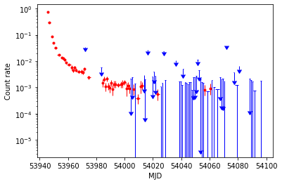
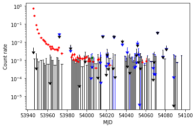

# The `swifttools.ukssdc.query.SXPS` class

[Jupyter notebook version of this page](SXPS.ipynb)

The `SXPSQuery` class is a child class of the [`swifttools.ukssdc.query` class](../query.md) extending its functionality to give some GRB-specific options. It makes use of the [`swifttools.ukssdc.data.SXPS` module](../data/SXPS.md) to allow you to download SXPS data products for objects found by querying.

In this guide I am going to cover the SXPS-specific query features and show you some examples of how to get data, but I am not going into all the details of the generic query syntax, or the product access functions. For those I refer you to the [`query`](../query.md) and [`data.SXPS`](../data/SXPS.md) documentation.

First, let's import the module, using our normal shortform:


```python
import swifttools.ukssdc.query as uq
```

## Page contents

* [The `SXPSQuery` class](#sxpsquery)
* [SXPS products](#prods)
    * [Sources](#sources)
        * [Source Details](#sinfo)
        * [Observation lists](#sobs)
        * [Light curves](#slc)
        * [Spectra](#sspec)
        * [Images](#sim)
        * [Vizier and SIMBAD matches](#scat)
        * [XRTProductRequests](#sxpr)
    * [Datasets](#datasets)
        * [Dataset Details](#dsinfo)
        * [Images](#dsim)
    * [Transients](#trans)
        * [Transient Details](#tinfo)
        * [Light curves](#tlc)
        * [Spectra](#tspec)
        * [Images](#tim)
        * [Vizier and SIMBAD matches](#tcat)
        * [XRTProductRequests](#txpr)
    * [Full table downloads](#fulltab)

<a id='sxpsquery'></a>
## The `SXPSQuery` class

To execute queries on the SXPS catalogues, we need an object from the `SXPSQuery` class, so let's start off by making one and, as usual, turning `silent` mode off for this demo:


```python
q = uq.SXPSQuery(silent=False)
```

    Resetting query details


The first thing we will need to do is decide what we want to query. Using this class we have multiple catalogues that we can query (2SXPS and LSXPS at the time of writing) and each of these has multiple tables. As you will know if you've read the [`ObsQuery`](../query.md) and [`GRBQuery`](GRB.md) documentation, we can view/set selected catlogue and table with the `cat` and `table` variables and can find out what options exist with `cats` and `tables`, so:


```python
print(f"Selected catalogue: {q.cat}")
print(f"Selected table: {q.table}\n")
print(f"Available catalogues: {q.cats}")
print(f"Available tables in this catalogue: {q.tables}\n")
```

    Selected catalogue: LSXPS
    Selected table: sources
    
    Available catalogues: ['LSXPS', '2SXPS']
    Available tables in this catalogue: ['sources', 'datasets', 'detections', 'obssources', 'xcorr', 'transients', 'oldstacks']
    


The table and catalogue can be specified in the constructor, or by setting the relevant variables, for example:


```python
q = uq.SXPSQuery(silent=False,
                 cat='LSXPS',
                 table='datasets')
q.cat='2SXPS'
q.table='sources'
```

    Resetting query details
    Resetting query details
    Resetting query details
    Resetting query details


Personally, I would recommend *always* setting the catalogue and table explicitly in the constructor, to make your code's operation more readable and in case for some reason the defaults ever change (I do not intend doing this, but maybe one day I'll go over to the Dark Side).

There is also an SXPS-specific feature: table subsets. That is, some tables have predefined subsets which you can select to search: if you've used the web interface you should be familiar with these; they are defined and documented in the [online documentatation](https://www.swift.ac.uk/LSXPS/docs.php#Table2) and [LSXPS paper](https://www.swift.ac.uk/LSXPS/paper.php). At the time of writing only the sources and datasets tables have such subsets, and the options are "clean" and "ultraclean", but you can check the available subsets for the selected catalogue and table using the `subsets` variable:


```python
q.subsets
```


    ('clean', 'ultraclean')


And you can view / set the subset using the `q.subset` variable:


```python
print(f"The current subset is {q.subset}")
q.subset = 'Clean'
print(f"Now it is {q.subset}")
```

    The current subset is None
    Now it is Clean


And you can unset it as well:


```python
q.subset=None
print(f"Now it is {q.subset}")
```

    Now it is None


One small note here: this `subset` variable belonging to the `SXPSQuery` class, should not be confused with the [`subsets` argument](../query.md#subsets) that you can pass to the various [functions to get products](#prods). In this case here, `subsets` is a *property of the catalogue* and relates to a predefined subset of catalogue results, so your query is on this catalogue subset. In the latter case, which we will encounter below, 
we are telling a function that gets products for our query results to return products for a subset *of the results we have already obtained* (the reuse of name is unfortunate, but a sensible alternative has failed to present itself to my mind. No doubt one will occur 13.2 seconds after release of this module).

So, let's put all of this together and make an example query, just to remind you of the syntax. I am going to request a cone search to find all datasets near GK Per, with at least 5ks of exposure.


```python
q = uq.SXPSQuery(silent=False,
                 cat='LSXPS',
                 table='datasets')
q.addConeSearch(name='GK Per',
                radius=12,
                units='arcmin')
q.addFilter(['ExposureUsed', '>=', 5000])
q.submit()
q.results
```

    Resetting query details
    Resetting query details
    Need to get the metadata.
    Calling DB look-up for rows 0 -- 1000
    Resolved 'GK Per' as (52.80004119305, 43.90429720867) via SIMBAD
    Received 8 rows.


<div style='width: 95%; max-height: 200px; overflow: scroll;'><style scoped>    .dataframe tbody tr th:only-of-type {        vertical-align: middle;    }    .dataframe tbody tr th {        vertical-align: top;    }    .dataframe thead th {        text-align: right;    }</style><table border="1" class="dataframe">  <thead>    <tr style="text-align: right;">      <th></th>      <th>_r</th>      <th>DatasetID</th>      <th>ObsID</th>      <th>DataVersion</th>      <th>IsStackedImage</th>      <th>FieldFlag</th>      <th>RA</th>      <th>Decl</th>      <th>l</th>      <th>b</th>      <th>...</th>      <th>StartTime_UTC</th>      <th>StopTime_UTC</th>      <th>RA_s</th>      <th>RA_apy</th>      <th>Decl_s</th>      <th>Decl_apy</th>      <th>l_s</th>      <th>l_apy</th>      <th>b_s</th>      <th>b_apy</th>    </tr>  </thead>  <tbody>    <tr>      <th>0</th>      <td>0.422190</td>      <td>7224</td>      <td>00030842005</td>      <td>9</td>      <td>0</td>      <td>0</td>      <td>52.79318</td>      <td>43.89929</td>      <td>150.954825</td>      <td>-10.111076</td>      <td>...</td>      <td>2007-01-17 03:13:51</td>      <td>2007-01-17 13:01:56</td>      <td>+03h 31m 10.36s</td>      <td>52d47m35.448s</td>      <td>+43d 53m 57.4s</td>      <td>43d53m57.444s</td>      <td>+10h 03m 49.16s</td>      <td>150d57m17.36958382s</td>      <td>-10d 06m 39.9s</td>      <td>-10d06m39.87334694s</td>    </tr>    <tr>      <th>1</th>      <td>0.515170</td>      <td>7557</td>      <td>00030842009</td>      <td>13</td>      <td>0</td>      <td>0</td>      <td>52.78865</td>      <td>43.90682</td>      <td>150.947686</td>      <td>-10.106837</td>      <td>...</td>      <td>2007-02-08 03:49:24</td>      <td>2007-02-08 21:36:41</td>      <td>+03h 31m 9.28s</td>      <td>52d47m19.14s</td>      <td>+43d 54m 24.6s</td>      <td>43d54m24.552s</td>      <td>+10h 03m 47.44s</td>      <td>150d56m51.67116423s</td>      <td>-10d 06m 24.6s</td>      <td>-10d06m24.61404396s</td>    </tr>    <tr>      <th>2</th>      <td>1.161283</td>      <td>7314</td>      <td>00030842006</td>      <td>9</td>      <td>0</td>      <td>0</td>      <td>52.77318</td>      <td>43.90452</td>      <td>150.939820</td>      <td>-10.115177</td>      <td>...</td>      <td>2007-01-23 02:11:48</td>      <td>2007-01-23 07:19:55</td>      <td>+03h 31m 5.56s</td>      <td>52d46m23.448s</td>      <td>+43d 54m 16.3s</td>      <td>43d54m16.272s</td>      <td>+10h 03m 45.56s</td>      <td>150d56m23.35263726s</td>      <td>-10d 06m 54.6s</td>      <td>-10d06m54.63669519s</td>    </tr>    <tr>      <th>3</th>      <td>1.758208</td>      <td>214434</td>      <td>10000021451</td>      <td>1</td>      <td>1</td>      <td>0</td>      <td>52.76405</td>      <td>43.91795</td>      <td>150.926465</td>      <td>-10.108051</td>      <td>...</td>      <td>2006-12-20 16:13:18</td>      <td>2018-11-12 22:02:58</td>      <td>+03h 31m 3.37s</td>      <td>52d45m50.58s</td>      <td>+43d 55m 4.6s</td>      <td>43d55m04.62s</td>      <td>+10h 03m 42.35s</td>      <td>150d55m35.27505151s</td>      <td>-10d 06m 29.0s</td>      <td>-10d06m28.98521735s</td>    </tr>    <tr>      <th>4</th>      <td>2.570163</td>      <td>7666</td>      <td>00030842012</td>      <td>11</td>      <td>0</td>      <td>0</td>      <td>52.74065</td>      <td>43.90627</td>      <td>150.919393</td>      <td>-10.127342</td>      <td>...</td>      <td>2007-02-16 02:41:59</td>      <td>2007-02-16 07:50:56</td>      <td>+03h 30m 57.76s</td>      <td>52d44m26.34s</td>      <td>+43d 54m 22.6s</td>      <td>43d54m22.572s</td>      <td>+10h 03m 40.65s</td>      <td>150d55m09.81458971s</td>      <td>-10d 07m 38.4s</td>      <td>-10d07m38.43088682s</td>    </tr>    <tr>      <th>5</th>      <td>2.606732</td>      <td>8090</td>      <td>00030842019</td>      <td>11</td>      <td>0</td>      <td>0</td>      <td>52.74574</td>      <td>43.92320</td>      <td>150.912458</td>      <td>-10.111421</td>      <td>...</td>      <td>2007-03-13 00:32:21</td>      <td>2007-03-13 10:19:53</td>      <td>+03h 30m 58.98s</td>      <td>52d44m44.664s</td>      <td>+43d 55m 23.5s</td>      <td>43d55m23.52s</td>      <td>+10h 03m 38.99s</td>      <td>150d54m44.85007265s</td>      <td>-10d 06m 41.1s</td>      <td>-10d06m41.11671946s</td>    </tr>    <tr>      <th>6</th>      <td>2.801839</td>      <td>7822</td>      <td>00030842015</td>      <td>8</td>      <td>0</td>      <td>0</td>      <td>52.74515</td>      <td>43.92914</td>      <td>150.908609</td>      <td>-10.106828</td>      <td>...</td>      <td>2007-02-26 00:28:52</td>      <td>2007-02-26 05:44:55</td>      <td>+03h 30m 58.84s</td>      <td>52d44m42.54s</td>      <td>+43d 55m 44.9s</td>      <td>43d55m44.904s</td>      <td>+10h 03m 38.07s</td>      <td>150d54m30.9918046s</td>      <td>-10d 06m 24.6s</td>      <td>-10d06m24.5794614s</td>    </tr>    <tr>      <th>7</th>      <td>2.940621</td>      <td>7974</td>      <td>00030842017</td>      <td>13</td>      <td>0</td>      <td>0</td>      <td>52.73292</td>      <td>43.91227</td>      <td>150.911250</td>      <td>-10.125681</td>      <td>...</td>      <td>2007-03-06 04:42:09</td>      <td>2007-03-06 12:56:57</td>      <td>+03h 30m 55.90s</td>      <td>52d43m58.512s</td>      <td>+43d 54m 44.2s</td>      <td>43d54m44.172s</td>      <td>+10h 03m 38.70s</td>      <td>150d54m40.50082912s</td>      <td>-10d 07m 32.5s</td>      <td>-10d07m32.45053766s</td>    </tr>  </tbody></table><p>8 rows × 22 columns</p></div>


For more details about how to forumulate an execute a query you need to read the [top-level query documentation](../query.md).

<a id='prods'></a>

### SXPS Products

Having carried out a query, such as above, you may want to access some of the data related to the objects found. You could take the object identifiers from your queries, and then pass them to the [`swifttools.ukssdc.data.SXPS` functions](../data/SXPS.md) to get at your data, but this is a bit of a drag, so the `SXPSQuery` module provides wrappers to do all of that for you, as we will now demonstrate. Note: I am *not* going to detail all of the arguments for the various data access functions, nor what they return: read the [data documentation](../data/SXPS.md) for that. I will, however, give a few quick notes here (as I did for GRBs):

First, let me remind you that by default all of the functions to get data (starting `get`), when called via the `query` module, neither save data to disk nor return it, but save it in a variable inside your `SXPSQuery` object. You can change this behaviour with the `saveData` and `returnData` arguments, but even then, the data will still be stored in class variables.

Second: the data you request must be indexed in some way (to show which object they belong to). In the [`data.SXPS` module](../data/SXPS.md) you controlled how the results were indexed by how you identified the objects you wanted, i.e. whether you supplied the `sourceName` or `sourceID` parameter to a `get()` function. When getting data from an `SXPSQuery` object, you use the `byName` or `byID` parameter to state how you want the results indexed (or, for datasets, `byObsID` and `byDatasetID`). We will see some examples below.

Third: You can request products for only a subset of the results your query found, using the [`subsets` argument](../query.md#subsets).

So, the basic syntax of every product retrieval function is the same:

`q.get<something>(byID, byName, subset, returnData, saveData, **kwargs)`

where `**kwargs` are any arguments you want to pass to the underlying function in [`SXPS.GRB`](../data/SXPS.md).

So, without wasting more time on abstract explanations, let's get to the examples. Data products are only available for the 'sources', 'datasets' and 'transients' tables, and we'll go through these in turn and (hopefully) at speed.

---

<a id='sources'></a>
## Sources

All of the source products we looked at in the [`swifttools.ukssdc.data.SXPS` documentation](../data/SXPS.md) are available for us and the function names are almost identical. First of all, let's run a query to get us some sources:


```python
q = uq.SXPSQuery(cat='LSXPS',
                 table='sources',
                 silent=False)
q.addConeSearch(name='GRB 060729',
                radius=2,
                units='arcmin')
q.addFilter(('DetFlag', '=', 0))
q.submit()
```

    Resetting query details
    Resetting query details
    Need to get the metadata.
    Calling DB look-up for rows 0 -- 1000
    Resolved 'GRB 060729' as (95.3827083, -62.3701917) via SIMBAD
    Received 6 rows.


At the time of writing, this found me 6 sources, although given that LSXPS is dynamic, this could change! If you turned off silent mode, then you can see how many rows you had like this:


```python
q.numRows
```


    6


To speed up the processing below, and to remind you how to get subsets, I'm going to make a subset that has only results less than 2' off axis, and with a positive HR1 value.


```python
mySS = (q.results['MeanOffAxisAngle']<2) | (q.results['HR1']>0)
```

As a quick aside, [filters in query expressions](../query.md#advanced) are always combined with an 'AND', so the above filter can *only* be done by making a subset of the query results.

Now we have a query, with some results, let's get some products.

<a id='sinfo'></a>
### Source details

**Note: This functionality only exists for LSXPS**

The `SXPSQuery` class provides two ways of getting the source details. The 'obvious' one is the `getsourceDetails()` function which wraps [the equivalent function in the `data` module](../data/SXPS.md#sinfo), but since your `SXPSQuery` object already knows which table you have been querying, you can save your fingers and just call a function `getDetails()`. This will silently redirect to `getSourceDetails()` (or one of the other `Details` functions) according to the selected table.

Really, it's up to you which you use. `getsourceDetails()` is 'safer' in that you can tell at a glance at the code what is being called, and if you accidentally call the function with the wrong table selected, you will get an error rather than a load of data you didn't want. `getDetails()` on the other hand is much more flexible, especially if you're calling it inside a function or loop where you don't know at the time of coding which table is going to be passed in.

So, below I will use both forms, just to make the point:


```python
q.getSourceDetails(byName=True,
                   subset = mySS
                  )
```

    Saved source information as sourceDetails varable.


```python
q.sourceDetails.keys()
```


    dict_keys(['LSXPS J062131.8-622213', 'LSXPS J062126.9-622317', 'LSXPS J062141.6-622120'])


As I warned, this function didn't return anything, because the data are instead stored in the `q.sourceDetails` variable. If for some reason, you really want to return the data, and can't bring yourself to access this variable, you can pass the argument `returnData=True` to the function, but in doing so, know that I judge you.

The `q.sourceDetails dict` is indexed by object name, because I have the `byName=True` argument.

One nice thing about the internal variable of products is that it can be updated. Imagine that you realiased that you gave the wrong subset, and wanted to get more results: just rerun the function the the new data will be added to the `q.sourceDetails dict`.


```python
q.getDetails(byName=True,
             subset = mySS
            )
q.sourceDetails.keys()
```

    Saved source information as sourceDetails varable.


    dict_keys(['LSXPS J062131.8-622213', 'LSXPS J062126.9-622317', 'LSXPS J062141.6-622120'])


As you see, the extra data have been added to the `dict`. You will also note that even though I used the shortened `getDetails()` function the result still got (correctly) directed to the `sourceDetails` variable.


If this is not what you wanted, you can always 'forget' the data you had first, using the generic `clearProduct()` function:


```python
q.clearProduct('sourceDetails')
print(f"sourceDetails is: {q.sourceDetails}\n\n")
q.getDetails(byID=True,
             subset = mySS
            )
q.sourceDetails.keys()
```

    Cleared stored `sourceDetails` data.
    sourceDetails is: None
    
    
    Saved source information as sourceDetails varable.


    dict_keys([209851, 209920, 209872])


Here I cleared the variable, and then sent another request, and, just to show that you can, ask for these results to be indexed by ID, not name.

<a id='sobs'></a>
### Source observations lists

**Note: This functionality only exists for LSXPS**

We can also get the list of observations and targetIDs covering the source(s) from our query, using the `getObsList()` function, which saves its data in the `sourceObsList` class variable.

**Important note** internally this uses `getSourceDetails()`, and to save time, if you've already got the source details for your objects, it will not repeat the look up. But if this is the case, then the `byName` or `byID` argument you give to `getObsList()` will be ignored, and whatever you used for `getSourceDetails()` used instead.

If you don't follow that, just clear the sourceDetails first:


```python
q.clearProduct('sourceDetails')

q.getObsList(byName=True,
             subset=mySS,
             useObs='allDet'
            )

q.sourceObsList
```

    Cleared stored `sourceDetails` data.


    {'LSXPS J062131.8-622213': {'targList': ['00221755'],
      'obsList': ['00221755000',
       '00221755001',
       '00221755002',
       '00221755003',
       '00221755004',
       '00221755005',
       '00221755006',
       '00221755007',
       '00221755008',
       '00221755009',
       '00221755010',
       '00221755011',
       '00221755012',
       '00221755013',
       '00221755014',
       '00221755015',
       '00221755016',
       '00221755017',
       '00221755018',
       '00221755020',
       '00221755022',
       '00221755023',
       '00221755024',
       '00221755025',
       '00221755026',
       '00221755027',
       '00221755028',
       '00221755029',
       '00221755030',
       '00221755031',
       '00221755032',
       '00221755033',
       '00221755034',
       '00221755035',
       '00221755036',
       '00221755037',
       '00221755038',
       '00221755041',
       '00221755043',
       '00221755044',
       '00221755045',
       '00221755058',
       '00221755083',
       '00221755086']},
     'LSXPS J062126.9-622317': {'targList': ['00221755'],
      'obsList': ['00221755033', '00221755040']},
     'LSXPS J062141.6-622120': {'targList': ['00221755'],
      'obsList': ['00221755001',
       '00221755004',
       '00221755007',
       '00221755020',
       '00221755025',
       '00221755031',
       '00221755034',
       '00221755035',
       '00221755041',
       '00221755043',
       '00221755074',
       '00221755009',
       '00221755032',
       '00221755037',
       '00221755065',
       '00221755073',
       '00221755090',
       '00221755100']}}


Again, for full details of the arguments, see the [function in the `data.SXPS` module](../data/SXPS.md#sobs).

If you wanted to download theese data using the [main `data` module](../data.md) you could do something like below:


```python
import swifttools.ukssdc.data as ud
ud.downloadObsData(q.sourceObsList['LSXPS J062126.9-622317']['obsList'],
                   instruments=('xrt',),
                   destDir='/tmp/APIDemo_SXPSq_data',
                   silent=False
                  )
```

    Making directory /tmp/APIDemo_SXPSq_data
    Downloading 2 datasets
    Making directory /tmp/APIDemo_SXPSq_data/00221755033
    Making directory /tmp/APIDemo_SXPSq_data/00221755033/xrt/
    Making directory /tmp/APIDemo_SXPSq_data/00221755033/xrt/event/
    Making directory /tmp/APIDemo_SXPSq_data/00221755033/xrt/hk/
    Making directory /tmp/APIDemo_SXPSq_data/00221755033/auxil/


    Downloading 00221755033:   0%|          | 0/24 [00:00<?, ?files/s]


    Making directory /tmp/APIDemo_SXPSq_data/00221755040
    Making directory /tmp/APIDemo_SXPSq_data/00221755040/xrt/
    Making directory /tmp/APIDemo_SXPSq_data/00221755040/xrt/event/
    Making directory /tmp/APIDemo_SXPSq_data/00221755040/xrt/hk/
    Making directory /tmp/APIDemo_SXPSq_data/00221755040/auxil/


    Downloading 00221755040:   0%|          | 0/24 [00:00<?, ?files/s]


In principle I could provide some wrapper function in the `query.SXPS` class to do this for you. I've decided against this for now, partly because there are a few little complexities to manage, and partly because I could continue forever adding little extras and never release this API. Honesty, I can't imagine this option being in demand. If you really want this functionality, let me know and I'll consider adding it.

<a id='slc'></a>
### Source light curves.

If you read the above, then the mechanism for getting source light curves is going to come as a huge shock. Brace yourself:


```python
q.getLightCurves(byID=True,
                 subset = q.results['MeanOffAxisAngle']<2,
                 timeFormat='MJD',
                 binning='obs',
                 )
```

And, as I didn't give `saveData=True` the results have only been stored in a class variable, `lightCurves`:


```python
q.lightCurves.keys()
```


    dict_keys([209851, 209920])


There are very many arguments related to the SXPS light curves, and they were [discussed in nauseating detail elsewhere](../data/SXPS.md#lightcurves) so I won't repeat myself here.

As with `sourceDetails` and everything else, you can repeat this call with a different (or no) subset and it will simply add those sources to the `q.lightCurves` `dict`. You can also change some of the arguments for `getLightCurves)`, if you decide you wanted to get a different band, for example, and these will be added in, as I'll show in a second.

**BUT there is a warning** Once you've saved some light curves, any subsequent downloads must have the *same `binning` and `timeFormat`* arguments as the first call (the reasons for this are too boring to document here. You can email me if you care). So the following cell will produce an error:


```python
q.getLightCurves(byID=True,
                 subset = q.results['MeanOffAxisAngle']>2,
                 timeFormat='TDB',
                 binning='obs',
             )
```


    ---------------------------------------------------------------------------

    ValueError                                Traceback (most recent call last)

    <ipython-input-20-6dd7c2d1fb4d> in <module>
    ----> 1 q.getLightCurves(byID=True,
          2                  subset = q.results['MeanOffAxisAngle']>2,
          3                  timeFormat='TDB',
          4                  binning='obs',
          5              )


    ~/soft/Python-3.8.1/lib/python3.8/site-packages/swifttools/ukssdc/query/SXPS.py in getLightCurves(self, subset, byName, byID, bands, binning, timeFormat, returnData, **kwargs)
        784                 timeFormat = self._lctimeformat
        785             if (binning != self._lcbinning) or (timeFormat != self._lctimeformat):
    --> 786                 raise ValueError("Cannot get more light curves with different binning / timeformat.")
        787 
        788         useTrans = False


    ValueError: Cannot get more light curves with different binning / timeformat.


So if we want to change binning or time format, we first need to save the light curve data we have (if we want to keep it) and then clear the light curve data via `q.clearProduct('lightCurves')`.

Let's do that, and then demonstrate a value way of updating `q.lightCurves`


```python
q.clearProduct('lightCurves')
q.getLightCurves(byID=True,
                 subset = mySS,
                 timeFormat='MJD',
                 binning='obs',
                 bands=('total', 'soft')
             )
```

    Cleared stored `lightCurves` data.


Let's have a quick look at what we have:


```python
q.lightCurves.keys()
```


    dict_keys([209851, 209920, 209872])


```python
q.lightCurves[209851]['Datasets']
```


    ['Total_rates', 'Total_UL', 'Soft_rates', 'Soft_UL']


Now let's pretend that I forgot that I also wanted the HR1 data; I can just add these to what I already have:


```python
q.getLightCurves(byID=True,
                 subset = mySS,
                 timeFormat='MJD',
                 binning='obs',
                 bands=('HR1',)
             )
```

So I should now have the total and soft data as before, and HR1 as well:


```python
q.lightCurves[209851]['Datasets']
```


    ['Total_rates', 'Total_UL', 'Soft_rates', 'Soft_UL', 'HR1']


And I do. If I'd wanted I could also have changed the subset to get light curves for extra sources.

#### Saving light curves

You can save light curves, either by setting the `saveData=True` argument in the `getLightCurves()` call, or by running `getLightCurves()` and calling the `saveLightCurve()` function, again, these just wrap the functions in the [`data.SXSPS` module](../data/SXPS.md)

Here are some quick demos:


```python
q.clearProduct('lightCurves')
q.verbose=True
q.getLightCurves(byID=True,
                 subset = q.results['MeanOffAxisAngle']<2,
                 timeFormat='MJD',
                 binning='obs',
                 bands=('total', 'soft'),
                 saveData=True,
                 destDir='/tmp/APIDemo_SXPSq_LC1',
                 subDirs=True
             )
```

    Cleared stored `lightCurves` data.
    Getting data for sourceID = `209851`
    Uploading data to https://www.swift.ac.uk/API/main.php
    Returned keys: dict_keys(['TimeFormat', 'T0', 'Binning', 'Datasets', 'Total_ratesData', 'Total_ULData', 'Soft_ratesData', 'Soft_ULData', 'OK', 'APIVersion'])
    Getting data for sourceID = `209920`
    Uploading data to https://www.swift.ac.uk/API/main.php
    Returned keys: dict_keys(['TimeFormat', 'T0', 'Binning', 'Datasets', 'Total_ratesData', 'Total_ULData', 'Soft_ratesData', 'Soft_ULData', 'OK', 'APIVersion'])
    Making directory /tmp/APIDemo_SXPSq_LC1
    Making directory /tmp/APIDemo_SXPSq_LC1/209851
    Writing file: `/tmp/APIDemo_SXPSq_LC1/209851/Total_rates_MJD_Observation.dat`
    Writing file: `/tmp/APIDemo_SXPSq_LC1/209851/Total_UL_MJD_Observation.dat`
    Writing file: `/tmp/APIDemo_SXPSq_LC1/209851/Soft_rates_MJD_Observation.dat`
    Writing file: `/tmp/APIDemo_SXPSq_LC1/209851/Soft_UL_MJD_Observation.dat`
    Making directory /tmp/APIDemo_SXPSq_LC1/209920
    Writing file: `/tmp/APIDemo_SXPSq_LC1/209920/Total_rates_MJD_Observation.dat`
    Writing file: `/tmp/APIDemo_SXPSq_LC1/209920/Total_UL_MJD_Observation.dat`
    Writing file: `/tmp/APIDemo_SXPSq_LC1/209920/Soft_rates_MJD_Observation.dat`
    Writing file: `/tmp/APIDemo_SXPSq_LC1/209920/Soft_UL_MJD_Observation.dat`


I deliberately made the object verbose, just to show you what's being saved.

The alternative approach is to call `saveLightCurves()` separately to `getLightCurves()`. This has the advantage that we can choose to save light curves only for some of the sources, or only some light curve types, using the `whichSources` and `whichCurves` argments that `data.SXPS.saveLightCurves` takes:


```python
q.saveLightCurves(destDir='/tmp/APIDemo_SXPSq_LC2',
                  subDirs=False,
                  whichSources=(209851,),
                  whichCurves=('Total_rates',)
             )
q.verbose = False # I want to turn this off again because it annoys me
```

    Making directory /tmp/APIDemo_SXPSq_LC2
    Writing file: `/tmp/APIDemo_SXPSq_LC2/209851_Total_rates_MJD_Observation.dat`
    Writing file: `/tmp/APIDemo_SXPSq_LC2/209851_Total_UL_MJD_Observation.dat`
    Writing file: `/tmp/APIDemo_SXPSq_LC2/209851_Soft_rates_MJD_Observation.dat`
    Writing file: `/tmp/APIDemo_SXPSq_LC2/209851_Soft_UL_MJD_Observation.dat`


#### Plotting light curves

You may recall the [module-level `plotLightCurve()` function](https://www.swift.ac.uk/API/ukssdc/commonFunc.md#plotlightcurve)? We can use that too. The only new argument is that we have to specify which source we want to plot; the function doesn't support plotting multiple objects (although it does return the `pyplot` objects so you could do this yourself)


```python
fig, ax = q.plotLightCurves(209851,
                            whichCurves=('Total_rates', 'Total_UL'),
                            cols = {'Total_rates':'red', 'Total_UL':'blue'},
                            ylog=True)
```

    Plotting Total_rates as upper rates
    Plotting Total_UL as upper limits


    

    


And having captured `fig` and `ax` if I wanted to add another dataset:


```python
fig, ax = q.plotLightCurves(209920,
                            fig=fig,
                            ax=ax,
                            whichCurves=('Total_rates', 'Total_UL'),
                            cols = {'Total_rates':'green', 'Total_UL':'black'},
                            ylog=True)
fig
```

    Plotting Total_rates as upper rates
    Plotting Total_UL as upper limits


    

    


<a id='sspec'></a>

### Source spectra

The situation for spectra is, amazingly enough, almost the same as for the other products we've already covered. The main thing to remind you is that for spectra, there is difference between the data returned and stored in variables, and the data saved to disk. The former gives information about the spectrum and the spectral fit results; the latter gives the actual spectral files themselves. If you want the latter then, exactly as above for light curves, you can either specify `saveData=True` during the `getSpectra()` call, or you can call `saveSpectra()` after the event. I will only demonstrate the latter here.


```python
q.getSpectra(byID=True,
             subset = mySS
             )
```


```python
q.spectra.keys()
```


    dict_keys([209851, 209920, 209872])


```python
q.spectra[209851]
```


    {'T0': 126230399.334228,
     'DeltaFitStat': 2.706,
     'GalNH_unfitted': 5.400326e+20,
     'rnames': ['interval0'],
     'interval0': {'DataFile': 'https://www.swift.ac.uk/LSXPS/sources/source209851/spectrum/interval0.tar.gz',
      'Start': 49663107.6386355,
      'Stop': 55380000.058715,
      'Modes': ['PC'],
      'PC': {'Models': ['PowerLaw', 'APEC'],
       'PowerLaw': {'NH': 1.02962e+21,
        'NHPos': 1.0054472300000005e+20,
        'NHNeg': -9.716517440000003e+19,
        'Gamma': 1.96167,
        'GammaPos': 0.0370174379999999,
        'GammaNeg': -0.03668947300000003,
        'ObsFlux': 1.0023052380778984e-12,
        'ObsFluxPos': 2.1825921701704336e-14,
        'ObsFluxNeg': -2.1507625571575763e-14,
        'UnabsFlux': 1.2237705564718283e-12,
        'UnabsFluxPos': 2.329668175179754e-14,
        'UnabsFluxNeg': -2.2795492981293633e-14,
        'Cstat': 734.2501096,
        'Dof': 750,
        'FitChi': 895.615057,
        'Image': 'https://www.swift.ac.uk/LSXPS/sources/source209851/spectrum/interval0pc_pow_plot.gif'},
       'Exposure': 713670.3500815034,
       'APEC': {'NH': 1.81995e+20,
        'NHPos': 5.826678339999999e+19,
        'NHNeg': -5.69794203e+19,
        'KT': 4.60222,
        'KTPos': 0.24289140000000042,
        'KTNeg': -0.22265284499999982,
        'ObsFlux': 9.97470361339622e-13,
        'ObsFluxPos': 2.1730377921461937e-14,
        'ObsFluxNeg': -2.1269582078831672e-14,
        'UnabsFlux': 1.0273064148386752e-12,
        'UnabsFluxPos': 2.1898074058960922e-14,
        'UnabsFluxNeg': -2.134213476941077e-14,
        'Cstat': 866.581794,
        'Dof': 750,
        'FitChi': 1129.326927,
        'Image': 'https://www.swift.ac.uk/LSXPS/sources/source209851/spectrum/interval0pc_apec_plot.gif'},
       'MeanTime': 49989545.8006105}}}


As you should, surely, have expected, this function got us a `dict` with an entry per source, indexed by ID (as requested), and these entries are themselves [spectrum `dict`s](https://www.swift.ac.uk/API/ukssdc/structures.md#the-spectrum-dict)

#### Saving the spectra

If you didn't give `saveData=True` above then you can still save the spectra later, as noted above, using the `saveSpectra()` function. As with light curves, this lets you choose to save only some of the spectra you have, if you want:


```python
q.verbose=True
q.saveSpectra(whichSources=(209851,),
              destDir='/tmp/APIDemo_SXPSq_spec',
              saveImages=True,
              extract=True,
              removeTar=True
             )
q.verbose=False
```

    Making directory /tmp/APIDemo_SXPSq_spec
    Making directory /tmp/APIDemo_SXPSq_spec/209851
    Transient False
    Saving `interval0` spectrum
    Downloading file `/tmp/APIDemo_SXPSq_spec/209851/interval0.tar.gz`
    Saving file `/tmp/APIDemo_SXPSq_spec/209851/interval0.tar.gz`
    Extracting `/tmp/APIDemo_SXPSq_spec/209851/interval0.tar.gz`
    README.txt
    interval0pcsource.pi
    interval0pcback.pi
    interval0pc.pi
    interval0pc.arf
    interval0pc.rmf
    interval0.areas
    GRB_info.txt
    models/interval0pc_apec.xcm
    models/interval0pc_pow.xcm
    interval0pc_apec_fit.fit
    interval0pc_pow_fit.fit
    
    
    Removing file /tmp/APIDemo_SXPSq_spec/209851/interval0.tar.gz
    Downloading file `/tmp/APIDemo_SXPSq_spec/209851/interval0pc_pow_plot.gif`
    Saving file `/tmp/APIDemo_SXPSq_spec/209851/interval0pc_pow_plot.gif`
    Downloading file `/tmp/APIDemo_SXPSq_spec/209851/interval0pc_apec_plot.gif`
    Saving file `/tmp/APIDemo_SXPSq_spec/209851/interval0pc_apec_plot.gif`


<a id='sim'></a>
### Source images

Source images are only saved to disk, these being just png-format images can only be saved to disk as there is no particular value (that I know of) of storing them in variables. The function thus begins `save` not `get`, and has the optional short-form `saveImages()` which will automatically redirect to `saveSourceImages()` if you have the 'sources' table selected (and `saveDatasetImages` if you have the 'datasets' table, etc.)

This only really needs one quick example:


```python
q.verbose=True # So we see what's going on
q.saveImages(subset = mySS,
             byName=True,
             destDir='/tmp/APIDemo_SXPSq_images')
```

    Making directory /tmp/APIDemo_SXPSq_images
    Getting images for sourceName = `LSXPS J062131.8-622213`
    Uploading data to https://www.swift.ac.uk/API/main.php
    Returned keys: dict_keys(['Total', 'Soft', 'Medium', 'Hard', 'Expmap', 'OK', 'APIVersion'])
    Making directory /tmp/APIDemo_SXPSq_images/LSXPS J062131.8-622213
    Downloading file `/tmp/APIDemo_SXPSq_images/LSXPS J062131.8-622213/Total.png`
    Saving file `/tmp/APIDemo_SXPSq_images/LSXPS J062131.8-622213/Total.png`
    Downloading file `/tmp/APIDemo_SXPSq_images/LSXPS J062131.8-622213/Soft.png`
    Saving file `/tmp/APIDemo_SXPSq_images/LSXPS J062131.8-622213/Soft.png`
    Downloading file `/tmp/APIDemo_SXPSq_images/LSXPS J062131.8-622213/Medium.png`
    Saving file `/tmp/APIDemo_SXPSq_images/LSXPS J062131.8-622213/Medium.png`
    Downloading file `/tmp/APIDemo_SXPSq_images/LSXPS J062131.8-622213/Hard.png`
    Saving file `/tmp/APIDemo_SXPSq_images/LSXPS J062131.8-622213/Hard.png`
    Downloading file `/tmp/APIDemo_SXPSq_images/LSXPS J062131.8-622213/Expmap.png`
    Saving file `/tmp/APIDemo_SXPSq_images/LSXPS J062131.8-622213/Expmap.png`
    Getting images for sourceName = `LSXPS J062126.9-622317`
    Uploading data to https://www.swift.ac.uk/API/main.php
    Returned keys: dict_keys(['Total', 'Soft', 'Medium', 'Hard', 'Expmap', 'OK', 'APIVersion'])
    Making directory /tmp/APIDemo_SXPSq_images/LSXPS J062126.9-622317
    Downloading file `/tmp/APIDemo_SXPSq_images/LSXPS J062126.9-622317/Total.png`
    Saving file `/tmp/APIDemo_SXPSq_images/LSXPS J062126.9-622317/Total.png`
    Downloading file `/tmp/APIDemo_SXPSq_images/LSXPS J062126.9-622317/Soft.png`
    Saving file `/tmp/APIDemo_SXPSq_images/LSXPS J062126.9-622317/Soft.png`
    Downloading file `/tmp/APIDemo_SXPSq_images/LSXPS J062126.9-622317/Medium.png`
    Saving file `/tmp/APIDemo_SXPSq_images/LSXPS J062126.9-622317/Medium.png`
    Downloading file `/tmp/APIDemo_SXPSq_images/LSXPS J062126.9-622317/Hard.png`
    Saving file `/tmp/APIDemo_SXPSq_images/LSXPS J062126.9-622317/Hard.png`
    Downloading file `/tmp/APIDemo_SXPSq_images/LSXPS J062126.9-622317/Expmap.png`
    Saving file `/tmp/APIDemo_SXPSq_images/LSXPS J062126.9-622317/Expmap.png`
    Getting images for sourceName = `LSXPS J062141.6-622120`
    Uploading data to https://www.swift.ac.uk/API/main.php
    Returned keys: dict_keys(['Total', 'Soft', 'Medium', 'Hard', 'Expmap', 'OK', 'APIVersion'])
    Making directory /tmp/APIDemo_SXPSq_images/LSXPS J062141.6-622120
    Downloading file `/tmp/APIDemo_SXPSq_images/LSXPS J062141.6-622120/Total.png`
    Saving file `/tmp/APIDemo_SXPSq_images/LSXPS J062141.6-622120/Total.png`
    Downloading file `/tmp/APIDemo_SXPSq_images/LSXPS J062141.6-622120/Soft.png`
    Saving file `/tmp/APIDemo_SXPSq_images/LSXPS J062141.6-622120/Soft.png`
    Downloading file `/tmp/APIDemo_SXPSq_images/LSXPS J062141.6-622120/Medium.png`
    Saving file `/tmp/APIDemo_SXPSq_images/LSXPS J062141.6-622120/Medium.png`
    Downloading file `/tmp/APIDemo_SXPSq_images/LSXPS J062141.6-622120/Hard.png`
    Saving file `/tmp/APIDemo_SXPSq_images/LSXPS J062141.6-622120/Hard.png`
    Downloading file `/tmp/APIDemo_SXPSq_images/LSXPS J062141.6-622120/Expmap.png`
    Saving file `/tmp/APIDemo_SXPSq_images/LSXPS J062141.6-622120/Expmap.png`


<a id='scat'></a>
#### Vizier and SIMBAD matches

The automated analysis of SXPS sources includes looking for possible counterparts in a predefined set of catalogues; you can access the results of this through the 'xcorr' table or via the 'CrossMatch' entry  in the data returned by the `getsourceDetails()`. However, you may want to look up a much wider range of catalogues, such as those available in SIMBAD and Vizier, so I've provided some basic functionality to do this. Or, more precisely, the astroquery devs have provided some time tools to use this,and I've provided some wrapper functions.

If you haven't already installed astroquery you can do that now (e.g. `pip install astroquery`), but if you do that you will probably have to restart the kernel in this notebook and redo the import of this module, otherwise it will not know that astroquery now exists.

To save you lots of scrolling, just install astroquery, restart the Jupyter kernel (select "Kernel -> Restart" from the menu) and then execute this next cell (which you can ignore if you already have astroquery). This will import the module and redo our basic source query that we're using as a basis.


```python
import swifttools.ukssdc.query as uq
q = uq.SXPSQuery(cat='LSXPS',
                 table='sources',
                 silent=False)
q.addConeSearch(name='GRB 060729',
                radius=2,
                units='arcmin')
q.addFilter(('DetFlag', '=', 0))
q.submit()
mySS = (q.results['MeanOffAxisAngle']<2) | (q.results['HR1']>0)
```

    Resetting query details
    Resetting query details
    Need to get the metadata.
    Calling DB look-up for rows 0 -- 1000
    Resolved 'GRB 060729' as (95.3827083, -62.3701917) via SIMBAD
    Received 6 rows.


Now we also need to import astropy.units, because we'll need these for our query, as this is what `astroquery` is expecting


```python
import astropy.units as au
```

Right, now we're ready to actually work. There are two functions available to us:

* `doSIMBADsearch()`
* `doVizierSearch()`

and I reckon you can guess what they do.

The basic arguments are those common to everything in this module, `byID` or `byName`, `subset` and `returnData`. There are two other arguments that may be useful:

* `pandas` (default: `True`) - the `astroquery` module returns its results in the form of an astropy `Table`s, but this API has been built around pandas, so these results are converted to `DataFrame`s. You can disable this conversion by setting `pandas=False`.

These functions actually ultimately call the function `doCatSearch()` in the (abstract) base class `dataQuery` so if you want to read the docstring, you will need to do `help(uq.dataQuery.doCatSearch)`, but I'll try to make that unnecessary here.

#### SIMBAD

Let's start with a SIMBAD query.


```python
q.doSIMBADSearch(byName=True,
                 subset = mySS,
                 radius=20*au.arcsec,
                 epoch='J2000',
                 equinox=2000)
```

The last 3 arguments are all things that the `astroquery.simbad.Simbad.query_region()` function needs. For more details see the help for that - essentially any arguments it needs can be passed to `doSIMBADSearch()` and will just get forwarded on.

The results of this are stored in the `q.SIMBAD` variable (and would have been returned if we said `returnData=True`. Let's explore it:


```python
q.SIMBAD.keys()
```


    dict_keys(['LSXPS J062131.8-622213', 'LSXPS J062126.9-622317', 'LSXPS J062141.6-622120'])


It's a `dict`, of course, and the keys are the sources we asked to query. Let's have a more detailed look at those:


```python
q.SIMBAD['LSXPS J062131.8-622213']
```


<div style='width: 95%; max-height: 200px; overflow: scroll;'><style scoped>    .dataframe tbody tr th:only-of-type {        vertical-align: middle;    }    .dataframe tbody tr th {        vertical-align: top;    }    .dataframe thead th {        text-align: right;    }</style><table border="1" class="dataframe">  <thead>    <tr style="text-align: right;">      <th></th>      <th>MAIN_ID</th>      <th>RA</th>      <th>DEC</th>      <th>RA_PREC</th>      <th>DEC_PREC</th>      <th>COO_ERR_MAJA</th>      <th>COO_ERR_MINA</th>      <th>COO_ERR_ANGLE</th>      <th>COO_QUAL</th>      <th>COO_WAVELENGTH</th>      <th>COO_BIBCODE</th>      <th>SCRIPT_NUMBER_ID</th>    </tr>  </thead>  <tbody>    <tr>      <th>0</th>      <td>GRB 060729</td>      <td>06 21 31.850</td>      <td>-62 22 12.69</td>      <td>7</td>      <td>7</td>      <td>1000.0</td>      <td>1000.0</td>      <td>90</td>      <td>D</td>      <td>U</td>      <td>2009ApJ...690..163R</td>      <td>1</td>    </tr>    <tr>      <th>1</th>      <td>2XMM J062131.8-622212</td>      <td>06 21 31.8</td>      <td>-62 22 12</td>      <td>5</td>      <td>5</td>      <td>NaN</td>      <td>NaN</td>      <td>0</td>      <td>D</td>      <td></td>      <td></td>      <td>1</td>    </tr>  </tbody></table></div>


This is a `DataFrame` giving the results that SIMBAD returned. For more details about the contents and how to customise them, you'll have to read up on `astroquery`.

#### Vizier

A Vizier lookup works more or less the same way, except that we don't specify the equinox and epoch. The simplest approach is to query all of Vizier **but this will be slow and you may not want to do it**. In that case just skip ahead a few cells.


```python
q.doVizierSearch(byName=True,
                 subset = mySS,
                 radius=20*au.arcsec
                 )
```


```python
q.Vizier.keys()
```


    dict_keys(['LSXPS J062131.8-622213', 'LSXPS J062126.9-622317', 'LSXPS J062141.6-622120'])


```python
q.Vizier['LSXPS J062131.8-622213'].keys()
```


    dict_keys(['I/252/out', 'I/284/out', 'I/297/out', 'I/305/out', 'I/317/sample', 'I/324/igsl3', 'I/337/gaia', 'I/339/hsoy', 'I/345/gaia2', 'I/347/gaia2dis', 'I/350/gaiaedr3', 'I/352/gedr3dis', 'I/353/gsc242', 'I/355/gaiadr3', 'I/355/paramp', 'II/281/2mass6x', 'II/311/wise', 'II/328/allwise', 'II/339/uvotssc1', 'II/339/summary', 'II/340/xmmom2_1', 'II/356/xmmom41s', 'II/363/unwise', 'II/365/catwise', 'II/367/vhs_dr5', 'II/370/xmmom5s', 'IV/38/tic', 'IV/39/tic82', 'IX/43/sources', 'IX/43/xcor', 'IX/45/csc11', 'IX/50/xmm3r6s', 'IX/54/xmm3r7s', 'IX/55/xmm3r8s', 'IX/57/csc2master', 'IX/58/2sxps', 'IX/59/xmm4dr9s', 'IX/63/xmm4d10s', 'IX/65/xmm4d11s', 'B/hst/obscore', 'B/hst/hstlog', 'B/chandra/chandra', 'B/xmm/xmmlog', 'B/eso/eso_arc', 'B/gemini/obscore', 'B/swift/swiftlog', 'J/ApJ/690/163/table5', 'J/ApJ/690/163/table3', 'J/ApJ/690/163/table4', 'J/ApJ/701/824/grb', 'J/ApJ/702/489/table1', 'J/ApJ/704/1405/table1', 'J/ApJ/720/1513/table2', 'J/ApJ/731/103/GRBs', 'J/ApJ/746/170/training', 'J/ApJ/756/44/table9', 'J/ApJ/772/73/table5', 'J/ApJ/774/157/table1', 'J/ApJ/786/20/table7', 'J/ApJ/787/66/table1', 'J/ApJ/787/90/table1', 'J/ApJ/820/66/table1', 'J/ApJ/826/45/table1', 'J/ApJ/828/36/table1', 'J/ApJ/833/159/table2', 'J/ApJ/852/53/table9', 'J/ApJ/866/97/table2', 'J/ApJ/867/105/refcat2', 'J/ApJ/884/59/table1', 'J/ApJ/896/L20/table1', 'J/ApJS/209/20/table9', 'J/ApJS/224/40/table5', 'J/ApJS/224/40/counts', 'J/ApJS/227/7/table1', 'J/ApJS/248/21/table1', 'J/A+A/493/339/target', 'J/A+A/551/A142/1swxrt', 'J/A+A/557/A12/GRBs', 'J/A+A/581/A125/list', 'J/A+A/582/A111/table2', 'J/A+A/584/A48/tablea1', 'J/A+A/642/A141/ousxg', 'J/A+A/657/A138/table7', 'J/AJ/133/1027/table1', 'J/MNRAS/397/1177/enhpos', 'J/MNRAS/418/2202/table1', 'J/MNRAS/428/729/observed', 'J/MNRAS/449/L6/table', 'J/MNRAS/449/L6/fig3', 'J/MNRAS/458/84/tablea3', 'J/MNRAS/464/4545/grbcat'])


**IF YOU SKIPPED, RESUME HERE**

As you can see from the code above (even if you didn't execute it), the results are saved in `q.Vizier`, are a `dict` with an entry per source, and then those themselves are `dict`s (if you didn't run the above, you can still infer this because I used the `.keys()` function). This `dict` is what `astroquery` returns, it is one entry for each Vizier table with a result. It's a bit much to plough through for a demonstration, and you may not have executed the above, so we'll do something simplier.

The underlying `astroquery` functionality allows us to specify a catalogue to look up in Vizier. Again, read the `astroquery` docs for full information, but to demonstrate:


```python
q.clearProduct('Vizier') # Let's lose that mass of data we downloaded just now
q.doVizierSearch(byName=True,
                 subset = q.results['MeanOffAxisAngle']<2,
                 radius=20*au.arcsec,
                 catalog = 'GSC'
                 )
```

    Cleared stored `Vizier` data.


Of course, the first thing you'll notice is that while *I've* resolutely used 'cat' instead of 'catalog\[ue\]', to prevent a transatlantic incident, `astroquery` are not so kind. Pah. If it leads to hostilities, don't blame me. Anyway, what did we get?


```python
q.Vizier['LSXPS J062131.8-622213'].keys()
```


    dict_keys(['I/305/out', 'I/353/gsc242'])


Looks like there were two catalogues returned that matched 'GSC'. Let's check out one of these results:


```python
q.Vizier['LSXPS J062131.8-622213']['I/353/gsc242']
```


<div style='width: 95%; max-height: 200px; overflow: scroll;'><style scoped>    .dataframe tbody tr th:only-of-type {        vertical-align: middle;    }    .dataframe tbody tr th {        vertical-align: top;    }    .dataframe thead th {        text-align: right;    }</style><table border="1" class="dataframe">  <thead>    <tr style="text-align: right;">      <th></th>      <th>GSC2</th>      <th>RA_ICRS</th>      <th>DE_ICRS</th>      <th>objID</th>      <th>Epoch</th>      <th>Class</th>      <th>Gmag</th>      <th>OMag</th>      <th>Bjmag</th>      <th>Fpgmag</th>      <th>...</th>      <th>Ymag</th>      <th>W1mag</th>      <th>W2mag</th>      <th>W3mag</th>      <th>W4mag</th>      <th>FUVmag</th>      <th>NUVmag</th>      <th>a</th>      <th>e</th>      <th>PA</th>    </tr>  </thead>  <tbody>    <tr>      <th>0</th>      <td>S4FR008835</td>      <td>95.391853</td>      <td>-62.372009</td>      <td>211213138835</td>      <td>2015.50</td>      <td>0</td>      <td>20.286947</td>      <td>NaN</td>      <td>NaN</td>      <td>20.5137</td>      <td>...</td>      <td>NaN</td>      <td>16.188000</td>      <td>16.375000</td>      <td>12.775</td>      <td>9.705</td>      <td>NaN</td>      <td>NaN</td>      <td>1.497</td>      <td>0.247</td>      <td>138.199997</td>    </tr>    <tr>      <th>1</th>      <td>S4FR008891</td>      <td>95.387189</td>      <td>-62.368586</td>      <td>211213138891</td>      <td>2015.50</td>      <td>0</td>      <td>19.342562</td>      <td>NaN</td>      <td>21.099501</td>      <td>19.1910</td>      <td>...</td>      <td>NaN</td>      <td>16.396000</td>      <td>16.627001</td>      <td>13.364</td>      <td>9.573</td>      <td>NaN</td>      <td>NaN</td>      <td>2.498</td>      <td>0.300</td>      <td>87.099998</td>    </tr>    <tr>      <th>2</th>      <td>S4FR086852</td>      <td>95.379841</td>      <td>-62.369011</td>      <td>2112131386852</td>      <td>2010.56</td>      <td>4</td>      <td>NaN</td>      <td>NaN</td>      <td>NaN</td>      <td>NaN</td>      <td>...</td>      <td>NaN</td>      <td>17.417999</td>      <td>17.664000</td>      <td>12.874</td>      <td>9.658</td>      <td>NaN</td>      <td>NaN</td>      <td>NaN</td>      <td>NaN</td>      <td>NaN</td>    </tr>  </tbody></table><p>3 rows × 35 columns</p></div>


It's a DataFrame, with all the output of the Vizier look up. Yay!

That's it for actual source products, so before I move on, let me show you one other useful function.


```python
q.clearProducts()
```

This has basically 'forgotten' anything we have downloaded so far, so all of the variables like `q.lightCurves`, `q.Vizier` and everything in between has been wiped.

<a id='sxpr'></a>
### XRTProductRequests

The last piece of functionality attached to the SXPS sources is the ability to make `XRTProductRequest` objects.
**PLEASE DO NOT SUBMIT HUGE NUMBERS OF THESE EN MASSE.** There are [instructions](../xrt_prods/advanced.md#scripting-large-numbers-of-jobs) showing how to submit things piecemeal, so as not to overload our servers. If you try submitting stupid number of jobs, we may have to turn on the secret death ray on Swift and fry your computer. You have been warned.

Making `XRTProductRequest` objects for SXPS sources, and all the assorted parameter options, was described in [the `swiftools.ukssdc.data.SXPS` notebook](../data/SXPS.md#xpr) (you've read it now, right? Right?). I'm not repeating it all here. All you need to know for this query module is:

* This is the one function in the module which always returns what it makes, rather than saving it to a variable.
* Beyond this it works just like all the functions above.

So you only get one demo. One piece of advice though: make your query silent before proceeding; it turns out this produces loads of verbiage otherwise.


```python
q.silent=True
rlist=q.makeProductRequest('MY_EMAIL_ADDRESS',
                           subset=mySS,
                           byID=True,
                           T0='firstBlindDet',
                           useObs='blind',
                           addProds=['LightCurve','Spectrum', 'StandardPos']
                          )
```


```python
rlist.keys()
```


    dict_keys([209851, 209920, 209872])


OK, as expected, that returned us a `dict` with an entry for each source we asked for. Let's have a quick shufti at the results.


```python
for k, v in rlist.items():
    print(f"{k}: ")
    print(v)
    print(f"Global Pars: {v.getGlobalPars()}")
    print(f"LC Pars: {v.getLightCurvePars()}")
```

    209851: 
    XRTProductRequest object for user `MY_EMAIL_ADDRESS`, with the following products requested:
    * light curve
    * spectrum
    * standard position
    
    Global Pars: {'name': 'LSXPS J062131.8-622213', 'targ': '00221755', 'T0': 175893506.972863, 'RA': 95.38255019, 'Dec': -62.3702951, 'centroid': False, 'posErr': 1, 'useSXPS': True, 'getTargs': False, 'getT0': False}
    LC Pars: {'whichData': 'user', 'useObs': '00221755000,00221755001,00221755002,00221755003,00221755004,00221755005,00221755006,00221755007,00221755008,00221755009,00221755010,00221755011,00221755012,00221755013,00221755014,00221755015,00221755016,00221755017,00221755018,00221755020,00221755022,00221755023,00221755024,00221755025,00221755026,00221755027,00221755028,00221755029,00221755030,00221755031,00221755032,00221755033,00221755034,00221755035,00221755036,00221755037,00221755038,00221755041,00221755043,00221755044'}
    209920: 
    XRTProductRequest object for user `MY_EMAIL_ADDRESS`, with the following products requested:
    * light curve
    * spectrum
    * standard position
    
    Global Pars: {'name': 'LSXPS J062126.9-622317', 'targ': '', 'T0': 175894000.0, 'RA': 95.36212207, 'Dec': -62.38828768, 'centroid': False, 'posErr': 1, 'useSXPS': True, 'getTargs': False, 'getT0': False}
    LC Pars: {'whichData': 'user', 'useObs': ''}
    209872: 
    XRTProductRequest object for user `MY_EMAIL_ADDRESS`, with the following products requested:
    * light curve
    * spectrum
    * standard position
    
    Global Pars: {'name': 'LSXPS J062141.6-622120', 'targ': '00221755', 'T0': 175894000.0, 'RA': 95.42369715, 'Dec': -62.35566404, 'centroid': False, 'posErr': 1, 'useSXPS': True, 'getTargs': False, 'getT0': False}
    LC Pars: {'whichData': 'user', 'useObs': '00221755001,00221755004,00221755007,00221755020,00221755025,00221755031,00221755034,00221755035,00221755041,00221755043,00221755074'}


```python
q.getSourceDetails(byID=True,
                   subset = q.results['MeanOffAxisAngle']<2
                  )
q.sourceDetails[209920]
```


    {'IAUName': 'LSXPS J062126.9-622317',
     'LSXPS_ID': 209920,
     'RA': 95.36212207,
     'Decl': -62.38828768,
     'Err90': 2.834039767,
     'AstromType': 1,
     'l': 271.80875954127,
     'b': -27.2499453846588,
     'MeanOffAxisAngle': 1.44829,
     'Exposure': 1186293.8928,
     'FirstObsDate': '2006-07-29 20:18:25',
     'LastObsDate': '2006-12-27 23:48:56',
     'FirstObsMET': 175893506.972863,
     'LastObsMET': 188956137.813723,
     'FirstDetDate': '2006-07-29 20:26:38',
     'LastDetDate': '2006-12-27 23:46:38',
     'FirstDetMET': 175894000,
     'LastDetMET': 188956000,
     'FirstBlindDetDate': '2006-07-29 20:26:38',
     'LastBlindDetDate': '2006-12-27 23:46:38',
     'FirstBlindDetMET': 175894000,
     'LastBlindDetMET': 188956000,
     'NumObs': 96,
     'NumBlindDetObs': 1,
     'NumDetObs': 3,
     'DetFlag': 0,
     'FieldFlag': 2,
     'DetFlag_band0': 0,
     'DetFlag_band1': -1,
     'DetFlag_band2': -1,
     'DetFlag_band3': 0,
     'BestDetectionID': 1095646,
     'OpticalLoadingWarning': 0,
     'StrayLightWarning': 0,
     'NearBrightSourceWarning': 0,
     'IsPotentialAlias': 0,
     'Rate_band0': 0.00010479103345663,
     'Rate_band0_pos': 3.06946983657823e-05,
     'Rate_band0_neg': -2.98692988780926e-05,
     'Rate_band1': 0,
     'Rate_band1_pos': 8.31967982111264e-06,
     'Rate_band1_neg': 0,
     'Rate_band2': 7.63246803365583e-06,
     'Rate_band2_pos': 1.396270816092e-05,
     'Rate_band2_neg': -7.63246803365583e-06,
     'Rate_band3': 2.82258505525886e-05,
     'Rate_band3_pos': 1.77824345617797e-05,
     'Rate_band3_neg': -1.70735661689065e-05,
     'Counts_band0': 597,
     'Counts_band1': 184,
     'Counts_band2': 182,
     'Counts_band3': 231,
     'BgCounts_band0': 512.445957481861,
     'BgCounts_band1': 213.383573718369,
     'BgCounts_band2': 175.839670512825,
     'BgCounts_band3': 208.22353803739,
     'RateCF_band0': 1.47021977682665,
     'RateCF_band1': 1.47021977682665,
     'RateCF_band2': 1.46986204794109,
     'RateCF_band3': 1.47015077843438,
     'NonBlindDet_band0': 1,
     'NonBlindDet_band1': 0,
     'NonBlindDet_band2': 0,
     'NonBlindDet_band3': 0,
     'UL_band0': 0.000197943438401407,
     'UL_band1': 3.49406723069609e-05,
     'UL_band2': 5.98727468055709e-05,
     'UL_band3': 8.44358919783773e-05,
     'PeakRate_band0': 0.0144985,
     'PeakRate_band0_pos': 0.00622473,
     'PeakRate_band0_neg': -0.00490721,
     'PeakRate_band1': 0.0149409,
     'PeakRate_band1_pos': 0.00622667,
     'PeakRate_band1_neg': -0.00490527,
     'PeakRate_band2': 7.63246803365583e-06,
     'PeakRate_band2_pos': 1.396270816092e-05,
     'PeakRate_band2_neg': -7.63246803365583e-06,
     'PeakRate_band3': 0.00386394,
     'PeakRate_band3_pos': 0.00301511,
     'PeakRate_band3_neg': -0.00202878,
     'PvarPchiSnapshot_band0': 0.9860197783706112,
     'PvarPchiSnapshot_band1': 0.9988590853820687,
     'PvarPchiSnapshot_band2': 0.9408378095178052,
     'PvarPchiSnapshot_band3': 0.9999942534463506,
     'PvarPchiSnapshot_HR1': None,
     'PvarPchiSnapshot_HR2': None,
     'PvarPchiObsID_band0': 0.2645252158965972,
     'PvarPchiObsID_band1': 0.2645252158965972,
     'PvarPchiObsID_band2': 0.2645252158965972,
     'PvarPchiObsID_band3': 0.2645252158965972,
     'PvarPchiObsID_HR1': None,
     'PvarPchiObsID_HR2': None,
     'HR1': 0.30857,
     'HR1_pos': 0.237323,
     'HR1_neg': -0.328914,
     'HR2': 0.193766,
     'HR2_pos': 0.141423,
     'HR2_neg': -0.181467,
     'GalacticNH': 5.046859e+20,
     'WhichPow': 1,
     'WhichAPEC': 0,
     'PowECFO': 6.60189e-11,
     'PowECFU': 6.82408e-11,
     'PowFlux': 6.91818875866991e-15,
     'PowFlux_pos': 2.02643022194074e-15,
     'PowFlux_neg': -1.97193825570291e-15,
     'PowUnabsFlux': 7.1510239559072e-15,
     'PowUnabsFlux_pos': 2.09463077223968e-15,
     'PowUnabsFlux_neg': -2.03830485088014e-15,
     'APECECFO': 2.30965e-11,
     'APECECFU': 2.65733e-11,
     'APECFlux': 2.42030610423105e-15,
     'APECFlux_pos': 7.08940100805291e-16,
     'APECFlux_neg': -6.89876261537866e-16,
     'APECUnabsFlux': 2.78464356935307e-15,
     'APECUnabsFlux_pos': 8.15659428083443e-16,
     'APECUnabsFlux_neg': -7.93725839877218e-16,
     'PowPeakFlux': 9.571750216499998e-13,
     'PowPeakFlux_pos': 4.1094982739699996e-13,
     'PowPeakFlux_neg': -3.23968606269e-13,
     'PowPeakUnabsFlux': 9.893892388e-13,
     'PowPeakUnabsFlux_pos': 4.24780554984e-13,
     'PowPeakUnabsFlux_neg': -3.3487193616800003e-13,
     'APECPeakFlux': 3.3486460524999996e-13,
     'APECPeakFlux_pos': 1.43769476445e-13,
     'APECPeakFlux_neg': -1.13339375765e-13,
     'APECPeakUnabsFlux': 3.8527299004999996e-13,
     'APECPeakUnabsFlux_pos': 1.6541161770900001e-13,
     'APECPeakUnabsFlux_neg': -1.3040076349300002e-13,
     'FixedPowECFO': 4.4562e-11,
     'FixedPowECFU': 4.82903e-11,
     'FixedPowFlux': 4.66969803289435e-15,
     'FixedPowFlux_pos': 1.36781714857599e-15,
     'FixedPowFlux_neg': -1.33103569660556e-15,
     'FixedPowUnabsFlux': 5.0603904429307e-15,
     'FixedPowUnabsFlux_pos': 1.48225619249314e-15,
     'FixedPowUnabsFlux_neg': -1.44239740361275e-15,
     'FixedAPECECFO': 2.30965e-11,
     'FixedAPECECFU': 2.65733e-11,
     'FixedAPECFlux': 2.42030610423105e-15,
     'FixedAPECFlux_pos': 7.08940100805291e-16,
     'FixedAPECFlux_neg': -6.89876261537866e-16,
     'FixedAPECUnabsFlux': 2.78464356935307e-15,
     'FixedAPECUnabsFlux_pos': 8.15659428083443e-16,
     'FixedAPECUnabsFlux_neg': -7.93725839877218e-16,
     'InterpPowECFO': 6.60189e-11,
     'InterpPowECFU': 6.82408e-11,
     'InterpPowNH': 5.97129e+20,
     'InterpPowNH_pos': 2.644031e+21,
     'InterpPowNH_neg': 1,
     'InterpPowGamma': 1.09649,
     'InterpPowGamma_pos': 0.47175,
     'InterpPowGamma_neg': -0.670219,
     'InterpPowFlux': 6.91818875866991e-15,
     'InterpPowFlux_pos': 2.02643022194074e-15,
     'InterpPowFlux_neg': -1.97193825570291e-15,
     'InterpPowUnabsFlux': 7.1510239559072e-15,
     'InterpPowUnabsFlux_pos': 2.09463077223968e-15,
     'InterpPowUnabsFlux_neg': -2.03830485088014e-15,
     'InterpAPECECFO': None,
     'InterpAPECECFU': None,
     'InterpAPECNH': None,
     'InterpAPECNH_pos': None,
     'InterpAPECNH_neg': None,
     'InterpAPECkT': None,
     'InterpAPECkT_pos': None,
     'InterpAPECkT_neg': None,
     'InterpAPECFlux': None,
     'InterpAPECFlux_pos': None,
     'InterpAPECFlux_neg': None,
     'InterpAPECUnabsFlux': None,
     'InterpAPECUnabsFlux_pos': None,
     'InterpAPECUnabsFlux_neg': None,
     'P_pow': 1,
     'P_APEC': 0.857898,
     'FittedPowECFO': None,
     'FittedPowECFU': None,
     'FittedPowNH': None,
     'FittedPowNH_pos': None,
     'FittedPowNH_neg': None,
     'FittedPowGamma': None,
     'FittedPowGamma_pos': None,
     'FittedPowGamma_neg': None,
     'FittedPowFlux': None,
     'FittedPowFlux_pos': None,
     'FittedPowFlux_neg': None,
     'FittedPowUnabsFlux': None,
     'FittedPowUnabsFlux_pos': None,
     'FittedPowUnabsFlux_neg': None,
     'FittedPowCstat': None,
     'FittedPowDOF': None,
     'FittedPowReducedChi2': None,
     'FittedAPECECFO': None,
     'FittedAPECECFU': None,
     'FittedAPECNH': None,
     'FittedAPECNH_pos': None,
     'FittedAPECNH_neg': None,
     'FittedAPECkT': None,
     'FittedAPECkT_pos': None,
     'FittedAPECkT_neg': None,
     'FittedAPECFlux': None,
     'FittedAPECFlux_pos': None,
     'FittedAPECFlux_neg': None,
     'FittedAPECUnabsFlux': None,
     'FittedAPECUnabsFlux_pos': None,
     'FittedAPECUnabsFlux_neg': None,
     'FittedAPECCstat': None,
     'FittedAPECDOF': None,
     'FittedAPECReducedChi2': None,
     'HasSpec': 0,
     'NearestNeighbour': 73.198647,
     'NearestOKNeighbour': 73.198647,
     'NearestNeighbour_ID': 209851,
     'NearestOKNeighbour_ID': 209851,
     'NumExternalMatches': 3,
     'NumExternalMatches_slim': 3,
     'MatchInROSHRI': 0,
     'MatchIn2RXS': 0,
     'MatchIn4XMM_DR10': 0,
     'MatchIn4XMM_DR10s': 0,
     'MatchInXMMSL2': 0,
     'MatchInSwiftFT': 1,
     'MatchIn1SWXRT': 0,
     'MatchInXRTGRB': 0,
     'MatchInSDSS_QSO_DR14': 0,
     'MatchIn2MASS': 0,
     'MatchInUSNOB1': 0,
     'MatchIn2CSC': 1,
     'MatchIn2SXPS': 1,
     'ra_rad': 1.6643830118102505,
     'sindec': -0.8861088544136535,
     'cosdec': 0.4634771818867922,
     'HPPIX': 185287,
     'ProcessedStatus': 7,
     'WhenAdded': '2022-04-20 18:21:31',
     'WhenModified': '2022-04-29 05:28:56',
     'StillDetected': 1,
     'HasExternalMatches': 3,
     'lcRanges': {'TDB_lo': 2453946.3047324233,
      'MJD_lo': 53945.80446325432,
      'MET_lo': 175893506.972863,
      'TDB_hi': 2454097.4934938885,
      'MJD_hi': 54096.99231658915,
      'MET_hi': 188956137.81372303,
      'rate_lo': 0,
      'rate_hi': 0.03914120490433241},
     'NearestNeighbour_name': 'LSXPS J062131.8-622213',
     'NearestOKNeighbour_name': 'LSXPS J062131.8-622213',
     'OK': 1,
     'Detections': {'NumStacks': 1,
      'NumObservations': 0,
      'Stacks':    ObsSourceID  DatasetID  LSXPS_ID  OSNum  UsedCorrectedPosition  \
      0       552835     202500    209920     74                      1   
      
         NearestNeighbour  NearestOKNeighbour      Exposure   HR1 HR1_pos  ...  \
      0         73.198667           73.198667  1.048591e+06  None    None  ...   
      
        IsObsoleteStack BestDetFlag  \
      0               0           0   
      
                                                Total_Info HasBlindDetection_band0  \
      0  {'DetectionID': 1095646, 'DatasetID': 202500, ...                       1   
      
                                                 Soft_Info HasBlindDetection_band1  \
      0  {'sourceID': 209920, 'dsID': 202500, 'band': 1...                       0   
      
                                               Medium_Info  HasBlindDetection_band2  \
      0  {'sourceID': 209920, 'dsID': 202500, 'band': 2...                        0   
      
                                                 Hard_Info  HasBlindDetection_band3  
      0  {'DetectionID': 1095941, 'DatasetID': 202500, ...                        1  
      
      [1 rows x 71 columns]},
     'NonDetections': {'NumStacks': 0,
      'NumObservations': 95,
      'Observations':         ObsID  DatasetID  IsStackedImage  \
      0   221755000       4946               0   
      1   221755001       4947               0   
      2   221755002       4962               0   
      3   221755003       4974               0   
      4   221755004       4987               0   
      ..        ...        ...             ...   
      90  221755100       6789               0   
      91  221755101       6805               0   
      92  221755102       6822               0   
      93  221755103       6836               0   
      94  221755104       6901               0   
      
                                                 Total_Info  \
      0   {'sourceID': 209920, 'dsID': 4946, 'band': 0, ...   
      1   {'sourceID': 209920, 'dsID': 4947, 'band': 0, ...   
      2   {'sourceID': 209920, 'dsID': 4962, 'band': 0, ...   
      3   {'sourceID': 209920, 'dsID': 4974, 'band': 0, ...   
      4   {'sourceID': 209920, 'dsID': 4987, 'band': 0, ...   
      ..                                                ...   
      90  {'sourceID': 209920, 'dsID': 6789, 'band': 0, ...   
      91  {'sourceID': 209920, 'dsID': 6805, 'band': 0, ...   
      92  {'sourceID': 209920, 'dsID': 6822, 'band': 0, ...   
      93  {'sourceID': 209920, 'dsID': 6836, 'band': 0, ...   
      94  {'sourceID': 209920, 'dsID': 6901, 'band': 0, ...   
      
                                                  Soft_Info  \
      0   {'sourceID': 209920, 'dsID': 4946, 'band': 1, ...   
      1   {'sourceID': 209920, 'dsID': 4947, 'band': 1, ...   
      2   {'sourceID': 209920, 'dsID': 4962, 'band': 1, ...   
      3   {'sourceID': 209920, 'dsID': 4974, 'band': 1, ...   
      4   {'sourceID': 209920, 'dsID': 4987, 'band': 1, ...   
      ..                                                ...   
      90  {'sourceID': 209920, 'dsID': 6789, 'band': 1, ...   
      91  {'sourceID': 209920, 'dsID': 6805, 'band': 1, ...   
      92  {'sourceID': 209920, 'dsID': 6822, 'band': 1, ...   
      93  {'sourceID': 209920, 'dsID': 6836, 'band': 1, ...   
      94  {'sourceID': 209920, 'dsID': 6901, 'band': 1, ...   
      
                                                Medium_Info  \
      0   {'sourceID': 209920, 'dsID': 4946, 'band': 2, ...   
      1   {'sourceID': 209920, 'dsID': 4947, 'band': 2, ...   
      2   {'sourceID': 209920, 'dsID': 4962, 'band': 2, ...   
      3   {'sourceID': 209920, 'dsID': 4974, 'band': 2, ...   
      4   {'sourceID': 209920, 'dsID': 4987, 'band': 2, ...   
      ..                                                ...   
      90  {'sourceID': 209920, 'dsID': 6789, 'band': 2, ...   
      91  {'sourceID': 209920, 'dsID': 6805, 'band': 2, ...   
      92  {'sourceID': 209920, 'dsID': 6822, 'band': 2, ...   
      93  {'sourceID': 209920, 'dsID': 6836, 'band': 2, ...   
      94  {'sourceID': 209920, 'dsID': 6901, 'band': 2, ...   
      
                                                  Hard_Info  
      0   {'sourceID': 209920, 'dsID': 4946, 'band': 3, ...  
      1   {'sourceID': 209920, 'dsID': 4947, 'band': 3, ...  
      2   {'sourceID': 209920, 'dsID': 4962, 'band': 3, ...  
      3   {'sourceID': 209920, 'dsID': 4974, 'band': 3, ...  
      4   {'sourceID': 209920, 'dsID': 4987, 'band': 3, ...  
      ..                                                ...  
      90  {'sourceID': 209920, 'dsID': 6789, 'band': 3, ...  
      91  {'sourceID': 209920, 'dsID': 6805, 'band': 3, ...  
      92  {'sourceID': 209920, 'dsID': 6822, 'band': 3, ...  
      93  {'sourceID': 209920, 'dsID': 6836, 'band': 3, ...  
      94  {'sourceID': 209920, 'dsID': 6901, 'band': 3, ...  
      
      [95 rows x 7 columns]},
     'CrossMatch':    LSXPS_ID  Distance                 ExtCat_ID Catalogue     Ext_RA  \
     0    209920  0.576230    2SXPS J062126.9-622318     2SXPS  95.362093   
     1    209920  0.965292     2CXO J062127.0-622317      2CSC  95.362700   
     2    209920  2.526034  SWIFTFT J062126.5-6223.3   SwiftFT  95.360642   
     
         Ext_Decl  Ext_Err90  
     0 -62.388447   2.577001  
     1 -62.388300   0.597704  
     2 -62.388435   4.008078  }


Looks good enough to me.

Right, that brings us to the end of the sources section, and I don't know about you, but I need a cuppa. Writing this stuff really takes a long time, and my goal of releasing this module next week is looking optimistic. So, I'm going for a drink, you can do the same if you want, and I'll be back in a few minutes to discuss datasets.

----

<a id='datasets'></a>

## Datasets

I hope you've recovered from the sources section. Datasets are much easier. First, let's get ourselves a set of datasets. I'll take GK Per, a source for which I have a soft spot, and we'll look for any datasets within 10'.


```python
q = uq.SXPSQuery(cat='LSXPS',
                 table='datasets',
                 silent=False)
q.addConeSearch(name='GK Per',
                radius=10,
                units='arcmin')
q.submit()
```

    Resetting query details
    Resetting query details
    Need to get the metadata to check the query is valid.
    Calling DB look-up for rows 0 -- 1000
    Resolved 'GK Per' as (52.80004119305, 43.90429720867) via SIMBAD
    Received 112 rows.


OK, 112 rows is a lot, let's make a subset for actually accessing things. Slightly annoyingly, on my screen at least, Jupyter doesn't show me the interesting columns, but I guess 'ExposureUsed' should make a worthwhile thing to filter on:


```python
q.results['ExposureUsed'].tolist()
```


    [1549.5,
     1772.7,
     970.3,
     6017.5,
     1757.6,
     812.4,
     4821.5,
     992.9,
     5250.3,
     2336.8,
     1689.9,
     977.8,
     1479.3,
     4698.7,
     3936.5,
     5779.3,
     945.3,
     1153.4,
     887.6,
     423.7,
     1875.5,
     997.9,
     1063.1,
     499.0,
     4422.9,
     852.5,
     2968.6,
     1130.8,
     1592.1,
     3949.0,
     448.8,
     1697.4,
     186092.8,
     897.6,
     4510.6,
     975.3,
     210.6,
     1762.6,
     1762.6,
     1018.0,
     925.2,
     990.4,
     1521.9,
     1223.6,
     1018.0,
     1394.1,
     1710.0,
     1755.1,
     895.1,
     902.6,
     1100.7,
     1160.9,
     1637.3,
     1775.2,
     1336.4,
     1050.6,
     626.8,
     1361.5,
     1855.4,
     1078.1,
     1652.3,
     1757.6,
     1599.7,
     1747.6,
     1175.9,
     122.9,
     2798.1,
     4059.3,
     947.8,
     6155.4,
     1150.9,
     1050.6,
     5736.7,
     927.7,
     6371.0,
     1080.6,
     3239.4,
     152.9,
     7797.7,
     107.8,
     987.9,
     1830.3,
     1286.2,
     925.2,
     970.3,
     1750.1,
     4202.2,
     932.7,
     376.1,
     3144.2,
     930.2,
     982.9,
     436.3,
     744.7,
     982.9,
     1973.2,
     168.0,
     1216.0,
     952.8,
     922.7,
     719.6,
     107.8,
     1471.8,
     1113.2,
     1454.2,
     3011.3,
     1175.9,
     163.0,
     574.2,
     576.7,
     110.3,
     115.3]


Yeah, that's nice. I'm going to put define a subset as those with 7ks or more of used exposure, which (you can trust me on this) at the time of writing gets me 2 datasets.


```python
mySS = q.results['ExposureUsed']>7000
```

<a id='dsinfo'></a>
### Dataset Details

The first things we can retrieve are the dataset details -- the information that makes up a dataset web page. I'm feeling a bit repetitive here, and will probably give up typing this soon, but: you can read abou this functionality on the  [`data.SXPS` documentation page](../data/SXPS.md#dsinfo).

As you remember from earlier, we can use either the `getDatasetDetails()` function, or just `getDetails()` and rely on the fact that our `SXPSQuery` object knows that we queried the `datasets` table. I'll just demonstrate the latter this time:


```python
q.getDetails(byObsID=True,
            subset=mySS)
```

    Saved dataset information as datasetDetails varable.


```python
q.datasetDetails.keys()
```


    dict_keys(['10000021451', '00030842017'])


This should not surprise you, we got two datasets, indexed by their obsID and stored in the `q.datasetDetails` variable. Each of these is a `dict` containing all the information shown in the previous notebook, you can explore yourself if you want. Note that I asked for them to be indexed by ObsID.

As with `getSourceDetails`, if we decide to get more dataset information, without first calling `q.clearProduct('datasetDetails')`, the `datasetDetails` variable will be updated. Actually, let me show something fun about this while I do it: we can change the indexing from 'ObsID' to 'DatasetID' in this new call (we could have done this for sources too). This will only affect the new objects:


```python
q.getDatasetDetails(byDatasetID=True,
                    subset=q.results['ExposureUsed']<300)
 
q.datasetDetails.keys()
```

    Saved dataset information as datasetDetails varable.


    dict_keys(['10000021451', '00030842017', 131898, 131765, 82019, 27726, 131776, 27796, 130130, 132627, 132623])


And you can see that I used `getdatasetDetails()` instead of `getDetails()` just to prove that you can.

<a id='dsim'></a>

### Dataset images

As I'm sure you remember from the [`data.SXPS` page](../data/SXPS.md#sImages), or from the [source images section above](#sim), the png-format images can only be saved to disk, there being no particular value (that I know of) of storing them in variables. The function thus begins `save` not `get`, and has the optional short-form `saveImages()` which will automatically redirect to `saveDatasetImages()` if you have the `datasets` table selected.


```python
q.verbose=True # So we see what's going on
q.saveImages(subset=mySS,
             byObsID=True,
             destDir='/tmp/APIDemo_SXPSq_images2')
```

    Making directory /tmp/APIDemo_SXPSq_images2
    Getting data for ObsID = `10000021451`
    Uploading data to https://www.swift.ac.uk/API/main.php
    Returned keys: dict_keys(['Total', 'Soft', 'Medium', 'Hard', 'Missingexpmap', 'OK', 'APIVersion'])
    Making directory /tmp/APIDemo_SXPSq_images2/10000021451
    No Image image exists for the Total band for `10000021451`.
    No BackgroundMap image exists for the Total band for `10000021451`.
    No BackgroundMapWithSources image exists for the Total band for `10000021451`.
    No Image image exists for the Soft band for `10000021451`.
    No BackgroundMap image exists for the Soft band for `10000021451`.
    No BackgroundMapWithSources image exists for the Soft band for `10000021451`.
    No Image image exists for the Medium band for `10000021451`.
    No BackgroundMap image exists for the Medium band for `10000021451`.
    No BackgroundMapWithSources image exists for the Medium band for `10000021451`.
    No Image image exists for the Hard band for `10000021451`.
    No BackgroundMap image exists for the Hard band for `10000021451`.
    No BackgroundMapWithSources image exists for the Hard band for `10000021451`.
    Getting data for ObsID = `00030842017`
    Uploading data to https://www.swift.ac.uk/API/main.php
    Returned keys: dict_keys(['Total', 'Soft', 'Medium', 'Hard', 'Expmap', 'OK', 'APIVersion'])
    Making directory /tmp/APIDemo_SXPSq_images2/00030842017
    Downloading file `/tmp/APIDemo_SXPSq_images2/00030842017/00030842017_total.img.gz`
    Saving file `/tmp/APIDemo_SXPSq_images2/00030842017/00030842017_total.img.gz`
    Downloading file `/tmp/APIDemo_SXPSq_images2/00030842017/00030842017_total_final_BGmap.img.gz`
    Saving file `/tmp/APIDemo_SXPSq_images2/00030842017/00030842017_total_final_BGmap.img.gz`
    Downloading file `/tmp/APIDemo_SXPSq_images2/00030842017/00030842017_total_final_BGmap_w_source.img.gz`
    Saving file `/tmp/APIDemo_SXPSq_images2/00030842017/00030842017_total_final_BGmap_w_source.img.gz`
    Downloading file `/tmp/APIDemo_SXPSq_images2/00030842017/00030842017_band1.img.gz`
    Saving file `/tmp/APIDemo_SXPSq_images2/00030842017/00030842017_band1.img.gz`
    Downloading file `/tmp/APIDemo_SXPSq_images2/00030842017/00030842017_band1_final_BGmap.img.gz`
    Saving file `/tmp/APIDemo_SXPSq_images2/00030842017/00030842017_band1_final_BGmap.img.gz`
    Downloading file `/tmp/APIDemo_SXPSq_images2/00030842017/00030842017_band1_final_BGmap_w_source.img.gz`
    Saving file `/tmp/APIDemo_SXPSq_images2/00030842017/00030842017_band1_final_BGmap_w_source.img.gz`
    Downloading file `/tmp/APIDemo_SXPSq_images2/00030842017/00030842017_band2.img.gz`
    Saving file `/tmp/APIDemo_SXPSq_images2/00030842017/00030842017_band2.img.gz`
    Downloading file `/tmp/APIDemo_SXPSq_images2/00030842017/00030842017_band2_final_BGmap.img.gz`
    Saving file `/tmp/APIDemo_SXPSq_images2/00030842017/00030842017_band2_final_BGmap.img.gz`
    Downloading file `/tmp/APIDemo_SXPSq_images2/00030842017/00030842017_band2_final_BGmap_w_source.img.gz`
    Saving file `/tmp/APIDemo_SXPSq_images2/00030842017/00030842017_band2_final_BGmap_w_source.img.gz`
    Downloading file `/tmp/APIDemo_SXPSq_images2/00030842017/00030842017_band3.img.gz`
    Saving file `/tmp/APIDemo_SXPSq_images2/00030842017/00030842017_band3.img.gz`
    Downloading file `/tmp/APIDemo_SXPSq_images2/00030842017/00030842017_band3_final_BGmap.img.gz`
    Saving file `/tmp/APIDemo_SXPSq_images2/00030842017/00030842017_band3_final_BGmap.img.gz`
    Downloading file `/tmp/APIDemo_SXPSq_images2/00030842017/00030842017_band3_final_BGmap_w_source.img.gz`
    Saving file `/tmp/APIDemo_SXPSq_images2/00030842017/00030842017_band3_final_BGmap_w_source.img.gz`
    Downloading file `/tmp/APIDemo_SXPSq_images2/00030842017/00030842017_ex.img.gz`
    Saving file `/tmp/APIDemo_SXPSq_images2/00030842017/00030842017_ex.img.gz`


----

<a id='trans'></a>

## Transients

The final table for which the `SXPSQuery` class provides enhanced functionality is the transients table.

This is going be be a *really* short section of the notebook, for the simple reason that the transient functions are the same as the source functions (except `getTransientDetails`). I mean, literally the same functions. Even if you think you're calling something else when you say `saveTransientImages()`, literally all that function does it call `saveSourceImages()`.

So, I'm going to do a query on the transients table, and then give one example per product. If you want more, then you need to scroll back up and read [the sources section](#sources).

Let's start by doing a query. I'm going to ask for all transients with the status "confirmed transient", which is Classification=1


```python
q = uq.SXPSQuery(cat='LSXPS', table='transients', silent=False)
q.addFilter(('Classification', '=', 1))
q.submit()
q.results
```

    Resetting query details
    Resetting query details
    Need to get the metadata.
    Calling DB look-up for rows 0 -- 1000
    Received 6 rows.


<div style='width: 95%; max-height: 200px; overflow: scroll;'><style scoped>    .dataframe tbody tr th:only-of-type {        vertical-align: middle;    }    .dataframe tbody tr th {        vertical-align: top;    }    .dataframe thead th {        text-align: right;    }</style><table border="1" class="dataframe">  <thead>    <tr style="text-align: right;">      <th></th>      <th>TransientID</th>      <th>IAUName</th>      <th>LSXPS_ID</th>      <th>LSXPSName</th>      <th>Classification</th>      <th>RA</th>      <th>Decl</th>      <th>Err90</th>      <th>l</th>      <th>b</th>      <th>DiscoveryDatasetID</th>      <th>ObsSourceID</th>      <th>Significance</th>      <th>DiscoveryDate</th>      <th>DetectionDate</th>      <th>DetectionMET</th>      <th>Notes</th>    </tr>  </thead>  <tbody>    <tr>      <th>0</th>      <td>1</td>      <td>Swift J102732.5-643553</td>      <td>187617</td>      <td>LSXPS J102732.5-643552</td>      <td>1</td>      <td>156.885618</td>      <td>-64.598111</td>      <td>4.695682</td>      <td>288.257468</td>      <td>-5.908269</td>      <td>195593</td>      <td>458744</td>      <td>4.03809</td>      <td>2022-04-01 08:57:49</td>      <td>2022-03-23 07:07:09</td>      <td>6.697121e+08</td>      <td>Probably a stellar flare from the YSO: UCAC4 1...</td>    </tr>    <tr>      <th>1</th>      <td>10</td>      <td>Swift J141823.9-611334</td>      <td>334122</td>      <td>LSXPS J141823.9-611335</td>      <td>1</td>      <td>214.599617</td>      <td>-61.226186</td>      <td>5.516301</td>      <td>313.202224</td>      <td>-0.100498</td>      <td>195683</td>      <td>458818</td>      <td>2.22119</td>      <td>2022-04-01 09:01:01</td>      <td>2022-03-25 18:12:52</td>      <td>6.699248e+08</td>      <td>Likely the counterpart to 4FGL J1418.7-6110.</td>    </tr>    <tr>      <th>2</th>      <td>30</td>      <td>Swift J175737.4-070600</td>      <td>211736</td>      <td>LSXPS J175737.5-070602</td>      <td>1</td>      <td>269.406180</td>      <td>-7.100117</td>      <td>3.922843</td>      <td>20.357242</td>      <td>8.575307</td>      <td>195723</td>      <td>459015</td>      <td>3.46214</td>      <td>2022-04-01 09:09:18</td>      <td>2022-03-25 18:55:11</td>      <td>6.699273e+08</td>      <td>None</td>    </tr>    <tr>      <th>3</th>      <td>576</td>      <td>Swift J073006.8-193709</td>      <td>366116</td>      <td>LSXPS J073006.8-193710</td>      <td>1</td>      <td>112.528411</td>      <td>-19.619262</td>      <td>5.687405</td>      <td>234.708997</td>      <td>-0.705047</td>      <td>220793</td>      <td>749043</td>      <td>3.02347</td>      <td>2022-05-30 11:18:21</td>      <td>2022-05-30 09:13:32</td>      <td>6.755912e+08</td>      <td>This appears to be a recurrent transient optic...</td>    </tr>    <tr>      <th>4</th>      <td>690</td>      <td>Swift J023017.0+283603</td>      <td>367334</td>      <td>LSXPS J023016.9+283603</td>      <td>1</td>      <td>37.571219</td>      <td>28.601217</td>      <td>4.375035</td>      <td>147.859419</td>      <td>-29.442103</td>      <td>222765</td>      <td>754255</td>      <td>5.13073</td>      <td>2022-06-22 13:54:14</td>      <td>2022-06-22 09:19:34</td>      <td>6.775788e+08</td>      <td>Possible TDE, see ATEL #15454</td>    </tr>    <tr>      <th>5</th>      <td>843</td>      <td>Swift J053048.0-035746</td>      <td>363310</td>      <td>LSXPS J053048.0-035745</td>      <td>1</td>      <td>82.700146</td>      <td>-3.962542</td>      <td>4.632011</td>      <td>207.123235</td>      <td>-19.724366</td>      <td>226150</td>      <td>778653</td>      <td>2.27328</td>      <td>2022-07-26 18:42:58</td>      <td>2022-07-26 17:53:59</td>      <td>6.805473e+08</td>      <td>Matches a red star, probable stellar flare.</td>    </tr>  </tbody></table></div>


```python
mySS = q.results['TransientID']<100
```

I've made a quick subset too.

<a id='tinfo'></a>
### Transient Details

As you probably can guess from the introduction above, getting transient details really is as simple as calling `getTransientDetails()` or even just `getDetails()`.


```python
q.getDetails(subset=mySS)
q.transientDetails
```

    Saved transient information as transientDetails varable.


    {1: {'TransientID': 1,
      'IAUName': 'Swift J102732.5-643553',
      'LSXPS_ID': 187617,
      'Classification': 'Confirmed transient',
      'RA': 156.8856183395,
      'Decl': -64.5981113759,
      'Err90': 4.69568186310615,
      'l': 288.257468033864,
      'b': -5.90826929237685,
      'DiscoveryDatasetID': 195593,
      'ObsSourceID': 458744,
      'PeakRateAtDetection': 0.046847,
      'PeakRateAtDetection_pos': 0.0103951,
      'PeakRateAtDetection_neg': -0.00906652,
      'PeakSoftMedBandRateAtDetection': 0.0331403520245826,
      'PeakSoftMedBandRateAtDetection_pos': 0.00887077250696786,
      'PeakSoftMedBandRateAtDetection_neg': -0.00754025548062746,
      'UpperLimitSource_Canned': 'LSXPS',
      'UpperLimitSource_DiscoverySpectrum': 'LSXPS',
      'UpperLimitSource_FullSpectrum': 'LSXPS',
      'Significance': 4.03809,
      'InitSpecNH': 4.44811e+21,
      'InitSpecGamma': 2.25068,
      'InitSpecCstat': 15.84830555,
      'InitSpecTestStat': 13.15563847,
      'InitSpecDof': 20,
      'FullSpecNH': 3.79833e+21,
      'FullSpecGamma': 2.43163,
      'FullSpecCstat': 20.01944902,
      'FullSpecTestStat': 16.53229099,
      'FullSpecDof': 23,
      'DiscoveryDate': '2022-04-01 08:57:49',
      'DetectionMET': 669712058.220383,
      'DetectionDate': '2022-03-23 07:07:09',
      'LSXPS_UpperLimit': 0.01023558873470014,
      'LSXPS_UpperLimit_ObsID': '03111075001',
      'XMM_UpperLimit_native': 1.878413,
      'XMM_UpperLimit_ObsMode': 'SLEW',
      'XMM_UpperLimit_Instrument': 'pn_Medium',
      'XMM_UpperLimit_asXRTTotal_DiscoverySpectrum': 0.15201996409000001,
      'XMM_UpperLimit_asXRTTotal_FullSpectrum': 0.14612174727000002,
      'XMM_UpperLimit_asXRTTotal_Canned': 0.1205754,
      'RASS_UpperLimit_native': 0.06172813,
      'RASS_UpperLimit_asXRTSoftMed_DiscoverySpectrum': 0.034685036247,
      'RASS_UpperLimit_asXRTSoftMed_FullSpectrum': 0.033870224931,
      'RASS_UpperLimit_asXRTSoftMed_Canned': 0.028407285426,
      'RASS_UpperLimit_asXRTTotal_DiscoverySpectrum': 0.056796052413,
      'RASS_UpperLimit_asXRTTotal_FullSpectrum': 0.050191142503000004,
      'RASS_UpperLimit_asXRTTotal_Canned': 0.0401563658516564,
      'LSXPSName': 'LSXPS J102732.5-643552',
      'Notes': 'Probably a stellar flare from the YSO: UCAC4 128-033839.',
      'ClassificationCode': 1,
      'DiscoveryObs': '03111075010',
      'DiscoveryDatasetProgress': 'live',
      'DetFlag': 0,
      'OpticalLoadingWarning': 0,
      'StrayLightWarning': 0,
      'NearBrightSourceWarning': 0,
      'LSXPS_UpperLimit_ObsID_Live': 1,
      'BestUpperLimitSource': 'LSXPS',
      'BestUpperLimit': 0.01023558873470014,
      'BestUpperLimitBand': '0.3 &#8212; 10 keV',
      'HasLC': 1,
      'HasLCCountBin': 1,
      'HasLCObsBin': 1,
      'HasLCSnapshotBin': 1,
      'HasInitialSpectrum': 1,
      'HasFullSpectrum': 1,
      'AllNewObs': ['03111075010', '03111075011'],
      'AllNewTargs': [3111075]},
     10: {'TransientID': 10,
      'IAUName': 'Swift J141823.9-611334',
      'LSXPS_ID': 334122,
      'Classification': 'Confirmed transient',
      'RA': 214.5996170282,
      'Decl': -61.2261864597,
      'Err90': 5.51630133658366,
      'l': 313.202223831535,
      'b': -0.100498452937754,
      'DiscoveryDatasetID': 195683,
      'ObsSourceID': 458818,
      'PeakRateAtDetection': 0.0228582,
      'PeakRateAtDetection_pos': 0.00785357,
      'PeakRateAtDetection_neg': -0.0064123,
      'PeakSoftMedBandRateAtDetection': 0.0165970402139489,
      'PeakSoftMedBandRateAtDetection_pos': 0.00683169600392024,
      'PeakSoftMedBandRateAtDetection_neg': -0.00538190324023383,
      'UpperLimitSource_Canned': 'LSXPS',
      'UpperLimitSource_DiscoverySpectrum': 'LSXPS',
      'UpperLimitSource_FullSpectrum': None,
      'Significance': 2.22119,
      'InitSpecNH': 4.93453e+21,
      'InitSpecGamma': 2.82248,
      'InitSpecCstat': 16.20186364,
      'InitSpecTestStat': 9.992222711,
      'InitSpecDof': 6,
      'FullSpecNH': None,
      'FullSpecGamma': None,
      'FullSpecCstat': None,
      'FullSpecTestStat': None,
      'FullSpecDof': None,
      'DiscoveryDate': '2022-04-01 09:01:01',
      'DetectionMET': 669924801.627424,
      'DetectionDate': '2022-03-25 18:12:52',
      'LSXPS_UpperLimit': 0.008615255841010085,
      'LSXPS_UpperLimit_ObsID': '03109705002',
      'XMM_UpperLimit_native': 0.2944435,
      'XMM_UpperLimit_ObsMode': 'SLEW',
      'XMM_UpperLimit_Instrument': 'pn_Medium',
      'XMM_UpperLimit_asXRTTotal_DiscoverySpectrum': 0.023028426135000002,
      'XMM_UpperLimit_asXRTTotal_FullSpectrum': None,
      'XMM_UpperLimit_asXRTTotal_Canned': 0.01890033,
      'RASS_UpperLimit_native': 0.03120037,
      'RASS_UpperLimit_asXRTSoftMed_DiscoverySpectrum': 0.017051002205,
      'RASS_UpperLimit_asXRTSoftMed_FullSpectrum': None,
      'RASS_UpperLimit_asXRTSoftMed_Canned': 0.014358410274,
      'RASS_UpperLimit_asXRTTotal_DiscoverySpectrum': 0.02399308453,
      'RASS_UpperLimit_asXRTTotal_FullSpectrum': None,
      'RASS_UpperLimit_asXRTTotal_Canned': 0.0197750568471423,
      'LSXPSName': 'LSXPS J141823.9-611335',
      'Notes': 'Likely the counterpart to 4FGL J1418.7-6110.',
      'ClassificationCode': 1,
      'DiscoveryObs': '03109705004',
      'DiscoveryDatasetProgress': 'live',
      'DetFlag': 0,
      'OpticalLoadingWarning': 0,
      'StrayLightWarning': 0,
      'NearBrightSourceWarning': 0,
      'LSXPS_UpperLimit_ObsID_Live': 1,
      'BestUpperLimitSource': 'LSXPS',
      'BestUpperLimit': 0.008615255841010085,
      'BestUpperLimitBand': '0.3 &#8212; 10 keV',
      'HasLC': 1,
      'HasLCCountBin': 1,
      'HasLCObsBin': 1,
      'HasLCSnapshotBin': 1,
      'HasInitialSpectrum': 1,
      'HasFullSpectrum': 0,
      'AllNewObs': ['03109705004'],
      'AllNewTargs': [3109705]},
     30: {'TransientID': 30,
      'IAUName': 'Swift J175737.4-070600',
      'LSXPS_ID': 211736,
      'Classification': 'Confirmed transient',
      'RA': 269.406179951,
      'Decl': -7.1001168023,
      'Err90': 3.92284266849209,
      'l': 20.3572416027057,
      'b': 8.57530685249831,
      'DiscoveryDatasetID': 195723,
      'ObsSourceID': 459015,
      'PeakRateAtDetection': 0.0405732,
      'PeakRateAtDetection_pos': 0.00831891,
      'PeakRateAtDetection_neg': -0.00734533,
      'PeakSoftMedBandRateAtDetection': 0.02194239,
      'PeakSoftMedBandRateAtDetection_pos': 0.00901106,
      'PeakSoftMedBandRateAtDetection_neg': -0.00693673,
      'UpperLimitSource_Canned': 'LSXPS',
      'UpperLimitSource_DiscoverySpectrum': 'LSXPS',
      'UpperLimitSource_FullSpectrum': None,
      'Significance': 3.46214,
      'InitSpecNH': 5.14375e+21,
      'InitSpecGamma': 2.45273,
      'InitSpecCstat': 60.11676713,
      'InitSpecTestStat': 69.40759135,
      'InitSpecDof': 81,
      'FullSpecNH': None,
      'FullSpecGamma': None,
      'FullSpecCstat': None,
      'FullSpecTestStat': None,
      'FullSpecDof': None,
      'DiscoveryDate': '2022-04-01 09:09:18',
      'DetectionMET': 669927340.039863,
      'DetectionDate': '2022-03-25 18:55:11',
      'LSXPS_UpperLimit': 0.01514264761710699,
      'LSXPS_UpperLimit_ObsID': '01099310000',
      'XMM_UpperLimit_native': 1.163122,
      'XMM_UpperLimit_ObsMode': 'SLEW',
      'XMM_UpperLimit_Instrument': 'pn_Medium',
      'XMM_UpperLimit_asXRTTotal_DiscoverySpectrum': 0.0945036625,
      'XMM_UpperLimit_asXRTTotal_FullSpectrum': None,
      'XMM_UpperLimit_asXRTTotal_Canned': 0.07466081,
      'RASS_UpperLimit_native': 0.04865576,
      'RASS_UpperLimit_asXRTSoftMed_DiscoverySpectrum': 0.027363999424000002,
      'RASS_UpperLimit_asXRTSoftMed_FullSpectrum': None,
      'RASS_UpperLimit_asXRTSoftMed_Canned': 0.022391380752,
      'RASS_UpperLimit_asXRTTotal_DiscoverySpectrum': 0.043444728104,
      'RASS_UpperLimit_asXRTTotal_FullSpectrum': None,
      'RASS_UpperLimit_asXRTTotal_Canned': 0.0414034191137359,
      'LSXPSName': 'LSXPS J175737.5-070602',
      'Notes': None,
      'ClassificationCode': 1,
      'DiscoveryObs': '01099310001',
      'DiscoveryDatasetProgress': 'live',
      'DetFlag': 0,
      'OpticalLoadingWarning': 0,
      'StrayLightWarning': 0,
      'NearBrightSourceWarning': 0,
      'LSXPS_UpperLimit_ObsID_Live': 1,
      'BestUpperLimitSource': 'LSXPS',
      'BestUpperLimit': 0.01514264761710699,
      'BestUpperLimitBand': '0.3 &#8212; 10 keV',
      'HasLC': 1,
      'HasLCCountBin': 1,
      'HasLCObsBin': 1,
      'HasLCSnapshotBin': 1,
      'HasInitialSpectrum': 1,
      'HasFullSpectrum': 0,
      'AllNewObs': ['01099310001', '01099310002', '01099310003', '01099310004'],
      'AllNewTargs': [1099310]}}


<a id='tlc'></a>
### Transient light curves

I wonder if you can guess how we get transient light curves...

The one thing to remember (see the [`data.SXPS` transients documentation](../data/SXPS.md#tlightcurves)) is that for transient light curves the available binning, timesystem and bands options are different to sources.


```python
q.getLightCurves(byName=True,
                 subset=mySS,
                 binning='counts',
                )
q.lightCurves.keys()
```


    dict_keys(['Swift J102732.5-643553', 'Swift J141823.9-611334', 'Swift J175737.4-070600'])


<a id='tspec'></a>
### Transient spectra

I'm running out of vaguely humourous ways to say this, but getting transient spectra really is exactly what you should expect. Just remember that for transients you have to specify the `specType`, 'Discovery', 'Full' or 'Both'.

Purely for the sake of variation, I'll get these by ID and not bother with the subset:


```python
q.getSpectra(byID=True,
             specType='discovery')
q.spectra.keys()
```


    dict_keys([1, 10, 30, 576, 690, 843])


```python
q.spectra[1]
```


    {'T0': 126230399.334228,
     'DeltaFitStat': 2.706,
     'GalNH_unfitted': 4.295116e+21,
     'rnames': ['interval0'],
     'interval0': {'DataFile': 'https://www.swift.ac.uk/LSXPS/transData/1/spectrum/interval0.tar.gz',
      'Start': 543481658.886155,
      'Stop': 543482325.828364,
      'Modes': ['PC'],
      'PC': {'Models': ['PowerLaw'],
       'PowerLaw': {'NH': 4.4481100000000003e+21,
        'NHPos': 6.21170231e+21,
        'NHNeg': -3.8474762615e+21,
        'Gamma': 2.25068,
        'GammaPos': 1.2336495799999998,
        'GammaNeg': -0.994057848,
        'ObsFlux': 1.7422079854237235e-12,
        'ObsFluxPos': 1.3792772135877039e-12,
        'ObsFluxNeg': -7.055549110544138e-13,
        'UnabsFlux': 3.246384827880331e-12,
        'UnabsFluxPos': 8.250534129547703e-12,
        'UnabsFluxNeg': -1.367079478352328e-12,
        'Cstat': 15.84830555,
        'Dof': 20,
        'FitChi': 13.15563847,
        'Image': 'https://www.swift.ac.uk/LSXPS/transData/1/spectrum/interval0pc_plot.gif'},
       'Exposure': 666.9417999982834,
       'MeanTime': 543482007.508688}}}


<a id='tim'></a>
### Images

There really should be nothing I need to write here, I hope&hellip;


```python
q.verbose=True # So we see what's going on
q.saveImages(byName=True,
             subset=mySS,
             destDir='/tmp/APIDemo_SXPSq_timages')
q.verbose=False # So we can stop seeing what's going on
```

    Making directory /tmp/APIDemo_SXPSq_timages
    Getting images for sourceName = `Swift J102732.5-643553`
    Uploading data to https://www.swift.ac.uk/API/main.php
    Returned keys: dict_keys(['Total', 'Soft', 'Medium', 'Hard', 'Expmap', 'OK', 'APIVersion'])
    Making directory /tmp/APIDemo_SXPSq_timages/Swift J102732.5-643553
    Downloading file `/tmp/APIDemo_SXPSq_timages/Swift J102732.5-643553/Total.png`
    Saving file `/tmp/APIDemo_SXPSq_timages/Swift J102732.5-643553/Total.png`
    Downloading file `/tmp/APIDemo_SXPSq_timages/Swift J102732.5-643553/Soft.png`
    Saving file `/tmp/APIDemo_SXPSq_timages/Swift J102732.5-643553/Soft.png`
    Downloading file `/tmp/APIDemo_SXPSq_timages/Swift J102732.5-643553/Medium.png`
    Saving file `/tmp/APIDemo_SXPSq_timages/Swift J102732.5-643553/Medium.png`
    Downloading file `/tmp/APIDemo_SXPSq_timages/Swift J102732.5-643553/Hard.png`
    Saving file `/tmp/APIDemo_SXPSq_timages/Swift J102732.5-643553/Hard.png`
    Downloading file `/tmp/APIDemo_SXPSq_timages/Swift J102732.5-643553/Expmap.png`
    Saving file `/tmp/APIDemo_SXPSq_timages/Swift J102732.5-643553/Expmap.png`
    Getting images for sourceName = `Swift J141823.9-611334`
    Uploading data to https://www.swift.ac.uk/API/main.php
    Returned keys: dict_keys(['Total', 'Soft', 'Medium', 'Hard', 'Expmap', 'OK', 'APIVersion'])
    Making directory /tmp/APIDemo_SXPSq_timages/Swift J141823.9-611334
    Downloading file `/tmp/APIDemo_SXPSq_timages/Swift J141823.9-611334/Total.png`
    Saving file `/tmp/APIDemo_SXPSq_timages/Swift J141823.9-611334/Total.png`
    Downloading file `/tmp/APIDemo_SXPSq_timages/Swift J141823.9-611334/Soft.png`
    Saving file `/tmp/APIDemo_SXPSq_timages/Swift J141823.9-611334/Soft.png`
    Downloading file `/tmp/APIDemo_SXPSq_timages/Swift J141823.9-611334/Medium.png`
    Saving file `/tmp/APIDemo_SXPSq_timages/Swift J141823.9-611334/Medium.png`
    Downloading file `/tmp/APIDemo_SXPSq_timages/Swift J141823.9-611334/Hard.png`
    Saving file `/tmp/APIDemo_SXPSq_timages/Swift J141823.9-611334/Hard.png`
    Downloading file `/tmp/APIDemo_SXPSq_timages/Swift J141823.9-611334/Expmap.png`
    Saving file `/tmp/APIDemo_SXPSq_timages/Swift J141823.9-611334/Expmap.png`
    Getting images for sourceName = `Swift J175737.4-070600`
    Uploading data to https://www.swift.ac.uk/API/main.php
    Returned keys: dict_keys(['Total', 'Soft', 'Medium', 'Hard', 'Expmap', 'OK', 'APIVersion'])
    Making directory /tmp/APIDemo_SXPSq_timages/Swift J175737.4-070600
    Downloading file `/tmp/APIDemo_SXPSq_timages/Swift J175737.4-070600/Total.png`
    Saving file `/tmp/APIDemo_SXPSq_timages/Swift J175737.4-070600/Total.png`
    Downloading file `/tmp/APIDemo_SXPSq_timages/Swift J175737.4-070600/Soft.png`
    Saving file `/tmp/APIDemo_SXPSq_timages/Swift J175737.4-070600/Soft.png`
    Downloading file `/tmp/APIDemo_SXPSq_timages/Swift J175737.4-070600/Medium.png`
    Saving file `/tmp/APIDemo_SXPSq_timages/Swift J175737.4-070600/Medium.png`
    Downloading file `/tmp/APIDemo_SXPSq_timages/Swift J175737.4-070600/Hard.png`
    Saving file `/tmp/APIDemo_SXPSq_timages/Swift J175737.4-070600/Hard.png`
    Downloading file `/tmp/APIDemo_SXPSq_timages/Swift J175737.4-070600/Expmap.png`
    Saving file `/tmp/APIDemo_SXPSq_timages/Swift J175737.4-070600/Expmap.png`


<a id='tcat'></a>

### Vizier and SIMBAD matches

I will give two examples here, one of SIMBAD and one of Vizier, but again, they really are dead straightforward if you read about sources earlier:


```python
# import astropy.units as au   # Uncomment if you didn't do this earlier

[Jupyter notebook version of this page](SXPS.ipynb)
q.doSIMBADSearch(byName=True,
                 subset=mySS,
                 radius=20*au.arcsec,
                 epoch='J2000',
                 equinox=2000)
q.SIMBAD.keys()
```


    dict_keys(['Swift J102732.5-643553', 'Swift J141823.9-611334', 'Swift J175737.4-070600'])


```python
q.SIMBAD['Swift J102732.5-643553']
```


<div style='width: 95%; max-height: 200px; overflow: scroll;'><style scoped>    .dataframe tbody tr th:only-of-type {        vertical-align: middle;    }    .dataframe tbody tr th {        vertical-align: top;    }    .dataframe thead th {        text-align: right;    }</style><table border="1" class="dataframe">  <thead>    <tr style="text-align: right;">      <th></th>      <th>MAIN_ID</th>      <th>RA</th>      <th>DEC</th>      <th>RA_PREC</th>      <th>DEC_PREC</th>      <th>COO_ERR_MAJA</th>      <th>COO_ERR_MINA</th>      <th>COO_ERR_ANGLE</th>      <th>COO_QUAL</th>      <th>COO_WAVELENGTH</th>      <th>COO_BIBCODE</th>      <th>SCRIPT_NUMBER_ID</th>    </tr>  </thead>  <tbody>    <tr>      <th>0</th>      <td>UCAC4 128-033839</td>      <td>10 27 32.7756</td>      <td>-64 35 53.108</td>      <td>14</td>      <td>14</td>      <td>0.0175</td>      <td>0.0186</td>      <td>90</td>      <td>A</td>      <td>O</td>      <td>2020yCat.1350....0G</td>      <td>1</td>    </tr>  </tbody></table></div>


```python
q.clearProduct('Vizier') # Let's lose that mass of data we downloaded just now
q.doVizierSearch(byName=True,
                 radius=20*au.arcsec,
                 catalog = 'USNO-B1'
                 )
q.Vizier.keys()
```

    Cleared stored `Vizier` data.


    dict_keys(['Swift J102732.5-643553', 'Swift J141823.9-611334', 'Swift J175737.4-070600', 'Swift J073006.8-193709', 'Swift J023017.0+283603', 'Swift J053048.0-035746'])


```python
q.Vizier['Swift J102732.5-643553'].keys()
```


    dict_keys(['I/284/out'])


```python
q.Vizier['Swift J102732.5-643553']['I/284/out']
```


<div style='width: 95%; max-height: 200px; overflow: scroll;'><style scoped>    .dataframe tbody tr th:only-of-type {        vertical-align: middle;    }    .dataframe tbody tr th {        vertical-align: top;    }    .dataframe thead th {        text-align: right;    }</style><table border="1" class="dataframe">  <thead>    <tr style="text-align: right;">      <th></th>      <th>USNO-B1.0</th>      <th>RAJ2000</th>      <th>DEJ2000</th>      <th>e_RAJ2000</th>      <th>e_DEJ2000</th>      <th>Epoch</th>      <th>pmRA</th>      <th>pmDE</th>      <th>Ndet</th>      <th>B1mag</th>      <th>R1mag</th>      <th>B2mag</th>      <th>R2mag</th>      <th>Imag</th>    </tr>  </thead>  <tbody>    <tr>      <th>0</th>      <td>0254-0168934</td>      <td>156.875762</td>      <td>-64.594970</td>      <td>42</td>      <td>285</td>      <td>1981.599976</td>      <td>0</td>      <td>0</td>      <td>2</td>      <td>NaN</td>      <td>17.240000</td>      <td>18.430000</td>      <td>NaN</td>      <td>NaN</td>    </tr>    <tr>      <th>1</th>      <td>0254-0168936</td>      <td>156.875995</td>      <td>-64.595573</td>      <td>122</td>      <td>19</td>      <td>1983.699951</td>      <td>0</td>      <td>0</td>      <td>2</td>      <td>NaN</td>      <td>17.520000</td>      <td>NaN</td>      <td>NaN</td>      <td>17.120001</td>    </tr>    <tr>      <th>2</th>      <td>0254-0168945</td>      <td>156.880162</td>      <td>-64.598812</td>      <td>152</td>      <td>42</td>      <td>1984.500000</td>      <td>0</td>      <td>0</td>      <td>4</td>      <td>NaN</td>      <td>16.530001</td>      <td>17.160000</td>      <td>17.34</td>      <td>16.910000</td>    </tr>    <tr>      <th>3</th>      <td>0254-0168964</td>      <td>156.886845</td>      <td>-64.598045</td>      <td>64</td>      <td>135</td>      <td>1984.500000</td>      <td>0</td>      <td>0</td>      <td>4</td>      <td>NaN</td>      <td>12.720000</td>      <td>13.590000</td>      <td>12.78</td>      <td>11.750000</td>    </tr>    <tr>      <th>4</th>      <td>0254-0168969</td>      <td>156.889534</td>      <td>-64.592934</td>      <td>97</td>      <td>69</td>      <td>1984.500000</td>      <td>0</td>      <td>0</td>      <td>4</td>      <td>NaN</td>      <td>15.420000</td>      <td>15.950000</td>      <td>15.66</td>      <td>15.100000</td>    </tr>    <tr>      <th>5</th>      <td>0254-0168975</td>      <td>156.890525</td>      <td>-64.596039</td>      <td>208</td>      <td>180</td>      <td>1984.500000</td>      <td>0</td>      <td>0</td>      <td>4</td>      <td>NaN</td>      <td>15.280000</td>      <td>16.510000</td>      <td>14.65</td>      <td>14.400000</td>    </tr>    <tr>      <th>6</th>      <td>0254-0168996</td>      <td>156.898162</td>      <td>-64.597387</td>      <td>57</td>      <td>15</td>      <td>1984.500000</td>      <td>0</td>      <td>0</td>      <td>4</td>      <td>NaN</td>      <td>15.510000</td>      <td>16.580000</td>      <td>15.95</td>      <td>14.920000</td>    </tr>    <tr>      <th>7</th>      <td>0253-0170769</td>      <td>156.879062</td>      <td>-64.601125</td>      <td>71</td>      <td>29</td>      <td>1984.500000</td>      <td>0</td>      <td>0</td>      <td>4</td>      <td>NaN</td>      <td>17.070000</td>      <td>17.709999</td>      <td>18.35</td>      <td>17.430000</td>    </tr>    <tr>      <th>8</th>      <td>0253-0170800</td>      <td>156.889925</td>      <td>-64.603253</td>      <td>37</td>      <td>37</td>      <td>1984.500000</td>      <td>0</td>      <td>0</td>      <td>4</td>      <td>NaN</td>      <td>16.660000</td>      <td>17.510000</td>      <td>18.10</td>      <td>17.090000</td>    </tr>  </tbody></table></div>


<a id='txpr'></a>
### XRTProductRequests

And guess what - just like for sources, we can make `XRTProductRequest` objects for transients! (And, just like sources, if you submit loads of them en masse I shall be &hellip; disappointed).


```python
q.silent=True
rlist=q.makeProductRequest('MY_EMAIL_ADDRESS',
                           byID=True,
                           subset=mySS,
                           T0='Discovery',
                           useObs='new',
                           addProds=['LightCurve',]
                          )
```


```python
for k, v in rlist.items():
    print(f"{k}: ")
    print(v)
```

    1: 
    XRTProductRequest object for user `MY_EMAIL_ADDRESS`, with the following products requested:
    * light curve
    
    10: 
    XRTProductRequest object for user `MY_EMAIL_ADDRESS`, with the following products requested:
    * light curve
    
    30: 
    XRTProductRequest object for user `MY_EMAIL_ADDRESS`, with the following products requested:
    * light curve
    


```python
rlist[30].getLightCurvePars()
```


    {'whichData': 'user',
     'useObs': '01099310001,01099310002,01099310003,01099310004'}


---

<a id='fulltab'></a>
### Getting the full table

One last thing which is really a kind of appendix to this module as it sort of goes against the point of it. I showed in the [`ukssdc.data.SXPS` documentation](../data/SXPS.md), how you can get the entire table in one go, storing it in a `DataFrame`. I cannot see why you would want to do this for the query module, and you could always just submit an empty query I guess (although this would be slow), so being nice, I provided a quick wrapper. You literally just do: `q.getFullTable()`; the catlaogue, table and subset are properties of your `SXPSQuery` object, so you don't set them. You can provide an `epoch`, for LSXPS tables, although if you want to know what epochs are available you'll need to use the `data` module.

So, let's do one quick demo of this: I will get the full 'obsSources' table, and the result will go into the `fullTable` variable


```python
q = uq.SXPSQuery(cat='LSXPS',
                 table='obssources',
                )
q.getFullTable()
q.fullTable
```


<div style='width: 95%; max-height: 200px; overflow: scroll;'><style scoped>    .dataframe tbody tr th:only-of-type {        vertical-align: middle;    }    .dataframe tbody tr th {        vertical-align: top;    }    .dataframe thead th {        text-align: right;    }</style><table border="1" class="dataframe">  <thead>    <tr style="text-align: right;">      <th></th>      <th>ObsSourceID</th>      <th>DatasetID</th>      <th>LSXPS_ID</th>      <th>OSNum</th>      <th>UsedCorrectedPosition</th>      <th>NearestNeighbour</th>      <th>NearestOKNeighbour</th>      <th>Exposure</th>      <th>HR1</th>      <th>HR1_pos</th>      <th>HR1_neg</th>      <th>HR2</th>      <th>HR2_pos</th>      <th>HR2_neg</th>      <th>BestBand</th>      <th>PileupWarning</th>      <th>BestDetectionID</th>      <th>IsOrphanSource</th>    </tr>  </thead>  <tbody>    <tr>      <th>0</th>      <td>240</td>      <td>1</td>      <td>190601</td>      <td>1</td>      <td>0</td>      <td>81.09</td>      <td>81.09</td>      <td>25838</td>      <td>0.111</td>      <td>0.1365</td>      <td>-0.1412</td>      <td>-0.260</td>      <td>0.1526</td>      <td>-0.1409</td>      <td>0</td>      <td>NaN</td>      <td>471</td>      <td>0</td>    </tr>    <tr>      <th>1</th>      <td>242</td>      <td>1</td>      <td>190604</td>      <td>2</td>      <td>0</td>      <td>112.32</td>      <td>112.32</td>      <td>24489</td>      <td>-0.280</td>      <td>0.1223</td>      <td>-0.1501</td>      <td>-0.255</td>      <td>0.1967</td>      <td>-0.2051</td>      <td>0</td>      <td>NaN</td>      <td>472</td>      <td>0</td>    </tr>    <tr>      <th>2</th>      <td>243</td>      <td>1</td>      <td>190602</td>      <td>3</td>      <td>0</td>      <td>35.82</td>      <td>106.41</td>      <td>24928</td>      <td>0.087</td>      <td>0.1530</td>      <td>-0.1448</td>      <td>-0.286</td>      <td>0.1432</td>      <td>-0.1774</td>      <td>0</td>      <td>NaN</td>      <td>473</td>      <td>0</td>    </tr>    <tr>      <th>3</th>      <td>244</td>      <td>1</td>      <td>190603</td>      <td>4</td>      <td>0</td>      <td>260.71</td>      <td>260.71</td>      <td>22939</td>      <td>-0.095</td>      <td>0.1292</td>      <td>-0.1488</td>      <td>-0.584</td>      <td>0.1616</td>      <td>-0.1960</td>      <td>0</td>      <td>NaN</td>      <td>474</td>      <td>0</td>    </tr>    <tr>      <th>4</th>      <td>245</td>      <td>1</td>      <td>190605</td>      <td>5</td>      <td>0</td>      <td>87.54</td>      <td>147.26</td>      <td>24295</td>      <td>0.821</td>      <td>0.1792</td>      <td>-0.0475</td>      <td>0.276</td>      <td>0.1777</td>      <td>-0.1409</td>      <td>0</td>      <td>NaN</td>      <td>475</td>      <td>0</td>    </tr>    <tr>      <th>...</th>      <td>...</td>      <td>...</td>      <td>...</td>      <td>...</td>      <td>...</td>      <td>...</td>      <td>...</td>      <td>...</td>      <td>...</td>      <td>...</td>      <td>...</td>      <td>...</td>      <td>...</td>      <td>...</td>      <td>...</td>      <td>...</td>      <td>...</td>      <td>...</td>    </tr>    <tr>      <th>752582</th>      <td>808319</td>      <td>229723</td>      <td>288584</td>      <td>25</td>      <td>0</td>      <td>68.40</td>      <td>68.40</td>      <td>39699</td>      <td>-0.760</td>      <td>-0.0372</td>      <td>-0.2398</td>      <td>0.447</td>      <td>0.5532</td>      <td>-0.0969</td>      <td>1</td>      <td>NaN</td>      <td>1553491</td>      <td>0</td>    </tr>    <tr>      <th>752583</th>      <td>808320</td>      <td>229723</td>      <td>372176</td>      <td>26</td>      <td>0</td>      <td>28.92</td>      <td>28.92</td>      <td>28607</td>      <td>0.179</td>      <td>0.5304</td>      <td>-0.5062</td>      <td>0.076</td>      <td>0.3948</td>      <td>-0.3914</td>      <td>0</td>      <td>NaN</td>      <td>1553481</td>      <td>0</td>    </tr>    <tr>      <th>752584</th>      <td>808321</td>      <td>229723</td>      <td>372177</td>      <td>27</td>      <td>0</td>      <td>121.74</td>      <td>121.74</td>      <td>11936</td>      <td>-0.879</td>      <td>0.0060</td>      <td>-0.1214</td>      <td>0.484</td>      <td>0.5160</td>      <td>-0.1136</td>      <td>1</td>      <td>NaN</td>      <td>1553492</td>      <td>0</td>    </tr>    <tr>      <th>752585</th>      <td>808322</td>      <td>229723</td>      <td>288586</td>      <td>28</td>      <td>0</td>      <td>200.57</td>      <td>448.39</td>      <td>12352</td>      <td>0.709</td>      <td>0.2912</td>      <td>-0.0720</td>      <td>-0.546</td>      <td>0.1240</td>      <td>-0.4543</td>      <td>2</td>      <td>NaN</td>      <td>1553503</td>      <td>0</td>    </tr>    <tr>      <th>752586</th>      <td>808323</td>      <td>229723</td>      <td>372178</td>      <td>29</td>      <td>0</td>      <td>123.92</td>      <td>123.92</td>      <td>33317</td>      <td>-0.707</td>      <td>-0.0033</td>      <td>-0.2934</td>      <td>0.299</td>      <td>0.7012</td>      <td>-0.2558</td>      <td>1</td>      <td>NaN</td>      <td>1553493</td>      <td>0</td>    </tr>  </tbody></table><p>752587 rows × 18 columns</p></div>

