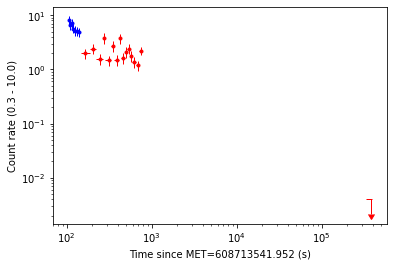

# XRT Product Generator Python Tutorial

This tutorial gives a simple example of how to use the `xrt_prods` Python module to request some XRT products. It should be relatively simple to adapt the examples in here to create the products you need, but of course you will need to read the [full job-submission documentation](RequestJob.md) to know what the different parameters are.

**This tutorial is for v.10 of the `xrt_prods` module.**

In this tutorial we will do the following:

* [Request all possible products be constructed for GRB 200416A.](#build-the-request)
* [Cancel the creation of the astrometric position.](#cancel-the-astrometric-position)
* [Poll the status until all products are completed.](#get-the-job-status)
* [Download all of the products.](#retrieve-the-products)

This tutorial acts as if you are working in an interactive `ipython` shell so that it can serve as a tutorial, however at the end we also
show [a full python script](#full-python-script) to request the products, monitor the progress, and then download the results.

---

## Build-the-request

First we need to create an `XRTProductRequest` object, and set some global parameters. 
By default, the object is created in 'silent' mode: it does not produce any output (unless
an error is raised). For interactive use such as in this tutorial, the output can be helpful,
so we will create it with `silent=False`.

The RA/Dec must be in decimal degrees, J2000.0. So:

```python
In [1]: import swifttools.ukssdc.xrt_prods as ux
In [2]: myReq = ux.XRTProductRequest('YOUR_EMAIL_ADDRESS', silent=False)
In [3]: myReq.setGlobalPars(getTargs=True, centroid=True, name='GRB 200416A', RA=335.6985, Dec=-7.5179, centMeth='simple', useSXPS=False, T0=608713541.952, posErr=1)
```

OK, now lets add the products. For the light curve we will request counts binning, with the same settings as the [XRT GRB light curve repository](https://www.swift.ac.uk/xrt_curves) uses. For the spectrum we need to specify that we have no redshift, and beyond this we will accept the defaults. Likewise for the positions, we will accept the default parameters, except that we want to use all available data for the astrometric positions:

```python
In [4]: myReq.addLightCurve(binMeth='counts', pcCounts=20, wtCounts=30, dynamic=True)
Successfully created a light curve

In [5]: myReq.addSpectrum(hasRedshift=False)
Successfully created a spectrum

In [6]: myReq.addStandardPos()
Successfully created a standard position

In [7]: myReq.addEnhancedPos()
Successfully created a enhanced position

In [8]: myReq.addAstromPos(useAllObs=True)
Successfully created a astrometric position
```

Let's check that this is valid before we try to submit it:

```python
In [9]: myReq.isValid()
Out[9]: (True, '')
```

Great, let's submit it:

```python
In [10]: myReq.submit()
Out[10]: True
```

Phew, it worked. Let's find the JobID, and the URL, just in case we want a note of them. We'll also save the data returned by the server in case we want it later.

```python
In [11]: myReq.JobID
Out[11]: '951'

In [12]: myReq.URL
Out[12]: 'https://www.swift.ac.uk/user_objects/tprods/USERPROD_951'

In [13]: subData = myReq.subRetData
```

Now, let's see how it's getting on:

```python
In [14]: progress = myReq.checkProductStatus()
In [15]: for prod,status in progress.items():
    ...:     print(f"{prod} -> {status['statusText']}")
    ...:
LightCurve -> Running
Spectrum -> Running
StandardPos -> Running
EnhancedPos -> Running
AstromPos -> Running
```

---

## Cancel the astrometric position

You know what, I didn't really want an astrometric position, let's get rid of it:

```python
In [16]: cancelOK, cancelStatus =  myReq.cancelProducts(['AstromPos'])
In [17]: cancelOK # Did it cancel ok?
Out[17]: 1        # Yes, woo!

In [18]: cancelStatus['AstromPos']                # Let's double check
Out[18]: {'code': 0, 'text': 'Job cancelled OK'}  # Yep, all looks good!
```

---

## Get the job status

(OK, we did this above before cancelling the job, but we're doing it again here).

Let's see what the status looks like now...

```python
In [19]: progress = myReq.checkProductStatus()
In [20]: for prod,status in progress.items():
    ...:     print(f"{prod} -> {status['statusText']}")
    ...:
LightCurve -> Running
Spectrum -> Running
StandardPos -> Running
EnhancedPos -> Running
AstromPos -> Cancelled at your request
```

That looks like we expected. I wonder how the light curve and standard position are actually doing:

```python
In [21]: print(progress['LightCurve']['progressText'])
  ** Prepare data and centroid (if selected). - ACTIVE**
  Extract data.
  Binning light curve.
  Plotting light curve as image.

The job has been running for 00:00:09


In [22]: print(progress['StandardPos']['progressText'])
  Collect data. - DONE
  Sum images and exposure maps. - DONE
  Perform detection with locally-estimated background - DONE
  ** Perform PSF fit. - ACTIVE**

The job has been running for 00:00:10

```

Hmm, the light curve hasn't got far yet but the standard position is nearly done. 

 Normally now we'd poll things periodically, but I can tell you it will take around 5 minutes for everything to complete so instead we'll go and make a cup of tea. 
 
 Done that? Nice brew? Good. OK, is this complete yet?

```python
In [23]: myReq.complete
True
```

Yay, it is complete (YMMV, so if it came back `False` we'd need to wait a minute and try again).

---

## Retrieve the products

Let's download the products now. I want to remember that these were for my tutorial, so I'll assign a stem. And I'll get a zip file because tar is, like, stone age (its names is from 'tape archive', for goodness sake).

```python
In [24]: myReq.downloadProducts('/some/where', stem='tutorial_files_', format='zip')
Out[24]:
{'LightCurve': '/some/where/tutorial_files_lc.zip',
 'Spectrum': '/some/where/tutorial_files_spec.zip',
 'StandardPos': '/some/where/tutorial_files_psf.zip',
 'EnhancedPos': '/some/where/tutorial_files_enh.zip',
 'AstromPos': '/some/where/tutorial_files_xastrom.zip'}
```

Since the initial release of this module, a number of people have made comments along the lines of,
&ldquo;This is really great&hellip;but do I really have to plough through all the contents of the zip files,
to access the products I want?&rdquo; Which is a fair point, so there are now some extra routines to make this easier (if `XRTProductRequest._apiVer` is less than 1.8, you need to do `pip install --update swifttools` first).

These functions all return Python dictionaries containing the key information related to that product.
In the case of the light curve, the dictionaries contain `Pandas DataFrame` objects of the light curve data.
For more information, see [full product-retrieval documentation](RetrieveProducts.md)

For the purposes of this tutorial, let's just grab these products and take a look.

```python
In [24]: myReq.retrieveStandardPos()
In [25]: myReq.standardPos
Out[25]: 
{'GotPos': True,
 'RA': '335.69849',
 'Dec': '-7.51788',
 'Err90': '3.5',
 'FromSXPS': False}
In [26]: myReq.retrieveEnhancedPos()
In [27]: myReq.enhancedPos()
Out[27]:
{'GotPos': True, 
 'RA': '335.70008', 
 'Dec': '-7.51816', 
 'Err90': '1.7'}
In [28]: myReq.retrieveSpectralFits()
In [29]: myReq.specData
Out[29]:
{'T0': 608713541.952,
 'rnames': ['interval0'],
 'interval0': {'DataFile': 'https://www.swift.ac.uk/user_objects/tprods/USERPROD_63345/spec/interval0.tar.gz',
  'Start': 103.678409218788,
  'Stop': 775.816271662712,
  'Modes': ['WT', 'PC'],
  'WT': {'Models': ['PowerLaw'],
   'PowerLaw': {'GalacticNH': 6.5378e+20,
    'NH': 1.57609e+17,
    'NHPos': 5.1739197789999995e+20,
    'NHNeg': -1.57609e+17,
    'Gamma': 3.60441,
    'GammaPos': 0.387164431,
    'GammaNeg': -0.22043750800000028,
   ... etc
```  

I've truncated the spectrum output here because it goes on for a while, but you can see the basic premise.
What about a light curve?

```python
In [30]: myReq.retrieveLightCurve()
In [31]: myReq.lcData.keys()
Out[31]: dict_keys(['WT', 'WTHard', 'WTSoft', 'WTHR', 'PC', 'PCHard', 'PCSoft', 'PCHR', 'Datasets', 'Binning', 'TimeFormat', 'URLs'])
In [32]: type(myReq.lcData['WT'])
Out[32]: pandas.core.frame.DataFrame
In [33]: myReq.lcData['WT']
Out[33]:
```

OK, I've removed the output as I can't make it look as nice as in my Jupyter notebook. You can explore it yourself. Or you can just:

```python
In [30]: myReq.plotLC(xlog=True, ylog=True)
```



And that's it. Do [drop me a line](mailto:swifthelp@leicester.ac.uk) if you have problems, or indeed
with feature requests: although I make no promises about whether and when they will be fulfilled.

---


## Full Python script

Of course, the whole point of the API interface is for where you don't want to be running everything interactively: if that's all you want the website will probably serve you better. So here's how you might do everything above in a script:

```python
# !/usr/bin/env python3
import swifttools.ukssdc.xrt_prods as ux
import sys
import time

myReq = ux.XRTProductRequest('YOUR_EMAIL_ADDRESS')
myReq.setGlobalPars(getTargs=True, centroid=True, name='GRB 200116A', RA=335.6985, Dec=-7.5179, centMeth='simple', useSXPS=False, T0=608713541.952, posErr=1)
myReq.addLightCurve(binMeth='counts', pcCounts=20, wtCounts=30, dynamic=True)
myReq.addSpectrum(hasRedshift=False, galactic=True)
myReq.addStandardPos()
myReq.addEnhancedPos()
myReq.addAstromPos(useAllObs=True)

if not myReq.submit():
    print(f"I couldn't submit error:{myReq.submitError}")
    sys.exit(1)
    # You can raise a RuntimeError here if you prefer.

# We won't bother cancelling a product as that doesn't seem to make sense in a script!
# I also don't want progress reporting here, and I'm not going to rush to download each product as it
# completes. I'm just going to wait until everything is complete

while not myReq.complete:
  print("Products not yet complete; waiting for a minute")
  time.sleep(60)

# Great, all done so download
myReq.downloadProducts('/some/where', stem='tutorial_files_', format='zip')

print("All done")
```

Note that in the above script I did not specify `silent=False` when creating `myReq`, so running this won't 
put a load of "Successfully created XXXX" type ouput on my screen.
